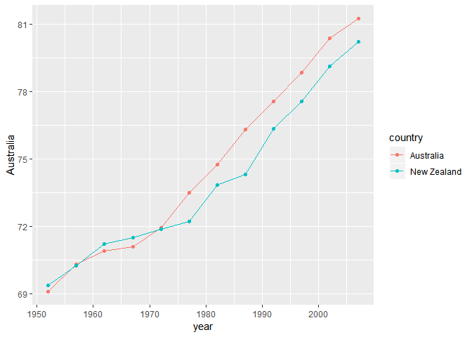
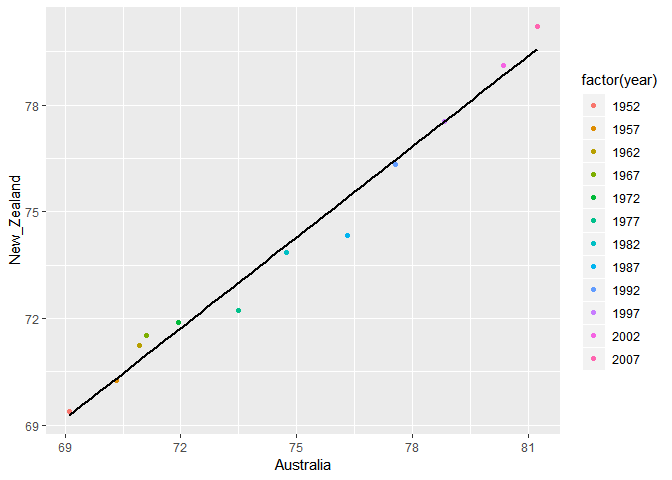
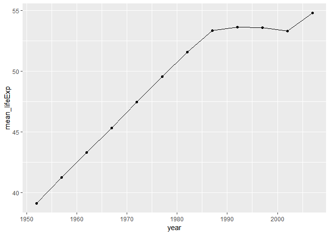
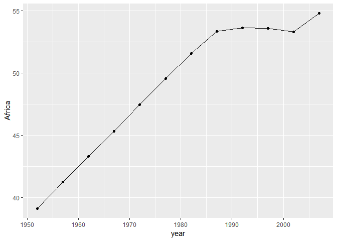

# Bring rectangular data in

```r
## load gapminder
suppressPackageStartupMessages(library(gapminder))
## load tidyverse
suppressPackageStartupMessages(library(tidyverse))
```

# Data Reshaping Prompts (and relationship to aggregation)

## Activity #1

**Make your own cheatsheet.**

In this section, we try to explore the following functions in `tidyr`:

- Commonly-used functions:
  - `gather()`: converts wide data to longer format.
  - `spread()`: converts long data to wider format.
  - `unite()`: combines two or more columns into a single column.
  - `separate()`: splits one column into two or more columns.
- Other functions:
  - `expand()`: is often useful in conjunction with `left_join()` if you want to convert implicit missing
values to explicit missing values. Or you can use it in conjunction with `anti_join()` to figure out
which combinations are missing.
  - `complete()`: turns implicit missing values into explicit missing values. This is a wrapper around `expand()`, `dplyr::left_join()` and `replace_na()` that's useful for completing missing combinations of data.
  - `separate_rows()`: if a variable contains observations with multiple delimited values, this separates the values and places each one in its own row.
  - `uncount()`: performs the opposite opperation to `dplyr::count()`, duplicating rows acoording to a weighting variable (or expression).
  - `drop_na()`: drops rows containing missing values.
  - `replace_na()`: replaces missing values.
  - `fill()`: fills missing values in using the previous entry. This is useful in the common output format where values are not repeated, they're recorded each time they change.
  - `full_seq()`: this is useful if you want to fill in missing values that should have been observed but weren't.

We are going to use `mtcars` and `gapminder` as the databases.


```r
# show a preview of mtcars
head(mtcars) %>% 
  knitr::kable(format = "html") %>% 
  # add styling to make table look better
  kableExtra::kable_styling(full_width = T)
```

<table class="table" style="margin-left: auto; margin-right: auto;">
 <thead>
  <tr>
   <th style="text-align:left;">   </th>
   <th style="text-align:right;"> mpg </th>
   <th style="text-align:right;"> cyl </th>
   <th style="text-align:right;"> disp </th>
   <th style="text-align:right;"> hp </th>
   <th style="text-align:right;"> drat </th>
   <th style="text-align:right;"> wt </th>
   <th style="text-align:right;"> qsec </th>
   <th style="text-align:right;"> vs </th>
   <th style="text-align:right;"> am </th>
   <th style="text-align:right;"> gear </th>
   <th style="text-align:right;"> carb </th>
  </tr>
 </thead>
<tbody>
  <tr>
   <td style="text-align:left;"> Mazda RX4 </td>
   <td style="text-align:right;"> 21.0 </td>
   <td style="text-align:right;"> 6 </td>
   <td style="text-align:right;"> 160 </td>
   <td style="text-align:right;"> 110 </td>
   <td style="text-align:right;"> 3.90 </td>
   <td style="text-align:right;"> 2.620 </td>
   <td style="text-align:right;"> 16.46 </td>
   <td style="text-align:right;"> 0 </td>
   <td style="text-align:right;"> 1 </td>
   <td style="text-align:right;"> 4 </td>
   <td style="text-align:right;"> 4 </td>
  </tr>
  <tr>
   <td style="text-align:left;"> Mazda RX4 Wag </td>
   <td style="text-align:right;"> 21.0 </td>
   <td style="text-align:right;"> 6 </td>
   <td style="text-align:right;"> 160 </td>
   <td style="text-align:right;"> 110 </td>
   <td style="text-align:right;"> 3.90 </td>
   <td style="text-align:right;"> 2.875 </td>
   <td style="text-align:right;"> 17.02 </td>
   <td style="text-align:right;"> 0 </td>
   <td style="text-align:right;"> 1 </td>
   <td style="text-align:right;"> 4 </td>
   <td style="text-align:right;"> 4 </td>
  </tr>
  <tr>
   <td style="text-align:left;"> Datsun 710 </td>
   <td style="text-align:right;"> 22.8 </td>
   <td style="text-align:right;"> 4 </td>
   <td style="text-align:right;"> 108 </td>
   <td style="text-align:right;"> 93 </td>
   <td style="text-align:right;"> 3.85 </td>
   <td style="text-align:right;"> 2.320 </td>
   <td style="text-align:right;"> 18.61 </td>
   <td style="text-align:right;"> 1 </td>
   <td style="text-align:right;"> 1 </td>
   <td style="text-align:right;"> 4 </td>
   <td style="text-align:right;"> 1 </td>
  </tr>
  <tr>
   <td style="text-align:left;"> Hornet 4 Drive </td>
   <td style="text-align:right;"> 21.4 </td>
   <td style="text-align:right;"> 6 </td>
   <td style="text-align:right;"> 258 </td>
   <td style="text-align:right;"> 110 </td>
   <td style="text-align:right;"> 3.08 </td>
   <td style="text-align:right;"> 3.215 </td>
   <td style="text-align:right;"> 19.44 </td>
   <td style="text-align:right;"> 1 </td>
   <td style="text-align:right;"> 0 </td>
   <td style="text-align:right;"> 3 </td>
   <td style="text-align:right;"> 1 </td>
  </tr>
  <tr>
   <td style="text-align:left;"> Hornet Sportabout </td>
   <td style="text-align:right;"> 18.7 </td>
   <td style="text-align:right;"> 8 </td>
   <td style="text-align:right;"> 360 </td>
   <td style="text-align:right;"> 175 </td>
   <td style="text-align:right;"> 3.15 </td>
   <td style="text-align:right;"> 3.440 </td>
   <td style="text-align:right;"> 17.02 </td>
   <td style="text-align:right;"> 0 </td>
   <td style="text-align:right;"> 0 </td>
   <td style="text-align:right;"> 3 </td>
   <td style="text-align:right;"> 2 </td>
  </tr>
  <tr>
   <td style="text-align:left;"> Valiant </td>
   <td style="text-align:right;"> 18.1 </td>
   <td style="text-align:right;"> 6 </td>
   <td style="text-align:right;"> 225 </td>
   <td style="text-align:right;"> 105 </td>
   <td style="text-align:right;"> 2.76 </td>
   <td style="text-align:right;"> 3.460 </td>
   <td style="text-align:right;"> 20.22 </td>
   <td style="text-align:right;"> 1 </td>
   <td style="text-align:right;"> 0 </td>
   <td style="text-align:right;"> 3 </td>
   <td style="text-align:right;"> 1 </td>
  </tr>
</tbody>
</table>

We give the first column a name ("car") so it is better to manipulate. In fact, the first column in the above table is the `rownames()` of the table.


```r
# add a new column and assign rownames() to it
mtcars$car <- rownames(mtcars)
# reshape the data frame
mtcars_with_car <- mtcars[, c(12, 1:11)]
# show a preview of modified mtcars
head(mtcars_with_car) %>% 
  knitr::kable(format = "html") %>% 
  # add styling to make table look better
  kableExtra::kable_styling(full_width = T)
```

<table class="table" style="margin-left: auto; margin-right: auto;">
 <thead>
  <tr>
   <th style="text-align:left;">   </th>
   <th style="text-align:left;"> car </th>
   <th style="text-align:right;"> mpg </th>
   <th style="text-align:right;"> cyl </th>
   <th style="text-align:right;"> disp </th>
   <th style="text-align:right;"> hp </th>
   <th style="text-align:right;"> drat </th>
   <th style="text-align:right;"> wt </th>
   <th style="text-align:right;"> qsec </th>
   <th style="text-align:right;"> vs </th>
   <th style="text-align:right;"> am </th>
   <th style="text-align:right;"> gear </th>
   <th style="text-align:right;"> carb </th>
  </tr>
 </thead>
<tbody>
  <tr>
   <td style="text-align:left;"> Mazda RX4 </td>
   <td style="text-align:left;"> Mazda RX4 </td>
   <td style="text-align:right;"> 21.0 </td>
   <td style="text-align:right;"> 6 </td>
   <td style="text-align:right;"> 160 </td>
   <td style="text-align:right;"> 110 </td>
   <td style="text-align:right;"> 3.90 </td>
   <td style="text-align:right;"> 2.620 </td>
   <td style="text-align:right;"> 16.46 </td>
   <td style="text-align:right;"> 0 </td>
   <td style="text-align:right;"> 1 </td>
   <td style="text-align:right;"> 4 </td>
   <td style="text-align:right;"> 4 </td>
  </tr>
  <tr>
   <td style="text-align:left;"> Mazda RX4 Wag </td>
   <td style="text-align:left;"> Mazda RX4 Wag </td>
   <td style="text-align:right;"> 21.0 </td>
   <td style="text-align:right;"> 6 </td>
   <td style="text-align:right;"> 160 </td>
   <td style="text-align:right;"> 110 </td>
   <td style="text-align:right;"> 3.90 </td>
   <td style="text-align:right;"> 2.875 </td>
   <td style="text-align:right;"> 17.02 </td>
   <td style="text-align:right;"> 0 </td>
   <td style="text-align:right;"> 1 </td>
   <td style="text-align:right;"> 4 </td>
   <td style="text-align:right;"> 4 </td>
  </tr>
  <tr>
   <td style="text-align:left;"> Datsun 710 </td>
   <td style="text-align:left;"> Datsun 710 </td>
   <td style="text-align:right;"> 22.8 </td>
   <td style="text-align:right;"> 4 </td>
   <td style="text-align:right;"> 108 </td>
   <td style="text-align:right;"> 93 </td>
   <td style="text-align:right;"> 3.85 </td>
   <td style="text-align:right;"> 2.320 </td>
   <td style="text-align:right;"> 18.61 </td>
   <td style="text-align:right;"> 1 </td>
   <td style="text-align:right;"> 1 </td>
   <td style="text-align:right;"> 4 </td>
   <td style="text-align:right;"> 1 </td>
  </tr>
  <tr>
   <td style="text-align:left;"> Hornet 4 Drive </td>
   <td style="text-align:left;"> Hornet 4 Drive </td>
   <td style="text-align:right;"> 21.4 </td>
   <td style="text-align:right;"> 6 </td>
   <td style="text-align:right;"> 258 </td>
   <td style="text-align:right;"> 110 </td>
   <td style="text-align:right;"> 3.08 </td>
   <td style="text-align:right;"> 3.215 </td>
   <td style="text-align:right;"> 19.44 </td>
   <td style="text-align:right;"> 1 </td>
   <td style="text-align:right;"> 0 </td>
   <td style="text-align:right;"> 3 </td>
   <td style="text-align:right;"> 1 </td>
  </tr>
  <tr>
   <td style="text-align:left;"> Hornet Sportabout </td>
   <td style="text-align:left;"> Hornet Sportabout </td>
   <td style="text-align:right;"> 18.7 </td>
   <td style="text-align:right;"> 8 </td>
   <td style="text-align:right;"> 360 </td>
   <td style="text-align:right;"> 175 </td>
   <td style="text-align:right;"> 3.15 </td>
   <td style="text-align:right;"> 3.440 </td>
   <td style="text-align:right;"> 17.02 </td>
   <td style="text-align:right;"> 0 </td>
   <td style="text-align:right;"> 0 </td>
   <td style="text-align:right;"> 3 </td>
   <td style="text-align:right;"> 2 </td>
  </tr>
  <tr>
   <td style="text-align:left;"> Valiant </td>
   <td style="text-align:left;"> Valiant </td>
   <td style="text-align:right;"> 18.1 </td>
   <td style="text-align:right;"> 6 </td>
   <td style="text-align:right;"> 225 </td>
   <td style="text-align:right;"> 105 </td>
   <td style="text-align:right;"> 2.76 </td>
   <td style="text-align:right;"> 3.460 </td>
   <td style="text-align:right;"> 20.22 </td>
   <td style="text-align:right;"> 1 </td>
   <td style="text-align:right;"> 0 </td>
   <td style="text-align:right;"> 3 </td>
   <td style="text-align:right;"> 1 </td>
  </tr>
</tbody>
</table>


### `gather()`

#### Usage

`gather(data, key, value, ..., na.rm = FALSE, convert = FALSE)`

Here `...` is the specification of the columns to gather.

#### Example(s)

`gather()` tries to create key-value pairs for a given data frame. In the first demos, we use `car` as the index, and different attribute as keys and show their corresponding values.


```r
gather_attributes <- mtcars_with_car %>% 
  # list all different attributes in column "attribute", use "car" as index (so it is not included in the reshape)
  gather(attribute, value, -car)

# show previews 
head(gather_attributes) %>% 
  knitr::kable(format = "html") %>% 
  # add styling to make table look better
  kableExtra::kable_styling(full_width = T)
```

<table class="table" style="margin-left: auto; margin-right: auto;">
 <thead>
  <tr>
   <th style="text-align:left;"> car </th>
   <th style="text-align:left;"> attribute </th>
   <th style="text-align:right;"> value </th>
  </tr>
 </thead>
<tbody>
  <tr>
   <td style="text-align:left;"> Mazda RX4 </td>
   <td style="text-align:left;"> mpg </td>
   <td style="text-align:right;"> 21.0 </td>
  </tr>
  <tr>
   <td style="text-align:left;"> Mazda RX4 Wag </td>
   <td style="text-align:left;"> mpg </td>
   <td style="text-align:right;"> 21.0 </td>
  </tr>
  <tr>
   <td style="text-align:left;"> Datsun 710 </td>
   <td style="text-align:left;"> mpg </td>
   <td style="text-align:right;"> 22.8 </td>
  </tr>
  <tr>
   <td style="text-align:left;"> Hornet 4 Drive </td>
   <td style="text-align:left;"> mpg </td>
   <td style="text-align:right;"> 21.4 </td>
  </tr>
  <tr>
   <td style="text-align:left;"> Hornet Sportabout </td>
   <td style="text-align:left;"> mpg </td>
   <td style="text-align:right;"> 18.7 </td>
  </tr>
  <tr>
   <td style="text-align:left;"> Valiant </td>
   <td style="text-align:left;"> mpg </td>
   <td style="text-align:right;"> 18.1 </td>
  </tr>
</tbody>
</table>

```r
tail(gather_attributes) %>% 
  knitr::kable(format = "html") %>% 
  # add styling to make table look better
  kableExtra::kable_styling(full_width = T)
```

<table class="table" style="margin-left: auto; margin-right: auto;">
 <thead>
  <tr>
   <th style="text-align:left;">   </th>
   <th style="text-align:left;"> car </th>
   <th style="text-align:left;"> attribute </th>
   <th style="text-align:right;"> value </th>
  </tr>
 </thead>
<tbody>
  <tr>
   <td style="text-align:left;"> 347 </td>
   <td style="text-align:left;"> Porsche 914-2 </td>
   <td style="text-align:left;"> carb </td>
   <td style="text-align:right;"> 2 </td>
  </tr>
  <tr>
   <td style="text-align:left;"> 348 </td>
   <td style="text-align:left;"> Lotus Europa </td>
   <td style="text-align:left;"> carb </td>
   <td style="text-align:right;"> 2 </td>
  </tr>
  <tr>
   <td style="text-align:left;"> 349 </td>
   <td style="text-align:left;"> Ford Pantera L </td>
   <td style="text-align:left;"> carb </td>
   <td style="text-align:right;"> 4 </td>
  </tr>
  <tr>
   <td style="text-align:left;"> 350 </td>
   <td style="text-align:left;"> Ferrari Dino </td>
   <td style="text-align:left;"> carb </td>
   <td style="text-align:right;"> 6 </td>
  </tr>
  <tr>
   <td style="text-align:left;"> 351 </td>
   <td style="text-align:left;"> Maserati Bora </td>
   <td style="text-align:left;"> carb </td>
   <td style="text-align:right;"> 8 </td>
  </tr>
  <tr>
   <td style="text-align:left;"> 352 </td>
   <td style="text-align:left;"> Volvo 142E </td>
   <td style="text-align:left;"> carb </td>
   <td style="text-align:right;"> 2 </td>
  </tr>
</tbody>
</table>

We can also gather some columns instead of all.


```r
gather_some_attributes <- mtcars_with_car %>% 
  # gather only mpg to gear
  gather(attribute, value, mpg:gear)

# show previews
head(gather_some_attributes) %>% 
  knitr::kable(format = "html") %>% 
  # add styling to make table look better
  kableExtra::kable_styling(full_width = T)
```

<table class="table" style="margin-left: auto; margin-right: auto;">
 <thead>
  <tr>
   <th style="text-align:left;"> car </th>
   <th style="text-align:right;"> carb </th>
   <th style="text-align:left;"> attribute </th>
   <th style="text-align:right;"> value </th>
  </tr>
 </thead>
<tbody>
  <tr>
   <td style="text-align:left;"> Mazda RX4 </td>
   <td style="text-align:right;"> 4 </td>
   <td style="text-align:left;"> mpg </td>
   <td style="text-align:right;"> 21.0 </td>
  </tr>
  <tr>
   <td style="text-align:left;"> Mazda RX4 Wag </td>
   <td style="text-align:right;"> 4 </td>
   <td style="text-align:left;"> mpg </td>
   <td style="text-align:right;"> 21.0 </td>
  </tr>
  <tr>
   <td style="text-align:left;"> Datsun 710 </td>
   <td style="text-align:right;"> 1 </td>
   <td style="text-align:left;"> mpg </td>
   <td style="text-align:right;"> 22.8 </td>
  </tr>
  <tr>
   <td style="text-align:left;"> Hornet 4 Drive </td>
   <td style="text-align:right;"> 1 </td>
   <td style="text-align:left;"> mpg </td>
   <td style="text-align:right;"> 21.4 </td>
  </tr>
  <tr>
   <td style="text-align:left;"> Hornet Sportabout </td>
   <td style="text-align:right;"> 2 </td>
   <td style="text-align:left;"> mpg </td>
   <td style="text-align:right;"> 18.7 </td>
  </tr>
  <tr>
   <td style="text-align:left;"> Valiant </td>
   <td style="text-align:right;"> 1 </td>
   <td style="text-align:left;"> mpg </td>
   <td style="text-align:right;"> 18.1 </td>
  </tr>
</tbody>
</table>

```r
tail(gather_some_attributes) %>% 
  knitr::kable(format = "html") %>% 
  # add styling to make table look better
  kableExtra::kable_styling(full_width = T)
```

<table class="table" style="margin-left: auto; margin-right: auto;">
 <thead>
  <tr>
   <th style="text-align:left;">   </th>
   <th style="text-align:left;"> car </th>
   <th style="text-align:right;"> carb </th>
   <th style="text-align:left;"> attribute </th>
   <th style="text-align:right;"> value </th>
  </tr>
 </thead>
<tbody>
  <tr>
   <td style="text-align:left;"> 315 </td>
   <td style="text-align:left;"> Porsche 914-2 </td>
   <td style="text-align:right;"> 2 </td>
   <td style="text-align:left;"> gear </td>
   <td style="text-align:right;"> 5 </td>
  </tr>
  <tr>
   <td style="text-align:left;"> 316 </td>
   <td style="text-align:left;"> Lotus Europa </td>
   <td style="text-align:right;"> 2 </td>
   <td style="text-align:left;"> gear </td>
   <td style="text-align:right;"> 5 </td>
  </tr>
  <tr>
   <td style="text-align:left;"> 317 </td>
   <td style="text-align:left;"> Ford Pantera L </td>
   <td style="text-align:right;"> 4 </td>
   <td style="text-align:left;"> gear </td>
   <td style="text-align:right;"> 5 </td>
  </tr>
  <tr>
   <td style="text-align:left;"> 318 </td>
   <td style="text-align:left;"> Ferrari Dino </td>
   <td style="text-align:right;"> 6 </td>
   <td style="text-align:left;"> gear </td>
   <td style="text-align:right;"> 5 </td>
  </tr>
  <tr>
   <td style="text-align:left;"> 319 </td>
   <td style="text-align:left;"> Maserati Bora </td>
   <td style="text-align:right;"> 8 </td>
   <td style="text-align:left;"> gear </td>
   <td style="text-align:right;"> 5 </td>
  </tr>
  <tr>
   <td style="text-align:left;"> 320 </td>
   <td style="text-align:left;"> Volvo 142E </td>
   <td style="text-align:right;"> 2 </td>
   <td style="text-align:left;"> gear </td>
   <td style="text-align:right;"> 4 </td>
  </tr>
</tbody>
</table>

### `spread()`

#### Usage

`spread(data, key, value, fill = NA, convert = FALSE, drop = TRUE)`

#### Example(s)

`spread()` can be considered as a reversed operation of `gather()`.


```r
# spread attribute and value
mtcars_spread <- gather_attributes %>% 
  spread(attribute, value)

# show a preview
head(mtcars_spread) %>% 
  knitr::kable(format = "html") %>% 
  # add styling to make table look better
  kableExtra::kable_styling(full_width = T)
```

<table class="table" style="margin-left: auto; margin-right: auto;">
 <thead>
  <tr>
   <th style="text-align:left;"> car </th>
   <th style="text-align:right;"> am </th>
   <th style="text-align:right;"> carb </th>
   <th style="text-align:right;"> cyl </th>
   <th style="text-align:right;"> disp </th>
   <th style="text-align:right;"> drat </th>
   <th style="text-align:right;"> gear </th>
   <th style="text-align:right;"> hp </th>
   <th style="text-align:right;"> mpg </th>
   <th style="text-align:right;"> qsec </th>
   <th style="text-align:right;"> vs </th>
   <th style="text-align:right;"> wt </th>
  </tr>
 </thead>
<tbody>
  <tr>
   <td style="text-align:left;"> AMC Javelin </td>
   <td style="text-align:right;"> 0 </td>
   <td style="text-align:right;"> 2 </td>
   <td style="text-align:right;"> 8 </td>
   <td style="text-align:right;"> 304 </td>
   <td style="text-align:right;"> 3.15 </td>
   <td style="text-align:right;"> 3 </td>
   <td style="text-align:right;"> 150 </td>
   <td style="text-align:right;"> 15.2 </td>
   <td style="text-align:right;"> 17.30 </td>
   <td style="text-align:right;"> 0 </td>
   <td style="text-align:right;"> 3.435 </td>
  </tr>
  <tr>
   <td style="text-align:left;"> Cadillac Fleetwood </td>
   <td style="text-align:right;"> 0 </td>
   <td style="text-align:right;"> 4 </td>
   <td style="text-align:right;"> 8 </td>
   <td style="text-align:right;"> 472 </td>
   <td style="text-align:right;"> 2.93 </td>
   <td style="text-align:right;"> 3 </td>
   <td style="text-align:right;"> 205 </td>
   <td style="text-align:right;"> 10.4 </td>
   <td style="text-align:right;"> 17.98 </td>
   <td style="text-align:right;"> 0 </td>
   <td style="text-align:right;"> 5.250 </td>
  </tr>
  <tr>
   <td style="text-align:left;"> Camaro Z28 </td>
   <td style="text-align:right;"> 0 </td>
   <td style="text-align:right;"> 4 </td>
   <td style="text-align:right;"> 8 </td>
   <td style="text-align:right;"> 350 </td>
   <td style="text-align:right;"> 3.73 </td>
   <td style="text-align:right;"> 3 </td>
   <td style="text-align:right;"> 245 </td>
   <td style="text-align:right;"> 13.3 </td>
   <td style="text-align:right;"> 15.41 </td>
   <td style="text-align:right;"> 0 </td>
   <td style="text-align:right;"> 3.840 </td>
  </tr>
  <tr>
   <td style="text-align:left;"> Chrysler Imperial </td>
   <td style="text-align:right;"> 0 </td>
   <td style="text-align:right;"> 4 </td>
   <td style="text-align:right;"> 8 </td>
   <td style="text-align:right;"> 440 </td>
   <td style="text-align:right;"> 3.23 </td>
   <td style="text-align:right;"> 3 </td>
   <td style="text-align:right;"> 230 </td>
   <td style="text-align:right;"> 14.7 </td>
   <td style="text-align:right;"> 17.42 </td>
   <td style="text-align:right;"> 0 </td>
   <td style="text-align:right;"> 5.345 </td>
  </tr>
  <tr>
   <td style="text-align:left;"> Datsun 710 </td>
   <td style="text-align:right;"> 1 </td>
   <td style="text-align:right;"> 1 </td>
   <td style="text-align:right;"> 4 </td>
   <td style="text-align:right;"> 108 </td>
   <td style="text-align:right;"> 3.85 </td>
   <td style="text-align:right;"> 4 </td>
   <td style="text-align:right;"> 93 </td>
   <td style="text-align:right;"> 22.8 </td>
   <td style="text-align:right;"> 18.61 </td>
   <td style="text-align:right;"> 1 </td>
   <td style="text-align:right;"> 2.320 </td>
  </tr>
  <tr>
   <td style="text-align:left;"> Dodge Challenger </td>
   <td style="text-align:right;"> 0 </td>
   <td style="text-align:right;"> 2 </td>
   <td style="text-align:right;"> 8 </td>
   <td style="text-align:right;"> 318 </td>
   <td style="text-align:right;"> 2.76 </td>
   <td style="text-align:right;"> 3 </td>
   <td style="text-align:right;"> 150 </td>
   <td style="text-align:right;"> 15.5 </td>
   <td style="text-align:right;"> 16.87 </td>
   <td style="text-align:right;"> 0 </td>
   <td style="text-align:right;"> 3.520 </td>
  </tr>
</tbody>
</table>

### `unite()`

#### Usage

`unite(data, col, ..., sep = "_", remove = TRUE)`

Here `...` represents the columns to unite and `col` represents the column to add.

#### Example(s)

In this demo, we try to unite `pop` and `gdpPercap` into the same column in `gapminder`. Notice it just shows the new column as a multiplication of `pop` and `gdpPercap`, but no calculation will be performed.


```r
# unite to have overall_gdp
unite_gdp <- gapminder %>% 
  unite(overall_gdp, pop, gdpPercap, sep = "*")

# show a preview
head(unite_gdp) %>% 
  knitr::kable(format = "html") %>% 
  # add styling to make table look better
  kableExtra::kable_styling(full_width = T)
```

<table class="table" style="margin-left: auto; margin-right: auto;">
 <thead>
  <tr>
   <th style="text-align:left;"> country </th>
   <th style="text-align:left;"> continent </th>
   <th style="text-align:right;"> year </th>
   <th style="text-align:right;"> lifeExp </th>
   <th style="text-align:left;"> overall_gdp </th>
  </tr>
 </thead>
<tbody>
  <tr>
   <td style="text-align:left;"> Afghanistan </td>
   <td style="text-align:left;"> Asia </td>
   <td style="text-align:right;"> 1952 </td>
   <td style="text-align:right;"> 28.801 </td>
   <td style="text-align:left;"> 8425333*779.4453145 </td>
  </tr>
  <tr>
   <td style="text-align:left;"> Afghanistan </td>
   <td style="text-align:left;"> Asia </td>
   <td style="text-align:right;"> 1957 </td>
   <td style="text-align:right;"> 30.332 </td>
   <td style="text-align:left;"> 9240934*820.8530296 </td>
  </tr>
  <tr>
   <td style="text-align:left;"> Afghanistan </td>
   <td style="text-align:left;"> Asia </td>
   <td style="text-align:right;"> 1962 </td>
   <td style="text-align:right;"> 31.997 </td>
   <td style="text-align:left;"> 10267083*853.10071 </td>
  </tr>
  <tr>
   <td style="text-align:left;"> Afghanistan </td>
   <td style="text-align:left;"> Asia </td>
   <td style="text-align:right;"> 1967 </td>
   <td style="text-align:right;"> 34.020 </td>
   <td style="text-align:left;"> 11537966*836.1971382 </td>
  </tr>
  <tr>
   <td style="text-align:left;"> Afghanistan </td>
   <td style="text-align:left;"> Asia </td>
   <td style="text-align:right;"> 1972 </td>
   <td style="text-align:right;"> 36.088 </td>
   <td style="text-align:left;"> 13079460*739.9811058 </td>
  </tr>
  <tr>
   <td style="text-align:left;"> Afghanistan </td>
   <td style="text-align:left;"> Asia </td>
   <td style="text-align:right;"> 1977 </td>
   <td style="text-align:right;"> 38.438 </td>
   <td style="text-align:left;"> 14880372*786.11336 </td>
  </tr>
</tbody>
</table>


### `separate()`

#### Usage

`separate(data, col, into, sep = "[^[:alnum:]]+", remove = TRUE, convert = FALSE, extra = "warn", fill = "warn", ...)`

#### Example(s)

`separate()` can be considered as a reversed operation of `unite()`.


```r
# separate into original columns. Notice that we need to use two backslashes as escape character.
sep_gdp <- unite_gdp %>% 
  separate(overall_gdp, c("pop", "gdpPercap"), sep = "\\*")

# show a preview
head(sep_gdp) %>% 
  knitr::kable(format = "html") %>% 
  # add styling to make table look better
  kableExtra::kable_styling(full_width = T)
```

<table class="table" style="margin-left: auto; margin-right: auto;">
 <thead>
  <tr>
   <th style="text-align:left;"> country </th>
   <th style="text-align:left;"> continent </th>
   <th style="text-align:right;"> year </th>
   <th style="text-align:right;"> lifeExp </th>
   <th style="text-align:left;"> pop </th>
   <th style="text-align:left;"> gdpPercap </th>
  </tr>
 </thead>
<tbody>
  <tr>
   <td style="text-align:left;"> Afghanistan </td>
   <td style="text-align:left;"> Asia </td>
   <td style="text-align:right;"> 1952 </td>
   <td style="text-align:right;"> 28.801 </td>
   <td style="text-align:left;"> 8425333 </td>
   <td style="text-align:left;"> 779.4453145 </td>
  </tr>
  <tr>
   <td style="text-align:left;"> Afghanistan </td>
   <td style="text-align:left;"> Asia </td>
   <td style="text-align:right;"> 1957 </td>
   <td style="text-align:right;"> 30.332 </td>
   <td style="text-align:left;"> 9240934 </td>
   <td style="text-align:left;"> 820.8530296 </td>
  </tr>
  <tr>
   <td style="text-align:left;"> Afghanistan </td>
   <td style="text-align:left;"> Asia </td>
   <td style="text-align:right;"> 1962 </td>
   <td style="text-align:right;"> 31.997 </td>
   <td style="text-align:left;"> 10267083 </td>
   <td style="text-align:left;"> 853.10071 </td>
  </tr>
  <tr>
   <td style="text-align:left;"> Afghanistan </td>
   <td style="text-align:left;"> Asia </td>
   <td style="text-align:right;"> 1967 </td>
   <td style="text-align:right;"> 34.020 </td>
   <td style="text-align:left;"> 11537966 </td>
   <td style="text-align:left;"> 836.1971382 </td>
  </tr>
  <tr>
   <td style="text-align:left;"> Afghanistan </td>
   <td style="text-align:left;"> Asia </td>
   <td style="text-align:right;"> 1972 </td>
   <td style="text-align:right;"> 36.088 </td>
   <td style="text-align:left;"> 13079460 </td>
   <td style="text-align:left;"> 739.9811058 </td>
  </tr>
  <tr>
   <td style="text-align:left;"> Afghanistan </td>
   <td style="text-align:left;"> Asia </td>
   <td style="text-align:right;"> 1977 </td>
   <td style="text-align:right;"> 38.438 </td>
   <td style="text-align:left;"> 14880372 </td>
   <td style="text-align:left;"> 786.11336 </td>
  </tr>
</tbody>
</table>

### `expand()`

#### Usage

`expand(data, ...)`

Here `...` represents the columns to expand.

#### Example(s)

`expand()` can show all possible combinations of columns, even those are not present in the data.


```r
expand(mtcars, vs, cyl) %>% 
  knitr::kable(format = "html") %>% 
  # add styling to make it look better
  kableExtra::kable_styling(full_width = F)
```

<table class="table" style="width: auto !important; margin-left: auto; margin-right: auto;">
 <thead>
  <tr>
   <th style="text-align:right;"> vs </th>
   <th style="text-align:right;"> cyl </th>
  </tr>
 </thead>
<tbody>
  <tr>
   <td style="text-align:right;"> 0 </td>
   <td style="text-align:right;"> 4 </td>
  </tr>
  <tr>
   <td style="text-align:right;"> 0 </td>
   <td style="text-align:right;"> 6 </td>
  </tr>
  <tr>
   <td style="text-align:right;"> 0 </td>
   <td style="text-align:right;"> 8 </td>
  </tr>
  <tr>
   <td style="text-align:right;"> 1 </td>
   <td style="text-align:right;"> 4 </td>
  </tr>
  <tr>
   <td style="text-align:right;"> 1 </td>
   <td style="text-align:right;"> 6 </td>
  </tr>
  <tr>
   <td style="text-align:right;"> 1 </td>
   <td style="text-align:right;"> 8 </td>
  </tr>
</tbody>
</table>

We can also use `nesting()` to show only combinations that appear in the data.


```r
expand(mtcars, nesting(vs, cyl)) %>% 
  knitr::kable(format = "html") %>% 
  # add styling to make it look better
  kableExtra::kable_styling(full_width = F)
```

<table class="table" style="width: auto !important; margin-left: auto; margin-right: auto;">
 <thead>
  <tr>
   <th style="text-align:right;"> vs </th>
   <th style="text-align:right;"> cyl </th>
  </tr>
 </thead>
<tbody>
  <tr>
   <td style="text-align:right;"> 0 </td>
   <td style="text-align:right;"> 4 </td>
  </tr>
  <tr>
   <td style="text-align:right;"> 0 </td>
   <td style="text-align:right;"> 6 </td>
  </tr>
  <tr>
   <td style="text-align:right;"> 0 </td>
   <td style="text-align:right;"> 8 </td>
  </tr>
  <tr>
   <td style="text-align:right;"> 1 </td>
   <td style="text-align:right;"> 4 </td>
  </tr>
  <tr>
   <td style="text-align:right;"> 1 </td>
   <td style="text-align:right;"> 6 </td>
  </tr>
</tbody>
</table>

### `complete()`

#### Usage

`complete(data, ..., fill = list())`

Here `...` represents the columns to expand.

#### Example(s)

In this example, we try to compare `complete()` with `expand()`.


```r
mtcars_complete <- complete(mtcars, vs, cyl)

# show the table
mtcars_complete %>% 
  knitr::kable(format = "html") %>% 
  # add styling to make table look better
  kableExtra::kable_styling(full_width = T)
```

<table class="table" style="margin-left: auto; margin-right: auto;">
 <thead>
  <tr>
   <th style="text-align:right;"> vs </th>
   <th style="text-align:right;"> cyl </th>
   <th style="text-align:right;"> mpg </th>
   <th style="text-align:right;"> disp </th>
   <th style="text-align:right;"> hp </th>
   <th style="text-align:right;"> drat </th>
   <th style="text-align:right;"> wt </th>
   <th style="text-align:right;"> qsec </th>
   <th style="text-align:right;"> am </th>
   <th style="text-align:right;"> gear </th>
   <th style="text-align:right;"> carb </th>
   <th style="text-align:left;"> car </th>
  </tr>
 </thead>
<tbody>
  <tr>
   <td style="text-align:right;"> 0 </td>
   <td style="text-align:right;"> 4 </td>
   <td style="text-align:right;"> 26.0 </td>
   <td style="text-align:right;"> 120.3 </td>
   <td style="text-align:right;"> 91 </td>
   <td style="text-align:right;"> 4.43 </td>
   <td style="text-align:right;"> 2.140 </td>
   <td style="text-align:right;"> 16.70 </td>
   <td style="text-align:right;"> 1 </td>
   <td style="text-align:right;"> 5 </td>
   <td style="text-align:right;"> 2 </td>
   <td style="text-align:left;"> Porsche 914-2 </td>
  </tr>
  <tr>
   <td style="text-align:right;"> 0 </td>
   <td style="text-align:right;"> 6 </td>
   <td style="text-align:right;"> 21.0 </td>
   <td style="text-align:right;"> 160.0 </td>
   <td style="text-align:right;"> 110 </td>
   <td style="text-align:right;"> 3.90 </td>
   <td style="text-align:right;"> 2.620 </td>
   <td style="text-align:right;"> 16.46 </td>
   <td style="text-align:right;"> 1 </td>
   <td style="text-align:right;"> 4 </td>
   <td style="text-align:right;"> 4 </td>
   <td style="text-align:left;"> Mazda RX4 </td>
  </tr>
  <tr>
   <td style="text-align:right;"> 0 </td>
   <td style="text-align:right;"> 6 </td>
   <td style="text-align:right;"> 21.0 </td>
   <td style="text-align:right;"> 160.0 </td>
   <td style="text-align:right;"> 110 </td>
   <td style="text-align:right;"> 3.90 </td>
   <td style="text-align:right;"> 2.875 </td>
   <td style="text-align:right;"> 17.02 </td>
   <td style="text-align:right;"> 1 </td>
   <td style="text-align:right;"> 4 </td>
   <td style="text-align:right;"> 4 </td>
   <td style="text-align:left;"> Mazda RX4 Wag </td>
  </tr>
  <tr>
   <td style="text-align:right;"> 0 </td>
   <td style="text-align:right;"> 6 </td>
   <td style="text-align:right;"> 19.7 </td>
   <td style="text-align:right;"> 145.0 </td>
   <td style="text-align:right;"> 175 </td>
   <td style="text-align:right;"> 3.62 </td>
   <td style="text-align:right;"> 2.770 </td>
   <td style="text-align:right;"> 15.50 </td>
   <td style="text-align:right;"> 1 </td>
   <td style="text-align:right;"> 5 </td>
   <td style="text-align:right;"> 6 </td>
   <td style="text-align:left;"> Ferrari Dino </td>
  </tr>
  <tr>
   <td style="text-align:right;"> 0 </td>
   <td style="text-align:right;"> 8 </td>
   <td style="text-align:right;"> 18.7 </td>
   <td style="text-align:right;"> 360.0 </td>
   <td style="text-align:right;"> 175 </td>
   <td style="text-align:right;"> 3.15 </td>
   <td style="text-align:right;"> 3.440 </td>
   <td style="text-align:right;"> 17.02 </td>
   <td style="text-align:right;"> 0 </td>
   <td style="text-align:right;"> 3 </td>
   <td style="text-align:right;"> 2 </td>
   <td style="text-align:left;"> Hornet Sportabout </td>
  </tr>
  <tr>
   <td style="text-align:right;"> 0 </td>
   <td style="text-align:right;"> 8 </td>
   <td style="text-align:right;"> 14.3 </td>
   <td style="text-align:right;"> 360.0 </td>
   <td style="text-align:right;"> 245 </td>
   <td style="text-align:right;"> 3.21 </td>
   <td style="text-align:right;"> 3.570 </td>
   <td style="text-align:right;"> 15.84 </td>
   <td style="text-align:right;"> 0 </td>
   <td style="text-align:right;"> 3 </td>
   <td style="text-align:right;"> 4 </td>
   <td style="text-align:left;"> Duster 360 </td>
  </tr>
  <tr>
   <td style="text-align:right;"> 0 </td>
   <td style="text-align:right;"> 8 </td>
   <td style="text-align:right;"> 16.4 </td>
   <td style="text-align:right;"> 275.8 </td>
   <td style="text-align:right;"> 180 </td>
   <td style="text-align:right;"> 3.07 </td>
   <td style="text-align:right;"> 4.070 </td>
   <td style="text-align:right;"> 17.40 </td>
   <td style="text-align:right;"> 0 </td>
   <td style="text-align:right;"> 3 </td>
   <td style="text-align:right;"> 3 </td>
   <td style="text-align:left;"> Merc 450SE </td>
  </tr>
  <tr>
   <td style="text-align:right;"> 0 </td>
   <td style="text-align:right;"> 8 </td>
   <td style="text-align:right;"> 17.3 </td>
   <td style="text-align:right;"> 275.8 </td>
   <td style="text-align:right;"> 180 </td>
   <td style="text-align:right;"> 3.07 </td>
   <td style="text-align:right;"> 3.730 </td>
   <td style="text-align:right;"> 17.60 </td>
   <td style="text-align:right;"> 0 </td>
   <td style="text-align:right;"> 3 </td>
   <td style="text-align:right;"> 3 </td>
   <td style="text-align:left;"> Merc 450SL </td>
  </tr>
  <tr>
   <td style="text-align:right;"> 0 </td>
   <td style="text-align:right;"> 8 </td>
   <td style="text-align:right;"> 15.2 </td>
   <td style="text-align:right;"> 275.8 </td>
   <td style="text-align:right;"> 180 </td>
   <td style="text-align:right;"> 3.07 </td>
   <td style="text-align:right;"> 3.780 </td>
   <td style="text-align:right;"> 18.00 </td>
   <td style="text-align:right;"> 0 </td>
   <td style="text-align:right;"> 3 </td>
   <td style="text-align:right;"> 3 </td>
   <td style="text-align:left;"> Merc 450SLC </td>
  </tr>
  <tr>
   <td style="text-align:right;"> 0 </td>
   <td style="text-align:right;"> 8 </td>
   <td style="text-align:right;"> 10.4 </td>
   <td style="text-align:right;"> 472.0 </td>
   <td style="text-align:right;"> 205 </td>
   <td style="text-align:right;"> 2.93 </td>
   <td style="text-align:right;"> 5.250 </td>
   <td style="text-align:right;"> 17.98 </td>
   <td style="text-align:right;"> 0 </td>
   <td style="text-align:right;"> 3 </td>
   <td style="text-align:right;"> 4 </td>
   <td style="text-align:left;"> Cadillac Fleetwood </td>
  </tr>
  <tr>
   <td style="text-align:right;"> 0 </td>
   <td style="text-align:right;"> 8 </td>
   <td style="text-align:right;"> 10.4 </td>
   <td style="text-align:right;"> 460.0 </td>
   <td style="text-align:right;"> 215 </td>
   <td style="text-align:right;"> 3.00 </td>
   <td style="text-align:right;"> 5.424 </td>
   <td style="text-align:right;"> 17.82 </td>
   <td style="text-align:right;"> 0 </td>
   <td style="text-align:right;"> 3 </td>
   <td style="text-align:right;"> 4 </td>
   <td style="text-align:left;"> Lincoln Continental </td>
  </tr>
  <tr>
   <td style="text-align:right;"> 0 </td>
   <td style="text-align:right;"> 8 </td>
   <td style="text-align:right;"> 14.7 </td>
   <td style="text-align:right;"> 440.0 </td>
   <td style="text-align:right;"> 230 </td>
   <td style="text-align:right;"> 3.23 </td>
   <td style="text-align:right;"> 5.345 </td>
   <td style="text-align:right;"> 17.42 </td>
   <td style="text-align:right;"> 0 </td>
   <td style="text-align:right;"> 3 </td>
   <td style="text-align:right;"> 4 </td>
   <td style="text-align:left;"> Chrysler Imperial </td>
  </tr>
  <tr>
   <td style="text-align:right;"> 0 </td>
   <td style="text-align:right;"> 8 </td>
   <td style="text-align:right;"> 15.5 </td>
   <td style="text-align:right;"> 318.0 </td>
   <td style="text-align:right;"> 150 </td>
   <td style="text-align:right;"> 2.76 </td>
   <td style="text-align:right;"> 3.520 </td>
   <td style="text-align:right;"> 16.87 </td>
   <td style="text-align:right;"> 0 </td>
   <td style="text-align:right;"> 3 </td>
   <td style="text-align:right;"> 2 </td>
   <td style="text-align:left;"> Dodge Challenger </td>
  </tr>
  <tr>
   <td style="text-align:right;"> 0 </td>
   <td style="text-align:right;"> 8 </td>
   <td style="text-align:right;"> 15.2 </td>
   <td style="text-align:right;"> 304.0 </td>
   <td style="text-align:right;"> 150 </td>
   <td style="text-align:right;"> 3.15 </td>
   <td style="text-align:right;"> 3.435 </td>
   <td style="text-align:right;"> 17.30 </td>
   <td style="text-align:right;"> 0 </td>
   <td style="text-align:right;"> 3 </td>
   <td style="text-align:right;"> 2 </td>
   <td style="text-align:left;"> AMC Javelin </td>
  </tr>
  <tr>
   <td style="text-align:right;"> 0 </td>
   <td style="text-align:right;"> 8 </td>
   <td style="text-align:right;"> 13.3 </td>
   <td style="text-align:right;"> 350.0 </td>
   <td style="text-align:right;"> 245 </td>
   <td style="text-align:right;"> 3.73 </td>
   <td style="text-align:right;"> 3.840 </td>
   <td style="text-align:right;"> 15.41 </td>
   <td style="text-align:right;"> 0 </td>
   <td style="text-align:right;"> 3 </td>
   <td style="text-align:right;"> 4 </td>
   <td style="text-align:left;"> Camaro Z28 </td>
  </tr>
  <tr>
   <td style="text-align:right;"> 0 </td>
   <td style="text-align:right;"> 8 </td>
   <td style="text-align:right;"> 19.2 </td>
   <td style="text-align:right;"> 400.0 </td>
   <td style="text-align:right;"> 175 </td>
   <td style="text-align:right;"> 3.08 </td>
   <td style="text-align:right;"> 3.845 </td>
   <td style="text-align:right;"> 17.05 </td>
   <td style="text-align:right;"> 0 </td>
   <td style="text-align:right;"> 3 </td>
   <td style="text-align:right;"> 2 </td>
   <td style="text-align:left;"> Pontiac Firebird </td>
  </tr>
  <tr>
   <td style="text-align:right;"> 0 </td>
   <td style="text-align:right;"> 8 </td>
   <td style="text-align:right;"> 15.8 </td>
   <td style="text-align:right;"> 351.0 </td>
   <td style="text-align:right;"> 264 </td>
   <td style="text-align:right;"> 4.22 </td>
   <td style="text-align:right;"> 3.170 </td>
   <td style="text-align:right;"> 14.50 </td>
   <td style="text-align:right;"> 1 </td>
   <td style="text-align:right;"> 5 </td>
   <td style="text-align:right;"> 4 </td>
   <td style="text-align:left;"> Ford Pantera L </td>
  </tr>
  <tr>
   <td style="text-align:right;"> 0 </td>
   <td style="text-align:right;"> 8 </td>
   <td style="text-align:right;"> 15.0 </td>
   <td style="text-align:right;"> 301.0 </td>
   <td style="text-align:right;"> 335 </td>
   <td style="text-align:right;"> 3.54 </td>
   <td style="text-align:right;"> 3.570 </td>
   <td style="text-align:right;"> 14.60 </td>
   <td style="text-align:right;"> 1 </td>
   <td style="text-align:right;"> 5 </td>
   <td style="text-align:right;"> 8 </td>
   <td style="text-align:left;"> Maserati Bora </td>
  </tr>
  <tr>
   <td style="text-align:right;"> 1 </td>
   <td style="text-align:right;"> 4 </td>
   <td style="text-align:right;"> 22.8 </td>
   <td style="text-align:right;"> 108.0 </td>
   <td style="text-align:right;"> 93 </td>
   <td style="text-align:right;"> 3.85 </td>
   <td style="text-align:right;"> 2.320 </td>
   <td style="text-align:right;"> 18.61 </td>
   <td style="text-align:right;"> 1 </td>
   <td style="text-align:right;"> 4 </td>
   <td style="text-align:right;"> 1 </td>
   <td style="text-align:left;"> Datsun 710 </td>
  </tr>
  <tr>
   <td style="text-align:right;"> 1 </td>
   <td style="text-align:right;"> 4 </td>
   <td style="text-align:right;"> 24.4 </td>
   <td style="text-align:right;"> 146.7 </td>
   <td style="text-align:right;"> 62 </td>
   <td style="text-align:right;"> 3.69 </td>
   <td style="text-align:right;"> 3.190 </td>
   <td style="text-align:right;"> 20.00 </td>
   <td style="text-align:right;"> 0 </td>
   <td style="text-align:right;"> 4 </td>
   <td style="text-align:right;"> 2 </td>
   <td style="text-align:left;"> Merc 240D </td>
  </tr>
  <tr>
   <td style="text-align:right;"> 1 </td>
   <td style="text-align:right;"> 4 </td>
   <td style="text-align:right;"> 22.8 </td>
   <td style="text-align:right;"> 140.8 </td>
   <td style="text-align:right;"> 95 </td>
   <td style="text-align:right;"> 3.92 </td>
   <td style="text-align:right;"> 3.150 </td>
   <td style="text-align:right;"> 22.90 </td>
   <td style="text-align:right;"> 0 </td>
   <td style="text-align:right;"> 4 </td>
   <td style="text-align:right;"> 2 </td>
   <td style="text-align:left;"> Merc 230 </td>
  </tr>
  <tr>
   <td style="text-align:right;"> 1 </td>
   <td style="text-align:right;"> 4 </td>
   <td style="text-align:right;"> 32.4 </td>
   <td style="text-align:right;"> 78.7 </td>
   <td style="text-align:right;"> 66 </td>
   <td style="text-align:right;"> 4.08 </td>
   <td style="text-align:right;"> 2.200 </td>
   <td style="text-align:right;"> 19.47 </td>
   <td style="text-align:right;"> 1 </td>
   <td style="text-align:right;"> 4 </td>
   <td style="text-align:right;"> 1 </td>
   <td style="text-align:left;"> Fiat 128 </td>
  </tr>
  <tr>
   <td style="text-align:right;"> 1 </td>
   <td style="text-align:right;"> 4 </td>
   <td style="text-align:right;"> 30.4 </td>
   <td style="text-align:right;"> 75.7 </td>
   <td style="text-align:right;"> 52 </td>
   <td style="text-align:right;"> 4.93 </td>
   <td style="text-align:right;"> 1.615 </td>
   <td style="text-align:right;"> 18.52 </td>
   <td style="text-align:right;"> 1 </td>
   <td style="text-align:right;"> 4 </td>
   <td style="text-align:right;"> 2 </td>
   <td style="text-align:left;"> Honda Civic </td>
  </tr>
  <tr>
   <td style="text-align:right;"> 1 </td>
   <td style="text-align:right;"> 4 </td>
   <td style="text-align:right;"> 33.9 </td>
   <td style="text-align:right;"> 71.1 </td>
   <td style="text-align:right;"> 65 </td>
   <td style="text-align:right;"> 4.22 </td>
   <td style="text-align:right;"> 1.835 </td>
   <td style="text-align:right;"> 19.90 </td>
   <td style="text-align:right;"> 1 </td>
   <td style="text-align:right;"> 4 </td>
   <td style="text-align:right;"> 1 </td>
   <td style="text-align:left;"> Toyota Corolla </td>
  </tr>
  <tr>
   <td style="text-align:right;"> 1 </td>
   <td style="text-align:right;"> 4 </td>
   <td style="text-align:right;"> 21.5 </td>
   <td style="text-align:right;"> 120.1 </td>
   <td style="text-align:right;"> 97 </td>
   <td style="text-align:right;"> 3.70 </td>
   <td style="text-align:right;"> 2.465 </td>
   <td style="text-align:right;"> 20.01 </td>
   <td style="text-align:right;"> 0 </td>
   <td style="text-align:right;"> 3 </td>
   <td style="text-align:right;"> 1 </td>
   <td style="text-align:left;"> Toyota Corona </td>
  </tr>
  <tr>
   <td style="text-align:right;"> 1 </td>
   <td style="text-align:right;"> 4 </td>
   <td style="text-align:right;"> 27.3 </td>
   <td style="text-align:right;"> 79.0 </td>
   <td style="text-align:right;"> 66 </td>
   <td style="text-align:right;"> 4.08 </td>
   <td style="text-align:right;"> 1.935 </td>
   <td style="text-align:right;"> 18.90 </td>
   <td style="text-align:right;"> 1 </td>
   <td style="text-align:right;"> 4 </td>
   <td style="text-align:right;"> 1 </td>
   <td style="text-align:left;"> Fiat X1-9 </td>
  </tr>
  <tr>
   <td style="text-align:right;"> 1 </td>
   <td style="text-align:right;"> 4 </td>
   <td style="text-align:right;"> 30.4 </td>
   <td style="text-align:right;"> 95.1 </td>
   <td style="text-align:right;"> 113 </td>
   <td style="text-align:right;"> 3.77 </td>
   <td style="text-align:right;"> 1.513 </td>
   <td style="text-align:right;"> 16.90 </td>
   <td style="text-align:right;"> 1 </td>
   <td style="text-align:right;"> 5 </td>
   <td style="text-align:right;"> 2 </td>
   <td style="text-align:left;"> Lotus Europa </td>
  </tr>
  <tr>
   <td style="text-align:right;"> 1 </td>
   <td style="text-align:right;"> 4 </td>
   <td style="text-align:right;"> 21.4 </td>
   <td style="text-align:right;"> 121.0 </td>
   <td style="text-align:right;"> 109 </td>
   <td style="text-align:right;"> 4.11 </td>
   <td style="text-align:right;"> 2.780 </td>
   <td style="text-align:right;"> 18.60 </td>
   <td style="text-align:right;"> 1 </td>
   <td style="text-align:right;"> 4 </td>
   <td style="text-align:right;"> 2 </td>
   <td style="text-align:left;"> Volvo 142E </td>
  </tr>
  <tr>
   <td style="text-align:right;"> 1 </td>
   <td style="text-align:right;"> 6 </td>
   <td style="text-align:right;"> 21.4 </td>
   <td style="text-align:right;"> 258.0 </td>
   <td style="text-align:right;"> 110 </td>
   <td style="text-align:right;"> 3.08 </td>
   <td style="text-align:right;"> 3.215 </td>
   <td style="text-align:right;"> 19.44 </td>
   <td style="text-align:right;"> 0 </td>
   <td style="text-align:right;"> 3 </td>
   <td style="text-align:right;"> 1 </td>
   <td style="text-align:left;"> Hornet 4 Drive </td>
  </tr>
  <tr>
   <td style="text-align:right;"> 1 </td>
   <td style="text-align:right;"> 6 </td>
   <td style="text-align:right;"> 18.1 </td>
   <td style="text-align:right;"> 225.0 </td>
   <td style="text-align:right;"> 105 </td>
   <td style="text-align:right;"> 2.76 </td>
   <td style="text-align:right;"> 3.460 </td>
   <td style="text-align:right;"> 20.22 </td>
   <td style="text-align:right;"> 0 </td>
   <td style="text-align:right;"> 3 </td>
   <td style="text-align:right;"> 1 </td>
   <td style="text-align:left;"> Valiant </td>
  </tr>
  <tr>
   <td style="text-align:right;"> 1 </td>
   <td style="text-align:right;"> 6 </td>
   <td style="text-align:right;"> 19.2 </td>
   <td style="text-align:right;"> 167.6 </td>
   <td style="text-align:right;"> 123 </td>
   <td style="text-align:right;"> 3.92 </td>
   <td style="text-align:right;"> 3.440 </td>
   <td style="text-align:right;"> 18.30 </td>
   <td style="text-align:right;"> 0 </td>
   <td style="text-align:right;"> 4 </td>
   <td style="text-align:right;"> 4 </td>
   <td style="text-align:left;"> Merc 280 </td>
  </tr>
  <tr>
   <td style="text-align:right;"> 1 </td>
   <td style="text-align:right;"> 6 </td>
   <td style="text-align:right;"> 17.8 </td>
   <td style="text-align:right;"> 167.6 </td>
   <td style="text-align:right;"> 123 </td>
   <td style="text-align:right;"> 3.92 </td>
   <td style="text-align:right;"> 3.440 </td>
   <td style="text-align:right;"> 18.90 </td>
   <td style="text-align:right;"> 0 </td>
   <td style="text-align:right;"> 4 </td>
   <td style="text-align:right;"> 4 </td>
   <td style="text-align:left;"> Merc 280C </td>
  </tr>
  <tr>
   <td style="text-align:right;"> 1 </td>
   <td style="text-align:right;"> 8 </td>
   <td style="text-align:right;"> NA </td>
   <td style="text-align:right;"> NA </td>
   <td style="text-align:right;"> NA </td>
   <td style="text-align:right;"> NA </td>
   <td style="text-align:right;"> NA </td>
   <td style="text-align:right;"> NA </td>
   <td style="text-align:right;"> NA </td>
   <td style="text-align:right;"> NA </td>
   <td style="text-align:right;"> NA </td>
   <td style="text-align:left;"> NA </td>
  </tr>
</tbody>
</table>

`complete()` tries to show all rows for every combinations regarding column `vs` and `cyl`.

We can also replace `NA` with what we specify in `fill`.


```r
# show the last six rows to display the filling effect
tail(complete(mtcars, vs, cyl, fill = list(mpg = 0))) %>% 
  knitr::kable(format = "html") %>% 
  # add styling to make table look better
  kableExtra::kable_styling(full_width = T)
```

<table class="table" style="margin-left: auto; margin-right: auto;">
 <thead>
  <tr>
   <th style="text-align:right;"> vs </th>
   <th style="text-align:right;"> cyl </th>
   <th style="text-align:right;"> mpg </th>
   <th style="text-align:right;"> disp </th>
   <th style="text-align:right;"> hp </th>
   <th style="text-align:right;"> drat </th>
   <th style="text-align:right;"> wt </th>
   <th style="text-align:right;"> qsec </th>
   <th style="text-align:right;"> am </th>
   <th style="text-align:right;"> gear </th>
   <th style="text-align:right;"> carb </th>
   <th style="text-align:left;"> car </th>
  </tr>
 </thead>
<tbody>
  <tr>
   <td style="text-align:right;"> 1 </td>
   <td style="text-align:right;"> 4 </td>
   <td style="text-align:right;"> 21.4 </td>
   <td style="text-align:right;"> 121.0 </td>
   <td style="text-align:right;"> 109 </td>
   <td style="text-align:right;"> 4.11 </td>
   <td style="text-align:right;"> 2.780 </td>
   <td style="text-align:right;"> 18.60 </td>
   <td style="text-align:right;"> 1 </td>
   <td style="text-align:right;"> 4 </td>
   <td style="text-align:right;"> 2 </td>
   <td style="text-align:left;"> Volvo 142E </td>
  </tr>
  <tr>
   <td style="text-align:right;"> 1 </td>
   <td style="text-align:right;"> 6 </td>
   <td style="text-align:right;"> 21.4 </td>
   <td style="text-align:right;"> 258.0 </td>
   <td style="text-align:right;"> 110 </td>
   <td style="text-align:right;"> 3.08 </td>
   <td style="text-align:right;"> 3.215 </td>
   <td style="text-align:right;"> 19.44 </td>
   <td style="text-align:right;"> 0 </td>
   <td style="text-align:right;"> 3 </td>
   <td style="text-align:right;"> 1 </td>
   <td style="text-align:left;"> Hornet 4 Drive </td>
  </tr>
  <tr>
   <td style="text-align:right;"> 1 </td>
   <td style="text-align:right;"> 6 </td>
   <td style="text-align:right;"> 18.1 </td>
   <td style="text-align:right;"> 225.0 </td>
   <td style="text-align:right;"> 105 </td>
   <td style="text-align:right;"> 2.76 </td>
   <td style="text-align:right;"> 3.460 </td>
   <td style="text-align:right;"> 20.22 </td>
   <td style="text-align:right;"> 0 </td>
   <td style="text-align:right;"> 3 </td>
   <td style="text-align:right;"> 1 </td>
   <td style="text-align:left;"> Valiant </td>
  </tr>
  <tr>
   <td style="text-align:right;"> 1 </td>
   <td style="text-align:right;"> 6 </td>
   <td style="text-align:right;"> 19.2 </td>
   <td style="text-align:right;"> 167.6 </td>
   <td style="text-align:right;"> 123 </td>
   <td style="text-align:right;"> 3.92 </td>
   <td style="text-align:right;"> 3.440 </td>
   <td style="text-align:right;"> 18.30 </td>
   <td style="text-align:right;"> 0 </td>
   <td style="text-align:right;"> 4 </td>
   <td style="text-align:right;"> 4 </td>
   <td style="text-align:left;"> Merc 280 </td>
  </tr>
  <tr>
   <td style="text-align:right;"> 1 </td>
   <td style="text-align:right;"> 6 </td>
   <td style="text-align:right;"> 17.8 </td>
   <td style="text-align:right;"> 167.6 </td>
   <td style="text-align:right;"> 123 </td>
   <td style="text-align:right;"> 3.92 </td>
   <td style="text-align:right;"> 3.440 </td>
   <td style="text-align:right;"> 18.90 </td>
   <td style="text-align:right;"> 0 </td>
   <td style="text-align:right;"> 4 </td>
   <td style="text-align:right;"> 4 </td>
   <td style="text-align:left;"> Merc 280C </td>
  </tr>
  <tr>
   <td style="text-align:right;"> 1 </td>
   <td style="text-align:right;"> 8 </td>
   <td style="text-align:right;"> 0.0 </td>
   <td style="text-align:right;"> NA </td>
   <td style="text-align:right;"> NA </td>
   <td style="text-align:right;"> NA </td>
   <td style="text-align:right;"> NA </td>
   <td style="text-align:right;"> NA </td>
   <td style="text-align:right;"> NA </td>
   <td style="text-align:right;"> NA </td>
   <td style="text-align:right;"> NA </td>
   <td style="text-align:left;"> NA </td>
  </tr>
</tbody>
</table>

### `separate_rows()`

#### Usage

`separate_rows(data, ..., sep = "[^[:alnum:].]+", convert = FALSE)`

Here `...` represents the columns to separate.

#### Example(s)

`separate_rows()` is a more flexible version of `separate()`: there can be different numbers of delimited values in each row.


```r
# create a data frame for demo
df <- data.frame(
  x = 1:3,
  y = c("a", "d,e,f", "g,h"),
  z = c("1", "2,3,4", "5,6"),
  stringsAsFactors = FALSE
)

# display the data frame
df %>% 
  knitr::kable(format = "html") %>% 
  # add styling to make it look better
  kableExtra::kable_styling(full_width = F)
```

<table class="table" style="width: auto !important; margin-left: auto; margin-right: auto;">
 <thead>
  <tr>
   <th style="text-align:right;"> x </th>
   <th style="text-align:left;"> y </th>
   <th style="text-align:left;"> z </th>
  </tr>
 </thead>
<tbody>
  <tr>
   <td style="text-align:right;"> 1 </td>
   <td style="text-align:left;"> a </td>
   <td style="text-align:left;"> 1 </td>
  </tr>
  <tr>
   <td style="text-align:right;"> 2 </td>
   <td style="text-align:left;"> d,e,f </td>
   <td style="text-align:left;"> 2,3,4 </td>
  </tr>
  <tr>
   <td style="text-align:right;"> 3 </td>
   <td style="text-align:left;"> g,h </td>
   <td style="text-align:left;"> 5,6 </td>
  </tr>
</tbody>
</table>

In `df`, there are 3 delimited values in the second row, and 2 delimited values in the third row.


```r
# use "convert = TRUE" to convert column z to int
separate_rows(df, y, z, convert = TRUE) %>% 
  knitr::kable(format = "html") %>% 
  # add styling to make it look better
  kableExtra::kable_styling(full_width = F)
```

<table class="table" style="width: auto !important; margin-left: auto; margin-right: auto;">
 <thead>
  <tr>
   <th style="text-align:right;"> x </th>
   <th style="text-align:left;"> y </th>
   <th style="text-align:right;"> z </th>
  </tr>
 </thead>
<tbody>
  <tr>
   <td style="text-align:right;"> 1 </td>
   <td style="text-align:left;"> a </td>
   <td style="text-align:right;"> 1 </td>
  </tr>
  <tr>
   <td style="text-align:right;"> 2 </td>
   <td style="text-align:left;"> d </td>
   <td style="text-align:right;"> 2 </td>
  </tr>
  <tr>
   <td style="text-align:right;"> 2 </td>
   <td style="text-align:left;"> e </td>
   <td style="text-align:right;"> 3 </td>
  </tr>
  <tr>
   <td style="text-align:right;"> 2 </td>
   <td style="text-align:left;"> f </td>
   <td style="text-align:right;"> 4 </td>
  </tr>
  <tr>
   <td style="text-align:right;"> 3 </td>
   <td style="text-align:left;"> g </td>
   <td style="text-align:right;"> 5 </td>
  </tr>
  <tr>
   <td style="text-align:right;"> 3 </td>
   <td style="text-align:left;"> h </td>
   <td style="text-align:right;"> 6 </td>
  </tr>
</tbody>
</table>
 
### `uncount()`

#### Usage

`uncount(data, weights, .remove = TRUE, .id = NULL)`

#### Example(s)

We create a tibble with two rows as an example.


```r
# create a data frame for demo
df <- tibble(
  x = c("a", "b"),
  n = c(1, 2)
)

# display the data frame
df %>% 
  knitr::kable(format = "html") %>% 
  # add styling to make it look better
  kableExtra::kable_styling(full_width = F)
```

<table class="table" style="width: auto !important; margin-left: auto; margin-right: auto;">
 <thead>
  <tr>
   <th style="text-align:left;"> x </th>
   <th style="text-align:right;"> n </th>
  </tr>
 </thead>
<tbody>
  <tr>
   <td style="text-align:left;"> a </td>
   <td style="text-align:right;"> 1 </td>
  </tr>
  <tr>
   <td style="text-align:left;"> b </td>
   <td style="text-align:right;"> 2 </td>
  </tr>
</tbody>
</table>

Now we use column `n` as weights, and the tibble is expanded to 3 rows: 1 for `a` and 2 for `b`.


```r
uncount(df, n) %>% 
  knitr::kable(format = "html") %>% 
  # add styling to make it look better
  kableExtra::kable_styling(full_width = F)
```

<table class="table" style="width: auto !important; margin-left: auto; margin-right: auto;">
 <thead>
  <tr>
   <th style="text-align:left;"> x </th>
  </tr>
 </thead>
<tbody>
  <tr>
   <td style="text-align:left;"> a </td>
  </tr>
  <tr>
   <td style="text-align:left;"> b </td>
  </tr>
  <tr>
   <td style="text-align:left;"> b </td>
  </tr>
</tbody>
</table>

### `drop_na()`

#### Usage

`drop_na(data, ...)`

Here `...` represents the columns to select.

#### Example(s)

The last row of `mtcars_complete` is with missing values, we try to drop it.


```r
# display preview before dropping missing values
tail(mtcars_complete) %>% 
  knitr::kable(format = "html") %>% 
  # add styling to make table look better
  kableExtra::kable_styling(full_width = T)
```

<table class="table" style="margin-left: auto; margin-right: auto;">
 <thead>
  <tr>
   <th style="text-align:right;"> vs </th>
   <th style="text-align:right;"> cyl </th>
   <th style="text-align:right;"> mpg </th>
   <th style="text-align:right;"> disp </th>
   <th style="text-align:right;"> hp </th>
   <th style="text-align:right;"> drat </th>
   <th style="text-align:right;"> wt </th>
   <th style="text-align:right;"> qsec </th>
   <th style="text-align:right;"> am </th>
   <th style="text-align:right;"> gear </th>
   <th style="text-align:right;"> carb </th>
   <th style="text-align:left;"> car </th>
  </tr>
 </thead>
<tbody>
  <tr>
   <td style="text-align:right;"> 1 </td>
   <td style="text-align:right;"> 4 </td>
   <td style="text-align:right;"> 21.4 </td>
   <td style="text-align:right;"> 121.0 </td>
   <td style="text-align:right;"> 109 </td>
   <td style="text-align:right;"> 4.11 </td>
   <td style="text-align:right;"> 2.780 </td>
   <td style="text-align:right;"> 18.60 </td>
   <td style="text-align:right;"> 1 </td>
   <td style="text-align:right;"> 4 </td>
   <td style="text-align:right;"> 2 </td>
   <td style="text-align:left;"> Volvo 142E </td>
  </tr>
  <tr>
   <td style="text-align:right;"> 1 </td>
   <td style="text-align:right;"> 6 </td>
   <td style="text-align:right;"> 21.4 </td>
   <td style="text-align:right;"> 258.0 </td>
   <td style="text-align:right;"> 110 </td>
   <td style="text-align:right;"> 3.08 </td>
   <td style="text-align:right;"> 3.215 </td>
   <td style="text-align:right;"> 19.44 </td>
   <td style="text-align:right;"> 0 </td>
   <td style="text-align:right;"> 3 </td>
   <td style="text-align:right;"> 1 </td>
   <td style="text-align:left;"> Hornet 4 Drive </td>
  </tr>
  <tr>
   <td style="text-align:right;"> 1 </td>
   <td style="text-align:right;"> 6 </td>
   <td style="text-align:right;"> 18.1 </td>
   <td style="text-align:right;"> 225.0 </td>
   <td style="text-align:right;"> 105 </td>
   <td style="text-align:right;"> 2.76 </td>
   <td style="text-align:right;"> 3.460 </td>
   <td style="text-align:right;"> 20.22 </td>
   <td style="text-align:right;"> 0 </td>
   <td style="text-align:right;"> 3 </td>
   <td style="text-align:right;"> 1 </td>
   <td style="text-align:left;"> Valiant </td>
  </tr>
  <tr>
   <td style="text-align:right;"> 1 </td>
   <td style="text-align:right;"> 6 </td>
   <td style="text-align:right;"> 19.2 </td>
   <td style="text-align:right;"> 167.6 </td>
   <td style="text-align:right;"> 123 </td>
   <td style="text-align:right;"> 3.92 </td>
   <td style="text-align:right;"> 3.440 </td>
   <td style="text-align:right;"> 18.30 </td>
   <td style="text-align:right;"> 0 </td>
   <td style="text-align:right;"> 4 </td>
   <td style="text-align:right;"> 4 </td>
   <td style="text-align:left;"> Merc 280 </td>
  </tr>
  <tr>
   <td style="text-align:right;"> 1 </td>
   <td style="text-align:right;"> 6 </td>
   <td style="text-align:right;"> 17.8 </td>
   <td style="text-align:right;"> 167.6 </td>
   <td style="text-align:right;"> 123 </td>
   <td style="text-align:right;"> 3.92 </td>
   <td style="text-align:right;"> 3.440 </td>
   <td style="text-align:right;"> 18.90 </td>
   <td style="text-align:right;"> 0 </td>
   <td style="text-align:right;"> 4 </td>
   <td style="text-align:right;"> 4 </td>
   <td style="text-align:left;"> Merc 280C </td>
  </tr>
  <tr>
   <td style="text-align:right;"> 1 </td>
   <td style="text-align:right;"> 8 </td>
   <td style="text-align:right;"> NA </td>
   <td style="text-align:right;"> NA </td>
   <td style="text-align:right;"> NA </td>
   <td style="text-align:right;"> NA </td>
   <td style="text-align:right;"> NA </td>
   <td style="text-align:right;"> NA </td>
   <td style="text-align:right;"> NA </td>
   <td style="text-align:right;"> NA </td>
   <td style="text-align:right;"> NA </td>
   <td style="text-align:left;"> NA </td>
  </tr>
</tbody>
</table>


```r
# display preview after dropping missing values
tail(drop_na(mtcars_complete)) %>% 
  knitr::kable(format = "html") %>% 
  # add styling to make table look better
  kableExtra::kable_styling(full_width = T)
```

<table class="table" style="margin-left: auto; margin-right: auto;">
 <thead>
  <tr>
   <th style="text-align:right;"> vs </th>
   <th style="text-align:right;"> cyl </th>
   <th style="text-align:right;"> mpg </th>
   <th style="text-align:right;"> disp </th>
   <th style="text-align:right;"> hp </th>
   <th style="text-align:right;"> drat </th>
   <th style="text-align:right;"> wt </th>
   <th style="text-align:right;"> qsec </th>
   <th style="text-align:right;"> am </th>
   <th style="text-align:right;"> gear </th>
   <th style="text-align:right;"> carb </th>
   <th style="text-align:left;"> car </th>
  </tr>
 </thead>
<tbody>
  <tr>
   <td style="text-align:right;"> 1 </td>
   <td style="text-align:right;"> 4 </td>
   <td style="text-align:right;"> 30.4 </td>
   <td style="text-align:right;"> 95.1 </td>
   <td style="text-align:right;"> 113 </td>
   <td style="text-align:right;"> 3.77 </td>
   <td style="text-align:right;"> 1.513 </td>
   <td style="text-align:right;"> 16.90 </td>
   <td style="text-align:right;"> 1 </td>
   <td style="text-align:right;"> 5 </td>
   <td style="text-align:right;"> 2 </td>
   <td style="text-align:left;"> Lotus Europa </td>
  </tr>
  <tr>
   <td style="text-align:right;"> 1 </td>
   <td style="text-align:right;"> 4 </td>
   <td style="text-align:right;"> 21.4 </td>
   <td style="text-align:right;"> 121.0 </td>
   <td style="text-align:right;"> 109 </td>
   <td style="text-align:right;"> 4.11 </td>
   <td style="text-align:right;"> 2.780 </td>
   <td style="text-align:right;"> 18.60 </td>
   <td style="text-align:right;"> 1 </td>
   <td style="text-align:right;"> 4 </td>
   <td style="text-align:right;"> 2 </td>
   <td style="text-align:left;"> Volvo 142E </td>
  </tr>
  <tr>
   <td style="text-align:right;"> 1 </td>
   <td style="text-align:right;"> 6 </td>
   <td style="text-align:right;"> 21.4 </td>
   <td style="text-align:right;"> 258.0 </td>
   <td style="text-align:right;"> 110 </td>
   <td style="text-align:right;"> 3.08 </td>
   <td style="text-align:right;"> 3.215 </td>
   <td style="text-align:right;"> 19.44 </td>
   <td style="text-align:right;"> 0 </td>
   <td style="text-align:right;"> 3 </td>
   <td style="text-align:right;"> 1 </td>
   <td style="text-align:left;"> Hornet 4 Drive </td>
  </tr>
  <tr>
   <td style="text-align:right;"> 1 </td>
   <td style="text-align:right;"> 6 </td>
   <td style="text-align:right;"> 18.1 </td>
   <td style="text-align:right;"> 225.0 </td>
   <td style="text-align:right;"> 105 </td>
   <td style="text-align:right;"> 2.76 </td>
   <td style="text-align:right;"> 3.460 </td>
   <td style="text-align:right;"> 20.22 </td>
   <td style="text-align:right;"> 0 </td>
   <td style="text-align:right;"> 3 </td>
   <td style="text-align:right;"> 1 </td>
   <td style="text-align:left;"> Valiant </td>
  </tr>
  <tr>
   <td style="text-align:right;"> 1 </td>
   <td style="text-align:right;"> 6 </td>
   <td style="text-align:right;"> 19.2 </td>
   <td style="text-align:right;"> 167.6 </td>
   <td style="text-align:right;"> 123 </td>
   <td style="text-align:right;"> 3.92 </td>
   <td style="text-align:right;"> 3.440 </td>
   <td style="text-align:right;"> 18.30 </td>
   <td style="text-align:right;"> 0 </td>
   <td style="text-align:right;"> 4 </td>
   <td style="text-align:right;"> 4 </td>
   <td style="text-align:left;"> Merc 280 </td>
  </tr>
  <tr>
   <td style="text-align:right;"> 1 </td>
   <td style="text-align:right;"> 6 </td>
   <td style="text-align:right;"> 17.8 </td>
   <td style="text-align:right;"> 167.6 </td>
   <td style="text-align:right;"> 123 </td>
   <td style="text-align:right;"> 3.92 </td>
   <td style="text-align:right;"> 3.440 </td>
   <td style="text-align:right;"> 18.90 </td>
   <td style="text-align:right;"> 0 </td>
   <td style="text-align:right;"> 4 </td>
   <td style="text-align:right;"> 4 </td>
   <td style="text-align:left;"> Merc 280C </td>
  </tr>
</tbody>
</table>

### `replace_na()`

#### Usage

`replace_na(data, replace, ...)`

Here `...` is currently unused.

#### Example(s)

The last row of `mtcars_complete` is with missing values, we try to replace it with 0.


```r
# display preview before replacing missing values
tail(mtcars_complete) %>% 
  knitr::kable(format = "html") %>% 
  # add styling to make table look better
  kableExtra::kable_styling(full_width = T)
```

<table class="table" style="margin-left: auto; margin-right: auto;">
 <thead>
  <tr>
   <th style="text-align:right;"> vs </th>
   <th style="text-align:right;"> cyl </th>
   <th style="text-align:right;"> mpg </th>
   <th style="text-align:right;"> disp </th>
   <th style="text-align:right;"> hp </th>
   <th style="text-align:right;"> drat </th>
   <th style="text-align:right;"> wt </th>
   <th style="text-align:right;"> qsec </th>
   <th style="text-align:right;"> am </th>
   <th style="text-align:right;"> gear </th>
   <th style="text-align:right;"> carb </th>
   <th style="text-align:left;"> car </th>
  </tr>
 </thead>
<tbody>
  <tr>
   <td style="text-align:right;"> 1 </td>
   <td style="text-align:right;"> 4 </td>
   <td style="text-align:right;"> 21.4 </td>
   <td style="text-align:right;"> 121.0 </td>
   <td style="text-align:right;"> 109 </td>
   <td style="text-align:right;"> 4.11 </td>
   <td style="text-align:right;"> 2.780 </td>
   <td style="text-align:right;"> 18.60 </td>
   <td style="text-align:right;"> 1 </td>
   <td style="text-align:right;"> 4 </td>
   <td style="text-align:right;"> 2 </td>
   <td style="text-align:left;"> Volvo 142E </td>
  </tr>
  <tr>
   <td style="text-align:right;"> 1 </td>
   <td style="text-align:right;"> 6 </td>
   <td style="text-align:right;"> 21.4 </td>
   <td style="text-align:right;"> 258.0 </td>
   <td style="text-align:right;"> 110 </td>
   <td style="text-align:right;"> 3.08 </td>
   <td style="text-align:right;"> 3.215 </td>
   <td style="text-align:right;"> 19.44 </td>
   <td style="text-align:right;"> 0 </td>
   <td style="text-align:right;"> 3 </td>
   <td style="text-align:right;"> 1 </td>
   <td style="text-align:left;"> Hornet 4 Drive </td>
  </tr>
  <tr>
   <td style="text-align:right;"> 1 </td>
   <td style="text-align:right;"> 6 </td>
   <td style="text-align:right;"> 18.1 </td>
   <td style="text-align:right;"> 225.0 </td>
   <td style="text-align:right;"> 105 </td>
   <td style="text-align:right;"> 2.76 </td>
   <td style="text-align:right;"> 3.460 </td>
   <td style="text-align:right;"> 20.22 </td>
   <td style="text-align:right;"> 0 </td>
   <td style="text-align:right;"> 3 </td>
   <td style="text-align:right;"> 1 </td>
   <td style="text-align:left;"> Valiant </td>
  </tr>
  <tr>
   <td style="text-align:right;"> 1 </td>
   <td style="text-align:right;"> 6 </td>
   <td style="text-align:right;"> 19.2 </td>
   <td style="text-align:right;"> 167.6 </td>
   <td style="text-align:right;"> 123 </td>
   <td style="text-align:right;"> 3.92 </td>
   <td style="text-align:right;"> 3.440 </td>
   <td style="text-align:right;"> 18.30 </td>
   <td style="text-align:right;"> 0 </td>
   <td style="text-align:right;"> 4 </td>
   <td style="text-align:right;"> 4 </td>
   <td style="text-align:left;"> Merc 280 </td>
  </tr>
  <tr>
   <td style="text-align:right;"> 1 </td>
   <td style="text-align:right;"> 6 </td>
   <td style="text-align:right;"> 17.8 </td>
   <td style="text-align:right;"> 167.6 </td>
   <td style="text-align:right;"> 123 </td>
   <td style="text-align:right;"> 3.92 </td>
   <td style="text-align:right;"> 3.440 </td>
   <td style="text-align:right;"> 18.90 </td>
   <td style="text-align:right;"> 0 </td>
   <td style="text-align:right;"> 4 </td>
   <td style="text-align:right;"> 4 </td>
   <td style="text-align:left;"> Merc 280C </td>
  </tr>
  <tr>
   <td style="text-align:right;"> 1 </td>
   <td style="text-align:right;"> 8 </td>
   <td style="text-align:right;"> NA </td>
   <td style="text-align:right;"> NA </td>
   <td style="text-align:right;"> NA </td>
   <td style="text-align:right;"> NA </td>
   <td style="text-align:right;"> NA </td>
   <td style="text-align:right;"> NA </td>
   <td style="text-align:right;"> NA </td>
   <td style="text-align:right;"> NA </td>
   <td style="text-align:right;"> NA </td>
   <td style="text-align:left;"> NA </td>
  </tr>
</tbody>
</table>


```r
# display preview after replacing missing values
tail(replace_na(mtcars_complete, list(mpg = 0, disp = 0))) %>% 
  knitr::kable(format = "html") %>% 
  # add styling to make table look better
  kableExtra::kable_styling(full_width = T)
```

<table class="table" style="margin-left: auto; margin-right: auto;">
 <thead>
  <tr>
   <th style="text-align:right;"> vs </th>
   <th style="text-align:right;"> cyl </th>
   <th style="text-align:right;"> mpg </th>
   <th style="text-align:right;"> disp </th>
   <th style="text-align:right;"> hp </th>
   <th style="text-align:right;"> drat </th>
   <th style="text-align:right;"> wt </th>
   <th style="text-align:right;"> qsec </th>
   <th style="text-align:right;"> am </th>
   <th style="text-align:right;"> gear </th>
   <th style="text-align:right;"> carb </th>
   <th style="text-align:left;"> car </th>
  </tr>
 </thead>
<tbody>
  <tr>
   <td style="text-align:right;"> 1 </td>
   <td style="text-align:right;"> 4 </td>
   <td style="text-align:right;"> 21.4 </td>
   <td style="text-align:right;"> 121.0 </td>
   <td style="text-align:right;"> 109 </td>
   <td style="text-align:right;"> 4.11 </td>
   <td style="text-align:right;"> 2.780 </td>
   <td style="text-align:right;"> 18.60 </td>
   <td style="text-align:right;"> 1 </td>
   <td style="text-align:right;"> 4 </td>
   <td style="text-align:right;"> 2 </td>
   <td style="text-align:left;"> Volvo 142E </td>
  </tr>
  <tr>
   <td style="text-align:right;"> 1 </td>
   <td style="text-align:right;"> 6 </td>
   <td style="text-align:right;"> 21.4 </td>
   <td style="text-align:right;"> 258.0 </td>
   <td style="text-align:right;"> 110 </td>
   <td style="text-align:right;"> 3.08 </td>
   <td style="text-align:right;"> 3.215 </td>
   <td style="text-align:right;"> 19.44 </td>
   <td style="text-align:right;"> 0 </td>
   <td style="text-align:right;"> 3 </td>
   <td style="text-align:right;"> 1 </td>
   <td style="text-align:left;"> Hornet 4 Drive </td>
  </tr>
  <tr>
   <td style="text-align:right;"> 1 </td>
   <td style="text-align:right;"> 6 </td>
   <td style="text-align:right;"> 18.1 </td>
   <td style="text-align:right;"> 225.0 </td>
   <td style="text-align:right;"> 105 </td>
   <td style="text-align:right;"> 2.76 </td>
   <td style="text-align:right;"> 3.460 </td>
   <td style="text-align:right;"> 20.22 </td>
   <td style="text-align:right;"> 0 </td>
   <td style="text-align:right;"> 3 </td>
   <td style="text-align:right;"> 1 </td>
   <td style="text-align:left;"> Valiant </td>
  </tr>
  <tr>
   <td style="text-align:right;"> 1 </td>
   <td style="text-align:right;"> 6 </td>
   <td style="text-align:right;"> 19.2 </td>
   <td style="text-align:right;"> 167.6 </td>
   <td style="text-align:right;"> 123 </td>
   <td style="text-align:right;"> 3.92 </td>
   <td style="text-align:right;"> 3.440 </td>
   <td style="text-align:right;"> 18.30 </td>
   <td style="text-align:right;"> 0 </td>
   <td style="text-align:right;"> 4 </td>
   <td style="text-align:right;"> 4 </td>
   <td style="text-align:left;"> Merc 280 </td>
  </tr>
  <tr>
   <td style="text-align:right;"> 1 </td>
   <td style="text-align:right;"> 6 </td>
   <td style="text-align:right;"> 17.8 </td>
   <td style="text-align:right;"> 167.6 </td>
   <td style="text-align:right;"> 123 </td>
   <td style="text-align:right;"> 3.92 </td>
   <td style="text-align:right;"> 3.440 </td>
   <td style="text-align:right;"> 18.90 </td>
   <td style="text-align:right;"> 0 </td>
   <td style="text-align:right;"> 4 </td>
   <td style="text-align:right;"> 4 </td>
   <td style="text-align:left;"> Merc 280C </td>
  </tr>
  <tr>
   <td style="text-align:right;"> 1 </td>
   <td style="text-align:right;"> 8 </td>
   <td style="text-align:right;"> 0.0 </td>
   <td style="text-align:right;"> 0.0 </td>
   <td style="text-align:right;"> NA </td>
   <td style="text-align:right;"> NA </td>
   <td style="text-align:right;"> NA </td>
   <td style="text-align:right;"> NA </td>
   <td style="text-align:right;"> NA </td>
   <td style="text-align:right;"> NA </td>
   <td style="text-align:right;"> NA </td>
   <td style="text-align:left;"> NA </td>
  </tr>
</tbody>
</table>

### `fill()`

#### Usage

`fill(data, ..., .direction = c("down", "up"))`

Here `...` represents the columns to expand.

#### Example(s)

The last row of `mtcars_complete` is with missing values, we try to fill it with values of its above row.


```r
# display preview before filling missing values
tail(mtcars_complete) %>% 
  knitr::kable(format = "html") %>% 
  # add styling to make table look better
  kableExtra::kable_styling(full_width = T)
```

<table class="table" style="margin-left: auto; margin-right: auto;">
 <thead>
  <tr>
   <th style="text-align:right;"> vs </th>
   <th style="text-align:right;"> cyl </th>
   <th style="text-align:right;"> mpg </th>
   <th style="text-align:right;"> disp </th>
   <th style="text-align:right;"> hp </th>
   <th style="text-align:right;"> drat </th>
   <th style="text-align:right;"> wt </th>
   <th style="text-align:right;"> qsec </th>
   <th style="text-align:right;"> am </th>
   <th style="text-align:right;"> gear </th>
   <th style="text-align:right;"> carb </th>
   <th style="text-align:left;"> car </th>
  </tr>
 </thead>
<tbody>
  <tr>
   <td style="text-align:right;"> 1 </td>
   <td style="text-align:right;"> 4 </td>
   <td style="text-align:right;"> 21.4 </td>
   <td style="text-align:right;"> 121.0 </td>
   <td style="text-align:right;"> 109 </td>
   <td style="text-align:right;"> 4.11 </td>
   <td style="text-align:right;"> 2.780 </td>
   <td style="text-align:right;"> 18.60 </td>
   <td style="text-align:right;"> 1 </td>
   <td style="text-align:right;"> 4 </td>
   <td style="text-align:right;"> 2 </td>
   <td style="text-align:left;"> Volvo 142E </td>
  </tr>
  <tr>
   <td style="text-align:right;"> 1 </td>
   <td style="text-align:right;"> 6 </td>
   <td style="text-align:right;"> 21.4 </td>
   <td style="text-align:right;"> 258.0 </td>
   <td style="text-align:right;"> 110 </td>
   <td style="text-align:right;"> 3.08 </td>
   <td style="text-align:right;"> 3.215 </td>
   <td style="text-align:right;"> 19.44 </td>
   <td style="text-align:right;"> 0 </td>
   <td style="text-align:right;"> 3 </td>
   <td style="text-align:right;"> 1 </td>
   <td style="text-align:left;"> Hornet 4 Drive </td>
  </tr>
  <tr>
   <td style="text-align:right;"> 1 </td>
   <td style="text-align:right;"> 6 </td>
   <td style="text-align:right;"> 18.1 </td>
   <td style="text-align:right;"> 225.0 </td>
   <td style="text-align:right;"> 105 </td>
   <td style="text-align:right;"> 2.76 </td>
   <td style="text-align:right;"> 3.460 </td>
   <td style="text-align:right;"> 20.22 </td>
   <td style="text-align:right;"> 0 </td>
   <td style="text-align:right;"> 3 </td>
   <td style="text-align:right;"> 1 </td>
   <td style="text-align:left;"> Valiant </td>
  </tr>
  <tr>
   <td style="text-align:right;"> 1 </td>
   <td style="text-align:right;"> 6 </td>
   <td style="text-align:right;"> 19.2 </td>
   <td style="text-align:right;"> 167.6 </td>
   <td style="text-align:right;"> 123 </td>
   <td style="text-align:right;"> 3.92 </td>
   <td style="text-align:right;"> 3.440 </td>
   <td style="text-align:right;"> 18.30 </td>
   <td style="text-align:right;"> 0 </td>
   <td style="text-align:right;"> 4 </td>
   <td style="text-align:right;"> 4 </td>
   <td style="text-align:left;"> Merc 280 </td>
  </tr>
  <tr>
   <td style="text-align:right;"> 1 </td>
   <td style="text-align:right;"> 6 </td>
   <td style="text-align:right;"> 17.8 </td>
   <td style="text-align:right;"> 167.6 </td>
   <td style="text-align:right;"> 123 </td>
   <td style="text-align:right;"> 3.92 </td>
   <td style="text-align:right;"> 3.440 </td>
   <td style="text-align:right;"> 18.90 </td>
   <td style="text-align:right;"> 0 </td>
   <td style="text-align:right;"> 4 </td>
   <td style="text-align:right;"> 4 </td>
   <td style="text-align:left;"> Merc 280C </td>
  </tr>
  <tr>
   <td style="text-align:right;"> 1 </td>
   <td style="text-align:right;"> 8 </td>
   <td style="text-align:right;"> NA </td>
   <td style="text-align:right;"> NA </td>
   <td style="text-align:right;"> NA </td>
   <td style="text-align:right;"> NA </td>
   <td style="text-align:right;"> NA </td>
   <td style="text-align:right;"> NA </td>
   <td style="text-align:right;"> NA </td>
   <td style="text-align:right;"> NA </td>
   <td style="text-align:right;"> NA </td>
   <td style="text-align:left;"> NA </td>
  </tr>
</tbody>
</table>


```r
# display preview after filling missing values
tail(fill(mtcars_complete, mpg:carb)) %>% 
  knitr::kable(format = "html") %>% 
  # add styling to make table look better
  kableExtra::kable_styling(full_width = T)
```

<table class="table" style="margin-left: auto; margin-right: auto;">
 <thead>
  <tr>
   <th style="text-align:right;"> vs </th>
   <th style="text-align:right;"> cyl </th>
   <th style="text-align:right;"> mpg </th>
   <th style="text-align:right;"> disp </th>
   <th style="text-align:right;"> hp </th>
   <th style="text-align:right;"> drat </th>
   <th style="text-align:right;"> wt </th>
   <th style="text-align:right;"> qsec </th>
   <th style="text-align:right;"> am </th>
   <th style="text-align:right;"> gear </th>
   <th style="text-align:right;"> carb </th>
   <th style="text-align:left;"> car </th>
  </tr>
 </thead>
<tbody>
  <tr>
   <td style="text-align:right;"> 1 </td>
   <td style="text-align:right;"> 4 </td>
   <td style="text-align:right;"> 21.4 </td>
   <td style="text-align:right;"> 121.0 </td>
   <td style="text-align:right;"> 109 </td>
   <td style="text-align:right;"> 4.11 </td>
   <td style="text-align:right;"> 2.780 </td>
   <td style="text-align:right;"> 18.60 </td>
   <td style="text-align:right;"> 1 </td>
   <td style="text-align:right;"> 4 </td>
   <td style="text-align:right;"> 2 </td>
   <td style="text-align:left;"> Volvo 142E </td>
  </tr>
  <tr>
   <td style="text-align:right;"> 1 </td>
   <td style="text-align:right;"> 6 </td>
   <td style="text-align:right;"> 21.4 </td>
   <td style="text-align:right;"> 258.0 </td>
   <td style="text-align:right;"> 110 </td>
   <td style="text-align:right;"> 3.08 </td>
   <td style="text-align:right;"> 3.215 </td>
   <td style="text-align:right;"> 19.44 </td>
   <td style="text-align:right;"> 0 </td>
   <td style="text-align:right;"> 3 </td>
   <td style="text-align:right;"> 1 </td>
   <td style="text-align:left;"> Hornet 4 Drive </td>
  </tr>
  <tr>
   <td style="text-align:right;"> 1 </td>
   <td style="text-align:right;"> 6 </td>
   <td style="text-align:right;"> 18.1 </td>
   <td style="text-align:right;"> 225.0 </td>
   <td style="text-align:right;"> 105 </td>
   <td style="text-align:right;"> 2.76 </td>
   <td style="text-align:right;"> 3.460 </td>
   <td style="text-align:right;"> 20.22 </td>
   <td style="text-align:right;"> 0 </td>
   <td style="text-align:right;"> 3 </td>
   <td style="text-align:right;"> 1 </td>
   <td style="text-align:left;"> Valiant </td>
  </tr>
  <tr>
   <td style="text-align:right;"> 1 </td>
   <td style="text-align:right;"> 6 </td>
   <td style="text-align:right;"> 19.2 </td>
   <td style="text-align:right;"> 167.6 </td>
   <td style="text-align:right;"> 123 </td>
   <td style="text-align:right;"> 3.92 </td>
   <td style="text-align:right;"> 3.440 </td>
   <td style="text-align:right;"> 18.30 </td>
   <td style="text-align:right;"> 0 </td>
   <td style="text-align:right;"> 4 </td>
   <td style="text-align:right;"> 4 </td>
   <td style="text-align:left;"> Merc 280 </td>
  </tr>
  <tr>
   <td style="text-align:right;"> 1 </td>
   <td style="text-align:right;"> 6 </td>
   <td style="text-align:right;"> 17.8 </td>
   <td style="text-align:right;"> 167.6 </td>
   <td style="text-align:right;"> 123 </td>
   <td style="text-align:right;"> 3.92 </td>
   <td style="text-align:right;"> 3.440 </td>
   <td style="text-align:right;"> 18.90 </td>
   <td style="text-align:right;"> 0 </td>
   <td style="text-align:right;"> 4 </td>
   <td style="text-align:right;"> 4 </td>
   <td style="text-align:left;"> Merc 280C </td>
  </tr>
  <tr>
   <td style="text-align:right;"> 1 </td>
   <td style="text-align:right;"> 8 </td>
   <td style="text-align:right;"> 17.8 </td>
   <td style="text-align:right;"> 167.6 </td>
   <td style="text-align:right;"> 123 </td>
   <td style="text-align:right;"> 3.92 </td>
   <td style="text-align:right;"> 3.440 </td>
   <td style="text-align:right;"> 18.90 </td>
   <td style="text-align:right;"> 0 </td>
   <td style="text-align:right;"> 4 </td>
   <td style="text-align:right;"> 4 </td>
   <td style="text-align:left;"> NA </td>
  </tr>
</tbody>
</table>

### `full_seq()`

#### Usage

`full_seq(x, period, tol = 1e-06)`

#### Example(s)


```r
# try to fill in missing values in 1:10
full_seq(c(1, 2, 4, 5, 10), 1)
```

```
##  [1]  1  2  3  4  5  6  7  8  9 10
```

## Activity #2

**Make a tibble with one row per year and columns for life expectancy for two or more countries.**

Let's select countries in Oceania.


```r
lifeExp_Oceania <- gapminder %>% 
  # filter countries in Oceania
  filter(continent == "Oceania") %>% 
  # select necessary columns, make year as the first column
  select(year, country, lifeExp) %>% 
  # spread country to columns, with lifeExp as values
  spread(country, lifeExp)

# display the table
lifeExp_Oceania %>% 
  knitr::kable(format = "html") %>% 
  # add styling to make table look better
  kableExtra::kable_styling(full_width = T)
```

<table class="table" style="margin-left: auto; margin-right: auto;">
 <thead>
  <tr>
   <th style="text-align:right;"> year </th>
   <th style="text-align:right;"> Australia </th>
   <th style="text-align:right;"> New Zealand </th>
  </tr>
 </thead>
<tbody>
  <tr>
   <td style="text-align:right;"> 1952 </td>
   <td style="text-align:right;"> 69.120 </td>
   <td style="text-align:right;"> 69.390 </td>
  </tr>
  <tr>
   <td style="text-align:right;"> 1957 </td>
   <td style="text-align:right;"> 70.330 </td>
   <td style="text-align:right;"> 70.260 </td>
  </tr>
  <tr>
   <td style="text-align:right;"> 1962 </td>
   <td style="text-align:right;"> 70.930 </td>
   <td style="text-align:right;"> 71.240 </td>
  </tr>
  <tr>
   <td style="text-align:right;"> 1967 </td>
   <td style="text-align:right;"> 71.100 </td>
   <td style="text-align:right;"> 71.520 </td>
  </tr>
  <tr>
   <td style="text-align:right;"> 1972 </td>
   <td style="text-align:right;"> 71.930 </td>
   <td style="text-align:right;"> 71.890 </td>
  </tr>
  <tr>
   <td style="text-align:right;"> 1977 </td>
   <td style="text-align:right;"> 73.490 </td>
   <td style="text-align:right;"> 72.220 </td>
  </tr>
  <tr>
   <td style="text-align:right;"> 1982 </td>
   <td style="text-align:right;"> 74.740 </td>
   <td style="text-align:right;"> 73.840 </td>
  </tr>
  <tr>
   <td style="text-align:right;"> 1987 </td>
   <td style="text-align:right;"> 76.320 </td>
   <td style="text-align:right;"> 74.320 </td>
  </tr>
  <tr>
   <td style="text-align:right;"> 1992 </td>
   <td style="text-align:right;"> 77.560 </td>
   <td style="text-align:right;"> 76.330 </td>
  </tr>
  <tr>
   <td style="text-align:right;"> 1997 </td>
   <td style="text-align:right;"> 78.830 </td>
   <td style="text-align:right;"> 77.550 </td>
  </tr>
  <tr>
   <td style="text-align:right;"> 2002 </td>
   <td style="text-align:right;"> 80.370 </td>
   <td style="text-align:right;"> 79.110 </td>
  </tr>
  <tr>
   <td style="text-align:right;"> 2007 </td>
   <td style="text-align:right;"> 81.235 </td>
   <td style="text-align:right;"> 80.204 </td>
  </tr>
</tbody>
</table>

In Oceania we only have two countries. Then we make a scatterplot of the new tibble. First, we show the trends of lifeExp over years in these two countries.


```r
# fix names with spaces
names(lifeExp_Oceania) <- str_replace_all(names(lifeExp_Oceania), " ", "_")

lifeExp_Oceania %>% 
  ggplot() +
  # make a line plot with points for Australia
  geom_line(aes(year, Australia, color = "Australia")) +
  geom_point(aes(year, Australia, color = "Australia")) +
  # make a line plot with points for New_Zealand
  geom_line(aes(year, New_Zealand, color = "New Zealand")) +
  geom_point(aes(year, New_Zealand, color = "New Zealand")) +
  # change color legent
  scale_color_discrete("country")
```

<!-- -->

Let's also compare them side-by-side.


```r
lifeExp_Oceania %>% 
  # Auatralia as x axis and New_Zealand as y axis, color as year
  ggplot(aes(Australia, New_Zealand, color = factor(year))) +
  # make it a scatterplot
  geom_point() +
  # try to draw a regression curve
  geom_smooth(method = "lm", se = FALSE, color = "black")
```

<!-- -->

We can learn from the figures that, after around 1973, the lifeExp in Australia becomes larger than New_Zealand.

## Activity #3

**Compute some measure of life expectancy (mean? median? min? max?) for all possible combinations of continent and year. Reshape that to have one row per year and one variable for each continent. Or the other way around: one row per continent and one variable per year.**

Let's first compute the means of life expectancy for every possible combinations of continent and year.


```r
mean_lifeExp <- gapminder %>% 
  # group by continent and year
  group_by(continent, year) %>%
  # calculate the means
  summarise(
    mean_lifeExp = mean(lifeExp)
  )

# show the table
mean_lifeExp %>% 
  knitr::kable(format = "html") %>% 
  # add styling to make table look better
  kableExtra::kable_styling(full_width = T)
```

<table class="table" style="margin-left: auto; margin-right: auto;">
 <thead>
  <tr>
   <th style="text-align:left;"> continent </th>
   <th style="text-align:right;"> year </th>
   <th style="text-align:right;"> mean_lifeExp </th>
  </tr>
 </thead>
<tbody>
  <tr>
   <td style="text-align:left;"> Africa </td>
   <td style="text-align:right;"> 1952 </td>
   <td style="text-align:right;"> 39.13550 </td>
  </tr>
  <tr>
   <td style="text-align:left;"> Africa </td>
   <td style="text-align:right;"> 1957 </td>
   <td style="text-align:right;"> 41.26635 </td>
  </tr>
  <tr>
   <td style="text-align:left;"> Africa </td>
   <td style="text-align:right;"> 1962 </td>
   <td style="text-align:right;"> 43.31944 </td>
  </tr>
  <tr>
   <td style="text-align:left;"> Africa </td>
   <td style="text-align:right;"> 1967 </td>
   <td style="text-align:right;"> 45.33454 </td>
  </tr>
  <tr>
   <td style="text-align:left;"> Africa </td>
   <td style="text-align:right;"> 1972 </td>
   <td style="text-align:right;"> 47.45094 </td>
  </tr>
  <tr>
   <td style="text-align:left;"> Africa </td>
   <td style="text-align:right;"> 1977 </td>
   <td style="text-align:right;"> 49.58042 </td>
  </tr>
  <tr>
   <td style="text-align:left;"> Africa </td>
   <td style="text-align:right;"> 1982 </td>
   <td style="text-align:right;"> 51.59287 </td>
  </tr>
  <tr>
   <td style="text-align:left;"> Africa </td>
   <td style="text-align:right;"> 1987 </td>
   <td style="text-align:right;"> 53.34479 </td>
  </tr>
  <tr>
   <td style="text-align:left;"> Africa </td>
   <td style="text-align:right;"> 1992 </td>
   <td style="text-align:right;"> 53.62958 </td>
  </tr>
  <tr>
   <td style="text-align:left;"> Africa </td>
   <td style="text-align:right;"> 1997 </td>
   <td style="text-align:right;"> 53.59827 </td>
  </tr>
  <tr>
   <td style="text-align:left;"> Africa </td>
   <td style="text-align:right;"> 2002 </td>
   <td style="text-align:right;"> 53.32523 </td>
  </tr>
  <tr>
   <td style="text-align:left;"> Africa </td>
   <td style="text-align:right;"> 2007 </td>
   <td style="text-align:right;"> 54.80604 </td>
  </tr>
  <tr>
   <td style="text-align:left;"> Americas </td>
   <td style="text-align:right;"> 1952 </td>
   <td style="text-align:right;"> 53.27984 </td>
  </tr>
  <tr>
   <td style="text-align:left;"> Americas </td>
   <td style="text-align:right;"> 1957 </td>
   <td style="text-align:right;"> 55.96028 </td>
  </tr>
  <tr>
   <td style="text-align:left;"> Americas </td>
   <td style="text-align:right;"> 1962 </td>
   <td style="text-align:right;"> 58.39876 </td>
  </tr>
  <tr>
   <td style="text-align:left;"> Americas </td>
   <td style="text-align:right;"> 1967 </td>
   <td style="text-align:right;"> 60.41092 </td>
  </tr>
  <tr>
   <td style="text-align:left;"> Americas </td>
   <td style="text-align:right;"> 1972 </td>
   <td style="text-align:right;"> 62.39492 </td>
  </tr>
  <tr>
   <td style="text-align:left;"> Americas </td>
   <td style="text-align:right;"> 1977 </td>
   <td style="text-align:right;"> 64.39156 </td>
  </tr>
  <tr>
   <td style="text-align:left;"> Americas </td>
   <td style="text-align:right;"> 1982 </td>
   <td style="text-align:right;"> 66.22884 </td>
  </tr>
  <tr>
   <td style="text-align:left;"> Americas </td>
   <td style="text-align:right;"> 1987 </td>
   <td style="text-align:right;"> 68.09072 </td>
  </tr>
  <tr>
   <td style="text-align:left;"> Americas </td>
   <td style="text-align:right;"> 1992 </td>
   <td style="text-align:right;"> 69.56836 </td>
  </tr>
  <tr>
   <td style="text-align:left;"> Americas </td>
   <td style="text-align:right;"> 1997 </td>
   <td style="text-align:right;"> 71.15048 </td>
  </tr>
  <tr>
   <td style="text-align:left;"> Americas </td>
   <td style="text-align:right;"> 2002 </td>
   <td style="text-align:right;"> 72.42204 </td>
  </tr>
  <tr>
   <td style="text-align:left;"> Americas </td>
   <td style="text-align:right;"> 2007 </td>
   <td style="text-align:right;"> 73.60812 </td>
  </tr>
  <tr>
   <td style="text-align:left;"> Asia </td>
   <td style="text-align:right;"> 1952 </td>
   <td style="text-align:right;"> 46.31439 </td>
  </tr>
  <tr>
   <td style="text-align:left;"> Asia </td>
   <td style="text-align:right;"> 1957 </td>
   <td style="text-align:right;"> 49.31854 </td>
  </tr>
  <tr>
   <td style="text-align:left;"> Asia </td>
   <td style="text-align:right;"> 1962 </td>
   <td style="text-align:right;"> 51.56322 </td>
  </tr>
  <tr>
   <td style="text-align:left;"> Asia </td>
   <td style="text-align:right;"> 1967 </td>
   <td style="text-align:right;"> 54.66364 </td>
  </tr>
  <tr>
   <td style="text-align:left;"> Asia </td>
   <td style="text-align:right;"> 1972 </td>
   <td style="text-align:right;"> 57.31927 </td>
  </tr>
  <tr>
   <td style="text-align:left;"> Asia </td>
   <td style="text-align:right;"> 1977 </td>
   <td style="text-align:right;"> 59.61056 </td>
  </tr>
  <tr>
   <td style="text-align:left;"> Asia </td>
   <td style="text-align:right;"> 1982 </td>
   <td style="text-align:right;"> 62.61794 </td>
  </tr>
  <tr>
   <td style="text-align:left;"> Asia </td>
   <td style="text-align:right;"> 1987 </td>
   <td style="text-align:right;"> 64.85118 </td>
  </tr>
  <tr>
   <td style="text-align:left;"> Asia </td>
   <td style="text-align:right;"> 1992 </td>
   <td style="text-align:right;"> 66.53721 </td>
  </tr>
  <tr>
   <td style="text-align:left;"> Asia </td>
   <td style="text-align:right;"> 1997 </td>
   <td style="text-align:right;"> 68.02052 </td>
  </tr>
  <tr>
   <td style="text-align:left;"> Asia </td>
   <td style="text-align:right;"> 2002 </td>
   <td style="text-align:right;"> 69.23388 </td>
  </tr>
  <tr>
   <td style="text-align:left;"> Asia </td>
   <td style="text-align:right;"> 2007 </td>
   <td style="text-align:right;"> 70.72848 </td>
  </tr>
  <tr>
   <td style="text-align:left;"> Europe </td>
   <td style="text-align:right;"> 1952 </td>
   <td style="text-align:right;"> 64.40850 </td>
  </tr>
  <tr>
   <td style="text-align:left;"> Europe </td>
   <td style="text-align:right;"> 1957 </td>
   <td style="text-align:right;"> 66.70307 </td>
  </tr>
  <tr>
   <td style="text-align:left;"> Europe </td>
   <td style="text-align:right;"> 1962 </td>
   <td style="text-align:right;"> 68.53923 </td>
  </tr>
  <tr>
   <td style="text-align:left;"> Europe </td>
   <td style="text-align:right;"> 1967 </td>
   <td style="text-align:right;"> 69.73760 </td>
  </tr>
  <tr>
   <td style="text-align:left;"> Europe </td>
   <td style="text-align:right;"> 1972 </td>
   <td style="text-align:right;"> 70.77503 </td>
  </tr>
  <tr>
   <td style="text-align:left;"> Europe </td>
   <td style="text-align:right;"> 1977 </td>
   <td style="text-align:right;"> 71.93777 </td>
  </tr>
  <tr>
   <td style="text-align:left;"> Europe </td>
   <td style="text-align:right;"> 1982 </td>
   <td style="text-align:right;"> 72.80640 </td>
  </tr>
  <tr>
   <td style="text-align:left;"> Europe </td>
   <td style="text-align:right;"> 1987 </td>
   <td style="text-align:right;"> 73.64217 </td>
  </tr>
  <tr>
   <td style="text-align:left;"> Europe </td>
   <td style="text-align:right;"> 1992 </td>
   <td style="text-align:right;"> 74.44010 </td>
  </tr>
  <tr>
   <td style="text-align:left;"> Europe </td>
   <td style="text-align:right;"> 1997 </td>
   <td style="text-align:right;"> 75.50517 </td>
  </tr>
  <tr>
   <td style="text-align:left;"> Europe </td>
   <td style="text-align:right;"> 2002 </td>
   <td style="text-align:right;"> 76.70060 </td>
  </tr>
  <tr>
   <td style="text-align:left;"> Europe </td>
   <td style="text-align:right;"> 2007 </td>
   <td style="text-align:right;"> 77.64860 </td>
  </tr>
  <tr>
   <td style="text-align:left;"> Oceania </td>
   <td style="text-align:right;"> 1952 </td>
   <td style="text-align:right;"> 69.25500 </td>
  </tr>
  <tr>
   <td style="text-align:left;"> Oceania </td>
   <td style="text-align:right;"> 1957 </td>
   <td style="text-align:right;"> 70.29500 </td>
  </tr>
  <tr>
   <td style="text-align:left;"> Oceania </td>
   <td style="text-align:right;"> 1962 </td>
   <td style="text-align:right;"> 71.08500 </td>
  </tr>
  <tr>
   <td style="text-align:left;"> Oceania </td>
   <td style="text-align:right;"> 1967 </td>
   <td style="text-align:right;"> 71.31000 </td>
  </tr>
  <tr>
   <td style="text-align:left;"> Oceania </td>
   <td style="text-align:right;"> 1972 </td>
   <td style="text-align:right;"> 71.91000 </td>
  </tr>
  <tr>
   <td style="text-align:left;"> Oceania </td>
   <td style="text-align:right;"> 1977 </td>
   <td style="text-align:right;"> 72.85500 </td>
  </tr>
  <tr>
   <td style="text-align:left;"> Oceania </td>
   <td style="text-align:right;"> 1982 </td>
   <td style="text-align:right;"> 74.29000 </td>
  </tr>
  <tr>
   <td style="text-align:left;"> Oceania </td>
   <td style="text-align:right;"> 1987 </td>
   <td style="text-align:right;"> 75.32000 </td>
  </tr>
  <tr>
   <td style="text-align:left;"> Oceania </td>
   <td style="text-align:right;"> 1992 </td>
   <td style="text-align:right;"> 76.94500 </td>
  </tr>
  <tr>
   <td style="text-align:left;"> Oceania </td>
   <td style="text-align:right;"> 1997 </td>
   <td style="text-align:right;"> 78.19000 </td>
  </tr>
  <tr>
   <td style="text-align:left;"> Oceania </td>
   <td style="text-align:right;"> 2002 </td>
   <td style="text-align:right;"> 79.74000 </td>
  </tr>
  <tr>
   <td style="text-align:left;"> Oceania </td>
   <td style="text-align:right;"> 2007 </td>
   <td style="text-align:right;"> 80.71950 </td>
  </tr>
</tbody>
</table>

Then we reshape it to one row per year and one variable for each continent.


```r
# use spread to reshape continent as columns
reshape_mean_lifeExp <- mean_lifeExp %>%
  spread(continent, mean_lifeExp)

# show the table
reshape_mean_lifeExp %>% 
  knitr::kable(format = "html") %>% 
  # add styling to make table look better
  kableExtra::kable_styling(full_width = T)
```

<table class="table" style="margin-left: auto; margin-right: auto;">
 <thead>
  <tr>
   <th style="text-align:right;"> year </th>
   <th style="text-align:right;"> Africa </th>
   <th style="text-align:right;"> Americas </th>
   <th style="text-align:right;"> Asia </th>
   <th style="text-align:right;"> Europe </th>
   <th style="text-align:right;"> Oceania </th>
  </tr>
 </thead>
<tbody>
  <tr>
   <td style="text-align:right;"> 1952 </td>
   <td style="text-align:right;"> 39.13550 </td>
   <td style="text-align:right;"> 53.27984 </td>
   <td style="text-align:right;"> 46.31439 </td>
   <td style="text-align:right;"> 64.40850 </td>
   <td style="text-align:right;"> 69.2550 </td>
  </tr>
  <tr>
   <td style="text-align:right;"> 1957 </td>
   <td style="text-align:right;"> 41.26635 </td>
   <td style="text-align:right;"> 55.96028 </td>
   <td style="text-align:right;"> 49.31854 </td>
   <td style="text-align:right;"> 66.70307 </td>
   <td style="text-align:right;"> 70.2950 </td>
  </tr>
  <tr>
   <td style="text-align:right;"> 1962 </td>
   <td style="text-align:right;"> 43.31944 </td>
   <td style="text-align:right;"> 58.39876 </td>
   <td style="text-align:right;"> 51.56322 </td>
   <td style="text-align:right;"> 68.53923 </td>
   <td style="text-align:right;"> 71.0850 </td>
  </tr>
  <tr>
   <td style="text-align:right;"> 1967 </td>
   <td style="text-align:right;"> 45.33454 </td>
   <td style="text-align:right;"> 60.41092 </td>
   <td style="text-align:right;"> 54.66364 </td>
   <td style="text-align:right;"> 69.73760 </td>
   <td style="text-align:right;"> 71.3100 </td>
  </tr>
  <tr>
   <td style="text-align:right;"> 1972 </td>
   <td style="text-align:right;"> 47.45094 </td>
   <td style="text-align:right;"> 62.39492 </td>
   <td style="text-align:right;"> 57.31927 </td>
   <td style="text-align:right;"> 70.77503 </td>
   <td style="text-align:right;"> 71.9100 </td>
  </tr>
  <tr>
   <td style="text-align:right;"> 1977 </td>
   <td style="text-align:right;"> 49.58042 </td>
   <td style="text-align:right;"> 64.39156 </td>
   <td style="text-align:right;"> 59.61056 </td>
   <td style="text-align:right;"> 71.93777 </td>
   <td style="text-align:right;"> 72.8550 </td>
  </tr>
  <tr>
   <td style="text-align:right;"> 1982 </td>
   <td style="text-align:right;"> 51.59287 </td>
   <td style="text-align:right;"> 66.22884 </td>
   <td style="text-align:right;"> 62.61794 </td>
   <td style="text-align:right;"> 72.80640 </td>
   <td style="text-align:right;"> 74.2900 </td>
  </tr>
  <tr>
   <td style="text-align:right;"> 1987 </td>
   <td style="text-align:right;"> 53.34479 </td>
   <td style="text-align:right;"> 68.09072 </td>
   <td style="text-align:right;"> 64.85118 </td>
   <td style="text-align:right;"> 73.64217 </td>
   <td style="text-align:right;"> 75.3200 </td>
  </tr>
  <tr>
   <td style="text-align:right;"> 1992 </td>
   <td style="text-align:right;"> 53.62958 </td>
   <td style="text-align:right;"> 69.56836 </td>
   <td style="text-align:right;"> 66.53721 </td>
   <td style="text-align:right;"> 74.44010 </td>
   <td style="text-align:right;"> 76.9450 </td>
  </tr>
  <tr>
   <td style="text-align:right;"> 1997 </td>
   <td style="text-align:right;"> 53.59827 </td>
   <td style="text-align:right;"> 71.15048 </td>
   <td style="text-align:right;"> 68.02052 </td>
   <td style="text-align:right;"> 75.50517 </td>
   <td style="text-align:right;"> 78.1900 </td>
  </tr>
  <tr>
   <td style="text-align:right;"> 2002 </td>
   <td style="text-align:right;"> 53.32523 </td>
   <td style="text-align:right;"> 72.42204 </td>
   <td style="text-align:right;"> 69.23388 </td>
   <td style="text-align:right;"> 76.70060 </td>
   <td style="text-align:right;"> 79.7400 </td>
  </tr>
  <tr>
   <td style="text-align:right;"> 2007 </td>
   <td style="text-align:right;"> 54.80604 </td>
   <td style="text-align:right;"> 73.60812 </td>
   <td style="text-align:right;"> 70.72848 </td>
   <td style="text-align:right;"> 77.64860 </td>
   <td style="text-align:right;"> 80.7195 </td>
  </tr>
</tbody>
</table>

The reshaped tibble is better, if you only want to have data of one continent. For example, we try to get data of Africa and show it as line plot.


```r
# original tibble
mean_lifeExp %>% 
  # need to filter continent as Africa
  filter(continent == "Africa") %>% 
  # year as x axis and mean_lifeExp as y axis
  ggplot(aes(year, mean_lifeExp)) +
  # make it a line plot with point
  geom_line() +
  geom_point()
```

<!-- -->

```r
reshape_mean_lifeExp %>% 
  # year as x axis and Africa as y axis
  ggplot(aes(year, Africa)) +
  # make it a line plot with point
  geom_line() +
  geom_point()
```

<!-- -->

The two plots are basically the same, except:

- Using the origianl tibble we need to filter data;
- The default label of y axis in the second figure is "Africa", and we do not need to change it.

## Activity #4

**In [Window functions](http://stat545.com/block010_dplyr-end-single-table.html#window-functions), we formed a tibble with 24 rows: 2 per year, giving the country with both the lowest and highest life expectancy (in Asia). Take that table (or a similar one for all continents) and reshape it so you have one row per year or per year * continent combination.**

First we get the table from the reference.


```r
# this piece of code is directly from the reference, so no commend is added
my_gap <- gapminder %>%
  filter(continent == "Asia") %>%
  select(year, country, lifeExp) %>%
  group_by(year) %>%
  filter(min_rank(desc(lifeExp)) < 2 | min_rank(lifeExp) < 2) %>% 
  arrange(year) %>%
  print(n = Inf)
```

```
## # A tibble: 24 x 3
## # Groups:   year [12]
##     year country     lifeExp
##    <int> <fct>         <dbl>
##  1  1952 Afghanistan    28.8
##  2  1952 Israel         65.4
##  3  1957 Afghanistan    30.3
##  4  1957 Israel         67.8
##  5  1962 Afghanistan    32.0
##  6  1962 Israel         69.4
##  7  1967 Afghanistan    34.0
##  8  1967 Japan          71.4
##  9  1972 Afghanistan    36.1
## 10  1972 Japan          73.4
## 11  1977 Cambodia       31.2
## 12  1977 Japan          75.4
## 13  1982 Afghanistan    39.9
## 14  1982 Japan          77.1
## 15  1987 Afghanistan    40.8
## 16  1987 Japan          78.7
## 17  1992 Afghanistan    41.7
## 18  1992 Japan          79.4
## 19  1997 Afghanistan    41.8
## 20  1997 Japan          80.7
## 21  2002 Afghanistan    42.1
## 22  2002 Japan          82  
## 23  2007 Afghanistan    43.8
## 24  2007 Japan          82.6
```

We reshape it into one row per year.


```r
# unite country and lifeExp
my_gap_unite <- my_gap %>% 
  unite(country_lifeExp, country, lifeExp, sep = ",")

# get maximum records for each year (even rows)
my_gap_max <- my_gap_unite %>% 
  filter(row_number() %% 2 == 0)

# get minimum records for each year (odd rows)
my_gap_min <- my_gap_unite %>% 
  filter(row_number() %% 2 == 1)

# combine data together
my_gap_final <- tibble(
  year = my_gap_max$year,
  max_country_lifeExp = my_gap_max$country_lifeExp,
  min_country_lifeExp = my_gap_min$country_lifeExp
)

# show the table
my_gap_final %>% 
  knitr::kable(format = "html") %>% 
  # add styling to make table look better
  kableExtra::kable_styling(full_width = T)
```

<table class="table" style="margin-left: auto; margin-right: auto;">
 <thead>
  <tr>
   <th style="text-align:right;"> year </th>
   <th style="text-align:left;"> max_country_lifeExp </th>
   <th style="text-align:left;"> min_country_lifeExp </th>
  </tr>
 </thead>
<tbody>
  <tr>
   <td style="text-align:right;"> 1952 </td>
   <td style="text-align:left;"> Israel,65.39 </td>
   <td style="text-align:left;"> Afghanistan,28.801 </td>
  </tr>
  <tr>
   <td style="text-align:right;"> 1957 </td>
   <td style="text-align:left;"> Israel,67.84 </td>
   <td style="text-align:left;"> Afghanistan,30.332 </td>
  </tr>
  <tr>
   <td style="text-align:right;"> 1962 </td>
   <td style="text-align:left;"> Israel,69.39 </td>
   <td style="text-align:left;"> Afghanistan,31.997 </td>
  </tr>
  <tr>
   <td style="text-align:right;"> 1967 </td>
   <td style="text-align:left;"> Japan,71.43 </td>
   <td style="text-align:left;"> Afghanistan,34.02 </td>
  </tr>
  <tr>
   <td style="text-align:right;"> 1972 </td>
   <td style="text-align:left;"> Japan,73.42 </td>
   <td style="text-align:left;"> Afghanistan,36.088 </td>
  </tr>
  <tr>
   <td style="text-align:right;"> 1977 </td>
   <td style="text-align:left;"> Japan,75.38 </td>
   <td style="text-align:left;"> Cambodia,31.22 </td>
  </tr>
  <tr>
   <td style="text-align:right;"> 1982 </td>
   <td style="text-align:left;"> Japan,77.11 </td>
   <td style="text-align:left;"> Afghanistan,39.854 </td>
  </tr>
  <tr>
   <td style="text-align:right;"> 1987 </td>
   <td style="text-align:left;"> Japan,78.67 </td>
   <td style="text-align:left;"> Afghanistan,40.822 </td>
  </tr>
  <tr>
   <td style="text-align:right;"> 1992 </td>
   <td style="text-align:left;"> Japan,79.36 </td>
   <td style="text-align:left;"> Afghanistan,41.674 </td>
  </tr>
  <tr>
   <td style="text-align:right;"> 1997 </td>
   <td style="text-align:left;"> Japan,80.69 </td>
   <td style="text-align:left;"> Afghanistan,41.763 </td>
  </tr>
  <tr>
   <td style="text-align:right;"> 2002 </td>
   <td style="text-align:left;"> Japan,82 </td>
   <td style="text-align:left;"> Afghanistan,42.129 </td>
  </tr>
  <tr>
   <td style="text-align:right;"> 2007 </td>
   <td style="text-align:left;"> Japan,82.603 </td>
   <td style="text-align:left;"> Afghanistan,43.828 </td>
  </tr>
</tbody>
</table>

## Activity #5

**Make up a similar set of exercises for yourself, in the abstract or (even better) using Gapminder or other data, and solve them.**

According to the [data manipulation sample](https://gist.github.com/aammd/11386424), some of the functions have been already covered in the previous assignemtns:

- Group using `group_by()` and show statistics using `summarize()`.
- Subset using `filter()`.
- Sort using `arragnge()`.

We are going to explore the following functions in the next section, so we can also skip them right now:

- Join using `left_join()` and `merge()`.

Therefore, we focus on the following functions:

- Split using `dcast()`.
- Stack using `melt()`.
- Transpose using `t()`.

Some of these functions belong to package `reshape2`, and assuming it is already installed.


```r
# load reshape2
suppressPackageStartupMessages(library(reshape2))
```


### Split

Here we show that `dcast()` is actually similar to `spread()`. The following example is retrieved form Activity #4.


```r
split <- my_gap %>% 
  # year as rows and country as columns, fill lifeExp as values
  dcast(year ~ country, value.var = "lifeExp")

# display the table
split %>% 
  knitr::kable(format = "html") %>% 
  # add styling to make table look better
  kableExtra::kable_styling(full_width = T)
```

<table class="table" style="margin-left: auto; margin-right: auto;">
 <thead>
  <tr>
   <th style="text-align:right;"> year </th>
   <th style="text-align:right;"> Afghanistan </th>
   <th style="text-align:right;"> Cambodia </th>
   <th style="text-align:right;"> Israel </th>
   <th style="text-align:right;"> Japan </th>
  </tr>
 </thead>
<tbody>
  <tr>
   <td style="text-align:right;"> 1952 </td>
   <td style="text-align:right;"> 28.801 </td>
   <td style="text-align:right;"> NA </td>
   <td style="text-align:right;"> 65.39 </td>
   <td style="text-align:right;"> NA </td>
  </tr>
  <tr>
   <td style="text-align:right;"> 1957 </td>
   <td style="text-align:right;"> 30.332 </td>
   <td style="text-align:right;"> NA </td>
   <td style="text-align:right;"> 67.84 </td>
   <td style="text-align:right;"> NA </td>
  </tr>
  <tr>
   <td style="text-align:right;"> 1962 </td>
   <td style="text-align:right;"> 31.997 </td>
   <td style="text-align:right;"> NA </td>
   <td style="text-align:right;"> 69.39 </td>
   <td style="text-align:right;"> NA </td>
  </tr>
  <tr>
   <td style="text-align:right;"> 1967 </td>
   <td style="text-align:right;"> 34.020 </td>
   <td style="text-align:right;"> NA </td>
   <td style="text-align:right;"> NA </td>
   <td style="text-align:right;"> 71.430 </td>
  </tr>
  <tr>
   <td style="text-align:right;"> 1972 </td>
   <td style="text-align:right;"> 36.088 </td>
   <td style="text-align:right;"> NA </td>
   <td style="text-align:right;"> NA </td>
   <td style="text-align:right;"> 73.420 </td>
  </tr>
  <tr>
   <td style="text-align:right;"> 1977 </td>
   <td style="text-align:right;"> NA </td>
   <td style="text-align:right;"> 31.22 </td>
   <td style="text-align:right;"> NA </td>
   <td style="text-align:right;"> 75.380 </td>
  </tr>
  <tr>
   <td style="text-align:right;"> 1982 </td>
   <td style="text-align:right;"> 39.854 </td>
   <td style="text-align:right;"> NA </td>
   <td style="text-align:right;"> NA </td>
   <td style="text-align:right;"> 77.110 </td>
  </tr>
  <tr>
   <td style="text-align:right;"> 1987 </td>
   <td style="text-align:right;"> 40.822 </td>
   <td style="text-align:right;"> NA </td>
   <td style="text-align:right;"> NA </td>
   <td style="text-align:right;"> 78.670 </td>
  </tr>
  <tr>
   <td style="text-align:right;"> 1992 </td>
   <td style="text-align:right;"> 41.674 </td>
   <td style="text-align:right;"> NA </td>
   <td style="text-align:right;"> NA </td>
   <td style="text-align:right;"> 79.360 </td>
  </tr>
  <tr>
   <td style="text-align:right;"> 1997 </td>
   <td style="text-align:right;"> 41.763 </td>
   <td style="text-align:right;"> NA </td>
   <td style="text-align:right;"> NA </td>
   <td style="text-align:right;"> 80.690 </td>
  </tr>
  <tr>
   <td style="text-align:right;"> 2002 </td>
   <td style="text-align:right;"> 42.129 </td>
   <td style="text-align:right;"> NA </td>
   <td style="text-align:right;"> NA </td>
   <td style="text-align:right;"> 82.000 </td>
  </tr>
  <tr>
   <td style="text-align:right;"> 2007 </td>
   <td style="text-align:right;"> 43.828 </td>
   <td style="text-align:right;"> NA </td>
   <td style="text-align:right;"> NA </td>
   <td style="text-align:right;"> 82.603 </td>
  </tr>
</tbody>
</table>

### Stack

Here we show that `melt()` is actually similar to `group()`. The following example is retrieved from Activity #1.


```r
melt_attributes <- mtcars_with_car %>% 
  # melt and use car as index
  melt(id = "car")

# show previews 
head(melt_attributes) %>% 
  knitr::kable(format = "html") %>% 
  # add styling to make table look better
  kableExtra::kable_styling(full_width = T)
```

<table class="table" style="margin-left: auto; margin-right: auto;">
 <thead>
  <tr>
   <th style="text-align:left;"> car </th>
   <th style="text-align:left;"> variable </th>
   <th style="text-align:right;"> value </th>
  </tr>
 </thead>
<tbody>
  <tr>
   <td style="text-align:left;"> Mazda RX4 </td>
   <td style="text-align:left;"> mpg </td>
   <td style="text-align:right;"> 21.0 </td>
  </tr>
  <tr>
   <td style="text-align:left;"> Mazda RX4 Wag </td>
   <td style="text-align:left;"> mpg </td>
   <td style="text-align:right;"> 21.0 </td>
  </tr>
  <tr>
   <td style="text-align:left;"> Datsun 710 </td>
   <td style="text-align:left;"> mpg </td>
   <td style="text-align:right;"> 22.8 </td>
  </tr>
  <tr>
   <td style="text-align:left;"> Hornet 4 Drive </td>
   <td style="text-align:left;"> mpg </td>
   <td style="text-align:right;"> 21.4 </td>
  </tr>
  <tr>
   <td style="text-align:left;"> Hornet Sportabout </td>
   <td style="text-align:left;"> mpg </td>
   <td style="text-align:right;"> 18.7 </td>
  </tr>
  <tr>
   <td style="text-align:left;"> Valiant </td>
   <td style="text-align:left;"> mpg </td>
   <td style="text-align:right;"> 18.1 </td>
  </tr>
</tbody>
</table>

```r
tail(melt_attributes) %>% 
  knitr::kable(format = "html") %>% 
  # add styling to make table look better
  kableExtra::kable_styling(full_width = T)
```

<table class="table" style="margin-left: auto; margin-right: auto;">
 <thead>
  <tr>
   <th style="text-align:left;">   </th>
   <th style="text-align:left;"> car </th>
   <th style="text-align:left;"> variable </th>
   <th style="text-align:right;"> value </th>
  </tr>
 </thead>
<tbody>
  <tr>
   <td style="text-align:left;"> 347 </td>
   <td style="text-align:left;"> Porsche 914-2 </td>
   <td style="text-align:left;"> carb </td>
   <td style="text-align:right;"> 2 </td>
  </tr>
  <tr>
   <td style="text-align:left;"> 348 </td>
   <td style="text-align:left;"> Lotus Europa </td>
   <td style="text-align:left;"> carb </td>
   <td style="text-align:right;"> 2 </td>
  </tr>
  <tr>
   <td style="text-align:left;"> 349 </td>
   <td style="text-align:left;"> Ford Pantera L </td>
   <td style="text-align:left;"> carb </td>
   <td style="text-align:right;"> 4 </td>
  </tr>
  <tr>
   <td style="text-align:left;"> 350 </td>
   <td style="text-align:left;"> Ferrari Dino </td>
   <td style="text-align:left;"> carb </td>
   <td style="text-align:right;"> 6 </td>
  </tr>
  <tr>
   <td style="text-align:left;"> 351 </td>
   <td style="text-align:left;"> Maserati Bora </td>
   <td style="text-align:left;"> carb </td>
   <td style="text-align:right;"> 8 </td>
  </tr>
  <tr>
   <td style="text-align:left;"> 352 </td>
   <td style="text-align:left;"> Volvo 142E </td>
   <td style="text-align:left;"> carb </td>
   <td style="text-align:right;"> 2 </td>
  </tr>
</tbody>
</table>


### Transpose

Let's try to transpose `mtcars`.


```r
# remove car
mtcars_ori <- mtcars %>% 
  select(-car)

# transpose data frame
mtcars_transpose <- data.frame(t(mtcars_ori))

# display the table with only first six columns
mtcars_transpose[, 1:6] %>% 
  knitr::kable(format = "html") %>% 
  # add styling to make table look better
  kableExtra::kable_styling(full_width = T)
```

<table class="table" style="margin-left: auto; margin-right: auto;">
 <thead>
  <tr>
   <th style="text-align:left;">   </th>
   <th style="text-align:right;"> Mazda.RX4 </th>
   <th style="text-align:right;"> Mazda.RX4.Wag </th>
   <th style="text-align:right;"> Datsun.710 </th>
   <th style="text-align:right;"> Hornet.4.Drive </th>
   <th style="text-align:right;"> Hornet.Sportabout </th>
   <th style="text-align:right;"> Valiant </th>
  </tr>
 </thead>
<tbody>
  <tr>
   <td style="text-align:left;"> mpg </td>
   <td style="text-align:right;"> 21.00 </td>
   <td style="text-align:right;"> 21.000 </td>
   <td style="text-align:right;"> 22.80 </td>
   <td style="text-align:right;"> 21.400 </td>
   <td style="text-align:right;"> 18.70 </td>
   <td style="text-align:right;"> 18.10 </td>
  </tr>
  <tr>
   <td style="text-align:left;"> cyl </td>
   <td style="text-align:right;"> 6.00 </td>
   <td style="text-align:right;"> 6.000 </td>
   <td style="text-align:right;"> 4.00 </td>
   <td style="text-align:right;"> 6.000 </td>
   <td style="text-align:right;"> 8.00 </td>
   <td style="text-align:right;"> 6.00 </td>
  </tr>
  <tr>
   <td style="text-align:left;"> disp </td>
   <td style="text-align:right;"> 160.00 </td>
   <td style="text-align:right;"> 160.000 </td>
   <td style="text-align:right;"> 108.00 </td>
   <td style="text-align:right;"> 258.000 </td>
   <td style="text-align:right;"> 360.00 </td>
   <td style="text-align:right;"> 225.00 </td>
  </tr>
  <tr>
   <td style="text-align:left;"> hp </td>
   <td style="text-align:right;"> 110.00 </td>
   <td style="text-align:right;"> 110.000 </td>
   <td style="text-align:right;"> 93.00 </td>
   <td style="text-align:right;"> 110.000 </td>
   <td style="text-align:right;"> 175.00 </td>
   <td style="text-align:right;"> 105.00 </td>
  </tr>
  <tr>
   <td style="text-align:left;"> drat </td>
   <td style="text-align:right;"> 3.90 </td>
   <td style="text-align:right;"> 3.900 </td>
   <td style="text-align:right;"> 3.85 </td>
   <td style="text-align:right;"> 3.080 </td>
   <td style="text-align:right;"> 3.15 </td>
   <td style="text-align:right;"> 2.76 </td>
  </tr>
  <tr>
   <td style="text-align:left;"> wt </td>
   <td style="text-align:right;"> 2.62 </td>
   <td style="text-align:right;"> 2.875 </td>
   <td style="text-align:right;"> 2.32 </td>
   <td style="text-align:right;"> 3.215 </td>
   <td style="text-align:right;"> 3.44 </td>
   <td style="text-align:right;"> 3.46 </td>
  </tr>
  <tr>
   <td style="text-align:left;"> qsec </td>
   <td style="text-align:right;"> 16.46 </td>
   <td style="text-align:right;"> 17.020 </td>
   <td style="text-align:right;"> 18.61 </td>
   <td style="text-align:right;"> 19.440 </td>
   <td style="text-align:right;"> 17.02 </td>
   <td style="text-align:right;"> 20.22 </td>
  </tr>
  <tr>
   <td style="text-align:left;"> vs </td>
   <td style="text-align:right;"> 0.00 </td>
   <td style="text-align:right;"> 0.000 </td>
   <td style="text-align:right;"> 1.00 </td>
   <td style="text-align:right;"> 1.000 </td>
   <td style="text-align:right;"> 0.00 </td>
   <td style="text-align:right;"> 1.00 </td>
  </tr>
  <tr>
   <td style="text-align:left;"> am </td>
   <td style="text-align:right;"> 1.00 </td>
   <td style="text-align:right;"> 1.000 </td>
   <td style="text-align:right;"> 1.00 </td>
   <td style="text-align:right;"> 0.000 </td>
   <td style="text-align:right;"> 0.00 </td>
   <td style="text-align:right;"> 0.00 </td>
  </tr>
  <tr>
   <td style="text-align:left;"> gear </td>
   <td style="text-align:right;"> 4.00 </td>
   <td style="text-align:right;"> 4.000 </td>
   <td style="text-align:right;"> 4.00 </td>
   <td style="text-align:right;"> 3.000 </td>
   <td style="text-align:right;"> 3.00 </td>
   <td style="text-align:right;"> 3.00 </td>
  </tr>
  <tr>
   <td style="text-align:left;"> carb </td>
   <td style="text-align:right;"> 4.00 </td>
   <td style="text-align:right;"> 4.000 </td>
   <td style="text-align:right;"> 1.00 </td>
   <td style="text-align:right;"> 1.000 </td>
   <td style="text-align:right;"> 2.00 </td>
   <td style="text-align:right;"> 1.00 </td>
  </tr>
</tbody>
</table>

# Join Prompts (join, merge, look up)

## Activity #1

**Create a second data frame, complementary to Gapminder. Join this with (part of) Gapminder using a dplyr join function and make some observations about the process and result. Explore the different types of joins.**

According to [Data from Gapminder](https://cran.r-project.org/web/packages/gapminder/gapminder.pdf), there is a data frame called `country_codes` in package `gapminder`, which is suitable in our example.


```r
# show a preview of country_code
head(country_codes) %>% 
  knitr::kable(format = "html") %>% 
  # add styling to make table look better
  kableExtra::kable_styling(full_width = T)
```

<table class="table" style="margin-left: auto; margin-right: auto;">
 <thead>
  <tr>
   <th style="text-align:left;"> country </th>
   <th style="text-align:left;"> iso_alpha </th>
   <th style="text-align:right;"> iso_num </th>
  </tr>
 </thead>
<tbody>
  <tr>
   <td style="text-align:left;"> Afghanistan </td>
   <td style="text-align:left;"> AFG </td>
   <td style="text-align:right;"> 4 </td>
  </tr>
  <tr>
   <td style="text-align:left;"> Albania </td>
   <td style="text-align:left;"> ALB </td>
   <td style="text-align:right;"> 8 </td>
  </tr>
  <tr>
   <td style="text-align:left;"> Algeria </td>
   <td style="text-align:left;"> DZA </td>
   <td style="text-align:right;"> 12 </td>
  </tr>
  <tr>
   <td style="text-align:left;"> Angola </td>
   <td style="text-align:left;"> AGO </td>
   <td style="text-align:right;"> 24 </td>
  </tr>
  <tr>
   <td style="text-align:left;"> Argentina </td>
   <td style="text-align:left;"> ARG </td>
   <td style="text-align:right;"> 32 </td>
  </tr>
  <tr>
   <td style="text-align:left;"> Armenia </td>
   <td style="text-align:left;"> ARM </td>
   <td style="text-align:right;"> 51 </td>
  </tr>
</tbody>
</table>

`country_codes` contains rows for all country, so somehow for every row in the full `gapminder` data frame, we can find at least one matching records in `country_codes`. To make it more intersting, we trim `gapminder` to include only countries in "Americas". We also try to select a single year, say 1952.


```r
gapminder_Americas <- gapminder %>% 
  # filter continent as Americas
  filter(continent == "Americas", year == 1952)

# show a preview
head(gapminder_Americas) %>% 
  knitr::kable(format = "html") %>% 
  # add styling to make table look better
  kableExtra::kable_styling(full_width = T)
```

<table class="table" style="margin-left: auto; margin-right: auto;">
 <thead>
  <tr>
   <th style="text-align:left;"> country </th>
   <th style="text-align:left;"> continent </th>
   <th style="text-align:right;"> year </th>
   <th style="text-align:right;"> lifeExp </th>
   <th style="text-align:right;"> pop </th>
   <th style="text-align:right;"> gdpPercap </th>
  </tr>
 </thead>
<tbody>
  <tr>
   <td style="text-align:left;"> Argentina </td>
   <td style="text-align:left;"> Americas </td>
   <td style="text-align:right;"> 1952 </td>
   <td style="text-align:right;"> 62.485 </td>
   <td style="text-align:right;"> 17876956 </td>
   <td style="text-align:right;"> 5911.315 </td>
  </tr>
  <tr>
   <td style="text-align:left;"> Bolivia </td>
   <td style="text-align:left;"> Americas </td>
   <td style="text-align:right;"> 1952 </td>
   <td style="text-align:right;"> 40.414 </td>
   <td style="text-align:right;"> 2883315 </td>
   <td style="text-align:right;"> 2677.326 </td>
  </tr>
  <tr>
   <td style="text-align:left;"> Brazil </td>
   <td style="text-align:left;"> Americas </td>
   <td style="text-align:right;"> 1952 </td>
   <td style="text-align:right;"> 50.917 </td>
   <td style="text-align:right;"> 56602560 </td>
   <td style="text-align:right;"> 2108.944 </td>
  </tr>
  <tr>
   <td style="text-align:left;"> Canada </td>
   <td style="text-align:left;"> Americas </td>
   <td style="text-align:right;"> 1952 </td>
   <td style="text-align:right;"> 68.750 </td>
   <td style="text-align:right;"> 14785584 </td>
   <td style="text-align:right;"> 11367.161 </td>
  </tr>
  <tr>
   <td style="text-align:left;"> Chile </td>
   <td style="text-align:left;"> Americas </td>
   <td style="text-align:right;"> 1952 </td>
   <td style="text-align:right;"> 54.745 </td>
   <td style="text-align:right;"> 6377619 </td>
   <td style="text-align:right;"> 3939.979 </td>
  </tr>
  <tr>
   <td style="text-align:left;"> Colombia </td>
   <td style="text-align:left;"> Americas </td>
   <td style="text-align:right;"> 1952 </td>
   <td style="text-align:right;"> 50.643 </td>
   <td style="text-align:right;"> 12350771 </td>
   <td style="text-align:right;"> 2144.115 </td>
  </tr>
</tbody>
</table>


We explore the following join functions:

- `inner_join()`: return all rows from x where there are matching values in y, and all columns from x and y. If there are multiple matches between x and y, all combination of the matches are returned. This is a mutating join.
- `semi_join()`: return all rows from x where there are matching values in y, keeping just columns from x. A semi join differs from an inner join because an inner join will return one row of x for each matching row of y, where a semi join will never duplicate rows of x. This is a filtering join.
- `left_join()`: return all rows from x, and all columns from x and y. If there are multiple matches between x and y, all combination of the matches are returned. This is a mutating join.
- `anti_join()`: return all rows from x where there are not matching values in y, keeping just columns from x. This is a filtering join.
- `full_join()`: return all rows and all columns from both x and y. Where there are not matching values, returns NA for the one missing. This is a mutating join.

### `inner_join()`

In the following two examples, we change the order of `x` and `y`.


```r
inner_join(x = gapminder_Americas, y = country_codes, by = "country") %>% 
  knitr::kable(format = "html") %>% 
  # add styling to make table look better
  kableExtra::kable_styling(full_width = T)
```

```
## Warning: Column `country` joining factor and character vector, coercing
## into character vector
```

<table class="table" style="margin-left: auto; margin-right: auto;">
 <thead>
  <tr>
   <th style="text-align:left;"> country </th>
   <th style="text-align:left;"> continent </th>
   <th style="text-align:right;"> year </th>
   <th style="text-align:right;"> lifeExp </th>
   <th style="text-align:right;"> pop </th>
   <th style="text-align:right;"> gdpPercap </th>
   <th style="text-align:left;"> iso_alpha </th>
   <th style="text-align:right;"> iso_num </th>
  </tr>
 </thead>
<tbody>
  <tr>
   <td style="text-align:left;"> Argentina </td>
   <td style="text-align:left;"> Americas </td>
   <td style="text-align:right;"> 1952 </td>
   <td style="text-align:right;"> 62.485 </td>
   <td style="text-align:right;"> 17876956 </td>
   <td style="text-align:right;"> 5911.315 </td>
   <td style="text-align:left;"> ARG </td>
   <td style="text-align:right;"> 32 </td>
  </tr>
  <tr>
   <td style="text-align:left;"> Bolivia </td>
   <td style="text-align:left;"> Americas </td>
   <td style="text-align:right;"> 1952 </td>
   <td style="text-align:right;"> 40.414 </td>
   <td style="text-align:right;"> 2883315 </td>
   <td style="text-align:right;"> 2677.326 </td>
   <td style="text-align:left;"> BOL </td>
   <td style="text-align:right;"> 68 </td>
  </tr>
  <tr>
   <td style="text-align:left;"> Brazil </td>
   <td style="text-align:left;"> Americas </td>
   <td style="text-align:right;"> 1952 </td>
   <td style="text-align:right;"> 50.917 </td>
   <td style="text-align:right;"> 56602560 </td>
   <td style="text-align:right;"> 2108.944 </td>
   <td style="text-align:left;"> BRA </td>
   <td style="text-align:right;"> 76 </td>
  </tr>
  <tr>
   <td style="text-align:left;"> Canada </td>
   <td style="text-align:left;"> Americas </td>
   <td style="text-align:right;"> 1952 </td>
   <td style="text-align:right;"> 68.750 </td>
   <td style="text-align:right;"> 14785584 </td>
   <td style="text-align:right;"> 11367.161 </td>
   <td style="text-align:left;"> CAN </td>
   <td style="text-align:right;"> 124 </td>
  </tr>
  <tr>
   <td style="text-align:left;"> Chile </td>
   <td style="text-align:left;"> Americas </td>
   <td style="text-align:right;"> 1952 </td>
   <td style="text-align:right;"> 54.745 </td>
   <td style="text-align:right;"> 6377619 </td>
   <td style="text-align:right;"> 3939.979 </td>
   <td style="text-align:left;"> CHL </td>
   <td style="text-align:right;"> 152 </td>
  </tr>
  <tr>
   <td style="text-align:left;"> Colombia </td>
   <td style="text-align:left;"> Americas </td>
   <td style="text-align:right;"> 1952 </td>
   <td style="text-align:right;"> 50.643 </td>
   <td style="text-align:right;"> 12350771 </td>
   <td style="text-align:right;"> 2144.115 </td>
   <td style="text-align:left;"> COL </td>
   <td style="text-align:right;"> 170 </td>
  </tr>
  <tr>
   <td style="text-align:left;"> Costa Rica </td>
   <td style="text-align:left;"> Americas </td>
   <td style="text-align:right;"> 1952 </td>
   <td style="text-align:right;"> 57.206 </td>
   <td style="text-align:right;"> 926317 </td>
   <td style="text-align:right;"> 2627.009 </td>
   <td style="text-align:left;"> CRI </td>
   <td style="text-align:right;"> 188 </td>
  </tr>
  <tr>
   <td style="text-align:left;"> Cuba </td>
   <td style="text-align:left;"> Americas </td>
   <td style="text-align:right;"> 1952 </td>
   <td style="text-align:right;"> 59.421 </td>
   <td style="text-align:right;"> 6007797 </td>
   <td style="text-align:right;"> 5586.539 </td>
   <td style="text-align:left;"> CUB </td>
   <td style="text-align:right;"> 192 </td>
  </tr>
  <tr>
   <td style="text-align:left;"> Dominican Republic </td>
   <td style="text-align:left;"> Americas </td>
   <td style="text-align:right;"> 1952 </td>
   <td style="text-align:right;"> 45.928 </td>
   <td style="text-align:right;"> 2491346 </td>
   <td style="text-align:right;"> 1397.717 </td>
   <td style="text-align:left;"> DOM </td>
   <td style="text-align:right;"> 214 </td>
  </tr>
  <tr>
   <td style="text-align:left;"> Ecuador </td>
   <td style="text-align:left;"> Americas </td>
   <td style="text-align:right;"> 1952 </td>
   <td style="text-align:right;"> 48.357 </td>
   <td style="text-align:right;"> 3548753 </td>
   <td style="text-align:right;"> 3522.111 </td>
   <td style="text-align:left;"> ECU </td>
   <td style="text-align:right;"> 218 </td>
  </tr>
  <tr>
   <td style="text-align:left;"> El Salvador </td>
   <td style="text-align:left;"> Americas </td>
   <td style="text-align:right;"> 1952 </td>
   <td style="text-align:right;"> 45.262 </td>
   <td style="text-align:right;"> 2042865 </td>
   <td style="text-align:right;"> 3048.303 </td>
   <td style="text-align:left;"> SLV </td>
   <td style="text-align:right;"> 222 </td>
  </tr>
  <tr>
   <td style="text-align:left;"> Guatemala </td>
   <td style="text-align:left;"> Americas </td>
   <td style="text-align:right;"> 1952 </td>
   <td style="text-align:right;"> 42.023 </td>
   <td style="text-align:right;"> 3146381 </td>
   <td style="text-align:right;"> 2428.238 </td>
   <td style="text-align:left;"> GTM </td>
   <td style="text-align:right;"> 320 </td>
  </tr>
  <tr>
   <td style="text-align:left;"> Haiti </td>
   <td style="text-align:left;"> Americas </td>
   <td style="text-align:right;"> 1952 </td>
   <td style="text-align:right;"> 37.579 </td>
   <td style="text-align:right;"> 3201488 </td>
   <td style="text-align:right;"> 1840.367 </td>
   <td style="text-align:left;"> HTI </td>
   <td style="text-align:right;"> 332 </td>
  </tr>
  <tr>
   <td style="text-align:left;"> Honduras </td>
   <td style="text-align:left;"> Americas </td>
   <td style="text-align:right;"> 1952 </td>
   <td style="text-align:right;"> 41.912 </td>
   <td style="text-align:right;"> 1517453 </td>
   <td style="text-align:right;"> 2194.926 </td>
   <td style="text-align:left;"> HND </td>
   <td style="text-align:right;"> 340 </td>
  </tr>
  <tr>
   <td style="text-align:left;"> Jamaica </td>
   <td style="text-align:left;"> Americas </td>
   <td style="text-align:right;"> 1952 </td>
   <td style="text-align:right;"> 58.530 </td>
   <td style="text-align:right;"> 1426095 </td>
   <td style="text-align:right;"> 2898.531 </td>
   <td style="text-align:left;"> JAM </td>
   <td style="text-align:right;"> 388 </td>
  </tr>
  <tr>
   <td style="text-align:left;"> Mexico </td>
   <td style="text-align:left;"> Americas </td>
   <td style="text-align:right;"> 1952 </td>
   <td style="text-align:right;"> 50.789 </td>
   <td style="text-align:right;"> 30144317 </td>
   <td style="text-align:right;"> 3478.126 </td>
   <td style="text-align:left;"> MEX </td>
   <td style="text-align:right;"> 484 </td>
  </tr>
  <tr>
   <td style="text-align:left;"> Nicaragua </td>
   <td style="text-align:left;"> Americas </td>
   <td style="text-align:right;"> 1952 </td>
   <td style="text-align:right;"> 42.314 </td>
   <td style="text-align:right;"> 1165790 </td>
   <td style="text-align:right;"> 3112.364 </td>
   <td style="text-align:left;"> NIC </td>
   <td style="text-align:right;"> 558 </td>
  </tr>
  <tr>
   <td style="text-align:left;"> Panama </td>
   <td style="text-align:left;"> Americas </td>
   <td style="text-align:right;"> 1952 </td>
   <td style="text-align:right;"> 55.191 </td>
   <td style="text-align:right;"> 940080 </td>
   <td style="text-align:right;"> 2480.380 </td>
   <td style="text-align:left;"> PAN </td>
   <td style="text-align:right;"> 591 </td>
  </tr>
  <tr>
   <td style="text-align:left;"> Paraguay </td>
   <td style="text-align:left;"> Americas </td>
   <td style="text-align:right;"> 1952 </td>
   <td style="text-align:right;"> 62.649 </td>
   <td style="text-align:right;"> 1555876 </td>
   <td style="text-align:right;"> 1952.309 </td>
   <td style="text-align:left;"> PRY </td>
   <td style="text-align:right;"> 600 </td>
  </tr>
  <tr>
   <td style="text-align:left;"> Peru </td>
   <td style="text-align:left;"> Americas </td>
   <td style="text-align:right;"> 1952 </td>
   <td style="text-align:right;"> 43.902 </td>
   <td style="text-align:right;"> 8025700 </td>
   <td style="text-align:right;"> 3758.523 </td>
   <td style="text-align:left;"> PER </td>
   <td style="text-align:right;"> 604 </td>
  </tr>
  <tr>
   <td style="text-align:left;"> Puerto Rico </td>
   <td style="text-align:left;"> Americas </td>
   <td style="text-align:right;"> 1952 </td>
   <td style="text-align:right;"> 64.280 </td>
   <td style="text-align:right;"> 2227000 </td>
   <td style="text-align:right;"> 3081.960 </td>
   <td style="text-align:left;"> PRI </td>
   <td style="text-align:right;"> 630 </td>
  </tr>
  <tr>
   <td style="text-align:left;"> Trinidad and Tobago </td>
   <td style="text-align:left;"> Americas </td>
   <td style="text-align:right;"> 1952 </td>
   <td style="text-align:right;"> 59.100 </td>
   <td style="text-align:right;"> 662850 </td>
   <td style="text-align:right;"> 3023.272 </td>
   <td style="text-align:left;"> TTO </td>
   <td style="text-align:right;"> 780 </td>
  </tr>
  <tr>
   <td style="text-align:left;"> United States </td>
   <td style="text-align:left;"> Americas </td>
   <td style="text-align:right;"> 1952 </td>
   <td style="text-align:right;"> 68.440 </td>
   <td style="text-align:right;"> 157553000 </td>
   <td style="text-align:right;"> 13990.482 </td>
   <td style="text-align:left;"> USA </td>
   <td style="text-align:right;"> 840 </td>
  </tr>
  <tr>
   <td style="text-align:left;"> Uruguay </td>
   <td style="text-align:left;"> Americas </td>
   <td style="text-align:right;"> 1952 </td>
   <td style="text-align:right;"> 66.071 </td>
   <td style="text-align:right;"> 2252965 </td>
   <td style="text-align:right;"> 5716.767 </td>
   <td style="text-align:left;"> URY </td>
   <td style="text-align:right;"> 858 </td>
  </tr>
  <tr>
   <td style="text-align:left;"> Venezuela </td>
   <td style="text-align:left;"> Americas </td>
   <td style="text-align:right;"> 1952 </td>
   <td style="text-align:right;"> 55.088 </td>
   <td style="text-align:right;"> 5439568 </td>
   <td style="text-align:right;"> 7689.800 </td>
   <td style="text-align:left;"> VEN </td>
   <td style="text-align:right;"> 862 </td>
  </tr>
</tbody>
</table>


```r
inner_join(x = country_codes, y = gapminder_Americas, by = "country") %>% 
  knitr::kable(format = "html") %>% 
  # add styling to make table look better
  kableExtra::kable_styling(full_width = T)
```

```
## Warning: Column `country` joining character vector and factor, coercing
## into character vector
```

<table class="table" style="margin-left: auto; margin-right: auto;">
 <thead>
  <tr>
   <th style="text-align:left;"> country </th>
   <th style="text-align:left;"> iso_alpha </th>
   <th style="text-align:right;"> iso_num </th>
   <th style="text-align:left;"> continent </th>
   <th style="text-align:right;"> year </th>
   <th style="text-align:right;"> lifeExp </th>
   <th style="text-align:right;"> pop </th>
   <th style="text-align:right;"> gdpPercap </th>
  </tr>
 </thead>
<tbody>
  <tr>
   <td style="text-align:left;"> Argentina </td>
   <td style="text-align:left;"> ARG </td>
   <td style="text-align:right;"> 32 </td>
   <td style="text-align:left;"> Americas </td>
   <td style="text-align:right;"> 1952 </td>
   <td style="text-align:right;"> 62.485 </td>
   <td style="text-align:right;"> 17876956 </td>
   <td style="text-align:right;"> 5911.315 </td>
  </tr>
  <tr>
   <td style="text-align:left;"> Bolivia </td>
   <td style="text-align:left;"> BOL </td>
   <td style="text-align:right;"> 68 </td>
   <td style="text-align:left;"> Americas </td>
   <td style="text-align:right;"> 1952 </td>
   <td style="text-align:right;"> 40.414 </td>
   <td style="text-align:right;"> 2883315 </td>
   <td style="text-align:right;"> 2677.326 </td>
  </tr>
  <tr>
   <td style="text-align:left;"> Brazil </td>
   <td style="text-align:left;"> BRA </td>
   <td style="text-align:right;"> 76 </td>
   <td style="text-align:left;"> Americas </td>
   <td style="text-align:right;"> 1952 </td>
   <td style="text-align:right;"> 50.917 </td>
   <td style="text-align:right;"> 56602560 </td>
   <td style="text-align:right;"> 2108.944 </td>
  </tr>
  <tr>
   <td style="text-align:left;"> Canada </td>
   <td style="text-align:left;"> CAN </td>
   <td style="text-align:right;"> 124 </td>
   <td style="text-align:left;"> Americas </td>
   <td style="text-align:right;"> 1952 </td>
   <td style="text-align:right;"> 68.750 </td>
   <td style="text-align:right;"> 14785584 </td>
   <td style="text-align:right;"> 11367.161 </td>
  </tr>
  <tr>
   <td style="text-align:left;"> Chile </td>
   <td style="text-align:left;"> CHL </td>
   <td style="text-align:right;"> 152 </td>
   <td style="text-align:left;"> Americas </td>
   <td style="text-align:right;"> 1952 </td>
   <td style="text-align:right;"> 54.745 </td>
   <td style="text-align:right;"> 6377619 </td>
   <td style="text-align:right;"> 3939.979 </td>
  </tr>
  <tr>
   <td style="text-align:left;"> Colombia </td>
   <td style="text-align:left;"> COL </td>
   <td style="text-align:right;"> 170 </td>
   <td style="text-align:left;"> Americas </td>
   <td style="text-align:right;"> 1952 </td>
   <td style="text-align:right;"> 50.643 </td>
   <td style="text-align:right;"> 12350771 </td>
   <td style="text-align:right;"> 2144.115 </td>
  </tr>
  <tr>
   <td style="text-align:left;"> Costa Rica </td>
   <td style="text-align:left;"> CRI </td>
   <td style="text-align:right;"> 188 </td>
   <td style="text-align:left;"> Americas </td>
   <td style="text-align:right;"> 1952 </td>
   <td style="text-align:right;"> 57.206 </td>
   <td style="text-align:right;"> 926317 </td>
   <td style="text-align:right;"> 2627.009 </td>
  </tr>
  <tr>
   <td style="text-align:left;"> Cuba </td>
   <td style="text-align:left;"> CUB </td>
   <td style="text-align:right;"> 192 </td>
   <td style="text-align:left;"> Americas </td>
   <td style="text-align:right;"> 1952 </td>
   <td style="text-align:right;"> 59.421 </td>
   <td style="text-align:right;"> 6007797 </td>
   <td style="text-align:right;"> 5586.539 </td>
  </tr>
  <tr>
   <td style="text-align:left;"> Dominican Republic </td>
   <td style="text-align:left;"> DOM </td>
   <td style="text-align:right;"> 214 </td>
   <td style="text-align:left;"> Americas </td>
   <td style="text-align:right;"> 1952 </td>
   <td style="text-align:right;"> 45.928 </td>
   <td style="text-align:right;"> 2491346 </td>
   <td style="text-align:right;"> 1397.717 </td>
  </tr>
  <tr>
   <td style="text-align:left;"> Ecuador </td>
   <td style="text-align:left;"> ECU </td>
   <td style="text-align:right;"> 218 </td>
   <td style="text-align:left;"> Americas </td>
   <td style="text-align:right;"> 1952 </td>
   <td style="text-align:right;"> 48.357 </td>
   <td style="text-align:right;"> 3548753 </td>
   <td style="text-align:right;"> 3522.111 </td>
  </tr>
  <tr>
   <td style="text-align:left;"> El Salvador </td>
   <td style="text-align:left;"> SLV </td>
   <td style="text-align:right;"> 222 </td>
   <td style="text-align:left;"> Americas </td>
   <td style="text-align:right;"> 1952 </td>
   <td style="text-align:right;"> 45.262 </td>
   <td style="text-align:right;"> 2042865 </td>
   <td style="text-align:right;"> 3048.303 </td>
  </tr>
  <tr>
   <td style="text-align:left;"> Guatemala </td>
   <td style="text-align:left;"> GTM </td>
   <td style="text-align:right;"> 320 </td>
   <td style="text-align:left;"> Americas </td>
   <td style="text-align:right;"> 1952 </td>
   <td style="text-align:right;"> 42.023 </td>
   <td style="text-align:right;"> 3146381 </td>
   <td style="text-align:right;"> 2428.238 </td>
  </tr>
  <tr>
   <td style="text-align:left;"> Haiti </td>
   <td style="text-align:left;"> HTI </td>
   <td style="text-align:right;"> 332 </td>
   <td style="text-align:left;"> Americas </td>
   <td style="text-align:right;"> 1952 </td>
   <td style="text-align:right;"> 37.579 </td>
   <td style="text-align:right;"> 3201488 </td>
   <td style="text-align:right;"> 1840.367 </td>
  </tr>
  <tr>
   <td style="text-align:left;"> Honduras </td>
   <td style="text-align:left;"> HND </td>
   <td style="text-align:right;"> 340 </td>
   <td style="text-align:left;"> Americas </td>
   <td style="text-align:right;"> 1952 </td>
   <td style="text-align:right;"> 41.912 </td>
   <td style="text-align:right;"> 1517453 </td>
   <td style="text-align:right;"> 2194.926 </td>
  </tr>
  <tr>
   <td style="text-align:left;"> Jamaica </td>
   <td style="text-align:left;"> JAM </td>
   <td style="text-align:right;"> 388 </td>
   <td style="text-align:left;"> Americas </td>
   <td style="text-align:right;"> 1952 </td>
   <td style="text-align:right;"> 58.530 </td>
   <td style="text-align:right;"> 1426095 </td>
   <td style="text-align:right;"> 2898.531 </td>
  </tr>
  <tr>
   <td style="text-align:left;"> Mexico </td>
   <td style="text-align:left;"> MEX </td>
   <td style="text-align:right;"> 484 </td>
   <td style="text-align:left;"> Americas </td>
   <td style="text-align:right;"> 1952 </td>
   <td style="text-align:right;"> 50.789 </td>
   <td style="text-align:right;"> 30144317 </td>
   <td style="text-align:right;"> 3478.126 </td>
  </tr>
  <tr>
   <td style="text-align:left;"> Nicaragua </td>
   <td style="text-align:left;"> NIC </td>
   <td style="text-align:right;"> 558 </td>
   <td style="text-align:left;"> Americas </td>
   <td style="text-align:right;"> 1952 </td>
   <td style="text-align:right;"> 42.314 </td>
   <td style="text-align:right;"> 1165790 </td>
   <td style="text-align:right;"> 3112.364 </td>
  </tr>
  <tr>
   <td style="text-align:left;"> Panama </td>
   <td style="text-align:left;"> PAN </td>
   <td style="text-align:right;"> 591 </td>
   <td style="text-align:left;"> Americas </td>
   <td style="text-align:right;"> 1952 </td>
   <td style="text-align:right;"> 55.191 </td>
   <td style="text-align:right;"> 940080 </td>
   <td style="text-align:right;"> 2480.380 </td>
  </tr>
  <tr>
   <td style="text-align:left;"> Paraguay </td>
   <td style="text-align:left;"> PRY </td>
   <td style="text-align:right;"> 600 </td>
   <td style="text-align:left;"> Americas </td>
   <td style="text-align:right;"> 1952 </td>
   <td style="text-align:right;"> 62.649 </td>
   <td style="text-align:right;"> 1555876 </td>
   <td style="text-align:right;"> 1952.309 </td>
  </tr>
  <tr>
   <td style="text-align:left;"> Peru </td>
   <td style="text-align:left;"> PER </td>
   <td style="text-align:right;"> 604 </td>
   <td style="text-align:left;"> Americas </td>
   <td style="text-align:right;"> 1952 </td>
   <td style="text-align:right;"> 43.902 </td>
   <td style="text-align:right;"> 8025700 </td>
   <td style="text-align:right;"> 3758.523 </td>
  </tr>
  <tr>
   <td style="text-align:left;"> Puerto Rico </td>
   <td style="text-align:left;"> PRI </td>
   <td style="text-align:right;"> 630 </td>
   <td style="text-align:left;"> Americas </td>
   <td style="text-align:right;"> 1952 </td>
   <td style="text-align:right;"> 64.280 </td>
   <td style="text-align:right;"> 2227000 </td>
   <td style="text-align:right;"> 3081.960 </td>
  </tr>
  <tr>
   <td style="text-align:left;"> Trinidad and Tobago </td>
   <td style="text-align:left;"> TTO </td>
   <td style="text-align:right;"> 780 </td>
   <td style="text-align:left;"> Americas </td>
   <td style="text-align:right;"> 1952 </td>
   <td style="text-align:right;"> 59.100 </td>
   <td style="text-align:right;"> 662850 </td>
   <td style="text-align:right;"> 3023.272 </td>
  </tr>
  <tr>
   <td style="text-align:left;"> United States </td>
   <td style="text-align:left;"> USA </td>
   <td style="text-align:right;"> 840 </td>
   <td style="text-align:left;"> Americas </td>
   <td style="text-align:right;"> 1952 </td>
   <td style="text-align:right;"> 68.440 </td>
   <td style="text-align:right;"> 157553000 </td>
   <td style="text-align:right;"> 13990.482 </td>
  </tr>
  <tr>
   <td style="text-align:left;"> Uruguay </td>
   <td style="text-align:left;"> URY </td>
   <td style="text-align:right;"> 858 </td>
   <td style="text-align:left;"> Americas </td>
   <td style="text-align:right;"> 1952 </td>
   <td style="text-align:right;"> 66.071 </td>
   <td style="text-align:right;"> 2252965 </td>
   <td style="text-align:right;"> 5716.767 </td>
  </tr>
  <tr>
   <td style="text-align:left;"> Venezuela </td>
   <td style="text-align:left;"> VEN </td>
   <td style="text-align:right;"> 862 </td>
   <td style="text-align:left;"> Americas </td>
   <td style="text-align:right;"> 1952 </td>
   <td style="text-align:right;"> 55.088 </td>
   <td style="text-align:right;"> 5439568 </td>
   <td style="text-align:right;"> 7689.800 </td>
  </tr>
</tbody>
</table>

**Finding(s):** After `inner_join()`, we get rows with countries only exist in `gapminder_Americas`, but for each row, we have columns both from `gapminder_Americas` and `country_codes`. Changing the order of `x` and `y` does not affect the results, since `inner_join()` tries to find overlapping countries in two data frames.

### `semi_join()`

In the following two examples, we change the order of `x` and `y`.


```r
semi_join(x = gapminder_Americas, y = country_codes, by = "country") %>% 
  knitr::kable(format = "html") %>% 
  # add styling to make table look better
  kableExtra::kable_styling(full_width = T)
```

```
## Warning: Column `country` joining factor and character vector, coercing
## into character vector
```

<table class="table" style="margin-left: auto; margin-right: auto;">
 <thead>
  <tr>
   <th style="text-align:left;"> country </th>
   <th style="text-align:left;"> continent </th>
   <th style="text-align:right;"> year </th>
   <th style="text-align:right;"> lifeExp </th>
   <th style="text-align:right;"> pop </th>
   <th style="text-align:right;"> gdpPercap </th>
  </tr>
 </thead>
<tbody>
  <tr>
   <td style="text-align:left;"> Argentina </td>
   <td style="text-align:left;"> Americas </td>
   <td style="text-align:right;"> 1952 </td>
   <td style="text-align:right;"> 62.485 </td>
   <td style="text-align:right;"> 17876956 </td>
   <td style="text-align:right;"> 5911.315 </td>
  </tr>
  <tr>
   <td style="text-align:left;"> Bolivia </td>
   <td style="text-align:left;"> Americas </td>
   <td style="text-align:right;"> 1952 </td>
   <td style="text-align:right;"> 40.414 </td>
   <td style="text-align:right;"> 2883315 </td>
   <td style="text-align:right;"> 2677.326 </td>
  </tr>
  <tr>
   <td style="text-align:left;"> Brazil </td>
   <td style="text-align:left;"> Americas </td>
   <td style="text-align:right;"> 1952 </td>
   <td style="text-align:right;"> 50.917 </td>
   <td style="text-align:right;"> 56602560 </td>
   <td style="text-align:right;"> 2108.944 </td>
  </tr>
  <tr>
   <td style="text-align:left;"> Canada </td>
   <td style="text-align:left;"> Americas </td>
   <td style="text-align:right;"> 1952 </td>
   <td style="text-align:right;"> 68.750 </td>
   <td style="text-align:right;"> 14785584 </td>
   <td style="text-align:right;"> 11367.161 </td>
  </tr>
  <tr>
   <td style="text-align:left;"> Chile </td>
   <td style="text-align:left;"> Americas </td>
   <td style="text-align:right;"> 1952 </td>
   <td style="text-align:right;"> 54.745 </td>
   <td style="text-align:right;"> 6377619 </td>
   <td style="text-align:right;"> 3939.979 </td>
  </tr>
  <tr>
   <td style="text-align:left;"> Colombia </td>
   <td style="text-align:left;"> Americas </td>
   <td style="text-align:right;"> 1952 </td>
   <td style="text-align:right;"> 50.643 </td>
   <td style="text-align:right;"> 12350771 </td>
   <td style="text-align:right;"> 2144.115 </td>
  </tr>
  <tr>
   <td style="text-align:left;"> Costa Rica </td>
   <td style="text-align:left;"> Americas </td>
   <td style="text-align:right;"> 1952 </td>
   <td style="text-align:right;"> 57.206 </td>
   <td style="text-align:right;"> 926317 </td>
   <td style="text-align:right;"> 2627.009 </td>
  </tr>
  <tr>
   <td style="text-align:left;"> Cuba </td>
   <td style="text-align:left;"> Americas </td>
   <td style="text-align:right;"> 1952 </td>
   <td style="text-align:right;"> 59.421 </td>
   <td style="text-align:right;"> 6007797 </td>
   <td style="text-align:right;"> 5586.539 </td>
  </tr>
  <tr>
   <td style="text-align:left;"> Dominican Republic </td>
   <td style="text-align:left;"> Americas </td>
   <td style="text-align:right;"> 1952 </td>
   <td style="text-align:right;"> 45.928 </td>
   <td style="text-align:right;"> 2491346 </td>
   <td style="text-align:right;"> 1397.717 </td>
  </tr>
  <tr>
   <td style="text-align:left;"> Ecuador </td>
   <td style="text-align:left;"> Americas </td>
   <td style="text-align:right;"> 1952 </td>
   <td style="text-align:right;"> 48.357 </td>
   <td style="text-align:right;"> 3548753 </td>
   <td style="text-align:right;"> 3522.111 </td>
  </tr>
  <tr>
   <td style="text-align:left;"> El Salvador </td>
   <td style="text-align:left;"> Americas </td>
   <td style="text-align:right;"> 1952 </td>
   <td style="text-align:right;"> 45.262 </td>
   <td style="text-align:right;"> 2042865 </td>
   <td style="text-align:right;"> 3048.303 </td>
  </tr>
  <tr>
   <td style="text-align:left;"> Guatemala </td>
   <td style="text-align:left;"> Americas </td>
   <td style="text-align:right;"> 1952 </td>
   <td style="text-align:right;"> 42.023 </td>
   <td style="text-align:right;"> 3146381 </td>
   <td style="text-align:right;"> 2428.238 </td>
  </tr>
  <tr>
   <td style="text-align:left;"> Haiti </td>
   <td style="text-align:left;"> Americas </td>
   <td style="text-align:right;"> 1952 </td>
   <td style="text-align:right;"> 37.579 </td>
   <td style="text-align:right;"> 3201488 </td>
   <td style="text-align:right;"> 1840.367 </td>
  </tr>
  <tr>
   <td style="text-align:left;"> Honduras </td>
   <td style="text-align:left;"> Americas </td>
   <td style="text-align:right;"> 1952 </td>
   <td style="text-align:right;"> 41.912 </td>
   <td style="text-align:right;"> 1517453 </td>
   <td style="text-align:right;"> 2194.926 </td>
  </tr>
  <tr>
   <td style="text-align:left;"> Jamaica </td>
   <td style="text-align:left;"> Americas </td>
   <td style="text-align:right;"> 1952 </td>
   <td style="text-align:right;"> 58.530 </td>
   <td style="text-align:right;"> 1426095 </td>
   <td style="text-align:right;"> 2898.531 </td>
  </tr>
  <tr>
   <td style="text-align:left;"> Mexico </td>
   <td style="text-align:left;"> Americas </td>
   <td style="text-align:right;"> 1952 </td>
   <td style="text-align:right;"> 50.789 </td>
   <td style="text-align:right;"> 30144317 </td>
   <td style="text-align:right;"> 3478.126 </td>
  </tr>
  <tr>
   <td style="text-align:left;"> Nicaragua </td>
   <td style="text-align:left;"> Americas </td>
   <td style="text-align:right;"> 1952 </td>
   <td style="text-align:right;"> 42.314 </td>
   <td style="text-align:right;"> 1165790 </td>
   <td style="text-align:right;"> 3112.364 </td>
  </tr>
  <tr>
   <td style="text-align:left;"> Panama </td>
   <td style="text-align:left;"> Americas </td>
   <td style="text-align:right;"> 1952 </td>
   <td style="text-align:right;"> 55.191 </td>
   <td style="text-align:right;"> 940080 </td>
   <td style="text-align:right;"> 2480.380 </td>
  </tr>
  <tr>
   <td style="text-align:left;"> Paraguay </td>
   <td style="text-align:left;"> Americas </td>
   <td style="text-align:right;"> 1952 </td>
   <td style="text-align:right;"> 62.649 </td>
   <td style="text-align:right;"> 1555876 </td>
   <td style="text-align:right;"> 1952.309 </td>
  </tr>
  <tr>
   <td style="text-align:left;"> Peru </td>
   <td style="text-align:left;"> Americas </td>
   <td style="text-align:right;"> 1952 </td>
   <td style="text-align:right;"> 43.902 </td>
   <td style="text-align:right;"> 8025700 </td>
   <td style="text-align:right;"> 3758.523 </td>
  </tr>
  <tr>
   <td style="text-align:left;"> Puerto Rico </td>
   <td style="text-align:left;"> Americas </td>
   <td style="text-align:right;"> 1952 </td>
   <td style="text-align:right;"> 64.280 </td>
   <td style="text-align:right;"> 2227000 </td>
   <td style="text-align:right;"> 3081.960 </td>
  </tr>
  <tr>
   <td style="text-align:left;"> Trinidad and Tobago </td>
   <td style="text-align:left;"> Americas </td>
   <td style="text-align:right;"> 1952 </td>
   <td style="text-align:right;"> 59.100 </td>
   <td style="text-align:right;"> 662850 </td>
   <td style="text-align:right;"> 3023.272 </td>
  </tr>
  <tr>
   <td style="text-align:left;"> United States </td>
   <td style="text-align:left;"> Americas </td>
   <td style="text-align:right;"> 1952 </td>
   <td style="text-align:right;"> 68.440 </td>
   <td style="text-align:right;"> 157553000 </td>
   <td style="text-align:right;"> 13990.482 </td>
  </tr>
  <tr>
   <td style="text-align:left;"> Uruguay </td>
   <td style="text-align:left;"> Americas </td>
   <td style="text-align:right;"> 1952 </td>
   <td style="text-align:right;"> 66.071 </td>
   <td style="text-align:right;"> 2252965 </td>
   <td style="text-align:right;"> 5716.767 </td>
  </tr>
  <tr>
   <td style="text-align:left;"> Venezuela </td>
   <td style="text-align:left;"> Americas </td>
   <td style="text-align:right;"> 1952 </td>
   <td style="text-align:right;"> 55.088 </td>
   <td style="text-align:right;"> 5439568 </td>
   <td style="text-align:right;"> 7689.800 </td>
  </tr>
</tbody>
</table>


```r
semi_join(x = country_codes, y = gapminder_Americas, by = "country") %>% 
  knitr::kable(format = "html") %>% 
  # add styling to make table look better
  kableExtra::kable_styling(full_width = T)
```

```
## Warning: Column `country` joining character vector and factor, coercing
## into character vector
```

<table class="table" style="margin-left: auto; margin-right: auto;">
 <thead>
  <tr>
   <th style="text-align:left;"> country </th>
   <th style="text-align:left;"> iso_alpha </th>
   <th style="text-align:right;"> iso_num </th>
  </tr>
 </thead>
<tbody>
  <tr>
   <td style="text-align:left;"> Argentina </td>
   <td style="text-align:left;"> ARG </td>
   <td style="text-align:right;"> 32 </td>
  </tr>
  <tr>
   <td style="text-align:left;"> Bolivia </td>
   <td style="text-align:left;"> BOL </td>
   <td style="text-align:right;"> 68 </td>
  </tr>
  <tr>
   <td style="text-align:left;"> Brazil </td>
   <td style="text-align:left;"> BRA </td>
   <td style="text-align:right;"> 76 </td>
  </tr>
  <tr>
   <td style="text-align:left;"> Canada </td>
   <td style="text-align:left;"> CAN </td>
   <td style="text-align:right;"> 124 </td>
  </tr>
  <tr>
   <td style="text-align:left;"> Chile </td>
   <td style="text-align:left;"> CHL </td>
   <td style="text-align:right;"> 152 </td>
  </tr>
  <tr>
   <td style="text-align:left;"> Colombia </td>
   <td style="text-align:left;"> COL </td>
   <td style="text-align:right;"> 170 </td>
  </tr>
  <tr>
   <td style="text-align:left;"> Costa Rica </td>
   <td style="text-align:left;"> CRI </td>
   <td style="text-align:right;"> 188 </td>
  </tr>
  <tr>
   <td style="text-align:left;"> Cuba </td>
   <td style="text-align:left;"> CUB </td>
   <td style="text-align:right;"> 192 </td>
  </tr>
  <tr>
   <td style="text-align:left;"> Dominican Republic </td>
   <td style="text-align:left;"> DOM </td>
   <td style="text-align:right;"> 214 </td>
  </tr>
  <tr>
   <td style="text-align:left;"> Ecuador </td>
   <td style="text-align:left;"> ECU </td>
   <td style="text-align:right;"> 218 </td>
  </tr>
  <tr>
   <td style="text-align:left;"> El Salvador </td>
   <td style="text-align:left;"> SLV </td>
   <td style="text-align:right;"> 222 </td>
  </tr>
  <tr>
   <td style="text-align:left;"> Guatemala </td>
   <td style="text-align:left;"> GTM </td>
   <td style="text-align:right;"> 320 </td>
  </tr>
  <tr>
   <td style="text-align:left;"> Haiti </td>
   <td style="text-align:left;"> HTI </td>
   <td style="text-align:right;"> 332 </td>
  </tr>
  <tr>
   <td style="text-align:left;"> Honduras </td>
   <td style="text-align:left;"> HND </td>
   <td style="text-align:right;"> 340 </td>
  </tr>
  <tr>
   <td style="text-align:left;"> Jamaica </td>
   <td style="text-align:left;"> JAM </td>
   <td style="text-align:right;"> 388 </td>
  </tr>
  <tr>
   <td style="text-align:left;"> Mexico </td>
   <td style="text-align:left;"> MEX </td>
   <td style="text-align:right;"> 484 </td>
  </tr>
  <tr>
   <td style="text-align:left;"> Nicaragua </td>
   <td style="text-align:left;"> NIC </td>
   <td style="text-align:right;"> 558 </td>
  </tr>
  <tr>
   <td style="text-align:left;"> Panama </td>
   <td style="text-align:left;"> PAN </td>
   <td style="text-align:right;"> 591 </td>
  </tr>
  <tr>
   <td style="text-align:left;"> Paraguay </td>
   <td style="text-align:left;"> PRY </td>
   <td style="text-align:right;"> 600 </td>
  </tr>
  <tr>
   <td style="text-align:left;"> Peru </td>
   <td style="text-align:left;"> PER </td>
   <td style="text-align:right;"> 604 </td>
  </tr>
  <tr>
   <td style="text-align:left;"> Puerto Rico </td>
   <td style="text-align:left;"> PRI </td>
   <td style="text-align:right;"> 630 </td>
  </tr>
  <tr>
   <td style="text-align:left;"> Trinidad and Tobago </td>
   <td style="text-align:left;"> TTO </td>
   <td style="text-align:right;"> 780 </td>
  </tr>
  <tr>
   <td style="text-align:left;"> United States </td>
   <td style="text-align:left;"> USA </td>
   <td style="text-align:right;"> 840 </td>
  </tr>
  <tr>
   <td style="text-align:left;"> Uruguay </td>
   <td style="text-align:left;"> URY </td>
   <td style="text-align:right;"> 858 </td>
  </tr>
  <tr>
   <td style="text-align:left;"> Venezuela </td>
   <td style="text-align:left;"> VEN </td>
   <td style="text-align:right;"> 862 </td>
  </tr>
</tbody>
</table>

**Finding(s):** Compare to `inner_join()`, `semi_join()` also returns overlapping countries only as rows. However, the columns depend on which data frame is provided as `x`.

### `left_join()`

In the following two examples, we change the order of `x` and `y`.


```r
left_join(x = gapminder_Americas, y = country_codes, by = "country") %>% 
  knitr::kable(format = "html") %>% 
  # add styling to make table look better
  kableExtra::kable_styling(full_width = T)
```

```
## Warning: Column `country` joining factor and character vector, coercing
## into character vector
```

<table class="table" style="margin-left: auto; margin-right: auto;">
 <thead>
  <tr>
   <th style="text-align:left;"> country </th>
   <th style="text-align:left;"> continent </th>
   <th style="text-align:right;"> year </th>
   <th style="text-align:right;"> lifeExp </th>
   <th style="text-align:right;"> pop </th>
   <th style="text-align:right;"> gdpPercap </th>
   <th style="text-align:left;"> iso_alpha </th>
   <th style="text-align:right;"> iso_num </th>
  </tr>
 </thead>
<tbody>
  <tr>
   <td style="text-align:left;"> Argentina </td>
   <td style="text-align:left;"> Americas </td>
   <td style="text-align:right;"> 1952 </td>
   <td style="text-align:right;"> 62.485 </td>
   <td style="text-align:right;"> 17876956 </td>
   <td style="text-align:right;"> 5911.315 </td>
   <td style="text-align:left;"> ARG </td>
   <td style="text-align:right;"> 32 </td>
  </tr>
  <tr>
   <td style="text-align:left;"> Bolivia </td>
   <td style="text-align:left;"> Americas </td>
   <td style="text-align:right;"> 1952 </td>
   <td style="text-align:right;"> 40.414 </td>
   <td style="text-align:right;"> 2883315 </td>
   <td style="text-align:right;"> 2677.326 </td>
   <td style="text-align:left;"> BOL </td>
   <td style="text-align:right;"> 68 </td>
  </tr>
  <tr>
   <td style="text-align:left;"> Brazil </td>
   <td style="text-align:left;"> Americas </td>
   <td style="text-align:right;"> 1952 </td>
   <td style="text-align:right;"> 50.917 </td>
   <td style="text-align:right;"> 56602560 </td>
   <td style="text-align:right;"> 2108.944 </td>
   <td style="text-align:left;"> BRA </td>
   <td style="text-align:right;"> 76 </td>
  </tr>
  <tr>
   <td style="text-align:left;"> Canada </td>
   <td style="text-align:left;"> Americas </td>
   <td style="text-align:right;"> 1952 </td>
   <td style="text-align:right;"> 68.750 </td>
   <td style="text-align:right;"> 14785584 </td>
   <td style="text-align:right;"> 11367.161 </td>
   <td style="text-align:left;"> CAN </td>
   <td style="text-align:right;"> 124 </td>
  </tr>
  <tr>
   <td style="text-align:left;"> Chile </td>
   <td style="text-align:left;"> Americas </td>
   <td style="text-align:right;"> 1952 </td>
   <td style="text-align:right;"> 54.745 </td>
   <td style="text-align:right;"> 6377619 </td>
   <td style="text-align:right;"> 3939.979 </td>
   <td style="text-align:left;"> CHL </td>
   <td style="text-align:right;"> 152 </td>
  </tr>
  <tr>
   <td style="text-align:left;"> Colombia </td>
   <td style="text-align:left;"> Americas </td>
   <td style="text-align:right;"> 1952 </td>
   <td style="text-align:right;"> 50.643 </td>
   <td style="text-align:right;"> 12350771 </td>
   <td style="text-align:right;"> 2144.115 </td>
   <td style="text-align:left;"> COL </td>
   <td style="text-align:right;"> 170 </td>
  </tr>
  <tr>
   <td style="text-align:left;"> Costa Rica </td>
   <td style="text-align:left;"> Americas </td>
   <td style="text-align:right;"> 1952 </td>
   <td style="text-align:right;"> 57.206 </td>
   <td style="text-align:right;"> 926317 </td>
   <td style="text-align:right;"> 2627.009 </td>
   <td style="text-align:left;"> CRI </td>
   <td style="text-align:right;"> 188 </td>
  </tr>
  <tr>
   <td style="text-align:left;"> Cuba </td>
   <td style="text-align:left;"> Americas </td>
   <td style="text-align:right;"> 1952 </td>
   <td style="text-align:right;"> 59.421 </td>
   <td style="text-align:right;"> 6007797 </td>
   <td style="text-align:right;"> 5586.539 </td>
   <td style="text-align:left;"> CUB </td>
   <td style="text-align:right;"> 192 </td>
  </tr>
  <tr>
   <td style="text-align:left;"> Dominican Republic </td>
   <td style="text-align:left;"> Americas </td>
   <td style="text-align:right;"> 1952 </td>
   <td style="text-align:right;"> 45.928 </td>
   <td style="text-align:right;"> 2491346 </td>
   <td style="text-align:right;"> 1397.717 </td>
   <td style="text-align:left;"> DOM </td>
   <td style="text-align:right;"> 214 </td>
  </tr>
  <tr>
   <td style="text-align:left;"> Ecuador </td>
   <td style="text-align:left;"> Americas </td>
   <td style="text-align:right;"> 1952 </td>
   <td style="text-align:right;"> 48.357 </td>
   <td style="text-align:right;"> 3548753 </td>
   <td style="text-align:right;"> 3522.111 </td>
   <td style="text-align:left;"> ECU </td>
   <td style="text-align:right;"> 218 </td>
  </tr>
  <tr>
   <td style="text-align:left;"> El Salvador </td>
   <td style="text-align:left;"> Americas </td>
   <td style="text-align:right;"> 1952 </td>
   <td style="text-align:right;"> 45.262 </td>
   <td style="text-align:right;"> 2042865 </td>
   <td style="text-align:right;"> 3048.303 </td>
   <td style="text-align:left;"> SLV </td>
   <td style="text-align:right;"> 222 </td>
  </tr>
  <tr>
   <td style="text-align:left;"> Guatemala </td>
   <td style="text-align:left;"> Americas </td>
   <td style="text-align:right;"> 1952 </td>
   <td style="text-align:right;"> 42.023 </td>
   <td style="text-align:right;"> 3146381 </td>
   <td style="text-align:right;"> 2428.238 </td>
   <td style="text-align:left;"> GTM </td>
   <td style="text-align:right;"> 320 </td>
  </tr>
  <tr>
   <td style="text-align:left;"> Haiti </td>
   <td style="text-align:left;"> Americas </td>
   <td style="text-align:right;"> 1952 </td>
   <td style="text-align:right;"> 37.579 </td>
   <td style="text-align:right;"> 3201488 </td>
   <td style="text-align:right;"> 1840.367 </td>
   <td style="text-align:left;"> HTI </td>
   <td style="text-align:right;"> 332 </td>
  </tr>
  <tr>
   <td style="text-align:left;"> Honduras </td>
   <td style="text-align:left;"> Americas </td>
   <td style="text-align:right;"> 1952 </td>
   <td style="text-align:right;"> 41.912 </td>
   <td style="text-align:right;"> 1517453 </td>
   <td style="text-align:right;"> 2194.926 </td>
   <td style="text-align:left;"> HND </td>
   <td style="text-align:right;"> 340 </td>
  </tr>
  <tr>
   <td style="text-align:left;"> Jamaica </td>
   <td style="text-align:left;"> Americas </td>
   <td style="text-align:right;"> 1952 </td>
   <td style="text-align:right;"> 58.530 </td>
   <td style="text-align:right;"> 1426095 </td>
   <td style="text-align:right;"> 2898.531 </td>
   <td style="text-align:left;"> JAM </td>
   <td style="text-align:right;"> 388 </td>
  </tr>
  <tr>
   <td style="text-align:left;"> Mexico </td>
   <td style="text-align:left;"> Americas </td>
   <td style="text-align:right;"> 1952 </td>
   <td style="text-align:right;"> 50.789 </td>
   <td style="text-align:right;"> 30144317 </td>
   <td style="text-align:right;"> 3478.126 </td>
   <td style="text-align:left;"> MEX </td>
   <td style="text-align:right;"> 484 </td>
  </tr>
  <tr>
   <td style="text-align:left;"> Nicaragua </td>
   <td style="text-align:left;"> Americas </td>
   <td style="text-align:right;"> 1952 </td>
   <td style="text-align:right;"> 42.314 </td>
   <td style="text-align:right;"> 1165790 </td>
   <td style="text-align:right;"> 3112.364 </td>
   <td style="text-align:left;"> NIC </td>
   <td style="text-align:right;"> 558 </td>
  </tr>
  <tr>
   <td style="text-align:left;"> Panama </td>
   <td style="text-align:left;"> Americas </td>
   <td style="text-align:right;"> 1952 </td>
   <td style="text-align:right;"> 55.191 </td>
   <td style="text-align:right;"> 940080 </td>
   <td style="text-align:right;"> 2480.380 </td>
   <td style="text-align:left;"> PAN </td>
   <td style="text-align:right;"> 591 </td>
  </tr>
  <tr>
   <td style="text-align:left;"> Paraguay </td>
   <td style="text-align:left;"> Americas </td>
   <td style="text-align:right;"> 1952 </td>
   <td style="text-align:right;"> 62.649 </td>
   <td style="text-align:right;"> 1555876 </td>
   <td style="text-align:right;"> 1952.309 </td>
   <td style="text-align:left;"> PRY </td>
   <td style="text-align:right;"> 600 </td>
  </tr>
  <tr>
   <td style="text-align:left;"> Peru </td>
   <td style="text-align:left;"> Americas </td>
   <td style="text-align:right;"> 1952 </td>
   <td style="text-align:right;"> 43.902 </td>
   <td style="text-align:right;"> 8025700 </td>
   <td style="text-align:right;"> 3758.523 </td>
   <td style="text-align:left;"> PER </td>
   <td style="text-align:right;"> 604 </td>
  </tr>
  <tr>
   <td style="text-align:left;"> Puerto Rico </td>
   <td style="text-align:left;"> Americas </td>
   <td style="text-align:right;"> 1952 </td>
   <td style="text-align:right;"> 64.280 </td>
   <td style="text-align:right;"> 2227000 </td>
   <td style="text-align:right;"> 3081.960 </td>
   <td style="text-align:left;"> PRI </td>
   <td style="text-align:right;"> 630 </td>
  </tr>
  <tr>
   <td style="text-align:left;"> Trinidad and Tobago </td>
   <td style="text-align:left;"> Americas </td>
   <td style="text-align:right;"> 1952 </td>
   <td style="text-align:right;"> 59.100 </td>
   <td style="text-align:right;"> 662850 </td>
   <td style="text-align:right;"> 3023.272 </td>
   <td style="text-align:left;"> TTO </td>
   <td style="text-align:right;"> 780 </td>
  </tr>
  <tr>
   <td style="text-align:left;"> United States </td>
   <td style="text-align:left;"> Americas </td>
   <td style="text-align:right;"> 1952 </td>
   <td style="text-align:right;"> 68.440 </td>
   <td style="text-align:right;"> 157553000 </td>
   <td style="text-align:right;"> 13990.482 </td>
   <td style="text-align:left;"> USA </td>
   <td style="text-align:right;"> 840 </td>
  </tr>
  <tr>
   <td style="text-align:left;"> Uruguay </td>
   <td style="text-align:left;"> Americas </td>
   <td style="text-align:right;"> 1952 </td>
   <td style="text-align:right;"> 66.071 </td>
   <td style="text-align:right;"> 2252965 </td>
   <td style="text-align:right;"> 5716.767 </td>
   <td style="text-align:left;"> URY </td>
   <td style="text-align:right;"> 858 </td>
  </tr>
  <tr>
   <td style="text-align:left;"> Venezuela </td>
   <td style="text-align:left;"> Americas </td>
   <td style="text-align:right;"> 1952 </td>
   <td style="text-align:right;"> 55.088 </td>
   <td style="text-align:right;"> 5439568 </td>
   <td style="text-align:right;"> 7689.800 </td>
   <td style="text-align:left;"> VEN </td>
   <td style="text-align:right;"> 862 </td>
  </tr>
</tbody>
</table>


```r
left_join(x = country_codes, y = gapminder_Americas, by = "country")  %>% 
  knitr::kable(format = "html") %>% 
  # add styling to make table look better
  kableExtra::kable_styling(full_width = T)
```

```
## Warning: Column `country` joining character vector and factor, coercing
## into character vector
```

<table class="table" style="margin-left: auto; margin-right: auto;">
 <thead>
  <tr>
   <th style="text-align:left;"> country </th>
   <th style="text-align:left;"> iso_alpha </th>
   <th style="text-align:right;"> iso_num </th>
   <th style="text-align:left;"> continent </th>
   <th style="text-align:right;"> year </th>
   <th style="text-align:right;"> lifeExp </th>
   <th style="text-align:right;"> pop </th>
   <th style="text-align:right;"> gdpPercap </th>
  </tr>
 </thead>
<tbody>
  <tr>
   <td style="text-align:left;"> Afghanistan </td>
   <td style="text-align:left;"> AFG </td>
   <td style="text-align:right;"> 4 </td>
   <td style="text-align:left;"> NA </td>
   <td style="text-align:right;"> NA </td>
   <td style="text-align:right;"> NA </td>
   <td style="text-align:right;"> NA </td>
   <td style="text-align:right;"> NA </td>
  </tr>
  <tr>
   <td style="text-align:left;"> Albania </td>
   <td style="text-align:left;"> ALB </td>
   <td style="text-align:right;"> 8 </td>
   <td style="text-align:left;"> NA </td>
   <td style="text-align:right;"> NA </td>
   <td style="text-align:right;"> NA </td>
   <td style="text-align:right;"> NA </td>
   <td style="text-align:right;"> NA </td>
  </tr>
  <tr>
   <td style="text-align:left;"> Algeria </td>
   <td style="text-align:left;"> DZA </td>
   <td style="text-align:right;"> 12 </td>
   <td style="text-align:left;"> NA </td>
   <td style="text-align:right;"> NA </td>
   <td style="text-align:right;"> NA </td>
   <td style="text-align:right;"> NA </td>
   <td style="text-align:right;"> NA </td>
  </tr>
  <tr>
   <td style="text-align:left;"> Angola </td>
   <td style="text-align:left;"> AGO </td>
   <td style="text-align:right;"> 24 </td>
   <td style="text-align:left;"> NA </td>
   <td style="text-align:right;"> NA </td>
   <td style="text-align:right;"> NA </td>
   <td style="text-align:right;"> NA </td>
   <td style="text-align:right;"> NA </td>
  </tr>
  <tr>
   <td style="text-align:left;"> Argentina </td>
   <td style="text-align:left;"> ARG </td>
   <td style="text-align:right;"> 32 </td>
   <td style="text-align:left;"> Americas </td>
   <td style="text-align:right;"> 1952 </td>
   <td style="text-align:right;"> 62.485 </td>
   <td style="text-align:right;"> 17876956 </td>
   <td style="text-align:right;"> 5911.315 </td>
  </tr>
  <tr>
   <td style="text-align:left;"> Armenia </td>
   <td style="text-align:left;"> ARM </td>
   <td style="text-align:right;"> 51 </td>
   <td style="text-align:left;"> NA </td>
   <td style="text-align:right;"> NA </td>
   <td style="text-align:right;"> NA </td>
   <td style="text-align:right;"> NA </td>
   <td style="text-align:right;"> NA </td>
  </tr>
  <tr>
   <td style="text-align:left;"> Aruba </td>
   <td style="text-align:left;"> ABW </td>
   <td style="text-align:right;"> 533 </td>
   <td style="text-align:left;"> NA </td>
   <td style="text-align:right;"> NA </td>
   <td style="text-align:right;"> NA </td>
   <td style="text-align:right;"> NA </td>
   <td style="text-align:right;"> NA </td>
  </tr>
  <tr>
   <td style="text-align:left;"> Australia </td>
   <td style="text-align:left;"> AUS </td>
   <td style="text-align:right;"> 36 </td>
   <td style="text-align:left;"> NA </td>
   <td style="text-align:right;"> NA </td>
   <td style="text-align:right;"> NA </td>
   <td style="text-align:right;"> NA </td>
   <td style="text-align:right;"> NA </td>
  </tr>
  <tr>
   <td style="text-align:left;"> Austria </td>
   <td style="text-align:left;"> AUT </td>
   <td style="text-align:right;"> 40 </td>
   <td style="text-align:left;"> NA </td>
   <td style="text-align:right;"> NA </td>
   <td style="text-align:right;"> NA </td>
   <td style="text-align:right;"> NA </td>
   <td style="text-align:right;"> NA </td>
  </tr>
  <tr>
   <td style="text-align:left;"> Azerbaijan </td>
   <td style="text-align:left;"> AZE </td>
   <td style="text-align:right;"> 31 </td>
   <td style="text-align:left;"> NA </td>
   <td style="text-align:right;"> NA </td>
   <td style="text-align:right;"> NA </td>
   <td style="text-align:right;"> NA </td>
   <td style="text-align:right;"> NA </td>
  </tr>
  <tr>
   <td style="text-align:left;"> Bahamas </td>
   <td style="text-align:left;"> BHS </td>
   <td style="text-align:right;"> 44 </td>
   <td style="text-align:left;"> NA </td>
   <td style="text-align:right;"> NA </td>
   <td style="text-align:right;"> NA </td>
   <td style="text-align:right;"> NA </td>
   <td style="text-align:right;"> NA </td>
  </tr>
  <tr>
   <td style="text-align:left;"> Bahrain </td>
   <td style="text-align:left;"> BHR </td>
   <td style="text-align:right;"> 48 </td>
   <td style="text-align:left;"> NA </td>
   <td style="text-align:right;"> NA </td>
   <td style="text-align:right;"> NA </td>
   <td style="text-align:right;"> NA </td>
   <td style="text-align:right;"> NA </td>
  </tr>
  <tr>
   <td style="text-align:left;"> Bangladesh </td>
   <td style="text-align:left;"> BGD </td>
   <td style="text-align:right;"> 50 </td>
   <td style="text-align:left;"> NA </td>
   <td style="text-align:right;"> NA </td>
   <td style="text-align:right;"> NA </td>
   <td style="text-align:right;"> NA </td>
   <td style="text-align:right;"> NA </td>
  </tr>
  <tr>
   <td style="text-align:left;"> Barbados </td>
   <td style="text-align:left;"> BRB </td>
   <td style="text-align:right;"> 52 </td>
   <td style="text-align:left;"> NA </td>
   <td style="text-align:right;"> NA </td>
   <td style="text-align:right;"> NA </td>
   <td style="text-align:right;"> NA </td>
   <td style="text-align:right;"> NA </td>
  </tr>
  <tr>
   <td style="text-align:left;"> Belarus </td>
   <td style="text-align:left;"> BLR </td>
   <td style="text-align:right;"> 112 </td>
   <td style="text-align:left;"> NA </td>
   <td style="text-align:right;"> NA </td>
   <td style="text-align:right;"> NA </td>
   <td style="text-align:right;"> NA </td>
   <td style="text-align:right;"> NA </td>
  </tr>
  <tr>
   <td style="text-align:left;"> Belgium </td>
   <td style="text-align:left;"> BEL </td>
   <td style="text-align:right;"> 56 </td>
   <td style="text-align:left;"> NA </td>
   <td style="text-align:right;"> NA </td>
   <td style="text-align:right;"> NA </td>
   <td style="text-align:right;"> NA </td>
   <td style="text-align:right;"> NA </td>
  </tr>
  <tr>
   <td style="text-align:left;"> Belize </td>
   <td style="text-align:left;"> BLZ </td>
   <td style="text-align:right;"> 84 </td>
   <td style="text-align:left;"> NA </td>
   <td style="text-align:right;"> NA </td>
   <td style="text-align:right;"> NA </td>
   <td style="text-align:right;"> NA </td>
   <td style="text-align:right;"> NA </td>
  </tr>
  <tr>
   <td style="text-align:left;"> Benin </td>
   <td style="text-align:left;"> BEN </td>
   <td style="text-align:right;"> 204 </td>
   <td style="text-align:left;"> NA </td>
   <td style="text-align:right;"> NA </td>
   <td style="text-align:right;"> NA </td>
   <td style="text-align:right;"> NA </td>
   <td style="text-align:right;"> NA </td>
  </tr>
  <tr>
   <td style="text-align:left;"> Bhutan </td>
   <td style="text-align:left;"> BTN </td>
   <td style="text-align:right;"> 64 </td>
   <td style="text-align:left;"> NA </td>
   <td style="text-align:right;"> NA </td>
   <td style="text-align:right;"> NA </td>
   <td style="text-align:right;"> NA </td>
   <td style="text-align:right;"> NA </td>
  </tr>
  <tr>
   <td style="text-align:left;"> Bolivia </td>
   <td style="text-align:left;"> BOL </td>
   <td style="text-align:right;"> 68 </td>
   <td style="text-align:left;"> Americas </td>
   <td style="text-align:right;"> 1952 </td>
   <td style="text-align:right;"> 40.414 </td>
   <td style="text-align:right;"> 2883315 </td>
   <td style="text-align:right;"> 2677.326 </td>
  </tr>
  <tr>
   <td style="text-align:left;"> Bosnia and Herzegovina </td>
   <td style="text-align:left;"> BIH </td>
   <td style="text-align:right;"> 70 </td>
   <td style="text-align:left;"> NA </td>
   <td style="text-align:right;"> NA </td>
   <td style="text-align:right;"> NA </td>
   <td style="text-align:right;"> NA </td>
   <td style="text-align:right;"> NA </td>
  </tr>
  <tr>
   <td style="text-align:left;"> Botswana </td>
   <td style="text-align:left;"> BWA </td>
   <td style="text-align:right;"> 72 </td>
   <td style="text-align:left;"> NA </td>
   <td style="text-align:right;"> NA </td>
   <td style="text-align:right;"> NA </td>
   <td style="text-align:right;"> NA </td>
   <td style="text-align:right;"> NA </td>
  </tr>
  <tr>
   <td style="text-align:left;"> Brazil </td>
   <td style="text-align:left;"> BRA </td>
   <td style="text-align:right;"> 76 </td>
   <td style="text-align:left;"> Americas </td>
   <td style="text-align:right;"> 1952 </td>
   <td style="text-align:right;"> 50.917 </td>
   <td style="text-align:right;"> 56602560 </td>
   <td style="text-align:right;"> 2108.944 </td>
  </tr>
  <tr>
   <td style="text-align:left;"> Brunei </td>
   <td style="text-align:left;"> BRN </td>
   <td style="text-align:right;"> 96 </td>
   <td style="text-align:left;"> NA </td>
   <td style="text-align:right;"> NA </td>
   <td style="text-align:right;"> NA </td>
   <td style="text-align:right;"> NA </td>
   <td style="text-align:right;"> NA </td>
  </tr>
  <tr>
   <td style="text-align:left;"> Bulgaria </td>
   <td style="text-align:left;"> BGR </td>
   <td style="text-align:right;"> 100 </td>
   <td style="text-align:left;"> NA </td>
   <td style="text-align:right;"> NA </td>
   <td style="text-align:right;"> NA </td>
   <td style="text-align:right;"> NA </td>
   <td style="text-align:right;"> NA </td>
  </tr>
  <tr>
   <td style="text-align:left;"> Burkina Faso </td>
   <td style="text-align:left;"> BFA </td>
   <td style="text-align:right;"> 854 </td>
   <td style="text-align:left;"> NA </td>
   <td style="text-align:right;"> NA </td>
   <td style="text-align:right;"> NA </td>
   <td style="text-align:right;"> NA </td>
   <td style="text-align:right;"> NA </td>
  </tr>
  <tr>
   <td style="text-align:left;"> Burundi </td>
   <td style="text-align:left;"> BDI </td>
   <td style="text-align:right;"> 108 </td>
   <td style="text-align:left;"> NA </td>
   <td style="text-align:right;"> NA </td>
   <td style="text-align:right;"> NA </td>
   <td style="text-align:right;"> NA </td>
   <td style="text-align:right;"> NA </td>
  </tr>
  <tr>
   <td style="text-align:left;"> Cambodia </td>
   <td style="text-align:left;"> KHM </td>
   <td style="text-align:right;"> 116 </td>
   <td style="text-align:left;"> NA </td>
   <td style="text-align:right;"> NA </td>
   <td style="text-align:right;"> NA </td>
   <td style="text-align:right;"> NA </td>
   <td style="text-align:right;"> NA </td>
  </tr>
  <tr>
   <td style="text-align:left;"> Cameroon </td>
   <td style="text-align:left;"> CMR </td>
   <td style="text-align:right;"> 120 </td>
   <td style="text-align:left;"> NA </td>
   <td style="text-align:right;"> NA </td>
   <td style="text-align:right;"> NA </td>
   <td style="text-align:right;"> NA </td>
   <td style="text-align:right;"> NA </td>
  </tr>
  <tr>
   <td style="text-align:left;"> Canada </td>
   <td style="text-align:left;"> CAN </td>
   <td style="text-align:right;"> 124 </td>
   <td style="text-align:left;"> Americas </td>
   <td style="text-align:right;"> 1952 </td>
   <td style="text-align:right;"> 68.750 </td>
   <td style="text-align:right;"> 14785584 </td>
   <td style="text-align:right;"> 11367.161 </td>
  </tr>
  <tr>
   <td style="text-align:left;"> Cape Verde </td>
   <td style="text-align:left;"> CPV </td>
   <td style="text-align:right;"> 132 </td>
   <td style="text-align:left;"> NA </td>
   <td style="text-align:right;"> NA </td>
   <td style="text-align:right;"> NA </td>
   <td style="text-align:right;"> NA </td>
   <td style="text-align:right;"> NA </td>
  </tr>
  <tr>
   <td style="text-align:left;"> Central African Republic </td>
   <td style="text-align:left;"> CAF </td>
   <td style="text-align:right;"> 140 </td>
   <td style="text-align:left;"> NA </td>
   <td style="text-align:right;"> NA </td>
   <td style="text-align:right;"> NA </td>
   <td style="text-align:right;"> NA </td>
   <td style="text-align:right;"> NA </td>
  </tr>
  <tr>
   <td style="text-align:left;"> Chad </td>
   <td style="text-align:left;"> TCD </td>
   <td style="text-align:right;"> 148 </td>
   <td style="text-align:left;"> NA </td>
   <td style="text-align:right;"> NA </td>
   <td style="text-align:right;"> NA </td>
   <td style="text-align:right;"> NA </td>
   <td style="text-align:right;"> NA </td>
  </tr>
  <tr>
   <td style="text-align:left;"> Chile </td>
   <td style="text-align:left;"> CHL </td>
   <td style="text-align:right;"> 152 </td>
   <td style="text-align:left;"> Americas </td>
   <td style="text-align:right;"> 1952 </td>
   <td style="text-align:right;"> 54.745 </td>
   <td style="text-align:right;"> 6377619 </td>
   <td style="text-align:right;"> 3939.979 </td>
  </tr>
  <tr>
   <td style="text-align:left;"> China </td>
   <td style="text-align:left;"> CHN </td>
   <td style="text-align:right;"> 156 </td>
   <td style="text-align:left;"> NA </td>
   <td style="text-align:right;"> NA </td>
   <td style="text-align:right;"> NA </td>
   <td style="text-align:right;"> NA </td>
   <td style="text-align:right;"> NA </td>
  </tr>
  <tr>
   <td style="text-align:left;"> Colombia </td>
   <td style="text-align:left;"> COL </td>
   <td style="text-align:right;"> 170 </td>
   <td style="text-align:left;"> Americas </td>
   <td style="text-align:right;"> 1952 </td>
   <td style="text-align:right;"> 50.643 </td>
   <td style="text-align:right;"> 12350771 </td>
   <td style="text-align:right;"> 2144.115 </td>
  </tr>
  <tr>
   <td style="text-align:left;"> Comoros </td>
   <td style="text-align:left;"> COM </td>
   <td style="text-align:right;"> 174 </td>
   <td style="text-align:left;"> NA </td>
   <td style="text-align:right;"> NA </td>
   <td style="text-align:right;"> NA </td>
   <td style="text-align:right;"> NA </td>
   <td style="text-align:right;"> NA </td>
  </tr>
  <tr>
   <td style="text-align:left;"> Congo, Dem. Rep. </td>
   <td style="text-align:left;"> COD </td>
   <td style="text-align:right;"> 180 </td>
   <td style="text-align:left;"> NA </td>
   <td style="text-align:right;"> NA </td>
   <td style="text-align:right;"> NA </td>
   <td style="text-align:right;"> NA </td>
   <td style="text-align:right;"> NA </td>
  </tr>
  <tr>
   <td style="text-align:left;"> Congo, Rep. </td>
   <td style="text-align:left;"> COG </td>
   <td style="text-align:right;"> 178 </td>
   <td style="text-align:left;"> NA </td>
   <td style="text-align:right;"> NA </td>
   <td style="text-align:right;"> NA </td>
   <td style="text-align:right;"> NA </td>
   <td style="text-align:right;"> NA </td>
  </tr>
  <tr>
   <td style="text-align:left;"> Costa Rica </td>
   <td style="text-align:left;"> CRI </td>
   <td style="text-align:right;"> 188 </td>
   <td style="text-align:left;"> Americas </td>
   <td style="text-align:right;"> 1952 </td>
   <td style="text-align:right;"> 57.206 </td>
   <td style="text-align:right;"> 926317 </td>
   <td style="text-align:right;"> 2627.009 </td>
  </tr>
  <tr>
   <td style="text-align:left;"> Cote d'Ivoire </td>
   <td style="text-align:left;"> CIV </td>
   <td style="text-align:right;"> 384 </td>
   <td style="text-align:left;"> NA </td>
   <td style="text-align:right;"> NA </td>
   <td style="text-align:right;"> NA </td>
   <td style="text-align:right;"> NA </td>
   <td style="text-align:right;"> NA </td>
  </tr>
  <tr>
   <td style="text-align:left;"> Croatia </td>
   <td style="text-align:left;"> HRV </td>
   <td style="text-align:right;"> 191 </td>
   <td style="text-align:left;"> NA </td>
   <td style="text-align:right;"> NA </td>
   <td style="text-align:right;"> NA </td>
   <td style="text-align:right;"> NA </td>
   <td style="text-align:right;"> NA </td>
  </tr>
  <tr>
   <td style="text-align:left;"> Cuba </td>
   <td style="text-align:left;"> CUB </td>
   <td style="text-align:right;"> 192 </td>
   <td style="text-align:left;"> Americas </td>
   <td style="text-align:right;"> 1952 </td>
   <td style="text-align:right;"> 59.421 </td>
   <td style="text-align:right;"> 6007797 </td>
   <td style="text-align:right;"> 5586.539 </td>
  </tr>
  <tr>
   <td style="text-align:left;"> Cyprus </td>
   <td style="text-align:left;"> CYP </td>
   <td style="text-align:right;"> 196 </td>
   <td style="text-align:left;"> NA </td>
   <td style="text-align:right;"> NA </td>
   <td style="text-align:right;"> NA </td>
   <td style="text-align:right;"> NA </td>
   <td style="text-align:right;"> NA </td>
  </tr>
  <tr>
   <td style="text-align:left;"> Czech Republic </td>
   <td style="text-align:left;"> CZE </td>
   <td style="text-align:right;"> 203 </td>
   <td style="text-align:left;"> NA </td>
   <td style="text-align:right;"> NA </td>
   <td style="text-align:right;"> NA </td>
   <td style="text-align:right;"> NA </td>
   <td style="text-align:right;"> NA </td>
  </tr>
  <tr>
   <td style="text-align:left;"> Denmark </td>
   <td style="text-align:left;"> DNK </td>
   <td style="text-align:right;"> 208 </td>
   <td style="text-align:left;"> NA </td>
   <td style="text-align:right;"> NA </td>
   <td style="text-align:right;"> NA </td>
   <td style="text-align:right;"> NA </td>
   <td style="text-align:right;"> NA </td>
  </tr>
  <tr>
   <td style="text-align:left;"> Djibouti </td>
   <td style="text-align:left;"> DJI </td>
   <td style="text-align:right;"> 262 </td>
   <td style="text-align:left;"> NA </td>
   <td style="text-align:right;"> NA </td>
   <td style="text-align:right;"> NA </td>
   <td style="text-align:right;"> NA </td>
   <td style="text-align:right;"> NA </td>
  </tr>
  <tr>
   <td style="text-align:left;"> Dominican Republic </td>
   <td style="text-align:left;"> DOM </td>
   <td style="text-align:right;"> 214 </td>
   <td style="text-align:left;"> Americas </td>
   <td style="text-align:right;"> 1952 </td>
   <td style="text-align:right;"> 45.928 </td>
   <td style="text-align:right;"> 2491346 </td>
   <td style="text-align:right;"> 1397.717 </td>
  </tr>
  <tr>
   <td style="text-align:left;"> Ecuador </td>
   <td style="text-align:left;"> ECU </td>
   <td style="text-align:right;"> 218 </td>
   <td style="text-align:left;"> Americas </td>
   <td style="text-align:right;"> 1952 </td>
   <td style="text-align:right;"> 48.357 </td>
   <td style="text-align:right;"> 3548753 </td>
   <td style="text-align:right;"> 3522.111 </td>
  </tr>
  <tr>
   <td style="text-align:left;"> Egypt </td>
   <td style="text-align:left;"> EGY </td>
   <td style="text-align:right;"> 818 </td>
   <td style="text-align:left;"> NA </td>
   <td style="text-align:right;"> NA </td>
   <td style="text-align:right;"> NA </td>
   <td style="text-align:right;"> NA </td>
   <td style="text-align:right;"> NA </td>
  </tr>
  <tr>
   <td style="text-align:left;"> El Salvador </td>
   <td style="text-align:left;"> SLV </td>
   <td style="text-align:right;"> 222 </td>
   <td style="text-align:left;"> Americas </td>
   <td style="text-align:right;"> 1952 </td>
   <td style="text-align:right;"> 45.262 </td>
   <td style="text-align:right;"> 2042865 </td>
   <td style="text-align:right;"> 3048.303 </td>
  </tr>
  <tr>
   <td style="text-align:left;"> Equatorial Guinea </td>
   <td style="text-align:left;"> GNQ </td>
   <td style="text-align:right;"> 226 </td>
   <td style="text-align:left;"> NA </td>
   <td style="text-align:right;"> NA </td>
   <td style="text-align:right;"> NA </td>
   <td style="text-align:right;"> NA </td>
   <td style="text-align:right;"> NA </td>
  </tr>
  <tr>
   <td style="text-align:left;"> Eritrea </td>
   <td style="text-align:left;"> ERI </td>
   <td style="text-align:right;"> 232 </td>
   <td style="text-align:left;"> NA </td>
   <td style="text-align:right;"> NA </td>
   <td style="text-align:right;"> NA </td>
   <td style="text-align:right;"> NA </td>
   <td style="text-align:right;"> NA </td>
  </tr>
  <tr>
   <td style="text-align:left;"> Estonia </td>
   <td style="text-align:left;"> EST </td>
   <td style="text-align:right;"> 233 </td>
   <td style="text-align:left;"> NA </td>
   <td style="text-align:right;"> NA </td>
   <td style="text-align:right;"> NA </td>
   <td style="text-align:right;"> NA </td>
   <td style="text-align:right;"> NA </td>
  </tr>
  <tr>
   <td style="text-align:left;"> Ethiopia </td>
   <td style="text-align:left;"> ETH </td>
   <td style="text-align:right;"> 231 </td>
   <td style="text-align:left;"> NA </td>
   <td style="text-align:right;"> NA </td>
   <td style="text-align:right;"> NA </td>
   <td style="text-align:right;"> NA </td>
   <td style="text-align:right;"> NA </td>
  </tr>
  <tr>
   <td style="text-align:left;"> Fiji </td>
   <td style="text-align:left;"> FJI </td>
   <td style="text-align:right;"> 242 </td>
   <td style="text-align:left;"> NA </td>
   <td style="text-align:right;"> NA </td>
   <td style="text-align:right;"> NA </td>
   <td style="text-align:right;"> NA </td>
   <td style="text-align:right;"> NA </td>
  </tr>
  <tr>
   <td style="text-align:left;"> Finland </td>
   <td style="text-align:left;"> FIN </td>
   <td style="text-align:right;"> 246 </td>
   <td style="text-align:left;"> NA </td>
   <td style="text-align:right;"> NA </td>
   <td style="text-align:right;"> NA </td>
   <td style="text-align:right;"> NA </td>
   <td style="text-align:right;"> NA </td>
  </tr>
  <tr>
   <td style="text-align:left;"> France </td>
   <td style="text-align:left;"> FRA </td>
   <td style="text-align:right;"> 250 </td>
   <td style="text-align:left;"> NA </td>
   <td style="text-align:right;"> NA </td>
   <td style="text-align:right;"> NA </td>
   <td style="text-align:right;"> NA </td>
   <td style="text-align:right;"> NA </td>
  </tr>
  <tr>
   <td style="text-align:left;"> French Guiana </td>
   <td style="text-align:left;"> GUF </td>
   <td style="text-align:right;"> 254 </td>
   <td style="text-align:left;"> NA </td>
   <td style="text-align:right;"> NA </td>
   <td style="text-align:right;"> NA </td>
   <td style="text-align:right;"> NA </td>
   <td style="text-align:right;"> NA </td>
  </tr>
  <tr>
   <td style="text-align:left;"> French Polynesia </td>
   <td style="text-align:left;"> PYF </td>
   <td style="text-align:right;"> 258 </td>
   <td style="text-align:left;"> NA </td>
   <td style="text-align:right;"> NA </td>
   <td style="text-align:right;"> NA </td>
   <td style="text-align:right;"> NA </td>
   <td style="text-align:right;"> NA </td>
  </tr>
  <tr>
   <td style="text-align:left;"> Gabon </td>
   <td style="text-align:left;"> GAB </td>
   <td style="text-align:right;"> 266 </td>
   <td style="text-align:left;"> NA </td>
   <td style="text-align:right;"> NA </td>
   <td style="text-align:right;"> NA </td>
   <td style="text-align:right;"> NA </td>
   <td style="text-align:right;"> NA </td>
  </tr>
  <tr>
   <td style="text-align:left;"> Gambia </td>
   <td style="text-align:left;"> GMB </td>
   <td style="text-align:right;"> 270 </td>
   <td style="text-align:left;"> NA </td>
   <td style="text-align:right;"> NA </td>
   <td style="text-align:right;"> NA </td>
   <td style="text-align:right;"> NA </td>
   <td style="text-align:right;"> NA </td>
  </tr>
  <tr>
   <td style="text-align:left;"> Georgia </td>
   <td style="text-align:left;"> GEO </td>
   <td style="text-align:right;"> 268 </td>
   <td style="text-align:left;"> NA </td>
   <td style="text-align:right;"> NA </td>
   <td style="text-align:right;"> NA </td>
   <td style="text-align:right;"> NA </td>
   <td style="text-align:right;"> NA </td>
  </tr>
  <tr>
   <td style="text-align:left;"> Germany </td>
   <td style="text-align:left;"> DEU </td>
   <td style="text-align:right;"> 276 </td>
   <td style="text-align:left;"> NA </td>
   <td style="text-align:right;"> NA </td>
   <td style="text-align:right;"> NA </td>
   <td style="text-align:right;"> NA </td>
   <td style="text-align:right;"> NA </td>
  </tr>
  <tr>
   <td style="text-align:left;"> Ghana </td>
   <td style="text-align:left;"> GHA </td>
   <td style="text-align:right;"> 288 </td>
   <td style="text-align:left;"> NA </td>
   <td style="text-align:right;"> NA </td>
   <td style="text-align:right;"> NA </td>
   <td style="text-align:right;"> NA </td>
   <td style="text-align:right;"> NA </td>
  </tr>
  <tr>
   <td style="text-align:left;"> Greece </td>
   <td style="text-align:left;"> GRC </td>
   <td style="text-align:right;"> 300 </td>
   <td style="text-align:left;"> NA </td>
   <td style="text-align:right;"> NA </td>
   <td style="text-align:right;"> NA </td>
   <td style="text-align:right;"> NA </td>
   <td style="text-align:right;"> NA </td>
  </tr>
  <tr>
   <td style="text-align:left;"> Grenada </td>
   <td style="text-align:left;"> GRD </td>
   <td style="text-align:right;"> 308 </td>
   <td style="text-align:left;"> NA </td>
   <td style="text-align:right;"> NA </td>
   <td style="text-align:right;"> NA </td>
   <td style="text-align:right;"> NA </td>
   <td style="text-align:right;"> NA </td>
  </tr>
  <tr>
   <td style="text-align:left;"> Guadeloupe </td>
   <td style="text-align:left;"> GLP </td>
   <td style="text-align:right;"> 312 </td>
   <td style="text-align:left;"> NA </td>
   <td style="text-align:right;"> NA </td>
   <td style="text-align:right;"> NA </td>
   <td style="text-align:right;"> NA </td>
   <td style="text-align:right;"> NA </td>
  </tr>
  <tr>
   <td style="text-align:left;"> Guatemala </td>
   <td style="text-align:left;"> GTM </td>
   <td style="text-align:right;"> 320 </td>
   <td style="text-align:left;"> Americas </td>
   <td style="text-align:right;"> 1952 </td>
   <td style="text-align:right;"> 42.023 </td>
   <td style="text-align:right;"> 3146381 </td>
   <td style="text-align:right;"> 2428.238 </td>
  </tr>
  <tr>
   <td style="text-align:left;"> Guinea </td>
   <td style="text-align:left;"> GIN </td>
   <td style="text-align:right;"> 324 </td>
   <td style="text-align:left;"> NA </td>
   <td style="text-align:right;"> NA </td>
   <td style="text-align:right;"> NA </td>
   <td style="text-align:right;"> NA </td>
   <td style="text-align:right;"> NA </td>
  </tr>
  <tr>
   <td style="text-align:left;"> Guinea-Bissau </td>
   <td style="text-align:left;"> GNB </td>
   <td style="text-align:right;"> 624 </td>
   <td style="text-align:left;"> NA </td>
   <td style="text-align:right;"> NA </td>
   <td style="text-align:right;"> NA </td>
   <td style="text-align:right;"> NA </td>
   <td style="text-align:right;"> NA </td>
  </tr>
  <tr>
   <td style="text-align:left;"> Guyana </td>
   <td style="text-align:left;"> GUY </td>
   <td style="text-align:right;"> 328 </td>
   <td style="text-align:left;"> NA </td>
   <td style="text-align:right;"> NA </td>
   <td style="text-align:right;"> NA </td>
   <td style="text-align:right;"> NA </td>
   <td style="text-align:right;"> NA </td>
  </tr>
  <tr>
   <td style="text-align:left;"> Haiti </td>
   <td style="text-align:left;"> HTI </td>
   <td style="text-align:right;"> 332 </td>
   <td style="text-align:left;"> Americas </td>
   <td style="text-align:right;"> 1952 </td>
   <td style="text-align:right;"> 37.579 </td>
   <td style="text-align:right;"> 3201488 </td>
   <td style="text-align:right;"> 1840.367 </td>
  </tr>
  <tr>
   <td style="text-align:left;"> Honduras </td>
   <td style="text-align:left;"> HND </td>
   <td style="text-align:right;"> 340 </td>
   <td style="text-align:left;"> Americas </td>
   <td style="text-align:right;"> 1952 </td>
   <td style="text-align:right;"> 41.912 </td>
   <td style="text-align:right;"> 1517453 </td>
   <td style="text-align:right;"> 2194.926 </td>
  </tr>
  <tr>
   <td style="text-align:left;"> Hong Kong, China </td>
   <td style="text-align:left;"> HKG </td>
   <td style="text-align:right;"> 344 </td>
   <td style="text-align:left;"> NA </td>
   <td style="text-align:right;"> NA </td>
   <td style="text-align:right;"> NA </td>
   <td style="text-align:right;"> NA </td>
   <td style="text-align:right;"> NA </td>
  </tr>
  <tr>
   <td style="text-align:left;"> Hungary </td>
   <td style="text-align:left;"> HUN </td>
   <td style="text-align:right;"> 348 </td>
   <td style="text-align:left;"> NA </td>
   <td style="text-align:right;"> NA </td>
   <td style="text-align:right;"> NA </td>
   <td style="text-align:right;"> NA </td>
   <td style="text-align:right;"> NA </td>
  </tr>
  <tr>
   <td style="text-align:left;"> Iceland </td>
   <td style="text-align:left;"> ISL </td>
   <td style="text-align:right;"> 352 </td>
   <td style="text-align:left;"> NA </td>
   <td style="text-align:right;"> NA </td>
   <td style="text-align:right;"> NA </td>
   <td style="text-align:right;"> NA </td>
   <td style="text-align:right;"> NA </td>
  </tr>
  <tr>
   <td style="text-align:left;"> India </td>
   <td style="text-align:left;"> IND </td>
   <td style="text-align:right;"> 356 </td>
   <td style="text-align:left;"> NA </td>
   <td style="text-align:right;"> NA </td>
   <td style="text-align:right;"> NA </td>
   <td style="text-align:right;"> NA </td>
   <td style="text-align:right;"> NA </td>
  </tr>
  <tr>
   <td style="text-align:left;"> Indonesia </td>
   <td style="text-align:left;"> IDN </td>
   <td style="text-align:right;"> 360 </td>
   <td style="text-align:left;"> NA </td>
   <td style="text-align:right;"> NA </td>
   <td style="text-align:right;"> NA </td>
   <td style="text-align:right;"> NA </td>
   <td style="text-align:right;"> NA </td>
  </tr>
  <tr>
   <td style="text-align:left;"> Iran </td>
   <td style="text-align:left;"> IRN </td>
   <td style="text-align:right;"> 364 </td>
   <td style="text-align:left;"> NA </td>
   <td style="text-align:right;"> NA </td>
   <td style="text-align:right;"> NA </td>
   <td style="text-align:right;"> NA </td>
   <td style="text-align:right;"> NA </td>
  </tr>
  <tr>
   <td style="text-align:left;"> Iraq </td>
   <td style="text-align:left;"> IRQ </td>
   <td style="text-align:right;"> 368 </td>
   <td style="text-align:left;"> NA </td>
   <td style="text-align:right;"> NA </td>
   <td style="text-align:right;"> NA </td>
   <td style="text-align:right;"> NA </td>
   <td style="text-align:right;"> NA </td>
  </tr>
  <tr>
   <td style="text-align:left;"> Ireland </td>
   <td style="text-align:left;"> IRL </td>
   <td style="text-align:right;"> 372 </td>
   <td style="text-align:left;"> NA </td>
   <td style="text-align:right;"> NA </td>
   <td style="text-align:right;"> NA </td>
   <td style="text-align:right;"> NA </td>
   <td style="text-align:right;"> NA </td>
  </tr>
  <tr>
   <td style="text-align:left;"> Israel </td>
   <td style="text-align:left;"> ISR </td>
   <td style="text-align:right;"> 376 </td>
   <td style="text-align:left;"> NA </td>
   <td style="text-align:right;"> NA </td>
   <td style="text-align:right;"> NA </td>
   <td style="text-align:right;"> NA </td>
   <td style="text-align:right;"> NA </td>
  </tr>
  <tr>
   <td style="text-align:left;"> Italy </td>
   <td style="text-align:left;"> ITA </td>
   <td style="text-align:right;"> 380 </td>
   <td style="text-align:left;"> NA </td>
   <td style="text-align:right;"> NA </td>
   <td style="text-align:right;"> NA </td>
   <td style="text-align:right;"> NA </td>
   <td style="text-align:right;"> NA </td>
  </tr>
  <tr>
   <td style="text-align:left;"> Jamaica </td>
   <td style="text-align:left;"> JAM </td>
   <td style="text-align:right;"> 388 </td>
   <td style="text-align:left;"> Americas </td>
   <td style="text-align:right;"> 1952 </td>
   <td style="text-align:right;"> 58.530 </td>
   <td style="text-align:right;"> 1426095 </td>
   <td style="text-align:right;"> 2898.531 </td>
  </tr>
  <tr>
   <td style="text-align:left;"> Japan </td>
   <td style="text-align:left;"> JPN </td>
   <td style="text-align:right;"> 392 </td>
   <td style="text-align:left;"> NA </td>
   <td style="text-align:right;"> NA </td>
   <td style="text-align:right;"> NA </td>
   <td style="text-align:right;"> NA </td>
   <td style="text-align:right;"> NA </td>
  </tr>
  <tr>
   <td style="text-align:left;"> Jordan </td>
   <td style="text-align:left;"> JOR </td>
   <td style="text-align:right;"> 400 </td>
   <td style="text-align:left;"> NA </td>
   <td style="text-align:right;"> NA </td>
   <td style="text-align:right;"> NA </td>
   <td style="text-align:right;"> NA </td>
   <td style="text-align:right;"> NA </td>
  </tr>
  <tr>
   <td style="text-align:left;"> Kazakhstan </td>
   <td style="text-align:left;"> KAZ </td>
   <td style="text-align:right;"> 398 </td>
   <td style="text-align:left;"> NA </td>
   <td style="text-align:right;"> NA </td>
   <td style="text-align:right;"> NA </td>
   <td style="text-align:right;"> NA </td>
   <td style="text-align:right;"> NA </td>
  </tr>
  <tr>
   <td style="text-align:left;"> Kenya </td>
   <td style="text-align:left;"> KEN </td>
   <td style="text-align:right;"> 404 </td>
   <td style="text-align:left;"> NA </td>
   <td style="text-align:right;"> NA </td>
   <td style="text-align:right;"> NA </td>
   <td style="text-align:right;"> NA </td>
   <td style="text-align:right;"> NA </td>
  </tr>
  <tr>
   <td style="text-align:left;"> Korea, Dem. Rep. </td>
   <td style="text-align:left;"> KOR </td>
   <td style="text-align:right;"> 410 </td>
   <td style="text-align:left;"> NA </td>
   <td style="text-align:right;"> NA </td>
   <td style="text-align:right;"> NA </td>
   <td style="text-align:right;"> NA </td>
   <td style="text-align:right;"> NA </td>
  </tr>
  <tr>
   <td style="text-align:left;"> Korea, Rep. </td>
   <td style="text-align:left;"> KOR </td>
   <td style="text-align:right;"> 410 </td>
   <td style="text-align:left;"> NA </td>
   <td style="text-align:right;"> NA </td>
   <td style="text-align:right;"> NA </td>
   <td style="text-align:right;"> NA </td>
   <td style="text-align:right;"> NA </td>
  </tr>
  <tr>
   <td style="text-align:left;"> Kuwait </td>
   <td style="text-align:left;"> KWT </td>
   <td style="text-align:right;"> 414 </td>
   <td style="text-align:left;"> NA </td>
   <td style="text-align:right;"> NA </td>
   <td style="text-align:right;"> NA </td>
   <td style="text-align:right;"> NA </td>
   <td style="text-align:right;"> NA </td>
  </tr>
  <tr>
   <td style="text-align:left;"> Latvia </td>
   <td style="text-align:left;"> LVA </td>
   <td style="text-align:right;"> 428 </td>
   <td style="text-align:left;"> NA </td>
   <td style="text-align:right;"> NA </td>
   <td style="text-align:right;"> NA </td>
   <td style="text-align:right;"> NA </td>
   <td style="text-align:right;"> NA </td>
  </tr>
  <tr>
   <td style="text-align:left;"> Lebanon </td>
   <td style="text-align:left;"> LBN </td>
   <td style="text-align:right;"> 422 </td>
   <td style="text-align:left;"> NA </td>
   <td style="text-align:right;"> NA </td>
   <td style="text-align:right;"> NA </td>
   <td style="text-align:right;"> NA </td>
   <td style="text-align:right;"> NA </td>
  </tr>
  <tr>
   <td style="text-align:left;"> Lesotho </td>
   <td style="text-align:left;"> LSO </td>
   <td style="text-align:right;"> 426 </td>
   <td style="text-align:left;"> NA </td>
   <td style="text-align:right;"> NA </td>
   <td style="text-align:right;"> NA </td>
   <td style="text-align:right;"> NA </td>
   <td style="text-align:right;"> NA </td>
  </tr>
  <tr>
   <td style="text-align:left;"> Liberia </td>
   <td style="text-align:left;"> LBR </td>
   <td style="text-align:right;"> 430 </td>
   <td style="text-align:left;"> NA </td>
   <td style="text-align:right;"> NA </td>
   <td style="text-align:right;"> NA </td>
   <td style="text-align:right;"> NA </td>
   <td style="text-align:right;"> NA </td>
  </tr>
  <tr>
   <td style="text-align:left;"> Libya </td>
   <td style="text-align:left;"> LBY </td>
   <td style="text-align:right;"> 434 </td>
   <td style="text-align:left;"> NA </td>
   <td style="text-align:right;"> NA </td>
   <td style="text-align:right;"> NA </td>
   <td style="text-align:right;"> NA </td>
   <td style="text-align:right;"> NA </td>
  </tr>
  <tr>
   <td style="text-align:left;"> Lithuania </td>
   <td style="text-align:left;"> LTU </td>
   <td style="text-align:right;"> 440 </td>
   <td style="text-align:left;"> NA </td>
   <td style="text-align:right;"> NA </td>
   <td style="text-align:right;"> NA </td>
   <td style="text-align:right;"> NA </td>
   <td style="text-align:right;"> NA </td>
  </tr>
  <tr>
   <td style="text-align:left;"> Luxembourg </td>
   <td style="text-align:left;"> LUX </td>
   <td style="text-align:right;"> 442 </td>
   <td style="text-align:left;"> NA </td>
   <td style="text-align:right;"> NA </td>
   <td style="text-align:right;"> NA </td>
   <td style="text-align:right;"> NA </td>
   <td style="text-align:right;"> NA </td>
  </tr>
  <tr>
   <td style="text-align:left;"> Macao, China </td>
   <td style="text-align:left;"> MAC </td>
   <td style="text-align:right;"> 446 </td>
   <td style="text-align:left;"> NA </td>
   <td style="text-align:right;"> NA </td>
   <td style="text-align:right;"> NA </td>
   <td style="text-align:right;"> NA </td>
   <td style="text-align:right;"> NA </td>
  </tr>
  <tr>
   <td style="text-align:left;"> Madagascar </td>
   <td style="text-align:left;"> MDG </td>
   <td style="text-align:right;"> 450 </td>
   <td style="text-align:left;"> NA </td>
   <td style="text-align:right;"> NA </td>
   <td style="text-align:right;"> NA </td>
   <td style="text-align:right;"> NA </td>
   <td style="text-align:right;"> NA </td>
  </tr>
  <tr>
   <td style="text-align:left;"> Malawi </td>
   <td style="text-align:left;"> MWI </td>
   <td style="text-align:right;"> 454 </td>
   <td style="text-align:left;"> NA </td>
   <td style="text-align:right;"> NA </td>
   <td style="text-align:right;"> NA </td>
   <td style="text-align:right;"> NA </td>
   <td style="text-align:right;"> NA </td>
  </tr>
  <tr>
   <td style="text-align:left;"> Malaysia </td>
   <td style="text-align:left;"> MYS </td>
   <td style="text-align:right;"> 458 </td>
   <td style="text-align:left;"> NA </td>
   <td style="text-align:right;"> NA </td>
   <td style="text-align:right;"> NA </td>
   <td style="text-align:right;"> NA </td>
   <td style="text-align:right;"> NA </td>
  </tr>
  <tr>
   <td style="text-align:left;"> Maldives </td>
   <td style="text-align:left;"> MDV </td>
   <td style="text-align:right;"> 462 </td>
   <td style="text-align:left;"> NA </td>
   <td style="text-align:right;"> NA </td>
   <td style="text-align:right;"> NA </td>
   <td style="text-align:right;"> NA </td>
   <td style="text-align:right;"> NA </td>
  </tr>
  <tr>
   <td style="text-align:left;"> Mali </td>
   <td style="text-align:left;"> MLI </td>
   <td style="text-align:right;"> 466 </td>
   <td style="text-align:left;"> NA </td>
   <td style="text-align:right;"> NA </td>
   <td style="text-align:right;"> NA </td>
   <td style="text-align:right;"> NA </td>
   <td style="text-align:right;"> NA </td>
  </tr>
  <tr>
   <td style="text-align:left;"> Malta </td>
   <td style="text-align:left;"> MLT </td>
   <td style="text-align:right;"> 470 </td>
   <td style="text-align:left;"> NA </td>
   <td style="text-align:right;"> NA </td>
   <td style="text-align:right;"> NA </td>
   <td style="text-align:right;"> NA </td>
   <td style="text-align:right;"> NA </td>
  </tr>
  <tr>
   <td style="text-align:left;"> Martinique </td>
   <td style="text-align:left;"> MTQ </td>
   <td style="text-align:right;"> 474 </td>
   <td style="text-align:left;"> NA </td>
   <td style="text-align:right;"> NA </td>
   <td style="text-align:right;"> NA </td>
   <td style="text-align:right;"> NA </td>
   <td style="text-align:right;"> NA </td>
  </tr>
  <tr>
   <td style="text-align:left;"> Mauritania </td>
   <td style="text-align:left;"> MRT </td>
   <td style="text-align:right;"> 478 </td>
   <td style="text-align:left;"> NA </td>
   <td style="text-align:right;"> NA </td>
   <td style="text-align:right;"> NA </td>
   <td style="text-align:right;"> NA </td>
   <td style="text-align:right;"> NA </td>
  </tr>
  <tr>
   <td style="text-align:left;"> Mauritius </td>
   <td style="text-align:left;"> MUS </td>
   <td style="text-align:right;"> 480 </td>
   <td style="text-align:left;"> NA </td>
   <td style="text-align:right;"> NA </td>
   <td style="text-align:right;"> NA </td>
   <td style="text-align:right;"> NA </td>
   <td style="text-align:right;"> NA </td>
  </tr>
  <tr>
   <td style="text-align:left;"> Mexico </td>
   <td style="text-align:left;"> MEX </td>
   <td style="text-align:right;"> 484 </td>
   <td style="text-align:left;"> Americas </td>
   <td style="text-align:right;"> 1952 </td>
   <td style="text-align:right;"> 50.789 </td>
   <td style="text-align:right;"> 30144317 </td>
   <td style="text-align:right;"> 3478.126 </td>
  </tr>
  <tr>
   <td style="text-align:left;"> Micronesia, Fed. Sts. </td>
   <td style="text-align:left;"> FSM </td>
   <td style="text-align:right;"> 583 </td>
   <td style="text-align:left;"> NA </td>
   <td style="text-align:right;"> NA </td>
   <td style="text-align:right;"> NA </td>
   <td style="text-align:right;"> NA </td>
   <td style="text-align:right;"> NA </td>
  </tr>
  <tr>
   <td style="text-align:left;"> Moldova </td>
   <td style="text-align:left;"> MDA </td>
   <td style="text-align:right;"> 498 </td>
   <td style="text-align:left;"> NA </td>
   <td style="text-align:right;"> NA </td>
   <td style="text-align:right;"> NA </td>
   <td style="text-align:right;"> NA </td>
   <td style="text-align:right;"> NA </td>
  </tr>
  <tr>
   <td style="text-align:left;"> Mongolia </td>
   <td style="text-align:left;"> MNG </td>
   <td style="text-align:right;"> 496 </td>
   <td style="text-align:left;"> NA </td>
   <td style="text-align:right;"> NA </td>
   <td style="text-align:right;"> NA </td>
   <td style="text-align:right;"> NA </td>
   <td style="text-align:right;"> NA </td>
  </tr>
  <tr>
   <td style="text-align:left;"> Montenegro </td>
   <td style="text-align:left;"> MNE </td>
   <td style="text-align:right;"> 499 </td>
   <td style="text-align:left;"> NA </td>
   <td style="text-align:right;"> NA </td>
   <td style="text-align:right;"> NA </td>
   <td style="text-align:right;"> NA </td>
   <td style="text-align:right;"> NA </td>
  </tr>
  <tr>
   <td style="text-align:left;"> Morocco </td>
   <td style="text-align:left;"> MAR </td>
   <td style="text-align:right;"> 504 </td>
   <td style="text-align:left;"> NA </td>
   <td style="text-align:right;"> NA </td>
   <td style="text-align:right;"> NA </td>
   <td style="text-align:right;"> NA </td>
   <td style="text-align:right;"> NA </td>
  </tr>
  <tr>
   <td style="text-align:left;"> Mozambique </td>
   <td style="text-align:left;"> MOZ </td>
   <td style="text-align:right;"> 508 </td>
   <td style="text-align:left;"> NA </td>
   <td style="text-align:right;"> NA </td>
   <td style="text-align:right;"> NA </td>
   <td style="text-align:right;"> NA </td>
   <td style="text-align:right;"> NA </td>
  </tr>
  <tr>
   <td style="text-align:left;"> Myanmar </td>
   <td style="text-align:left;"> MMR </td>
   <td style="text-align:right;"> 104 </td>
   <td style="text-align:left;"> NA </td>
   <td style="text-align:right;"> NA </td>
   <td style="text-align:right;"> NA </td>
   <td style="text-align:right;"> NA </td>
   <td style="text-align:right;"> NA </td>
  </tr>
  <tr>
   <td style="text-align:left;"> Namibia </td>
   <td style="text-align:left;"> NAM </td>
   <td style="text-align:right;"> 516 </td>
   <td style="text-align:left;"> NA </td>
   <td style="text-align:right;"> NA </td>
   <td style="text-align:right;"> NA </td>
   <td style="text-align:right;"> NA </td>
   <td style="text-align:right;"> NA </td>
  </tr>
  <tr>
   <td style="text-align:left;"> Nepal </td>
   <td style="text-align:left;"> NPL </td>
   <td style="text-align:right;"> 524 </td>
   <td style="text-align:left;"> NA </td>
   <td style="text-align:right;"> NA </td>
   <td style="text-align:right;"> NA </td>
   <td style="text-align:right;"> NA </td>
   <td style="text-align:right;"> NA </td>
  </tr>
  <tr>
   <td style="text-align:left;"> Netherlands </td>
   <td style="text-align:left;"> NLD </td>
   <td style="text-align:right;"> 528 </td>
   <td style="text-align:left;"> NA </td>
   <td style="text-align:right;"> NA </td>
   <td style="text-align:right;"> NA </td>
   <td style="text-align:right;"> NA </td>
   <td style="text-align:right;"> NA </td>
  </tr>
  <tr>
   <td style="text-align:left;"> Netherlands Antilles </td>
   <td style="text-align:left;"> ANT </td>
   <td style="text-align:right;"> 530 </td>
   <td style="text-align:left;"> NA </td>
   <td style="text-align:right;"> NA </td>
   <td style="text-align:right;"> NA </td>
   <td style="text-align:right;"> NA </td>
   <td style="text-align:right;"> NA </td>
  </tr>
  <tr>
   <td style="text-align:left;"> New Caledonia </td>
   <td style="text-align:left;"> NCL </td>
   <td style="text-align:right;"> 540 </td>
   <td style="text-align:left;"> NA </td>
   <td style="text-align:right;"> NA </td>
   <td style="text-align:right;"> NA </td>
   <td style="text-align:right;"> NA </td>
   <td style="text-align:right;"> NA </td>
  </tr>
  <tr>
   <td style="text-align:left;"> New Zealand </td>
   <td style="text-align:left;"> NZL </td>
   <td style="text-align:right;"> 554 </td>
   <td style="text-align:left;"> NA </td>
   <td style="text-align:right;"> NA </td>
   <td style="text-align:right;"> NA </td>
   <td style="text-align:right;"> NA </td>
   <td style="text-align:right;"> NA </td>
  </tr>
  <tr>
   <td style="text-align:left;"> Nicaragua </td>
   <td style="text-align:left;"> NIC </td>
   <td style="text-align:right;"> 558 </td>
   <td style="text-align:left;"> Americas </td>
   <td style="text-align:right;"> 1952 </td>
   <td style="text-align:right;"> 42.314 </td>
   <td style="text-align:right;"> 1165790 </td>
   <td style="text-align:right;"> 3112.364 </td>
  </tr>
  <tr>
   <td style="text-align:left;"> Niger </td>
   <td style="text-align:left;"> NER </td>
   <td style="text-align:right;"> 562 </td>
   <td style="text-align:left;"> NA </td>
   <td style="text-align:right;"> NA </td>
   <td style="text-align:right;"> NA </td>
   <td style="text-align:right;"> NA </td>
   <td style="text-align:right;"> NA </td>
  </tr>
  <tr>
   <td style="text-align:left;"> Nigeria </td>
   <td style="text-align:left;"> NGA </td>
   <td style="text-align:right;"> 566 </td>
   <td style="text-align:left;"> NA </td>
   <td style="text-align:right;"> NA </td>
   <td style="text-align:right;"> NA </td>
   <td style="text-align:right;"> NA </td>
   <td style="text-align:right;"> NA </td>
  </tr>
  <tr>
   <td style="text-align:left;"> Norway </td>
   <td style="text-align:left;"> NOR </td>
   <td style="text-align:right;"> 578 </td>
   <td style="text-align:left;"> NA </td>
   <td style="text-align:right;"> NA </td>
   <td style="text-align:right;"> NA </td>
   <td style="text-align:right;"> NA </td>
   <td style="text-align:right;"> NA </td>
  </tr>
  <tr>
   <td style="text-align:left;"> Oman </td>
   <td style="text-align:left;"> OMN </td>
   <td style="text-align:right;"> 512 </td>
   <td style="text-align:left;"> NA </td>
   <td style="text-align:right;"> NA </td>
   <td style="text-align:right;"> NA </td>
   <td style="text-align:right;"> NA </td>
   <td style="text-align:right;"> NA </td>
  </tr>
  <tr>
   <td style="text-align:left;"> Pakistan </td>
   <td style="text-align:left;"> PAK </td>
   <td style="text-align:right;"> 586 </td>
   <td style="text-align:left;"> NA </td>
   <td style="text-align:right;"> NA </td>
   <td style="text-align:right;"> NA </td>
   <td style="text-align:right;"> NA </td>
   <td style="text-align:right;"> NA </td>
  </tr>
  <tr>
   <td style="text-align:left;"> Panama </td>
   <td style="text-align:left;"> PAN </td>
   <td style="text-align:right;"> 591 </td>
   <td style="text-align:left;"> Americas </td>
   <td style="text-align:right;"> 1952 </td>
   <td style="text-align:right;"> 55.191 </td>
   <td style="text-align:right;"> 940080 </td>
   <td style="text-align:right;"> 2480.380 </td>
  </tr>
  <tr>
   <td style="text-align:left;"> Papua New Guinea </td>
   <td style="text-align:left;"> PNG </td>
   <td style="text-align:right;"> 598 </td>
   <td style="text-align:left;"> NA </td>
   <td style="text-align:right;"> NA </td>
   <td style="text-align:right;"> NA </td>
   <td style="text-align:right;"> NA </td>
   <td style="text-align:right;"> NA </td>
  </tr>
  <tr>
   <td style="text-align:left;"> Paraguay </td>
   <td style="text-align:left;"> PRY </td>
   <td style="text-align:right;"> 600 </td>
   <td style="text-align:left;"> Americas </td>
   <td style="text-align:right;"> 1952 </td>
   <td style="text-align:right;"> 62.649 </td>
   <td style="text-align:right;"> 1555876 </td>
   <td style="text-align:right;"> 1952.309 </td>
  </tr>
  <tr>
   <td style="text-align:left;"> Peru </td>
   <td style="text-align:left;"> PER </td>
   <td style="text-align:right;"> 604 </td>
   <td style="text-align:left;"> Americas </td>
   <td style="text-align:right;"> 1952 </td>
   <td style="text-align:right;"> 43.902 </td>
   <td style="text-align:right;"> 8025700 </td>
   <td style="text-align:right;"> 3758.523 </td>
  </tr>
  <tr>
   <td style="text-align:left;"> Philippines </td>
   <td style="text-align:left;"> PHL </td>
   <td style="text-align:right;"> 608 </td>
   <td style="text-align:left;"> NA </td>
   <td style="text-align:right;"> NA </td>
   <td style="text-align:right;"> NA </td>
   <td style="text-align:right;"> NA </td>
   <td style="text-align:right;"> NA </td>
  </tr>
  <tr>
   <td style="text-align:left;"> Poland </td>
   <td style="text-align:left;"> POL </td>
   <td style="text-align:right;"> 616 </td>
   <td style="text-align:left;"> NA </td>
   <td style="text-align:right;"> NA </td>
   <td style="text-align:right;"> NA </td>
   <td style="text-align:right;"> NA </td>
   <td style="text-align:right;"> NA </td>
  </tr>
  <tr>
   <td style="text-align:left;"> Portugal </td>
   <td style="text-align:left;"> PRT </td>
   <td style="text-align:right;"> 620 </td>
   <td style="text-align:left;"> NA </td>
   <td style="text-align:right;"> NA </td>
   <td style="text-align:right;"> NA </td>
   <td style="text-align:right;"> NA </td>
   <td style="text-align:right;"> NA </td>
  </tr>
  <tr>
   <td style="text-align:left;"> Puerto Rico </td>
   <td style="text-align:left;"> PRI </td>
   <td style="text-align:right;"> 630 </td>
   <td style="text-align:left;"> Americas </td>
   <td style="text-align:right;"> 1952 </td>
   <td style="text-align:right;"> 64.280 </td>
   <td style="text-align:right;"> 2227000 </td>
   <td style="text-align:right;"> 3081.960 </td>
  </tr>
  <tr>
   <td style="text-align:left;"> Qatar </td>
   <td style="text-align:left;"> QAT </td>
   <td style="text-align:right;"> 634 </td>
   <td style="text-align:left;"> NA </td>
   <td style="text-align:right;"> NA </td>
   <td style="text-align:right;"> NA </td>
   <td style="text-align:right;"> NA </td>
   <td style="text-align:right;"> NA </td>
  </tr>
  <tr>
   <td style="text-align:left;"> Reunion </td>
   <td style="text-align:left;"> REU </td>
   <td style="text-align:right;"> 638 </td>
   <td style="text-align:left;"> NA </td>
   <td style="text-align:right;"> NA </td>
   <td style="text-align:right;"> NA </td>
   <td style="text-align:right;"> NA </td>
   <td style="text-align:right;"> NA </td>
  </tr>
  <tr>
   <td style="text-align:left;"> Romania </td>
   <td style="text-align:left;"> ROU </td>
   <td style="text-align:right;"> 642 </td>
   <td style="text-align:left;"> NA </td>
   <td style="text-align:right;"> NA </td>
   <td style="text-align:right;"> NA </td>
   <td style="text-align:right;"> NA </td>
   <td style="text-align:right;"> NA </td>
  </tr>
  <tr>
   <td style="text-align:left;"> Russia </td>
   <td style="text-align:left;"> RUS </td>
   <td style="text-align:right;"> 643 </td>
   <td style="text-align:left;"> NA </td>
   <td style="text-align:right;"> NA </td>
   <td style="text-align:right;"> NA </td>
   <td style="text-align:right;"> NA </td>
   <td style="text-align:right;"> NA </td>
  </tr>
  <tr>
   <td style="text-align:left;"> Rwanda </td>
   <td style="text-align:left;"> RWA </td>
   <td style="text-align:right;"> 646 </td>
   <td style="text-align:left;"> NA </td>
   <td style="text-align:right;"> NA </td>
   <td style="text-align:right;"> NA </td>
   <td style="text-align:right;"> NA </td>
   <td style="text-align:right;"> NA </td>
  </tr>
  <tr>
   <td style="text-align:left;"> Samoa </td>
   <td style="text-align:left;"> WSM </td>
   <td style="text-align:right;"> 882 </td>
   <td style="text-align:left;"> NA </td>
   <td style="text-align:right;"> NA </td>
   <td style="text-align:right;"> NA </td>
   <td style="text-align:right;"> NA </td>
   <td style="text-align:right;"> NA </td>
  </tr>
  <tr>
   <td style="text-align:left;"> Sao Tome and Principe </td>
   <td style="text-align:left;"> STP </td>
   <td style="text-align:right;"> 678 </td>
   <td style="text-align:left;"> NA </td>
   <td style="text-align:right;"> NA </td>
   <td style="text-align:right;"> NA </td>
   <td style="text-align:right;"> NA </td>
   <td style="text-align:right;"> NA </td>
  </tr>
  <tr>
   <td style="text-align:left;"> Saudi Arabia </td>
   <td style="text-align:left;"> SAU </td>
   <td style="text-align:right;"> 682 </td>
   <td style="text-align:left;"> NA </td>
   <td style="text-align:right;"> NA </td>
   <td style="text-align:right;"> NA </td>
   <td style="text-align:right;"> NA </td>
   <td style="text-align:right;"> NA </td>
  </tr>
  <tr>
   <td style="text-align:left;"> Senegal </td>
   <td style="text-align:left;"> SEN </td>
   <td style="text-align:right;"> 686 </td>
   <td style="text-align:left;"> NA </td>
   <td style="text-align:right;"> NA </td>
   <td style="text-align:right;"> NA </td>
   <td style="text-align:right;"> NA </td>
   <td style="text-align:right;"> NA </td>
  </tr>
  <tr>
   <td style="text-align:left;"> Serbia </td>
   <td style="text-align:left;"> SRB </td>
   <td style="text-align:right;"> 688 </td>
   <td style="text-align:left;"> NA </td>
   <td style="text-align:right;"> NA </td>
   <td style="text-align:right;"> NA </td>
   <td style="text-align:right;"> NA </td>
   <td style="text-align:right;"> NA </td>
  </tr>
  <tr>
   <td style="text-align:left;"> Sierra Leone </td>
   <td style="text-align:left;"> SLE </td>
   <td style="text-align:right;"> 694 </td>
   <td style="text-align:left;"> NA </td>
   <td style="text-align:right;"> NA </td>
   <td style="text-align:right;"> NA </td>
   <td style="text-align:right;"> NA </td>
   <td style="text-align:right;"> NA </td>
  </tr>
  <tr>
   <td style="text-align:left;"> Singapore </td>
   <td style="text-align:left;"> SGP </td>
   <td style="text-align:right;"> 702 </td>
   <td style="text-align:left;"> NA </td>
   <td style="text-align:right;"> NA </td>
   <td style="text-align:right;"> NA </td>
   <td style="text-align:right;"> NA </td>
   <td style="text-align:right;"> NA </td>
  </tr>
  <tr>
   <td style="text-align:left;"> Slovak Republic </td>
   <td style="text-align:left;"> SVK </td>
   <td style="text-align:right;"> 703 </td>
   <td style="text-align:left;"> NA </td>
   <td style="text-align:right;"> NA </td>
   <td style="text-align:right;"> NA </td>
   <td style="text-align:right;"> NA </td>
   <td style="text-align:right;"> NA </td>
  </tr>
  <tr>
   <td style="text-align:left;"> Slovenia </td>
   <td style="text-align:left;"> SVN </td>
   <td style="text-align:right;"> 705 </td>
   <td style="text-align:left;"> NA </td>
   <td style="text-align:right;"> NA </td>
   <td style="text-align:right;"> NA </td>
   <td style="text-align:right;"> NA </td>
   <td style="text-align:right;"> NA </td>
  </tr>
  <tr>
   <td style="text-align:left;"> Solomon Islands </td>
   <td style="text-align:left;"> SLB </td>
   <td style="text-align:right;"> 90 </td>
   <td style="text-align:left;"> NA </td>
   <td style="text-align:right;"> NA </td>
   <td style="text-align:right;"> NA </td>
   <td style="text-align:right;"> NA </td>
   <td style="text-align:right;"> NA </td>
  </tr>
  <tr>
   <td style="text-align:left;"> Somalia </td>
   <td style="text-align:left;"> SOM </td>
   <td style="text-align:right;"> 706 </td>
   <td style="text-align:left;"> NA </td>
   <td style="text-align:right;"> NA </td>
   <td style="text-align:right;"> NA </td>
   <td style="text-align:right;"> NA </td>
   <td style="text-align:right;"> NA </td>
  </tr>
  <tr>
   <td style="text-align:left;"> South Africa </td>
   <td style="text-align:left;"> ZAF </td>
   <td style="text-align:right;"> 710 </td>
   <td style="text-align:left;"> NA </td>
   <td style="text-align:right;"> NA </td>
   <td style="text-align:right;"> NA </td>
   <td style="text-align:right;"> NA </td>
   <td style="text-align:right;"> NA </td>
  </tr>
  <tr>
   <td style="text-align:left;"> Spain </td>
   <td style="text-align:left;"> ESP </td>
   <td style="text-align:right;"> 724 </td>
   <td style="text-align:left;"> NA </td>
   <td style="text-align:right;"> NA </td>
   <td style="text-align:right;"> NA </td>
   <td style="text-align:right;"> NA </td>
   <td style="text-align:right;"> NA </td>
  </tr>
  <tr>
   <td style="text-align:left;"> Sri Lanka </td>
   <td style="text-align:left;"> LKA </td>
   <td style="text-align:right;"> 144 </td>
   <td style="text-align:left;"> NA </td>
   <td style="text-align:right;"> NA </td>
   <td style="text-align:right;"> NA </td>
   <td style="text-align:right;"> NA </td>
   <td style="text-align:right;"> NA </td>
  </tr>
  <tr>
   <td style="text-align:left;"> Sudan </td>
   <td style="text-align:left;"> SDN </td>
   <td style="text-align:right;"> 736 </td>
   <td style="text-align:left;"> NA </td>
   <td style="text-align:right;"> NA </td>
   <td style="text-align:right;"> NA </td>
   <td style="text-align:right;"> NA </td>
   <td style="text-align:right;"> NA </td>
  </tr>
  <tr>
   <td style="text-align:left;"> Suriname </td>
   <td style="text-align:left;"> SUR </td>
   <td style="text-align:right;"> 740 </td>
   <td style="text-align:left;"> NA </td>
   <td style="text-align:right;"> NA </td>
   <td style="text-align:right;"> NA </td>
   <td style="text-align:right;"> NA </td>
   <td style="text-align:right;"> NA </td>
  </tr>
  <tr>
   <td style="text-align:left;"> Swaziland </td>
   <td style="text-align:left;"> SWZ </td>
   <td style="text-align:right;"> 748 </td>
   <td style="text-align:left;"> NA </td>
   <td style="text-align:right;"> NA </td>
   <td style="text-align:right;"> NA </td>
   <td style="text-align:right;"> NA </td>
   <td style="text-align:right;"> NA </td>
  </tr>
  <tr>
   <td style="text-align:left;"> Sweden </td>
   <td style="text-align:left;"> SWE </td>
   <td style="text-align:right;"> 752 </td>
   <td style="text-align:left;"> NA </td>
   <td style="text-align:right;"> NA </td>
   <td style="text-align:right;"> NA </td>
   <td style="text-align:right;"> NA </td>
   <td style="text-align:right;"> NA </td>
  </tr>
  <tr>
   <td style="text-align:left;"> Switzerland </td>
   <td style="text-align:left;"> CHE </td>
   <td style="text-align:right;"> 756 </td>
   <td style="text-align:left;"> NA </td>
   <td style="text-align:right;"> NA </td>
   <td style="text-align:right;"> NA </td>
   <td style="text-align:right;"> NA </td>
   <td style="text-align:right;"> NA </td>
  </tr>
  <tr>
   <td style="text-align:left;"> Syria </td>
   <td style="text-align:left;"> SYR </td>
   <td style="text-align:right;"> 760 </td>
   <td style="text-align:left;"> NA </td>
   <td style="text-align:right;"> NA </td>
   <td style="text-align:right;"> NA </td>
   <td style="text-align:right;"> NA </td>
   <td style="text-align:right;"> NA </td>
  </tr>
  <tr>
   <td style="text-align:left;"> Taiwan </td>
   <td style="text-align:left;"> TWN </td>
   <td style="text-align:right;"> 158 </td>
   <td style="text-align:left;"> NA </td>
   <td style="text-align:right;"> NA </td>
   <td style="text-align:right;"> NA </td>
   <td style="text-align:right;"> NA </td>
   <td style="text-align:right;"> NA </td>
  </tr>
  <tr>
   <td style="text-align:left;"> Tajikistan </td>
   <td style="text-align:left;"> TJK </td>
   <td style="text-align:right;"> 762 </td>
   <td style="text-align:left;"> NA </td>
   <td style="text-align:right;"> NA </td>
   <td style="text-align:right;"> NA </td>
   <td style="text-align:right;"> NA </td>
   <td style="text-align:right;"> NA </td>
  </tr>
  <tr>
   <td style="text-align:left;"> Tanzania </td>
   <td style="text-align:left;"> TZA </td>
   <td style="text-align:right;"> 834 </td>
   <td style="text-align:left;"> NA </td>
   <td style="text-align:right;"> NA </td>
   <td style="text-align:right;"> NA </td>
   <td style="text-align:right;"> NA </td>
   <td style="text-align:right;"> NA </td>
  </tr>
  <tr>
   <td style="text-align:left;"> Thailand </td>
   <td style="text-align:left;"> THA </td>
   <td style="text-align:right;"> 764 </td>
   <td style="text-align:left;"> NA </td>
   <td style="text-align:right;"> NA </td>
   <td style="text-align:right;"> NA </td>
   <td style="text-align:right;"> NA </td>
   <td style="text-align:right;"> NA </td>
  </tr>
  <tr>
   <td style="text-align:left;"> Timor-Leste </td>
   <td style="text-align:left;"> TLS </td>
   <td style="text-align:right;"> 626 </td>
   <td style="text-align:left;"> NA </td>
   <td style="text-align:right;"> NA </td>
   <td style="text-align:right;"> NA </td>
   <td style="text-align:right;"> NA </td>
   <td style="text-align:right;"> NA </td>
  </tr>
  <tr>
   <td style="text-align:left;"> Togo </td>
   <td style="text-align:left;"> TGO </td>
   <td style="text-align:right;"> 768 </td>
   <td style="text-align:left;"> NA </td>
   <td style="text-align:right;"> NA </td>
   <td style="text-align:right;"> NA </td>
   <td style="text-align:right;"> NA </td>
   <td style="text-align:right;"> NA </td>
  </tr>
  <tr>
   <td style="text-align:left;"> Tonga </td>
   <td style="text-align:left;"> TON </td>
   <td style="text-align:right;"> 776 </td>
   <td style="text-align:left;"> NA </td>
   <td style="text-align:right;"> NA </td>
   <td style="text-align:right;"> NA </td>
   <td style="text-align:right;"> NA </td>
   <td style="text-align:right;"> NA </td>
  </tr>
  <tr>
   <td style="text-align:left;"> Trinidad and Tobago </td>
   <td style="text-align:left;"> TTO </td>
   <td style="text-align:right;"> 780 </td>
   <td style="text-align:left;"> Americas </td>
   <td style="text-align:right;"> 1952 </td>
   <td style="text-align:right;"> 59.100 </td>
   <td style="text-align:right;"> 662850 </td>
   <td style="text-align:right;"> 3023.272 </td>
  </tr>
  <tr>
   <td style="text-align:left;"> Tunisia </td>
   <td style="text-align:left;"> TUN </td>
   <td style="text-align:right;"> 788 </td>
   <td style="text-align:left;"> NA </td>
   <td style="text-align:right;"> NA </td>
   <td style="text-align:right;"> NA </td>
   <td style="text-align:right;"> NA </td>
   <td style="text-align:right;"> NA </td>
  </tr>
  <tr>
   <td style="text-align:left;"> Turkey </td>
   <td style="text-align:left;"> TUR </td>
   <td style="text-align:right;"> 792 </td>
   <td style="text-align:left;"> NA </td>
   <td style="text-align:right;"> NA </td>
   <td style="text-align:right;"> NA </td>
   <td style="text-align:right;"> NA </td>
   <td style="text-align:right;"> NA </td>
  </tr>
  <tr>
   <td style="text-align:left;"> Turkmenistan </td>
   <td style="text-align:left;"> TKM </td>
   <td style="text-align:right;"> 795 </td>
   <td style="text-align:left;"> NA </td>
   <td style="text-align:right;"> NA </td>
   <td style="text-align:right;"> NA </td>
   <td style="text-align:right;"> NA </td>
   <td style="text-align:right;"> NA </td>
  </tr>
  <tr>
   <td style="text-align:left;"> Uganda </td>
   <td style="text-align:left;"> UGA </td>
   <td style="text-align:right;"> 800 </td>
   <td style="text-align:left;"> NA </td>
   <td style="text-align:right;"> NA </td>
   <td style="text-align:right;"> NA </td>
   <td style="text-align:right;"> NA </td>
   <td style="text-align:right;"> NA </td>
  </tr>
  <tr>
   <td style="text-align:left;"> Ukraine </td>
   <td style="text-align:left;"> UKR </td>
   <td style="text-align:right;"> 804 </td>
   <td style="text-align:left;"> NA </td>
   <td style="text-align:right;"> NA </td>
   <td style="text-align:right;"> NA </td>
   <td style="text-align:right;"> NA </td>
   <td style="text-align:right;"> NA </td>
  </tr>
  <tr>
   <td style="text-align:left;"> United Arab Emirates </td>
   <td style="text-align:left;"> ARE </td>
   <td style="text-align:right;"> 784 </td>
   <td style="text-align:left;"> NA </td>
   <td style="text-align:right;"> NA </td>
   <td style="text-align:right;"> NA </td>
   <td style="text-align:right;"> NA </td>
   <td style="text-align:right;"> NA </td>
  </tr>
  <tr>
   <td style="text-align:left;"> United Kingdom </td>
   <td style="text-align:left;"> GBR </td>
   <td style="text-align:right;"> 826 </td>
   <td style="text-align:left;"> NA </td>
   <td style="text-align:right;"> NA </td>
   <td style="text-align:right;"> NA </td>
   <td style="text-align:right;"> NA </td>
   <td style="text-align:right;"> NA </td>
  </tr>
  <tr>
   <td style="text-align:left;"> United States </td>
   <td style="text-align:left;"> USA </td>
   <td style="text-align:right;"> 840 </td>
   <td style="text-align:left;"> Americas </td>
   <td style="text-align:right;"> 1952 </td>
   <td style="text-align:right;"> 68.440 </td>
   <td style="text-align:right;"> 157553000 </td>
   <td style="text-align:right;"> 13990.482 </td>
  </tr>
  <tr>
   <td style="text-align:left;"> Uruguay </td>
   <td style="text-align:left;"> URY </td>
   <td style="text-align:right;"> 858 </td>
   <td style="text-align:left;"> Americas </td>
   <td style="text-align:right;"> 1952 </td>
   <td style="text-align:right;"> 66.071 </td>
   <td style="text-align:right;"> 2252965 </td>
   <td style="text-align:right;"> 5716.767 </td>
  </tr>
  <tr>
   <td style="text-align:left;"> Uzbekistan </td>
   <td style="text-align:left;"> UZB </td>
   <td style="text-align:right;"> 860 </td>
   <td style="text-align:left;"> NA </td>
   <td style="text-align:right;"> NA </td>
   <td style="text-align:right;"> NA </td>
   <td style="text-align:right;"> NA </td>
   <td style="text-align:right;"> NA </td>
  </tr>
  <tr>
   <td style="text-align:left;"> Vanuatu </td>
   <td style="text-align:left;"> VUT </td>
   <td style="text-align:right;"> 548 </td>
   <td style="text-align:left;"> NA </td>
   <td style="text-align:right;"> NA </td>
   <td style="text-align:right;"> NA </td>
   <td style="text-align:right;"> NA </td>
   <td style="text-align:right;"> NA </td>
  </tr>
  <tr>
   <td style="text-align:left;"> Venezuela </td>
   <td style="text-align:left;"> VEN </td>
   <td style="text-align:right;"> 862 </td>
   <td style="text-align:left;"> Americas </td>
   <td style="text-align:right;"> 1952 </td>
   <td style="text-align:right;"> 55.088 </td>
   <td style="text-align:right;"> 5439568 </td>
   <td style="text-align:right;"> 7689.800 </td>
  </tr>
  <tr>
   <td style="text-align:left;"> Vietnam </td>
   <td style="text-align:left;"> VNM </td>
   <td style="text-align:right;"> 704 </td>
   <td style="text-align:left;"> NA </td>
   <td style="text-align:right;"> NA </td>
   <td style="text-align:right;"> NA </td>
   <td style="text-align:right;"> NA </td>
   <td style="text-align:right;"> NA </td>
  </tr>
  <tr>
   <td style="text-align:left;"> West Bank and Gaza </td>
   <td style="text-align:left;"> PSE </td>
   <td style="text-align:right;"> 275 </td>
   <td style="text-align:left;"> NA </td>
   <td style="text-align:right;"> NA </td>
   <td style="text-align:right;"> NA </td>
   <td style="text-align:right;"> NA </td>
   <td style="text-align:right;"> NA </td>
  </tr>
  <tr>
   <td style="text-align:left;"> Yemen, Rep. </td>
   <td style="text-align:left;"> YEM </td>
   <td style="text-align:right;"> 887 </td>
   <td style="text-align:left;"> NA </td>
   <td style="text-align:right;"> NA </td>
   <td style="text-align:right;"> NA </td>
   <td style="text-align:right;"> NA </td>
   <td style="text-align:right;"> NA </td>
  </tr>
  <tr>
   <td style="text-align:left;"> Zambia </td>
   <td style="text-align:left;"> ZMB </td>
   <td style="text-align:right;"> 894 </td>
   <td style="text-align:left;"> NA </td>
   <td style="text-align:right;"> NA </td>
   <td style="text-align:right;"> NA </td>
   <td style="text-align:right;"> NA </td>
   <td style="text-align:right;"> NA </td>
  </tr>
  <tr>
   <td style="text-align:left;"> Zimbabwe </td>
   <td style="text-align:left;"> ZWE </td>
   <td style="text-align:right;"> 716 </td>
   <td style="text-align:left;"> NA </td>
   <td style="text-align:right;"> NA </td>
   <td style="text-align:right;"> NA </td>
   <td style="text-align:right;"> NA </td>
   <td style="text-align:right;"> NA </td>
  </tr>
</tbody>
</table>

**Finding(s):** Using `left_join()`, rows depend on what countries we have in `x`. All columns in `x` and `y` are used to form the final table. However, since we cannot find all countries in `gapminder_Americas`, for those countries only exist in `country_codes`, the values are `NA` for columns in `gapminder_Americas`.

### `anti_join()`

In the following two examples, we change the order of `x` and `y`.


```r
# there is no record in the result so no table is shown
anti_join(x = gapminder_Americas, y = country_codes, by = "country")
```

```
## Warning: Column `country` joining factor and character vector, coercing
## into character vector
```

```
## # A tibble: 0 x 6
## # ... with 6 variables: country <fct>, continent <fct>, year <int>,
## #   lifeExp <dbl>, pop <int>, gdpPercap <dbl>
```


```r
anti_join(x = country_codes, y = gapminder_Americas, by = "country")  %>% 
  knitr::kable(format = "html") %>% 
  # add styling to make table look better
  kableExtra::kable_styling(full_width = T)
```

```
## Warning: Column `country` joining character vector and factor, coercing
## into character vector
```

<table class="table" style="margin-left: auto; margin-right: auto;">
 <thead>
  <tr>
   <th style="text-align:left;"> country </th>
   <th style="text-align:left;"> iso_alpha </th>
   <th style="text-align:right;"> iso_num </th>
  </tr>
 </thead>
<tbody>
  <tr>
   <td style="text-align:left;"> Afghanistan </td>
   <td style="text-align:left;"> AFG </td>
   <td style="text-align:right;"> 4 </td>
  </tr>
  <tr>
   <td style="text-align:left;"> Albania </td>
   <td style="text-align:left;"> ALB </td>
   <td style="text-align:right;"> 8 </td>
  </tr>
  <tr>
   <td style="text-align:left;"> Algeria </td>
   <td style="text-align:left;"> DZA </td>
   <td style="text-align:right;"> 12 </td>
  </tr>
  <tr>
   <td style="text-align:left;"> Angola </td>
   <td style="text-align:left;"> AGO </td>
   <td style="text-align:right;"> 24 </td>
  </tr>
  <tr>
   <td style="text-align:left;"> Armenia </td>
   <td style="text-align:left;"> ARM </td>
   <td style="text-align:right;"> 51 </td>
  </tr>
  <tr>
   <td style="text-align:left;"> Aruba </td>
   <td style="text-align:left;"> ABW </td>
   <td style="text-align:right;"> 533 </td>
  </tr>
  <tr>
   <td style="text-align:left;"> Australia </td>
   <td style="text-align:left;"> AUS </td>
   <td style="text-align:right;"> 36 </td>
  </tr>
  <tr>
   <td style="text-align:left;"> Austria </td>
   <td style="text-align:left;"> AUT </td>
   <td style="text-align:right;"> 40 </td>
  </tr>
  <tr>
   <td style="text-align:left;"> Azerbaijan </td>
   <td style="text-align:left;"> AZE </td>
   <td style="text-align:right;"> 31 </td>
  </tr>
  <tr>
   <td style="text-align:left;"> Bahamas </td>
   <td style="text-align:left;"> BHS </td>
   <td style="text-align:right;"> 44 </td>
  </tr>
  <tr>
   <td style="text-align:left;"> Bahrain </td>
   <td style="text-align:left;"> BHR </td>
   <td style="text-align:right;"> 48 </td>
  </tr>
  <tr>
   <td style="text-align:left;"> Bangladesh </td>
   <td style="text-align:left;"> BGD </td>
   <td style="text-align:right;"> 50 </td>
  </tr>
  <tr>
   <td style="text-align:left;"> Barbados </td>
   <td style="text-align:left;"> BRB </td>
   <td style="text-align:right;"> 52 </td>
  </tr>
  <tr>
   <td style="text-align:left;"> Belarus </td>
   <td style="text-align:left;"> BLR </td>
   <td style="text-align:right;"> 112 </td>
  </tr>
  <tr>
   <td style="text-align:left;"> Belgium </td>
   <td style="text-align:left;"> BEL </td>
   <td style="text-align:right;"> 56 </td>
  </tr>
  <tr>
   <td style="text-align:left;"> Belize </td>
   <td style="text-align:left;"> BLZ </td>
   <td style="text-align:right;"> 84 </td>
  </tr>
  <tr>
   <td style="text-align:left;"> Benin </td>
   <td style="text-align:left;"> BEN </td>
   <td style="text-align:right;"> 204 </td>
  </tr>
  <tr>
   <td style="text-align:left;"> Bhutan </td>
   <td style="text-align:left;"> BTN </td>
   <td style="text-align:right;"> 64 </td>
  </tr>
  <tr>
   <td style="text-align:left;"> Bosnia and Herzegovina </td>
   <td style="text-align:left;"> BIH </td>
   <td style="text-align:right;"> 70 </td>
  </tr>
  <tr>
   <td style="text-align:left;"> Botswana </td>
   <td style="text-align:left;"> BWA </td>
   <td style="text-align:right;"> 72 </td>
  </tr>
  <tr>
   <td style="text-align:left;"> Brunei </td>
   <td style="text-align:left;"> BRN </td>
   <td style="text-align:right;"> 96 </td>
  </tr>
  <tr>
   <td style="text-align:left;"> Bulgaria </td>
   <td style="text-align:left;"> BGR </td>
   <td style="text-align:right;"> 100 </td>
  </tr>
  <tr>
   <td style="text-align:left;"> Burkina Faso </td>
   <td style="text-align:left;"> BFA </td>
   <td style="text-align:right;"> 854 </td>
  </tr>
  <tr>
   <td style="text-align:left;"> Burundi </td>
   <td style="text-align:left;"> BDI </td>
   <td style="text-align:right;"> 108 </td>
  </tr>
  <tr>
   <td style="text-align:left;"> Cambodia </td>
   <td style="text-align:left;"> KHM </td>
   <td style="text-align:right;"> 116 </td>
  </tr>
  <tr>
   <td style="text-align:left;"> Cameroon </td>
   <td style="text-align:left;"> CMR </td>
   <td style="text-align:right;"> 120 </td>
  </tr>
  <tr>
   <td style="text-align:left;"> Cape Verde </td>
   <td style="text-align:left;"> CPV </td>
   <td style="text-align:right;"> 132 </td>
  </tr>
  <tr>
   <td style="text-align:left;"> Central African Republic </td>
   <td style="text-align:left;"> CAF </td>
   <td style="text-align:right;"> 140 </td>
  </tr>
  <tr>
   <td style="text-align:left;"> Chad </td>
   <td style="text-align:left;"> TCD </td>
   <td style="text-align:right;"> 148 </td>
  </tr>
  <tr>
   <td style="text-align:left;"> China </td>
   <td style="text-align:left;"> CHN </td>
   <td style="text-align:right;"> 156 </td>
  </tr>
  <tr>
   <td style="text-align:left;"> Comoros </td>
   <td style="text-align:left;"> COM </td>
   <td style="text-align:right;"> 174 </td>
  </tr>
  <tr>
   <td style="text-align:left;"> Congo, Dem. Rep. </td>
   <td style="text-align:left;"> COD </td>
   <td style="text-align:right;"> 180 </td>
  </tr>
  <tr>
   <td style="text-align:left;"> Congo, Rep. </td>
   <td style="text-align:left;"> COG </td>
   <td style="text-align:right;"> 178 </td>
  </tr>
  <tr>
   <td style="text-align:left;"> Cote d'Ivoire </td>
   <td style="text-align:left;"> CIV </td>
   <td style="text-align:right;"> 384 </td>
  </tr>
  <tr>
   <td style="text-align:left;"> Croatia </td>
   <td style="text-align:left;"> HRV </td>
   <td style="text-align:right;"> 191 </td>
  </tr>
  <tr>
   <td style="text-align:left;"> Cyprus </td>
   <td style="text-align:left;"> CYP </td>
   <td style="text-align:right;"> 196 </td>
  </tr>
  <tr>
   <td style="text-align:left;"> Czech Republic </td>
   <td style="text-align:left;"> CZE </td>
   <td style="text-align:right;"> 203 </td>
  </tr>
  <tr>
   <td style="text-align:left;"> Denmark </td>
   <td style="text-align:left;"> DNK </td>
   <td style="text-align:right;"> 208 </td>
  </tr>
  <tr>
   <td style="text-align:left;"> Djibouti </td>
   <td style="text-align:left;"> DJI </td>
   <td style="text-align:right;"> 262 </td>
  </tr>
  <tr>
   <td style="text-align:left;"> Egypt </td>
   <td style="text-align:left;"> EGY </td>
   <td style="text-align:right;"> 818 </td>
  </tr>
  <tr>
   <td style="text-align:left;"> Equatorial Guinea </td>
   <td style="text-align:left;"> GNQ </td>
   <td style="text-align:right;"> 226 </td>
  </tr>
  <tr>
   <td style="text-align:left;"> Eritrea </td>
   <td style="text-align:left;"> ERI </td>
   <td style="text-align:right;"> 232 </td>
  </tr>
  <tr>
   <td style="text-align:left;"> Estonia </td>
   <td style="text-align:left;"> EST </td>
   <td style="text-align:right;"> 233 </td>
  </tr>
  <tr>
   <td style="text-align:left;"> Ethiopia </td>
   <td style="text-align:left;"> ETH </td>
   <td style="text-align:right;"> 231 </td>
  </tr>
  <tr>
   <td style="text-align:left;"> Fiji </td>
   <td style="text-align:left;"> FJI </td>
   <td style="text-align:right;"> 242 </td>
  </tr>
  <tr>
   <td style="text-align:left;"> Finland </td>
   <td style="text-align:left;"> FIN </td>
   <td style="text-align:right;"> 246 </td>
  </tr>
  <tr>
   <td style="text-align:left;"> France </td>
   <td style="text-align:left;"> FRA </td>
   <td style="text-align:right;"> 250 </td>
  </tr>
  <tr>
   <td style="text-align:left;"> French Guiana </td>
   <td style="text-align:left;"> GUF </td>
   <td style="text-align:right;"> 254 </td>
  </tr>
  <tr>
   <td style="text-align:left;"> French Polynesia </td>
   <td style="text-align:left;"> PYF </td>
   <td style="text-align:right;"> 258 </td>
  </tr>
  <tr>
   <td style="text-align:left;"> Gabon </td>
   <td style="text-align:left;"> GAB </td>
   <td style="text-align:right;"> 266 </td>
  </tr>
  <tr>
   <td style="text-align:left;"> Gambia </td>
   <td style="text-align:left;"> GMB </td>
   <td style="text-align:right;"> 270 </td>
  </tr>
  <tr>
   <td style="text-align:left;"> Georgia </td>
   <td style="text-align:left;"> GEO </td>
   <td style="text-align:right;"> 268 </td>
  </tr>
  <tr>
   <td style="text-align:left;"> Germany </td>
   <td style="text-align:left;"> DEU </td>
   <td style="text-align:right;"> 276 </td>
  </tr>
  <tr>
   <td style="text-align:left;"> Ghana </td>
   <td style="text-align:left;"> GHA </td>
   <td style="text-align:right;"> 288 </td>
  </tr>
  <tr>
   <td style="text-align:left;"> Greece </td>
   <td style="text-align:left;"> GRC </td>
   <td style="text-align:right;"> 300 </td>
  </tr>
  <tr>
   <td style="text-align:left;"> Grenada </td>
   <td style="text-align:left;"> GRD </td>
   <td style="text-align:right;"> 308 </td>
  </tr>
  <tr>
   <td style="text-align:left;"> Guadeloupe </td>
   <td style="text-align:left;"> GLP </td>
   <td style="text-align:right;"> 312 </td>
  </tr>
  <tr>
   <td style="text-align:left;"> Guinea </td>
   <td style="text-align:left;"> GIN </td>
   <td style="text-align:right;"> 324 </td>
  </tr>
  <tr>
   <td style="text-align:left;"> Guinea-Bissau </td>
   <td style="text-align:left;"> GNB </td>
   <td style="text-align:right;"> 624 </td>
  </tr>
  <tr>
   <td style="text-align:left;"> Guyana </td>
   <td style="text-align:left;"> GUY </td>
   <td style="text-align:right;"> 328 </td>
  </tr>
  <tr>
   <td style="text-align:left;"> Hong Kong, China </td>
   <td style="text-align:left;"> HKG </td>
   <td style="text-align:right;"> 344 </td>
  </tr>
  <tr>
   <td style="text-align:left;"> Hungary </td>
   <td style="text-align:left;"> HUN </td>
   <td style="text-align:right;"> 348 </td>
  </tr>
  <tr>
   <td style="text-align:left;"> Iceland </td>
   <td style="text-align:left;"> ISL </td>
   <td style="text-align:right;"> 352 </td>
  </tr>
  <tr>
   <td style="text-align:left;"> India </td>
   <td style="text-align:left;"> IND </td>
   <td style="text-align:right;"> 356 </td>
  </tr>
  <tr>
   <td style="text-align:left;"> Indonesia </td>
   <td style="text-align:left;"> IDN </td>
   <td style="text-align:right;"> 360 </td>
  </tr>
  <tr>
   <td style="text-align:left;"> Iran </td>
   <td style="text-align:left;"> IRN </td>
   <td style="text-align:right;"> 364 </td>
  </tr>
  <tr>
   <td style="text-align:left;"> Iraq </td>
   <td style="text-align:left;"> IRQ </td>
   <td style="text-align:right;"> 368 </td>
  </tr>
  <tr>
   <td style="text-align:left;"> Ireland </td>
   <td style="text-align:left;"> IRL </td>
   <td style="text-align:right;"> 372 </td>
  </tr>
  <tr>
   <td style="text-align:left;"> Israel </td>
   <td style="text-align:left;"> ISR </td>
   <td style="text-align:right;"> 376 </td>
  </tr>
  <tr>
   <td style="text-align:left;"> Italy </td>
   <td style="text-align:left;"> ITA </td>
   <td style="text-align:right;"> 380 </td>
  </tr>
  <tr>
   <td style="text-align:left;"> Japan </td>
   <td style="text-align:left;"> JPN </td>
   <td style="text-align:right;"> 392 </td>
  </tr>
  <tr>
   <td style="text-align:left;"> Jordan </td>
   <td style="text-align:left;"> JOR </td>
   <td style="text-align:right;"> 400 </td>
  </tr>
  <tr>
   <td style="text-align:left;"> Kazakhstan </td>
   <td style="text-align:left;"> KAZ </td>
   <td style="text-align:right;"> 398 </td>
  </tr>
  <tr>
   <td style="text-align:left;"> Kenya </td>
   <td style="text-align:left;"> KEN </td>
   <td style="text-align:right;"> 404 </td>
  </tr>
  <tr>
   <td style="text-align:left;"> Korea, Dem. Rep. </td>
   <td style="text-align:left;"> KOR </td>
   <td style="text-align:right;"> 410 </td>
  </tr>
  <tr>
   <td style="text-align:left;"> Korea, Rep. </td>
   <td style="text-align:left;"> KOR </td>
   <td style="text-align:right;"> 410 </td>
  </tr>
  <tr>
   <td style="text-align:left;"> Kuwait </td>
   <td style="text-align:left;"> KWT </td>
   <td style="text-align:right;"> 414 </td>
  </tr>
  <tr>
   <td style="text-align:left;"> Latvia </td>
   <td style="text-align:left;"> LVA </td>
   <td style="text-align:right;"> 428 </td>
  </tr>
  <tr>
   <td style="text-align:left;"> Lebanon </td>
   <td style="text-align:left;"> LBN </td>
   <td style="text-align:right;"> 422 </td>
  </tr>
  <tr>
   <td style="text-align:left;"> Lesotho </td>
   <td style="text-align:left;"> LSO </td>
   <td style="text-align:right;"> 426 </td>
  </tr>
  <tr>
   <td style="text-align:left;"> Liberia </td>
   <td style="text-align:left;"> LBR </td>
   <td style="text-align:right;"> 430 </td>
  </tr>
  <tr>
   <td style="text-align:left;"> Libya </td>
   <td style="text-align:left;"> LBY </td>
   <td style="text-align:right;"> 434 </td>
  </tr>
  <tr>
   <td style="text-align:left;"> Lithuania </td>
   <td style="text-align:left;"> LTU </td>
   <td style="text-align:right;"> 440 </td>
  </tr>
  <tr>
   <td style="text-align:left;"> Luxembourg </td>
   <td style="text-align:left;"> LUX </td>
   <td style="text-align:right;"> 442 </td>
  </tr>
  <tr>
   <td style="text-align:left;"> Macao, China </td>
   <td style="text-align:left;"> MAC </td>
   <td style="text-align:right;"> 446 </td>
  </tr>
  <tr>
   <td style="text-align:left;"> Madagascar </td>
   <td style="text-align:left;"> MDG </td>
   <td style="text-align:right;"> 450 </td>
  </tr>
  <tr>
   <td style="text-align:left;"> Malawi </td>
   <td style="text-align:left;"> MWI </td>
   <td style="text-align:right;"> 454 </td>
  </tr>
  <tr>
   <td style="text-align:left;"> Malaysia </td>
   <td style="text-align:left;"> MYS </td>
   <td style="text-align:right;"> 458 </td>
  </tr>
  <tr>
   <td style="text-align:left;"> Maldives </td>
   <td style="text-align:left;"> MDV </td>
   <td style="text-align:right;"> 462 </td>
  </tr>
  <tr>
   <td style="text-align:left;"> Mali </td>
   <td style="text-align:left;"> MLI </td>
   <td style="text-align:right;"> 466 </td>
  </tr>
  <tr>
   <td style="text-align:left;"> Malta </td>
   <td style="text-align:left;"> MLT </td>
   <td style="text-align:right;"> 470 </td>
  </tr>
  <tr>
   <td style="text-align:left;"> Martinique </td>
   <td style="text-align:left;"> MTQ </td>
   <td style="text-align:right;"> 474 </td>
  </tr>
  <tr>
   <td style="text-align:left;"> Mauritania </td>
   <td style="text-align:left;"> MRT </td>
   <td style="text-align:right;"> 478 </td>
  </tr>
  <tr>
   <td style="text-align:left;"> Mauritius </td>
   <td style="text-align:left;"> MUS </td>
   <td style="text-align:right;"> 480 </td>
  </tr>
  <tr>
   <td style="text-align:left;"> Micronesia, Fed. Sts. </td>
   <td style="text-align:left;"> FSM </td>
   <td style="text-align:right;"> 583 </td>
  </tr>
  <tr>
   <td style="text-align:left;"> Moldova </td>
   <td style="text-align:left;"> MDA </td>
   <td style="text-align:right;"> 498 </td>
  </tr>
  <tr>
   <td style="text-align:left;"> Mongolia </td>
   <td style="text-align:left;"> MNG </td>
   <td style="text-align:right;"> 496 </td>
  </tr>
  <tr>
   <td style="text-align:left;"> Montenegro </td>
   <td style="text-align:left;"> MNE </td>
   <td style="text-align:right;"> 499 </td>
  </tr>
  <tr>
   <td style="text-align:left;"> Morocco </td>
   <td style="text-align:left;"> MAR </td>
   <td style="text-align:right;"> 504 </td>
  </tr>
  <tr>
   <td style="text-align:left;"> Mozambique </td>
   <td style="text-align:left;"> MOZ </td>
   <td style="text-align:right;"> 508 </td>
  </tr>
  <tr>
   <td style="text-align:left;"> Myanmar </td>
   <td style="text-align:left;"> MMR </td>
   <td style="text-align:right;"> 104 </td>
  </tr>
  <tr>
   <td style="text-align:left;"> Namibia </td>
   <td style="text-align:left;"> NAM </td>
   <td style="text-align:right;"> 516 </td>
  </tr>
  <tr>
   <td style="text-align:left;"> Nepal </td>
   <td style="text-align:left;"> NPL </td>
   <td style="text-align:right;"> 524 </td>
  </tr>
  <tr>
   <td style="text-align:left;"> Netherlands </td>
   <td style="text-align:left;"> NLD </td>
   <td style="text-align:right;"> 528 </td>
  </tr>
  <tr>
   <td style="text-align:left;"> Netherlands Antilles </td>
   <td style="text-align:left;"> ANT </td>
   <td style="text-align:right;"> 530 </td>
  </tr>
  <tr>
   <td style="text-align:left;"> New Caledonia </td>
   <td style="text-align:left;"> NCL </td>
   <td style="text-align:right;"> 540 </td>
  </tr>
  <tr>
   <td style="text-align:left;"> New Zealand </td>
   <td style="text-align:left;"> NZL </td>
   <td style="text-align:right;"> 554 </td>
  </tr>
  <tr>
   <td style="text-align:left;"> Niger </td>
   <td style="text-align:left;"> NER </td>
   <td style="text-align:right;"> 562 </td>
  </tr>
  <tr>
   <td style="text-align:left;"> Nigeria </td>
   <td style="text-align:left;"> NGA </td>
   <td style="text-align:right;"> 566 </td>
  </tr>
  <tr>
   <td style="text-align:left;"> Norway </td>
   <td style="text-align:left;"> NOR </td>
   <td style="text-align:right;"> 578 </td>
  </tr>
  <tr>
   <td style="text-align:left;"> Oman </td>
   <td style="text-align:left;"> OMN </td>
   <td style="text-align:right;"> 512 </td>
  </tr>
  <tr>
   <td style="text-align:left;"> Pakistan </td>
   <td style="text-align:left;"> PAK </td>
   <td style="text-align:right;"> 586 </td>
  </tr>
  <tr>
   <td style="text-align:left;"> Papua New Guinea </td>
   <td style="text-align:left;"> PNG </td>
   <td style="text-align:right;"> 598 </td>
  </tr>
  <tr>
   <td style="text-align:left;"> Philippines </td>
   <td style="text-align:left;"> PHL </td>
   <td style="text-align:right;"> 608 </td>
  </tr>
  <tr>
   <td style="text-align:left;"> Poland </td>
   <td style="text-align:left;"> POL </td>
   <td style="text-align:right;"> 616 </td>
  </tr>
  <tr>
   <td style="text-align:left;"> Portugal </td>
   <td style="text-align:left;"> PRT </td>
   <td style="text-align:right;"> 620 </td>
  </tr>
  <tr>
   <td style="text-align:left;"> Qatar </td>
   <td style="text-align:left;"> QAT </td>
   <td style="text-align:right;"> 634 </td>
  </tr>
  <tr>
   <td style="text-align:left;"> Reunion </td>
   <td style="text-align:left;"> REU </td>
   <td style="text-align:right;"> 638 </td>
  </tr>
  <tr>
   <td style="text-align:left;"> Romania </td>
   <td style="text-align:left;"> ROU </td>
   <td style="text-align:right;"> 642 </td>
  </tr>
  <tr>
   <td style="text-align:left;"> Russia </td>
   <td style="text-align:left;"> RUS </td>
   <td style="text-align:right;"> 643 </td>
  </tr>
  <tr>
   <td style="text-align:left;"> Rwanda </td>
   <td style="text-align:left;"> RWA </td>
   <td style="text-align:right;"> 646 </td>
  </tr>
  <tr>
   <td style="text-align:left;"> Samoa </td>
   <td style="text-align:left;"> WSM </td>
   <td style="text-align:right;"> 882 </td>
  </tr>
  <tr>
   <td style="text-align:left;"> Sao Tome and Principe </td>
   <td style="text-align:left;"> STP </td>
   <td style="text-align:right;"> 678 </td>
  </tr>
  <tr>
   <td style="text-align:left;"> Saudi Arabia </td>
   <td style="text-align:left;"> SAU </td>
   <td style="text-align:right;"> 682 </td>
  </tr>
  <tr>
   <td style="text-align:left;"> Senegal </td>
   <td style="text-align:left;"> SEN </td>
   <td style="text-align:right;"> 686 </td>
  </tr>
  <tr>
   <td style="text-align:left;"> Serbia </td>
   <td style="text-align:left;"> SRB </td>
   <td style="text-align:right;"> 688 </td>
  </tr>
  <tr>
   <td style="text-align:left;"> Sierra Leone </td>
   <td style="text-align:left;"> SLE </td>
   <td style="text-align:right;"> 694 </td>
  </tr>
  <tr>
   <td style="text-align:left;"> Singapore </td>
   <td style="text-align:left;"> SGP </td>
   <td style="text-align:right;"> 702 </td>
  </tr>
  <tr>
   <td style="text-align:left;"> Slovak Republic </td>
   <td style="text-align:left;"> SVK </td>
   <td style="text-align:right;"> 703 </td>
  </tr>
  <tr>
   <td style="text-align:left;"> Slovenia </td>
   <td style="text-align:left;"> SVN </td>
   <td style="text-align:right;"> 705 </td>
  </tr>
  <tr>
   <td style="text-align:left;"> Solomon Islands </td>
   <td style="text-align:left;"> SLB </td>
   <td style="text-align:right;"> 90 </td>
  </tr>
  <tr>
   <td style="text-align:left;"> Somalia </td>
   <td style="text-align:left;"> SOM </td>
   <td style="text-align:right;"> 706 </td>
  </tr>
  <tr>
   <td style="text-align:left;"> South Africa </td>
   <td style="text-align:left;"> ZAF </td>
   <td style="text-align:right;"> 710 </td>
  </tr>
  <tr>
   <td style="text-align:left;"> Spain </td>
   <td style="text-align:left;"> ESP </td>
   <td style="text-align:right;"> 724 </td>
  </tr>
  <tr>
   <td style="text-align:left;"> Sri Lanka </td>
   <td style="text-align:left;"> LKA </td>
   <td style="text-align:right;"> 144 </td>
  </tr>
  <tr>
   <td style="text-align:left;"> Sudan </td>
   <td style="text-align:left;"> SDN </td>
   <td style="text-align:right;"> 736 </td>
  </tr>
  <tr>
   <td style="text-align:left;"> Suriname </td>
   <td style="text-align:left;"> SUR </td>
   <td style="text-align:right;"> 740 </td>
  </tr>
  <tr>
   <td style="text-align:left;"> Swaziland </td>
   <td style="text-align:left;"> SWZ </td>
   <td style="text-align:right;"> 748 </td>
  </tr>
  <tr>
   <td style="text-align:left;"> Sweden </td>
   <td style="text-align:left;"> SWE </td>
   <td style="text-align:right;"> 752 </td>
  </tr>
  <tr>
   <td style="text-align:left;"> Switzerland </td>
   <td style="text-align:left;"> CHE </td>
   <td style="text-align:right;"> 756 </td>
  </tr>
  <tr>
   <td style="text-align:left;"> Syria </td>
   <td style="text-align:left;"> SYR </td>
   <td style="text-align:right;"> 760 </td>
  </tr>
  <tr>
   <td style="text-align:left;"> Taiwan </td>
   <td style="text-align:left;"> TWN </td>
   <td style="text-align:right;"> 158 </td>
  </tr>
  <tr>
   <td style="text-align:left;"> Tajikistan </td>
   <td style="text-align:left;"> TJK </td>
   <td style="text-align:right;"> 762 </td>
  </tr>
  <tr>
   <td style="text-align:left;"> Tanzania </td>
   <td style="text-align:left;"> TZA </td>
   <td style="text-align:right;"> 834 </td>
  </tr>
  <tr>
   <td style="text-align:left;"> Thailand </td>
   <td style="text-align:left;"> THA </td>
   <td style="text-align:right;"> 764 </td>
  </tr>
  <tr>
   <td style="text-align:left;"> Timor-Leste </td>
   <td style="text-align:left;"> TLS </td>
   <td style="text-align:right;"> 626 </td>
  </tr>
  <tr>
   <td style="text-align:left;"> Togo </td>
   <td style="text-align:left;"> TGO </td>
   <td style="text-align:right;"> 768 </td>
  </tr>
  <tr>
   <td style="text-align:left;"> Tonga </td>
   <td style="text-align:left;"> TON </td>
   <td style="text-align:right;"> 776 </td>
  </tr>
  <tr>
   <td style="text-align:left;"> Tunisia </td>
   <td style="text-align:left;"> TUN </td>
   <td style="text-align:right;"> 788 </td>
  </tr>
  <tr>
   <td style="text-align:left;"> Turkey </td>
   <td style="text-align:left;"> TUR </td>
   <td style="text-align:right;"> 792 </td>
  </tr>
  <tr>
   <td style="text-align:left;"> Turkmenistan </td>
   <td style="text-align:left;"> TKM </td>
   <td style="text-align:right;"> 795 </td>
  </tr>
  <tr>
   <td style="text-align:left;"> Uganda </td>
   <td style="text-align:left;"> UGA </td>
   <td style="text-align:right;"> 800 </td>
  </tr>
  <tr>
   <td style="text-align:left;"> Ukraine </td>
   <td style="text-align:left;"> UKR </td>
   <td style="text-align:right;"> 804 </td>
  </tr>
  <tr>
   <td style="text-align:left;"> United Arab Emirates </td>
   <td style="text-align:left;"> ARE </td>
   <td style="text-align:right;"> 784 </td>
  </tr>
  <tr>
   <td style="text-align:left;"> United Kingdom </td>
   <td style="text-align:left;"> GBR </td>
   <td style="text-align:right;"> 826 </td>
  </tr>
  <tr>
   <td style="text-align:left;"> Uzbekistan </td>
   <td style="text-align:left;"> UZB </td>
   <td style="text-align:right;"> 860 </td>
  </tr>
  <tr>
   <td style="text-align:left;"> Vanuatu </td>
   <td style="text-align:left;"> VUT </td>
   <td style="text-align:right;"> 548 </td>
  </tr>
  <tr>
   <td style="text-align:left;"> Vietnam </td>
   <td style="text-align:left;"> VNM </td>
   <td style="text-align:right;"> 704 </td>
  </tr>
  <tr>
   <td style="text-align:left;"> West Bank and Gaza </td>
   <td style="text-align:left;"> PSE </td>
   <td style="text-align:right;"> 275 </td>
  </tr>
  <tr>
   <td style="text-align:left;"> Yemen, Rep. </td>
   <td style="text-align:left;"> YEM </td>
   <td style="text-align:right;"> 887 </td>
  </tr>
  <tr>
   <td style="text-align:left;"> Zambia </td>
   <td style="text-align:left;"> ZMB </td>
   <td style="text-align:right;"> 894 </td>
  </tr>
  <tr>
   <td style="text-align:left;"> Zimbabwe </td>
   <td style="text-align:left;"> ZWE </td>
   <td style="text-align:right;"> 716 </td>
  </tr>
</tbody>
</table>

**Finding(s):** `anti_join()` is interesting that it shows rows in `x` that cannot be found a matching value in `y`, and columns to shown depend on `x`:

- Since one can find all country in `gapminder_Americas` in `country_codes`, the first table is empty.
- The second table actually shows countries that do not exist in `gapminder_Americas`.

### `full_join()`

In the following two examples, we change the order of `x` and `y`.


```r
full_join(x = gapminder_Americas, y = country_codes, by = "country") %>% 
  knitr::kable(format = "html") %>% 
  # add styling to make table look better
  kableExtra::kable_styling(full_width = T)
```

```
## Warning: Column `country` joining factor and character vector, coercing
## into character vector
```

<table class="table" style="margin-left: auto; margin-right: auto;">
 <thead>
  <tr>
   <th style="text-align:left;"> country </th>
   <th style="text-align:left;"> continent </th>
   <th style="text-align:right;"> year </th>
   <th style="text-align:right;"> lifeExp </th>
   <th style="text-align:right;"> pop </th>
   <th style="text-align:right;"> gdpPercap </th>
   <th style="text-align:left;"> iso_alpha </th>
   <th style="text-align:right;"> iso_num </th>
  </tr>
 </thead>
<tbody>
  <tr>
   <td style="text-align:left;"> Argentina </td>
   <td style="text-align:left;"> Americas </td>
   <td style="text-align:right;"> 1952 </td>
   <td style="text-align:right;"> 62.485 </td>
   <td style="text-align:right;"> 17876956 </td>
   <td style="text-align:right;"> 5911.315 </td>
   <td style="text-align:left;"> ARG </td>
   <td style="text-align:right;"> 32 </td>
  </tr>
  <tr>
   <td style="text-align:left;"> Bolivia </td>
   <td style="text-align:left;"> Americas </td>
   <td style="text-align:right;"> 1952 </td>
   <td style="text-align:right;"> 40.414 </td>
   <td style="text-align:right;"> 2883315 </td>
   <td style="text-align:right;"> 2677.326 </td>
   <td style="text-align:left;"> BOL </td>
   <td style="text-align:right;"> 68 </td>
  </tr>
  <tr>
   <td style="text-align:left;"> Brazil </td>
   <td style="text-align:left;"> Americas </td>
   <td style="text-align:right;"> 1952 </td>
   <td style="text-align:right;"> 50.917 </td>
   <td style="text-align:right;"> 56602560 </td>
   <td style="text-align:right;"> 2108.944 </td>
   <td style="text-align:left;"> BRA </td>
   <td style="text-align:right;"> 76 </td>
  </tr>
  <tr>
   <td style="text-align:left;"> Canada </td>
   <td style="text-align:left;"> Americas </td>
   <td style="text-align:right;"> 1952 </td>
   <td style="text-align:right;"> 68.750 </td>
   <td style="text-align:right;"> 14785584 </td>
   <td style="text-align:right;"> 11367.161 </td>
   <td style="text-align:left;"> CAN </td>
   <td style="text-align:right;"> 124 </td>
  </tr>
  <tr>
   <td style="text-align:left;"> Chile </td>
   <td style="text-align:left;"> Americas </td>
   <td style="text-align:right;"> 1952 </td>
   <td style="text-align:right;"> 54.745 </td>
   <td style="text-align:right;"> 6377619 </td>
   <td style="text-align:right;"> 3939.979 </td>
   <td style="text-align:left;"> CHL </td>
   <td style="text-align:right;"> 152 </td>
  </tr>
  <tr>
   <td style="text-align:left;"> Colombia </td>
   <td style="text-align:left;"> Americas </td>
   <td style="text-align:right;"> 1952 </td>
   <td style="text-align:right;"> 50.643 </td>
   <td style="text-align:right;"> 12350771 </td>
   <td style="text-align:right;"> 2144.115 </td>
   <td style="text-align:left;"> COL </td>
   <td style="text-align:right;"> 170 </td>
  </tr>
  <tr>
   <td style="text-align:left;"> Costa Rica </td>
   <td style="text-align:left;"> Americas </td>
   <td style="text-align:right;"> 1952 </td>
   <td style="text-align:right;"> 57.206 </td>
   <td style="text-align:right;"> 926317 </td>
   <td style="text-align:right;"> 2627.009 </td>
   <td style="text-align:left;"> CRI </td>
   <td style="text-align:right;"> 188 </td>
  </tr>
  <tr>
   <td style="text-align:left;"> Cuba </td>
   <td style="text-align:left;"> Americas </td>
   <td style="text-align:right;"> 1952 </td>
   <td style="text-align:right;"> 59.421 </td>
   <td style="text-align:right;"> 6007797 </td>
   <td style="text-align:right;"> 5586.539 </td>
   <td style="text-align:left;"> CUB </td>
   <td style="text-align:right;"> 192 </td>
  </tr>
  <tr>
   <td style="text-align:left;"> Dominican Republic </td>
   <td style="text-align:left;"> Americas </td>
   <td style="text-align:right;"> 1952 </td>
   <td style="text-align:right;"> 45.928 </td>
   <td style="text-align:right;"> 2491346 </td>
   <td style="text-align:right;"> 1397.717 </td>
   <td style="text-align:left;"> DOM </td>
   <td style="text-align:right;"> 214 </td>
  </tr>
  <tr>
   <td style="text-align:left;"> Ecuador </td>
   <td style="text-align:left;"> Americas </td>
   <td style="text-align:right;"> 1952 </td>
   <td style="text-align:right;"> 48.357 </td>
   <td style="text-align:right;"> 3548753 </td>
   <td style="text-align:right;"> 3522.111 </td>
   <td style="text-align:left;"> ECU </td>
   <td style="text-align:right;"> 218 </td>
  </tr>
  <tr>
   <td style="text-align:left;"> El Salvador </td>
   <td style="text-align:left;"> Americas </td>
   <td style="text-align:right;"> 1952 </td>
   <td style="text-align:right;"> 45.262 </td>
   <td style="text-align:right;"> 2042865 </td>
   <td style="text-align:right;"> 3048.303 </td>
   <td style="text-align:left;"> SLV </td>
   <td style="text-align:right;"> 222 </td>
  </tr>
  <tr>
   <td style="text-align:left;"> Guatemala </td>
   <td style="text-align:left;"> Americas </td>
   <td style="text-align:right;"> 1952 </td>
   <td style="text-align:right;"> 42.023 </td>
   <td style="text-align:right;"> 3146381 </td>
   <td style="text-align:right;"> 2428.238 </td>
   <td style="text-align:left;"> GTM </td>
   <td style="text-align:right;"> 320 </td>
  </tr>
  <tr>
   <td style="text-align:left;"> Haiti </td>
   <td style="text-align:left;"> Americas </td>
   <td style="text-align:right;"> 1952 </td>
   <td style="text-align:right;"> 37.579 </td>
   <td style="text-align:right;"> 3201488 </td>
   <td style="text-align:right;"> 1840.367 </td>
   <td style="text-align:left;"> HTI </td>
   <td style="text-align:right;"> 332 </td>
  </tr>
  <tr>
   <td style="text-align:left;"> Honduras </td>
   <td style="text-align:left;"> Americas </td>
   <td style="text-align:right;"> 1952 </td>
   <td style="text-align:right;"> 41.912 </td>
   <td style="text-align:right;"> 1517453 </td>
   <td style="text-align:right;"> 2194.926 </td>
   <td style="text-align:left;"> HND </td>
   <td style="text-align:right;"> 340 </td>
  </tr>
  <tr>
   <td style="text-align:left;"> Jamaica </td>
   <td style="text-align:left;"> Americas </td>
   <td style="text-align:right;"> 1952 </td>
   <td style="text-align:right;"> 58.530 </td>
   <td style="text-align:right;"> 1426095 </td>
   <td style="text-align:right;"> 2898.531 </td>
   <td style="text-align:left;"> JAM </td>
   <td style="text-align:right;"> 388 </td>
  </tr>
  <tr>
   <td style="text-align:left;"> Mexico </td>
   <td style="text-align:left;"> Americas </td>
   <td style="text-align:right;"> 1952 </td>
   <td style="text-align:right;"> 50.789 </td>
   <td style="text-align:right;"> 30144317 </td>
   <td style="text-align:right;"> 3478.126 </td>
   <td style="text-align:left;"> MEX </td>
   <td style="text-align:right;"> 484 </td>
  </tr>
  <tr>
   <td style="text-align:left;"> Nicaragua </td>
   <td style="text-align:left;"> Americas </td>
   <td style="text-align:right;"> 1952 </td>
   <td style="text-align:right;"> 42.314 </td>
   <td style="text-align:right;"> 1165790 </td>
   <td style="text-align:right;"> 3112.364 </td>
   <td style="text-align:left;"> NIC </td>
   <td style="text-align:right;"> 558 </td>
  </tr>
  <tr>
   <td style="text-align:left;"> Panama </td>
   <td style="text-align:left;"> Americas </td>
   <td style="text-align:right;"> 1952 </td>
   <td style="text-align:right;"> 55.191 </td>
   <td style="text-align:right;"> 940080 </td>
   <td style="text-align:right;"> 2480.380 </td>
   <td style="text-align:left;"> PAN </td>
   <td style="text-align:right;"> 591 </td>
  </tr>
  <tr>
   <td style="text-align:left;"> Paraguay </td>
   <td style="text-align:left;"> Americas </td>
   <td style="text-align:right;"> 1952 </td>
   <td style="text-align:right;"> 62.649 </td>
   <td style="text-align:right;"> 1555876 </td>
   <td style="text-align:right;"> 1952.309 </td>
   <td style="text-align:left;"> PRY </td>
   <td style="text-align:right;"> 600 </td>
  </tr>
  <tr>
   <td style="text-align:left;"> Peru </td>
   <td style="text-align:left;"> Americas </td>
   <td style="text-align:right;"> 1952 </td>
   <td style="text-align:right;"> 43.902 </td>
   <td style="text-align:right;"> 8025700 </td>
   <td style="text-align:right;"> 3758.523 </td>
   <td style="text-align:left;"> PER </td>
   <td style="text-align:right;"> 604 </td>
  </tr>
  <tr>
   <td style="text-align:left;"> Puerto Rico </td>
   <td style="text-align:left;"> Americas </td>
   <td style="text-align:right;"> 1952 </td>
   <td style="text-align:right;"> 64.280 </td>
   <td style="text-align:right;"> 2227000 </td>
   <td style="text-align:right;"> 3081.960 </td>
   <td style="text-align:left;"> PRI </td>
   <td style="text-align:right;"> 630 </td>
  </tr>
  <tr>
   <td style="text-align:left;"> Trinidad and Tobago </td>
   <td style="text-align:left;"> Americas </td>
   <td style="text-align:right;"> 1952 </td>
   <td style="text-align:right;"> 59.100 </td>
   <td style="text-align:right;"> 662850 </td>
   <td style="text-align:right;"> 3023.272 </td>
   <td style="text-align:left;"> TTO </td>
   <td style="text-align:right;"> 780 </td>
  </tr>
  <tr>
   <td style="text-align:left;"> United States </td>
   <td style="text-align:left;"> Americas </td>
   <td style="text-align:right;"> 1952 </td>
   <td style="text-align:right;"> 68.440 </td>
   <td style="text-align:right;"> 157553000 </td>
   <td style="text-align:right;"> 13990.482 </td>
   <td style="text-align:left;"> USA </td>
   <td style="text-align:right;"> 840 </td>
  </tr>
  <tr>
   <td style="text-align:left;"> Uruguay </td>
   <td style="text-align:left;"> Americas </td>
   <td style="text-align:right;"> 1952 </td>
   <td style="text-align:right;"> 66.071 </td>
   <td style="text-align:right;"> 2252965 </td>
   <td style="text-align:right;"> 5716.767 </td>
   <td style="text-align:left;"> URY </td>
   <td style="text-align:right;"> 858 </td>
  </tr>
  <tr>
   <td style="text-align:left;"> Venezuela </td>
   <td style="text-align:left;"> Americas </td>
   <td style="text-align:right;"> 1952 </td>
   <td style="text-align:right;"> 55.088 </td>
   <td style="text-align:right;"> 5439568 </td>
   <td style="text-align:right;"> 7689.800 </td>
   <td style="text-align:left;"> VEN </td>
   <td style="text-align:right;"> 862 </td>
  </tr>
  <tr>
   <td style="text-align:left;"> Afghanistan </td>
   <td style="text-align:left;"> NA </td>
   <td style="text-align:right;"> NA </td>
   <td style="text-align:right;"> NA </td>
   <td style="text-align:right;"> NA </td>
   <td style="text-align:right;"> NA </td>
   <td style="text-align:left;"> AFG </td>
   <td style="text-align:right;"> 4 </td>
  </tr>
  <tr>
   <td style="text-align:left;"> Albania </td>
   <td style="text-align:left;"> NA </td>
   <td style="text-align:right;"> NA </td>
   <td style="text-align:right;"> NA </td>
   <td style="text-align:right;"> NA </td>
   <td style="text-align:right;"> NA </td>
   <td style="text-align:left;"> ALB </td>
   <td style="text-align:right;"> 8 </td>
  </tr>
  <tr>
   <td style="text-align:left;"> Algeria </td>
   <td style="text-align:left;"> NA </td>
   <td style="text-align:right;"> NA </td>
   <td style="text-align:right;"> NA </td>
   <td style="text-align:right;"> NA </td>
   <td style="text-align:right;"> NA </td>
   <td style="text-align:left;"> DZA </td>
   <td style="text-align:right;"> 12 </td>
  </tr>
  <tr>
   <td style="text-align:left;"> Angola </td>
   <td style="text-align:left;"> NA </td>
   <td style="text-align:right;"> NA </td>
   <td style="text-align:right;"> NA </td>
   <td style="text-align:right;"> NA </td>
   <td style="text-align:right;"> NA </td>
   <td style="text-align:left;"> AGO </td>
   <td style="text-align:right;"> 24 </td>
  </tr>
  <tr>
   <td style="text-align:left;"> Armenia </td>
   <td style="text-align:left;"> NA </td>
   <td style="text-align:right;"> NA </td>
   <td style="text-align:right;"> NA </td>
   <td style="text-align:right;"> NA </td>
   <td style="text-align:right;"> NA </td>
   <td style="text-align:left;"> ARM </td>
   <td style="text-align:right;"> 51 </td>
  </tr>
  <tr>
   <td style="text-align:left;"> Aruba </td>
   <td style="text-align:left;"> NA </td>
   <td style="text-align:right;"> NA </td>
   <td style="text-align:right;"> NA </td>
   <td style="text-align:right;"> NA </td>
   <td style="text-align:right;"> NA </td>
   <td style="text-align:left;"> ABW </td>
   <td style="text-align:right;"> 533 </td>
  </tr>
  <tr>
   <td style="text-align:left;"> Australia </td>
   <td style="text-align:left;"> NA </td>
   <td style="text-align:right;"> NA </td>
   <td style="text-align:right;"> NA </td>
   <td style="text-align:right;"> NA </td>
   <td style="text-align:right;"> NA </td>
   <td style="text-align:left;"> AUS </td>
   <td style="text-align:right;"> 36 </td>
  </tr>
  <tr>
   <td style="text-align:left;"> Austria </td>
   <td style="text-align:left;"> NA </td>
   <td style="text-align:right;"> NA </td>
   <td style="text-align:right;"> NA </td>
   <td style="text-align:right;"> NA </td>
   <td style="text-align:right;"> NA </td>
   <td style="text-align:left;"> AUT </td>
   <td style="text-align:right;"> 40 </td>
  </tr>
  <tr>
   <td style="text-align:left;"> Azerbaijan </td>
   <td style="text-align:left;"> NA </td>
   <td style="text-align:right;"> NA </td>
   <td style="text-align:right;"> NA </td>
   <td style="text-align:right;"> NA </td>
   <td style="text-align:right;"> NA </td>
   <td style="text-align:left;"> AZE </td>
   <td style="text-align:right;"> 31 </td>
  </tr>
  <tr>
   <td style="text-align:left;"> Bahamas </td>
   <td style="text-align:left;"> NA </td>
   <td style="text-align:right;"> NA </td>
   <td style="text-align:right;"> NA </td>
   <td style="text-align:right;"> NA </td>
   <td style="text-align:right;"> NA </td>
   <td style="text-align:left;"> BHS </td>
   <td style="text-align:right;"> 44 </td>
  </tr>
  <tr>
   <td style="text-align:left;"> Bahrain </td>
   <td style="text-align:left;"> NA </td>
   <td style="text-align:right;"> NA </td>
   <td style="text-align:right;"> NA </td>
   <td style="text-align:right;"> NA </td>
   <td style="text-align:right;"> NA </td>
   <td style="text-align:left;"> BHR </td>
   <td style="text-align:right;"> 48 </td>
  </tr>
  <tr>
   <td style="text-align:left;"> Bangladesh </td>
   <td style="text-align:left;"> NA </td>
   <td style="text-align:right;"> NA </td>
   <td style="text-align:right;"> NA </td>
   <td style="text-align:right;"> NA </td>
   <td style="text-align:right;"> NA </td>
   <td style="text-align:left;"> BGD </td>
   <td style="text-align:right;"> 50 </td>
  </tr>
  <tr>
   <td style="text-align:left;"> Barbados </td>
   <td style="text-align:left;"> NA </td>
   <td style="text-align:right;"> NA </td>
   <td style="text-align:right;"> NA </td>
   <td style="text-align:right;"> NA </td>
   <td style="text-align:right;"> NA </td>
   <td style="text-align:left;"> BRB </td>
   <td style="text-align:right;"> 52 </td>
  </tr>
  <tr>
   <td style="text-align:left;"> Belarus </td>
   <td style="text-align:left;"> NA </td>
   <td style="text-align:right;"> NA </td>
   <td style="text-align:right;"> NA </td>
   <td style="text-align:right;"> NA </td>
   <td style="text-align:right;"> NA </td>
   <td style="text-align:left;"> BLR </td>
   <td style="text-align:right;"> 112 </td>
  </tr>
  <tr>
   <td style="text-align:left;"> Belgium </td>
   <td style="text-align:left;"> NA </td>
   <td style="text-align:right;"> NA </td>
   <td style="text-align:right;"> NA </td>
   <td style="text-align:right;"> NA </td>
   <td style="text-align:right;"> NA </td>
   <td style="text-align:left;"> BEL </td>
   <td style="text-align:right;"> 56 </td>
  </tr>
  <tr>
   <td style="text-align:left;"> Belize </td>
   <td style="text-align:left;"> NA </td>
   <td style="text-align:right;"> NA </td>
   <td style="text-align:right;"> NA </td>
   <td style="text-align:right;"> NA </td>
   <td style="text-align:right;"> NA </td>
   <td style="text-align:left;"> BLZ </td>
   <td style="text-align:right;"> 84 </td>
  </tr>
  <tr>
   <td style="text-align:left;"> Benin </td>
   <td style="text-align:left;"> NA </td>
   <td style="text-align:right;"> NA </td>
   <td style="text-align:right;"> NA </td>
   <td style="text-align:right;"> NA </td>
   <td style="text-align:right;"> NA </td>
   <td style="text-align:left;"> BEN </td>
   <td style="text-align:right;"> 204 </td>
  </tr>
  <tr>
   <td style="text-align:left;"> Bhutan </td>
   <td style="text-align:left;"> NA </td>
   <td style="text-align:right;"> NA </td>
   <td style="text-align:right;"> NA </td>
   <td style="text-align:right;"> NA </td>
   <td style="text-align:right;"> NA </td>
   <td style="text-align:left;"> BTN </td>
   <td style="text-align:right;"> 64 </td>
  </tr>
  <tr>
   <td style="text-align:left;"> Bosnia and Herzegovina </td>
   <td style="text-align:left;"> NA </td>
   <td style="text-align:right;"> NA </td>
   <td style="text-align:right;"> NA </td>
   <td style="text-align:right;"> NA </td>
   <td style="text-align:right;"> NA </td>
   <td style="text-align:left;"> BIH </td>
   <td style="text-align:right;"> 70 </td>
  </tr>
  <tr>
   <td style="text-align:left;"> Botswana </td>
   <td style="text-align:left;"> NA </td>
   <td style="text-align:right;"> NA </td>
   <td style="text-align:right;"> NA </td>
   <td style="text-align:right;"> NA </td>
   <td style="text-align:right;"> NA </td>
   <td style="text-align:left;"> BWA </td>
   <td style="text-align:right;"> 72 </td>
  </tr>
  <tr>
   <td style="text-align:left;"> Brunei </td>
   <td style="text-align:left;"> NA </td>
   <td style="text-align:right;"> NA </td>
   <td style="text-align:right;"> NA </td>
   <td style="text-align:right;"> NA </td>
   <td style="text-align:right;"> NA </td>
   <td style="text-align:left;"> BRN </td>
   <td style="text-align:right;"> 96 </td>
  </tr>
  <tr>
   <td style="text-align:left;"> Bulgaria </td>
   <td style="text-align:left;"> NA </td>
   <td style="text-align:right;"> NA </td>
   <td style="text-align:right;"> NA </td>
   <td style="text-align:right;"> NA </td>
   <td style="text-align:right;"> NA </td>
   <td style="text-align:left;"> BGR </td>
   <td style="text-align:right;"> 100 </td>
  </tr>
  <tr>
   <td style="text-align:left;"> Burkina Faso </td>
   <td style="text-align:left;"> NA </td>
   <td style="text-align:right;"> NA </td>
   <td style="text-align:right;"> NA </td>
   <td style="text-align:right;"> NA </td>
   <td style="text-align:right;"> NA </td>
   <td style="text-align:left;"> BFA </td>
   <td style="text-align:right;"> 854 </td>
  </tr>
  <tr>
   <td style="text-align:left;"> Burundi </td>
   <td style="text-align:left;"> NA </td>
   <td style="text-align:right;"> NA </td>
   <td style="text-align:right;"> NA </td>
   <td style="text-align:right;"> NA </td>
   <td style="text-align:right;"> NA </td>
   <td style="text-align:left;"> BDI </td>
   <td style="text-align:right;"> 108 </td>
  </tr>
  <tr>
   <td style="text-align:left;"> Cambodia </td>
   <td style="text-align:left;"> NA </td>
   <td style="text-align:right;"> NA </td>
   <td style="text-align:right;"> NA </td>
   <td style="text-align:right;"> NA </td>
   <td style="text-align:right;"> NA </td>
   <td style="text-align:left;"> KHM </td>
   <td style="text-align:right;"> 116 </td>
  </tr>
  <tr>
   <td style="text-align:left;"> Cameroon </td>
   <td style="text-align:left;"> NA </td>
   <td style="text-align:right;"> NA </td>
   <td style="text-align:right;"> NA </td>
   <td style="text-align:right;"> NA </td>
   <td style="text-align:right;"> NA </td>
   <td style="text-align:left;"> CMR </td>
   <td style="text-align:right;"> 120 </td>
  </tr>
  <tr>
   <td style="text-align:left;"> Cape Verde </td>
   <td style="text-align:left;"> NA </td>
   <td style="text-align:right;"> NA </td>
   <td style="text-align:right;"> NA </td>
   <td style="text-align:right;"> NA </td>
   <td style="text-align:right;"> NA </td>
   <td style="text-align:left;"> CPV </td>
   <td style="text-align:right;"> 132 </td>
  </tr>
  <tr>
   <td style="text-align:left;"> Central African Republic </td>
   <td style="text-align:left;"> NA </td>
   <td style="text-align:right;"> NA </td>
   <td style="text-align:right;"> NA </td>
   <td style="text-align:right;"> NA </td>
   <td style="text-align:right;"> NA </td>
   <td style="text-align:left;"> CAF </td>
   <td style="text-align:right;"> 140 </td>
  </tr>
  <tr>
   <td style="text-align:left;"> Chad </td>
   <td style="text-align:left;"> NA </td>
   <td style="text-align:right;"> NA </td>
   <td style="text-align:right;"> NA </td>
   <td style="text-align:right;"> NA </td>
   <td style="text-align:right;"> NA </td>
   <td style="text-align:left;"> TCD </td>
   <td style="text-align:right;"> 148 </td>
  </tr>
  <tr>
   <td style="text-align:left;"> China </td>
   <td style="text-align:left;"> NA </td>
   <td style="text-align:right;"> NA </td>
   <td style="text-align:right;"> NA </td>
   <td style="text-align:right;"> NA </td>
   <td style="text-align:right;"> NA </td>
   <td style="text-align:left;"> CHN </td>
   <td style="text-align:right;"> 156 </td>
  </tr>
  <tr>
   <td style="text-align:left;"> Comoros </td>
   <td style="text-align:left;"> NA </td>
   <td style="text-align:right;"> NA </td>
   <td style="text-align:right;"> NA </td>
   <td style="text-align:right;"> NA </td>
   <td style="text-align:right;"> NA </td>
   <td style="text-align:left;"> COM </td>
   <td style="text-align:right;"> 174 </td>
  </tr>
  <tr>
   <td style="text-align:left;"> Congo, Dem. Rep. </td>
   <td style="text-align:left;"> NA </td>
   <td style="text-align:right;"> NA </td>
   <td style="text-align:right;"> NA </td>
   <td style="text-align:right;"> NA </td>
   <td style="text-align:right;"> NA </td>
   <td style="text-align:left;"> COD </td>
   <td style="text-align:right;"> 180 </td>
  </tr>
  <tr>
   <td style="text-align:left;"> Congo, Rep. </td>
   <td style="text-align:left;"> NA </td>
   <td style="text-align:right;"> NA </td>
   <td style="text-align:right;"> NA </td>
   <td style="text-align:right;"> NA </td>
   <td style="text-align:right;"> NA </td>
   <td style="text-align:left;"> COG </td>
   <td style="text-align:right;"> 178 </td>
  </tr>
  <tr>
   <td style="text-align:left;"> Cote d'Ivoire </td>
   <td style="text-align:left;"> NA </td>
   <td style="text-align:right;"> NA </td>
   <td style="text-align:right;"> NA </td>
   <td style="text-align:right;"> NA </td>
   <td style="text-align:right;"> NA </td>
   <td style="text-align:left;"> CIV </td>
   <td style="text-align:right;"> 384 </td>
  </tr>
  <tr>
   <td style="text-align:left;"> Croatia </td>
   <td style="text-align:left;"> NA </td>
   <td style="text-align:right;"> NA </td>
   <td style="text-align:right;"> NA </td>
   <td style="text-align:right;"> NA </td>
   <td style="text-align:right;"> NA </td>
   <td style="text-align:left;"> HRV </td>
   <td style="text-align:right;"> 191 </td>
  </tr>
  <tr>
   <td style="text-align:left;"> Cyprus </td>
   <td style="text-align:left;"> NA </td>
   <td style="text-align:right;"> NA </td>
   <td style="text-align:right;"> NA </td>
   <td style="text-align:right;"> NA </td>
   <td style="text-align:right;"> NA </td>
   <td style="text-align:left;"> CYP </td>
   <td style="text-align:right;"> 196 </td>
  </tr>
  <tr>
   <td style="text-align:left;"> Czech Republic </td>
   <td style="text-align:left;"> NA </td>
   <td style="text-align:right;"> NA </td>
   <td style="text-align:right;"> NA </td>
   <td style="text-align:right;"> NA </td>
   <td style="text-align:right;"> NA </td>
   <td style="text-align:left;"> CZE </td>
   <td style="text-align:right;"> 203 </td>
  </tr>
  <tr>
   <td style="text-align:left;"> Denmark </td>
   <td style="text-align:left;"> NA </td>
   <td style="text-align:right;"> NA </td>
   <td style="text-align:right;"> NA </td>
   <td style="text-align:right;"> NA </td>
   <td style="text-align:right;"> NA </td>
   <td style="text-align:left;"> DNK </td>
   <td style="text-align:right;"> 208 </td>
  </tr>
  <tr>
   <td style="text-align:left;"> Djibouti </td>
   <td style="text-align:left;"> NA </td>
   <td style="text-align:right;"> NA </td>
   <td style="text-align:right;"> NA </td>
   <td style="text-align:right;"> NA </td>
   <td style="text-align:right;"> NA </td>
   <td style="text-align:left;"> DJI </td>
   <td style="text-align:right;"> 262 </td>
  </tr>
  <tr>
   <td style="text-align:left;"> Egypt </td>
   <td style="text-align:left;"> NA </td>
   <td style="text-align:right;"> NA </td>
   <td style="text-align:right;"> NA </td>
   <td style="text-align:right;"> NA </td>
   <td style="text-align:right;"> NA </td>
   <td style="text-align:left;"> EGY </td>
   <td style="text-align:right;"> 818 </td>
  </tr>
  <tr>
   <td style="text-align:left;"> Equatorial Guinea </td>
   <td style="text-align:left;"> NA </td>
   <td style="text-align:right;"> NA </td>
   <td style="text-align:right;"> NA </td>
   <td style="text-align:right;"> NA </td>
   <td style="text-align:right;"> NA </td>
   <td style="text-align:left;"> GNQ </td>
   <td style="text-align:right;"> 226 </td>
  </tr>
  <tr>
   <td style="text-align:left;"> Eritrea </td>
   <td style="text-align:left;"> NA </td>
   <td style="text-align:right;"> NA </td>
   <td style="text-align:right;"> NA </td>
   <td style="text-align:right;"> NA </td>
   <td style="text-align:right;"> NA </td>
   <td style="text-align:left;"> ERI </td>
   <td style="text-align:right;"> 232 </td>
  </tr>
  <tr>
   <td style="text-align:left;"> Estonia </td>
   <td style="text-align:left;"> NA </td>
   <td style="text-align:right;"> NA </td>
   <td style="text-align:right;"> NA </td>
   <td style="text-align:right;"> NA </td>
   <td style="text-align:right;"> NA </td>
   <td style="text-align:left;"> EST </td>
   <td style="text-align:right;"> 233 </td>
  </tr>
  <tr>
   <td style="text-align:left;"> Ethiopia </td>
   <td style="text-align:left;"> NA </td>
   <td style="text-align:right;"> NA </td>
   <td style="text-align:right;"> NA </td>
   <td style="text-align:right;"> NA </td>
   <td style="text-align:right;"> NA </td>
   <td style="text-align:left;"> ETH </td>
   <td style="text-align:right;"> 231 </td>
  </tr>
  <tr>
   <td style="text-align:left;"> Fiji </td>
   <td style="text-align:left;"> NA </td>
   <td style="text-align:right;"> NA </td>
   <td style="text-align:right;"> NA </td>
   <td style="text-align:right;"> NA </td>
   <td style="text-align:right;"> NA </td>
   <td style="text-align:left;"> FJI </td>
   <td style="text-align:right;"> 242 </td>
  </tr>
  <tr>
   <td style="text-align:left;"> Finland </td>
   <td style="text-align:left;"> NA </td>
   <td style="text-align:right;"> NA </td>
   <td style="text-align:right;"> NA </td>
   <td style="text-align:right;"> NA </td>
   <td style="text-align:right;"> NA </td>
   <td style="text-align:left;"> FIN </td>
   <td style="text-align:right;"> 246 </td>
  </tr>
  <tr>
   <td style="text-align:left;"> France </td>
   <td style="text-align:left;"> NA </td>
   <td style="text-align:right;"> NA </td>
   <td style="text-align:right;"> NA </td>
   <td style="text-align:right;"> NA </td>
   <td style="text-align:right;"> NA </td>
   <td style="text-align:left;"> FRA </td>
   <td style="text-align:right;"> 250 </td>
  </tr>
  <tr>
   <td style="text-align:left;"> French Guiana </td>
   <td style="text-align:left;"> NA </td>
   <td style="text-align:right;"> NA </td>
   <td style="text-align:right;"> NA </td>
   <td style="text-align:right;"> NA </td>
   <td style="text-align:right;"> NA </td>
   <td style="text-align:left;"> GUF </td>
   <td style="text-align:right;"> 254 </td>
  </tr>
  <tr>
   <td style="text-align:left;"> French Polynesia </td>
   <td style="text-align:left;"> NA </td>
   <td style="text-align:right;"> NA </td>
   <td style="text-align:right;"> NA </td>
   <td style="text-align:right;"> NA </td>
   <td style="text-align:right;"> NA </td>
   <td style="text-align:left;"> PYF </td>
   <td style="text-align:right;"> 258 </td>
  </tr>
  <tr>
   <td style="text-align:left;"> Gabon </td>
   <td style="text-align:left;"> NA </td>
   <td style="text-align:right;"> NA </td>
   <td style="text-align:right;"> NA </td>
   <td style="text-align:right;"> NA </td>
   <td style="text-align:right;"> NA </td>
   <td style="text-align:left;"> GAB </td>
   <td style="text-align:right;"> 266 </td>
  </tr>
  <tr>
   <td style="text-align:left;"> Gambia </td>
   <td style="text-align:left;"> NA </td>
   <td style="text-align:right;"> NA </td>
   <td style="text-align:right;"> NA </td>
   <td style="text-align:right;"> NA </td>
   <td style="text-align:right;"> NA </td>
   <td style="text-align:left;"> GMB </td>
   <td style="text-align:right;"> 270 </td>
  </tr>
  <tr>
   <td style="text-align:left;"> Georgia </td>
   <td style="text-align:left;"> NA </td>
   <td style="text-align:right;"> NA </td>
   <td style="text-align:right;"> NA </td>
   <td style="text-align:right;"> NA </td>
   <td style="text-align:right;"> NA </td>
   <td style="text-align:left;"> GEO </td>
   <td style="text-align:right;"> 268 </td>
  </tr>
  <tr>
   <td style="text-align:left;"> Germany </td>
   <td style="text-align:left;"> NA </td>
   <td style="text-align:right;"> NA </td>
   <td style="text-align:right;"> NA </td>
   <td style="text-align:right;"> NA </td>
   <td style="text-align:right;"> NA </td>
   <td style="text-align:left;"> DEU </td>
   <td style="text-align:right;"> 276 </td>
  </tr>
  <tr>
   <td style="text-align:left;"> Ghana </td>
   <td style="text-align:left;"> NA </td>
   <td style="text-align:right;"> NA </td>
   <td style="text-align:right;"> NA </td>
   <td style="text-align:right;"> NA </td>
   <td style="text-align:right;"> NA </td>
   <td style="text-align:left;"> GHA </td>
   <td style="text-align:right;"> 288 </td>
  </tr>
  <tr>
   <td style="text-align:left;"> Greece </td>
   <td style="text-align:left;"> NA </td>
   <td style="text-align:right;"> NA </td>
   <td style="text-align:right;"> NA </td>
   <td style="text-align:right;"> NA </td>
   <td style="text-align:right;"> NA </td>
   <td style="text-align:left;"> GRC </td>
   <td style="text-align:right;"> 300 </td>
  </tr>
  <tr>
   <td style="text-align:left;"> Grenada </td>
   <td style="text-align:left;"> NA </td>
   <td style="text-align:right;"> NA </td>
   <td style="text-align:right;"> NA </td>
   <td style="text-align:right;"> NA </td>
   <td style="text-align:right;"> NA </td>
   <td style="text-align:left;"> GRD </td>
   <td style="text-align:right;"> 308 </td>
  </tr>
  <tr>
   <td style="text-align:left;"> Guadeloupe </td>
   <td style="text-align:left;"> NA </td>
   <td style="text-align:right;"> NA </td>
   <td style="text-align:right;"> NA </td>
   <td style="text-align:right;"> NA </td>
   <td style="text-align:right;"> NA </td>
   <td style="text-align:left;"> GLP </td>
   <td style="text-align:right;"> 312 </td>
  </tr>
  <tr>
   <td style="text-align:left;"> Guinea </td>
   <td style="text-align:left;"> NA </td>
   <td style="text-align:right;"> NA </td>
   <td style="text-align:right;"> NA </td>
   <td style="text-align:right;"> NA </td>
   <td style="text-align:right;"> NA </td>
   <td style="text-align:left;"> GIN </td>
   <td style="text-align:right;"> 324 </td>
  </tr>
  <tr>
   <td style="text-align:left;"> Guinea-Bissau </td>
   <td style="text-align:left;"> NA </td>
   <td style="text-align:right;"> NA </td>
   <td style="text-align:right;"> NA </td>
   <td style="text-align:right;"> NA </td>
   <td style="text-align:right;"> NA </td>
   <td style="text-align:left;"> GNB </td>
   <td style="text-align:right;"> 624 </td>
  </tr>
  <tr>
   <td style="text-align:left;"> Guyana </td>
   <td style="text-align:left;"> NA </td>
   <td style="text-align:right;"> NA </td>
   <td style="text-align:right;"> NA </td>
   <td style="text-align:right;"> NA </td>
   <td style="text-align:right;"> NA </td>
   <td style="text-align:left;"> GUY </td>
   <td style="text-align:right;"> 328 </td>
  </tr>
  <tr>
   <td style="text-align:left;"> Hong Kong, China </td>
   <td style="text-align:left;"> NA </td>
   <td style="text-align:right;"> NA </td>
   <td style="text-align:right;"> NA </td>
   <td style="text-align:right;"> NA </td>
   <td style="text-align:right;"> NA </td>
   <td style="text-align:left;"> HKG </td>
   <td style="text-align:right;"> 344 </td>
  </tr>
  <tr>
   <td style="text-align:left;"> Hungary </td>
   <td style="text-align:left;"> NA </td>
   <td style="text-align:right;"> NA </td>
   <td style="text-align:right;"> NA </td>
   <td style="text-align:right;"> NA </td>
   <td style="text-align:right;"> NA </td>
   <td style="text-align:left;"> HUN </td>
   <td style="text-align:right;"> 348 </td>
  </tr>
  <tr>
   <td style="text-align:left;"> Iceland </td>
   <td style="text-align:left;"> NA </td>
   <td style="text-align:right;"> NA </td>
   <td style="text-align:right;"> NA </td>
   <td style="text-align:right;"> NA </td>
   <td style="text-align:right;"> NA </td>
   <td style="text-align:left;"> ISL </td>
   <td style="text-align:right;"> 352 </td>
  </tr>
  <tr>
   <td style="text-align:left;"> India </td>
   <td style="text-align:left;"> NA </td>
   <td style="text-align:right;"> NA </td>
   <td style="text-align:right;"> NA </td>
   <td style="text-align:right;"> NA </td>
   <td style="text-align:right;"> NA </td>
   <td style="text-align:left;"> IND </td>
   <td style="text-align:right;"> 356 </td>
  </tr>
  <tr>
   <td style="text-align:left;"> Indonesia </td>
   <td style="text-align:left;"> NA </td>
   <td style="text-align:right;"> NA </td>
   <td style="text-align:right;"> NA </td>
   <td style="text-align:right;"> NA </td>
   <td style="text-align:right;"> NA </td>
   <td style="text-align:left;"> IDN </td>
   <td style="text-align:right;"> 360 </td>
  </tr>
  <tr>
   <td style="text-align:left;"> Iran </td>
   <td style="text-align:left;"> NA </td>
   <td style="text-align:right;"> NA </td>
   <td style="text-align:right;"> NA </td>
   <td style="text-align:right;"> NA </td>
   <td style="text-align:right;"> NA </td>
   <td style="text-align:left;"> IRN </td>
   <td style="text-align:right;"> 364 </td>
  </tr>
  <tr>
   <td style="text-align:left;"> Iraq </td>
   <td style="text-align:left;"> NA </td>
   <td style="text-align:right;"> NA </td>
   <td style="text-align:right;"> NA </td>
   <td style="text-align:right;"> NA </td>
   <td style="text-align:right;"> NA </td>
   <td style="text-align:left;"> IRQ </td>
   <td style="text-align:right;"> 368 </td>
  </tr>
  <tr>
   <td style="text-align:left;"> Ireland </td>
   <td style="text-align:left;"> NA </td>
   <td style="text-align:right;"> NA </td>
   <td style="text-align:right;"> NA </td>
   <td style="text-align:right;"> NA </td>
   <td style="text-align:right;"> NA </td>
   <td style="text-align:left;"> IRL </td>
   <td style="text-align:right;"> 372 </td>
  </tr>
  <tr>
   <td style="text-align:left;"> Israel </td>
   <td style="text-align:left;"> NA </td>
   <td style="text-align:right;"> NA </td>
   <td style="text-align:right;"> NA </td>
   <td style="text-align:right;"> NA </td>
   <td style="text-align:right;"> NA </td>
   <td style="text-align:left;"> ISR </td>
   <td style="text-align:right;"> 376 </td>
  </tr>
  <tr>
   <td style="text-align:left;"> Italy </td>
   <td style="text-align:left;"> NA </td>
   <td style="text-align:right;"> NA </td>
   <td style="text-align:right;"> NA </td>
   <td style="text-align:right;"> NA </td>
   <td style="text-align:right;"> NA </td>
   <td style="text-align:left;"> ITA </td>
   <td style="text-align:right;"> 380 </td>
  </tr>
  <tr>
   <td style="text-align:left;"> Japan </td>
   <td style="text-align:left;"> NA </td>
   <td style="text-align:right;"> NA </td>
   <td style="text-align:right;"> NA </td>
   <td style="text-align:right;"> NA </td>
   <td style="text-align:right;"> NA </td>
   <td style="text-align:left;"> JPN </td>
   <td style="text-align:right;"> 392 </td>
  </tr>
  <tr>
   <td style="text-align:left;"> Jordan </td>
   <td style="text-align:left;"> NA </td>
   <td style="text-align:right;"> NA </td>
   <td style="text-align:right;"> NA </td>
   <td style="text-align:right;"> NA </td>
   <td style="text-align:right;"> NA </td>
   <td style="text-align:left;"> JOR </td>
   <td style="text-align:right;"> 400 </td>
  </tr>
  <tr>
   <td style="text-align:left;"> Kazakhstan </td>
   <td style="text-align:left;"> NA </td>
   <td style="text-align:right;"> NA </td>
   <td style="text-align:right;"> NA </td>
   <td style="text-align:right;"> NA </td>
   <td style="text-align:right;"> NA </td>
   <td style="text-align:left;"> KAZ </td>
   <td style="text-align:right;"> 398 </td>
  </tr>
  <tr>
   <td style="text-align:left;"> Kenya </td>
   <td style="text-align:left;"> NA </td>
   <td style="text-align:right;"> NA </td>
   <td style="text-align:right;"> NA </td>
   <td style="text-align:right;"> NA </td>
   <td style="text-align:right;"> NA </td>
   <td style="text-align:left;"> KEN </td>
   <td style="text-align:right;"> 404 </td>
  </tr>
  <tr>
   <td style="text-align:left;"> Korea, Dem. Rep. </td>
   <td style="text-align:left;"> NA </td>
   <td style="text-align:right;"> NA </td>
   <td style="text-align:right;"> NA </td>
   <td style="text-align:right;"> NA </td>
   <td style="text-align:right;"> NA </td>
   <td style="text-align:left;"> KOR </td>
   <td style="text-align:right;"> 410 </td>
  </tr>
  <tr>
   <td style="text-align:left;"> Korea, Rep. </td>
   <td style="text-align:left;"> NA </td>
   <td style="text-align:right;"> NA </td>
   <td style="text-align:right;"> NA </td>
   <td style="text-align:right;"> NA </td>
   <td style="text-align:right;"> NA </td>
   <td style="text-align:left;"> KOR </td>
   <td style="text-align:right;"> 410 </td>
  </tr>
  <tr>
   <td style="text-align:left;"> Kuwait </td>
   <td style="text-align:left;"> NA </td>
   <td style="text-align:right;"> NA </td>
   <td style="text-align:right;"> NA </td>
   <td style="text-align:right;"> NA </td>
   <td style="text-align:right;"> NA </td>
   <td style="text-align:left;"> KWT </td>
   <td style="text-align:right;"> 414 </td>
  </tr>
  <tr>
   <td style="text-align:left;"> Latvia </td>
   <td style="text-align:left;"> NA </td>
   <td style="text-align:right;"> NA </td>
   <td style="text-align:right;"> NA </td>
   <td style="text-align:right;"> NA </td>
   <td style="text-align:right;"> NA </td>
   <td style="text-align:left;"> LVA </td>
   <td style="text-align:right;"> 428 </td>
  </tr>
  <tr>
   <td style="text-align:left;"> Lebanon </td>
   <td style="text-align:left;"> NA </td>
   <td style="text-align:right;"> NA </td>
   <td style="text-align:right;"> NA </td>
   <td style="text-align:right;"> NA </td>
   <td style="text-align:right;"> NA </td>
   <td style="text-align:left;"> LBN </td>
   <td style="text-align:right;"> 422 </td>
  </tr>
  <tr>
   <td style="text-align:left;"> Lesotho </td>
   <td style="text-align:left;"> NA </td>
   <td style="text-align:right;"> NA </td>
   <td style="text-align:right;"> NA </td>
   <td style="text-align:right;"> NA </td>
   <td style="text-align:right;"> NA </td>
   <td style="text-align:left;"> LSO </td>
   <td style="text-align:right;"> 426 </td>
  </tr>
  <tr>
   <td style="text-align:left;"> Liberia </td>
   <td style="text-align:left;"> NA </td>
   <td style="text-align:right;"> NA </td>
   <td style="text-align:right;"> NA </td>
   <td style="text-align:right;"> NA </td>
   <td style="text-align:right;"> NA </td>
   <td style="text-align:left;"> LBR </td>
   <td style="text-align:right;"> 430 </td>
  </tr>
  <tr>
   <td style="text-align:left;"> Libya </td>
   <td style="text-align:left;"> NA </td>
   <td style="text-align:right;"> NA </td>
   <td style="text-align:right;"> NA </td>
   <td style="text-align:right;"> NA </td>
   <td style="text-align:right;"> NA </td>
   <td style="text-align:left;"> LBY </td>
   <td style="text-align:right;"> 434 </td>
  </tr>
  <tr>
   <td style="text-align:left;"> Lithuania </td>
   <td style="text-align:left;"> NA </td>
   <td style="text-align:right;"> NA </td>
   <td style="text-align:right;"> NA </td>
   <td style="text-align:right;"> NA </td>
   <td style="text-align:right;"> NA </td>
   <td style="text-align:left;"> LTU </td>
   <td style="text-align:right;"> 440 </td>
  </tr>
  <tr>
   <td style="text-align:left;"> Luxembourg </td>
   <td style="text-align:left;"> NA </td>
   <td style="text-align:right;"> NA </td>
   <td style="text-align:right;"> NA </td>
   <td style="text-align:right;"> NA </td>
   <td style="text-align:right;"> NA </td>
   <td style="text-align:left;"> LUX </td>
   <td style="text-align:right;"> 442 </td>
  </tr>
  <tr>
   <td style="text-align:left;"> Macao, China </td>
   <td style="text-align:left;"> NA </td>
   <td style="text-align:right;"> NA </td>
   <td style="text-align:right;"> NA </td>
   <td style="text-align:right;"> NA </td>
   <td style="text-align:right;"> NA </td>
   <td style="text-align:left;"> MAC </td>
   <td style="text-align:right;"> 446 </td>
  </tr>
  <tr>
   <td style="text-align:left;"> Madagascar </td>
   <td style="text-align:left;"> NA </td>
   <td style="text-align:right;"> NA </td>
   <td style="text-align:right;"> NA </td>
   <td style="text-align:right;"> NA </td>
   <td style="text-align:right;"> NA </td>
   <td style="text-align:left;"> MDG </td>
   <td style="text-align:right;"> 450 </td>
  </tr>
  <tr>
   <td style="text-align:left;"> Malawi </td>
   <td style="text-align:left;"> NA </td>
   <td style="text-align:right;"> NA </td>
   <td style="text-align:right;"> NA </td>
   <td style="text-align:right;"> NA </td>
   <td style="text-align:right;"> NA </td>
   <td style="text-align:left;"> MWI </td>
   <td style="text-align:right;"> 454 </td>
  </tr>
  <tr>
   <td style="text-align:left;"> Malaysia </td>
   <td style="text-align:left;"> NA </td>
   <td style="text-align:right;"> NA </td>
   <td style="text-align:right;"> NA </td>
   <td style="text-align:right;"> NA </td>
   <td style="text-align:right;"> NA </td>
   <td style="text-align:left;"> MYS </td>
   <td style="text-align:right;"> 458 </td>
  </tr>
  <tr>
   <td style="text-align:left;"> Maldives </td>
   <td style="text-align:left;"> NA </td>
   <td style="text-align:right;"> NA </td>
   <td style="text-align:right;"> NA </td>
   <td style="text-align:right;"> NA </td>
   <td style="text-align:right;"> NA </td>
   <td style="text-align:left;"> MDV </td>
   <td style="text-align:right;"> 462 </td>
  </tr>
  <tr>
   <td style="text-align:left;"> Mali </td>
   <td style="text-align:left;"> NA </td>
   <td style="text-align:right;"> NA </td>
   <td style="text-align:right;"> NA </td>
   <td style="text-align:right;"> NA </td>
   <td style="text-align:right;"> NA </td>
   <td style="text-align:left;"> MLI </td>
   <td style="text-align:right;"> 466 </td>
  </tr>
  <tr>
   <td style="text-align:left;"> Malta </td>
   <td style="text-align:left;"> NA </td>
   <td style="text-align:right;"> NA </td>
   <td style="text-align:right;"> NA </td>
   <td style="text-align:right;"> NA </td>
   <td style="text-align:right;"> NA </td>
   <td style="text-align:left;"> MLT </td>
   <td style="text-align:right;"> 470 </td>
  </tr>
  <tr>
   <td style="text-align:left;"> Martinique </td>
   <td style="text-align:left;"> NA </td>
   <td style="text-align:right;"> NA </td>
   <td style="text-align:right;"> NA </td>
   <td style="text-align:right;"> NA </td>
   <td style="text-align:right;"> NA </td>
   <td style="text-align:left;"> MTQ </td>
   <td style="text-align:right;"> 474 </td>
  </tr>
  <tr>
   <td style="text-align:left;"> Mauritania </td>
   <td style="text-align:left;"> NA </td>
   <td style="text-align:right;"> NA </td>
   <td style="text-align:right;"> NA </td>
   <td style="text-align:right;"> NA </td>
   <td style="text-align:right;"> NA </td>
   <td style="text-align:left;"> MRT </td>
   <td style="text-align:right;"> 478 </td>
  </tr>
  <tr>
   <td style="text-align:left;"> Mauritius </td>
   <td style="text-align:left;"> NA </td>
   <td style="text-align:right;"> NA </td>
   <td style="text-align:right;"> NA </td>
   <td style="text-align:right;"> NA </td>
   <td style="text-align:right;"> NA </td>
   <td style="text-align:left;"> MUS </td>
   <td style="text-align:right;"> 480 </td>
  </tr>
  <tr>
   <td style="text-align:left;"> Micronesia, Fed. Sts. </td>
   <td style="text-align:left;"> NA </td>
   <td style="text-align:right;"> NA </td>
   <td style="text-align:right;"> NA </td>
   <td style="text-align:right;"> NA </td>
   <td style="text-align:right;"> NA </td>
   <td style="text-align:left;"> FSM </td>
   <td style="text-align:right;"> 583 </td>
  </tr>
  <tr>
   <td style="text-align:left;"> Moldova </td>
   <td style="text-align:left;"> NA </td>
   <td style="text-align:right;"> NA </td>
   <td style="text-align:right;"> NA </td>
   <td style="text-align:right;"> NA </td>
   <td style="text-align:right;"> NA </td>
   <td style="text-align:left;"> MDA </td>
   <td style="text-align:right;"> 498 </td>
  </tr>
  <tr>
   <td style="text-align:left;"> Mongolia </td>
   <td style="text-align:left;"> NA </td>
   <td style="text-align:right;"> NA </td>
   <td style="text-align:right;"> NA </td>
   <td style="text-align:right;"> NA </td>
   <td style="text-align:right;"> NA </td>
   <td style="text-align:left;"> MNG </td>
   <td style="text-align:right;"> 496 </td>
  </tr>
  <tr>
   <td style="text-align:left;"> Montenegro </td>
   <td style="text-align:left;"> NA </td>
   <td style="text-align:right;"> NA </td>
   <td style="text-align:right;"> NA </td>
   <td style="text-align:right;"> NA </td>
   <td style="text-align:right;"> NA </td>
   <td style="text-align:left;"> MNE </td>
   <td style="text-align:right;"> 499 </td>
  </tr>
  <tr>
   <td style="text-align:left;"> Morocco </td>
   <td style="text-align:left;"> NA </td>
   <td style="text-align:right;"> NA </td>
   <td style="text-align:right;"> NA </td>
   <td style="text-align:right;"> NA </td>
   <td style="text-align:right;"> NA </td>
   <td style="text-align:left;"> MAR </td>
   <td style="text-align:right;"> 504 </td>
  </tr>
  <tr>
   <td style="text-align:left;"> Mozambique </td>
   <td style="text-align:left;"> NA </td>
   <td style="text-align:right;"> NA </td>
   <td style="text-align:right;"> NA </td>
   <td style="text-align:right;"> NA </td>
   <td style="text-align:right;"> NA </td>
   <td style="text-align:left;"> MOZ </td>
   <td style="text-align:right;"> 508 </td>
  </tr>
  <tr>
   <td style="text-align:left;"> Myanmar </td>
   <td style="text-align:left;"> NA </td>
   <td style="text-align:right;"> NA </td>
   <td style="text-align:right;"> NA </td>
   <td style="text-align:right;"> NA </td>
   <td style="text-align:right;"> NA </td>
   <td style="text-align:left;"> MMR </td>
   <td style="text-align:right;"> 104 </td>
  </tr>
  <tr>
   <td style="text-align:left;"> Namibia </td>
   <td style="text-align:left;"> NA </td>
   <td style="text-align:right;"> NA </td>
   <td style="text-align:right;"> NA </td>
   <td style="text-align:right;"> NA </td>
   <td style="text-align:right;"> NA </td>
   <td style="text-align:left;"> NAM </td>
   <td style="text-align:right;"> 516 </td>
  </tr>
  <tr>
   <td style="text-align:left;"> Nepal </td>
   <td style="text-align:left;"> NA </td>
   <td style="text-align:right;"> NA </td>
   <td style="text-align:right;"> NA </td>
   <td style="text-align:right;"> NA </td>
   <td style="text-align:right;"> NA </td>
   <td style="text-align:left;"> NPL </td>
   <td style="text-align:right;"> 524 </td>
  </tr>
  <tr>
   <td style="text-align:left;"> Netherlands </td>
   <td style="text-align:left;"> NA </td>
   <td style="text-align:right;"> NA </td>
   <td style="text-align:right;"> NA </td>
   <td style="text-align:right;"> NA </td>
   <td style="text-align:right;"> NA </td>
   <td style="text-align:left;"> NLD </td>
   <td style="text-align:right;"> 528 </td>
  </tr>
  <tr>
   <td style="text-align:left;"> Netherlands Antilles </td>
   <td style="text-align:left;"> NA </td>
   <td style="text-align:right;"> NA </td>
   <td style="text-align:right;"> NA </td>
   <td style="text-align:right;"> NA </td>
   <td style="text-align:right;"> NA </td>
   <td style="text-align:left;"> ANT </td>
   <td style="text-align:right;"> 530 </td>
  </tr>
  <tr>
   <td style="text-align:left;"> New Caledonia </td>
   <td style="text-align:left;"> NA </td>
   <td style="text-align:right;"> NA </td>
   <td style="text-align:right;"> NA </td>
   <td style="text-align:right;"> NA </td>
   <td style="text-align:right;"> NA </td>
   <td style="text-align:left;"> NCL </td>
   <td style="text-align:right;"> 540 </td>
  </tr>
  <tr>
   <td style="text-align:left;"> New Zealand </td>
   <td style="text-align:left;"> NA </td>
   <td style="text-align:right;"> NA </td>
   <td style="text-align:right;"> NA </td>
   <td style="text-align:right;"> NA </td>
   <td style="text-align:right;"> NA </td>
   <td style="text-align:left;"> NZL </td>
   <td style="text-align:right;"> 554 </td>
  </tr>
  <tr>
   <td style="text-align:left;"> Niger </td>
   <td style="text-align:left;"> NA </td>
   <td style="text-align:right;"> NA </td>
   <td style="text-align:right;"> NA </td>
   <td style="text-align:right;"> NA </td>
   <td style="text-align:right;"> NA </td>
   <td style="text-align:left;"> NER </td>
   <td style="text-align:right;"> 562 </td>
  </tr>
  <tr>
   <td style="text-align:left;"> Nigeria </td>
   <td style="text-align:left;"> NA </td>
   <td style="text-align:right;"> NA </td>
   <td style="text-align:right;"> NA </td>
   <td style="text-align:right;"> NA </td>
   <td style="text-align:right;"> NA </td>
   <td style="text-align:left;"> NGA </td>
   <td style="text-align:right;"> 566 </td>
  </tr>
  <tr>
   <td style="text-align:left;"> Norway </td>
   <td style="text-align:left;"> NA </td>
   <td style="text-align:right;"> NA </td>
   <td style="text-align:right;"> NA </td>
   <td style="text-align:right;"> NA </td>
   <td style="text-align:right;"> NA </td>
   <td style="text-align:left;"> NOR </td>
   <td style="text-align:right;"> 578 </td>
  </tr>
  <tr>
   <td style="text-align:left;"> Oman </td>
   <td style="text-align:left;"> NA </td>
   <td style="text-align:right;"> NA </td>
   <td style="text-align:right;"> NA </td>
   <td style="text-align:right;"> NA </td>
   <td style="text-align:right;"> NA </td>
   <td style="text-align:left;"> OMN </td>
   <td style="text-align:right;"> 512 </td>
  </tr>
  <tr>
   <td style="text-align:left;"> Pakistan </td>
   <td style="text-align:left;"> NA </td>
   <td style="text-align:right;"> NA </td>
   <td style="text-align:right;"> NA </td>
   <td style="text-align:right;"> NA </td>
   <td style="text-align:right;"> NA </td>
   <td style="text-align:left;"> PAK </td>
   <td style="text-align:right;"> 586 </td>
  </tr>
  <tr>
   <td style="text-align:left;"> Papua New Guinea </td>
   <td style="text-align:left;"> NA </td>
   <td style="text-align:right;"> NA </td>
   <td style="text-align:right;"> NA </td>
   <td style="text-align:right;"> NA </td>
   <td style="text-align:right;"> NA </td>
   <td style="text-align:left;"> PNG </td>
   <td style="text-align:right;"> 598 </td>
  </tr>
  <tr>
   <td style="text-align:left;"> Philippines </td>
   <td style="text-align:left;"> NA </td>
   <td style="text-align:right;"> NA </td>
   <td style="text-align:right;"> NA </td>
   <td style="text-align:right;"> NA </td>
   <td style="text-align:right;"> NA </td>
   <td style="text-align:left;"> PHL </td>
   <td style="text-align:right;"> 608 </td>
  </tr>
  <tr>
   <td style="text-align:left;"> Poland </td>
   <td style="text-align:left;"> NA </td>
   <td style="text-align:right;"> NA </td>
   <td style="text-align:right;"> NA </td>
   <td style="text-align:right;"> NA </td>
   <td style="text-align:right;"> NA </td>
   <td style="text-align:left;"> POL </td>
   <td style="text-align:right;"> 616 </td>
  </tr>
  <tr>
   <td style="text-align:left;"> Portugal </td>
   <td style="text-align:left;"> NA </td>
   <td style="text-align:right;"> NA </td>
   <td style="text-align:right;"> NA </td>
   <td style="text-align:right;"> NA </td>
   <td style="text-align:right;"> NA </td>
   <td style="text-align:left;"> PRT </td>
   <td style="text-align:right;"> 620 </td>
  </tr>
  <tr>
   <td style="text-align:left;"> Qatar </td>
   <td style="text-align:left;"> NA </td>
   <td style="text-align:right;"> NA </td>
   <td style="text-align:right;"> NA </td>
   <td style="text-align:right;"> NA </td>
   <td style="text-align:right;"> NA </td>
   <td style="text-align:left;"> QAT </td>
   <td style="text-align:right;"> 634 </td>
  </tr>
  <tr>
   <td style="text-align:left;"> Reunion </td>
   <td style="text-align:left;"> NA </td>
   <td style="text-align:right;"> NA </td>
   <td style="text-align:right;"> NA </td>
   <td style="text-align:right;"> NA </td>
   <td style="text-align:right;"> NA </td>
   <td style="text-align:left;"> REU </td>
   <td style="text-align:right;"> 638 </td>
  </tr>
  <tr>
   <td style="text-align:left;"> Romania </td>
   <td style="text-align:left;"> NA </td>
   <td style="text-align:right;"> NA </td>
   <td style="text-align:right;"> NA </td>
   <td style="text-align:right;"> NA </td>
   <td style="text-align:right;"> NA </td>
   <td style="text-align:left;"> ROU </td>
   <td style="text-align:right;"> 642 </td>
  </tr>
  <tr>
   <td style="text-align:left;"> Russia </td>
   <td style="text-align:left;"> NA </td>
   <td style="text-align:right;"> NA </td>
   <td style="text-align:right;"> NA </td>
   <td style="text-align:right;"> NA </td>
   <td style="text-align:right;"> NA </td>
   <td style="text-align:left;"> RUS </td>
   <td style="text-align:right;"> 643 </td>
  </tr>
  <tr>
   <td style="text-align:left;"> Rwanda </td>
   <td style="text-align:left;"> NA </td>
   <td style="text-align:right;"> NA </td>
   <td style="text-align:right;"> NA </td>
   <td style="text-align:right;"> NA </td>
   <td style="text-align:right;"> NA </td>
   <td style="text-align:left;"> RWA </td>
   <td style="text-align:right;"> 646 </td>
  </tr>
  <tr>
   <td style="text-align:left;"> Samoa </td>
   <td style="text-align:left;"> NA </td>
   <td style="text-align:right;"> NA </td>
   <td style="text-align:right;"> NA </td>
   <td style="text-align:right;"> NA </td>
   <td style="text-align:right;"> NA </td>
   <td style="text-align:left;"> WSM </td>
   <td style="text-align:right;"> 882 </td>
  </tr>
  <tr>
   <td style="text-align:left;"> Sao Tome and Principe </td>
   <td style="text-align:left;"> NA </td>
   <td style="text-align:right;"> NA </td>
   <td style="text-align:right;"> NA </td>
   <td style="text-align:right;"> NA </td>
   <td style="text-align:right;"> NA </td>
   <td style="text-align:left;"> STP </td>
   <td style="text-align:right;"> 678 </td>
  </tr>
  <tr>
   <td style="text-align:left;"> Saudi Arabia </td>
   <td style="text-align:left;"> NA </td>
   <td style="text-align:right;"> NA </td>
   <td style="text-align:right;"> NA </td>
   <td style="text-align:right;"> NA </td>
   <td style="text-align:right;"> NA </td>
   <td style="text-align:left;"> SAU </td>
   <td style="text-align:right;"> 682 </td>
  </tr>
  <tr>
   <td style="text-align:left;"> Senegal </td>
   <td style="text-align:left;"> NA </td>
   <td style="text-align:right;"> NA </td>
   <td style="text-align:right;"> NA </td>
   <td style="text-align:right;"> NA </td>
   <td style="text-align:right;"> NA </td>
   <td style="text-align:left;"> SEN </td>
   <td style="text-align:right;"> 686 </td>
  </tr>
  <tr>
   <td style="text-align:left;"> Serbia </td>
   <td style="text-align:left;"> NA </td>
   <td style="text-align:right;"> NA </td>
   <td style="text-align:right;"> NA </td>
   <td style="text-align:right;"> NA </td>
   <td style="text-align:right;"> NA </td>
   <td style="text-align:left;"> SRB </td>
   <td style="text-align:right;"> 688 </td>
  </tr>
  <tr>
   <td style="text-align:left;"> Sierra Leone </td>
   <td style="text-align:left;"> NA </td>
   <td style="text-align:right;"> NA </td>
   <td style="text-align:right;"> NA </td>
   <td style="text-align:right;"> NA </td>
   <td style="text-align:right;"> NA </td>
   <td style="text-align:left;"> SLE </td>
   <td style="text-align:right;"> 694 </td>
  </tr>
  <tr>
   <td style="text-align:left;"> Singapore </td>
   <td style="text-align:left;"> NA </td>
   <td style="text-align:right;"> NA </td>
   <td style="text-align:right;"> NA </td>
   <td style="text-align:right;"> NA </td>
   <td style="text-align:right;"> NA </td>
   <td style="text-align:left;"> SGP </td>
   <td style="text-align:right;"> 702 </td>
  </tr>
  <tr>
   <td style="text-align:left;"> Slovak Republic </td>
   <td style="text-align:left;"> NA </td>
   <td style="text-align:right;"> NA </td>
   <td style="text-align:right;"> NA </td>
   <td style="text-align:right;"> NA </td>
   <td style="text-align:right;"> NA </td>
   <td style="text-align:left;"> SVK </td>
   <td style="text-align:right;"> 703 </td>
  </tr>
  <tr>
   <td style="text-align:left;"> Slovenia </td>
   <td style="text-align:left;"> NA </td>
   <td style="text-align:right;"> NA </td>
   <td style="text-align:right;"> NA </td>
   <td style="text-align:right;"> NA </td>
   <td style="text-align:right;"> NA </td>
   <td style="text-align:left;"> SVN </td>
   <td style="text-align:right;"> 705 </td>
  </tr>
  <tr>
   <td style="text-align:left;"> Solomon Islands </td>
   <td style="text-align:left;"> NA </td>
   <td style="text-align:right;"> NA </td>
   <td style="text-align:right;"> NA </td>
   <td style="text-align:right;"> NA </td>
   <td style="text-align:right;"> NA </td>
   <td style="text-align:left;"> SLB </td>
   <td style="text-align:right;"> 90 </td>
  </tr>
  <tr>
   <td style="text-align:left;"> Somalia </td>
   <td style="text-align:left;"> NA </td>
   <td style="text-align:right;"> NA </td>
   <td style="text-align:right;"> NA </td>
   <td style="text-align:right;"> NA </td>
   <td style="text-align:right;"> NA </td>
   <td style="text-align:left;"> SOM </td>
   <td style="text-align:right;"> 706 </td>
  </tr>
  <tr>
   <td style="text-align:left;"> South Africa </td>
   <td style="text-align:left;"> NA </td>
   <td style="text-align:right;"> NA </td>
   <td style="text-align:right;"> NA </td>
   <td style="text-align:right;"> NA </td>
   <td style="text-align:right;"> NA </td>
   <td style="text-align:left;"> ZAF </td>
   <td style="text-align:right;"> 710 </td>
  </tr>
  <tr>
   <td style="text-align:left;"> Spain </td>
   <td style="text-align:left;"> NA </td>
   <td style="text-align:right;"> NA </td>
   <td style="text-align:right;"> NA </td>
   <td style="text-align:right;"> NA </td>
   <td style="text-align:right;"> NA </td>
   <td style="text-align:left;"> ESP </td>
   <td style="text-align:right;"> 724 </td>
  </tr>
  <tr>
   <td style="text-align:left;"> Sri Lanka </td>
   <td style="text-align:left;"> NA </td>
   <td style="text-align:right;"> NA </td>
   <td style="text-align:right;"> NA </td>
   <td style="text-align:right;"> NA </td>
   <td style="text-align:right;"> NA </td>
   <td style="text-align:left;"> LKA </td>
   <td style="text-align:right;"> 144 </td>
  </tr>
  <tr>
   <td style="text-align:left;"> Sudan </td>
   <td style="text-align:left;"> NA </td>
   <td style="text-align:right;"> NA </td>
   <td style="text-align:right;"> NA </td>
   <td style="text-align:right;"> NA </td>
   <td style="text-align:right;"> NA </td>
   <td style="text-align:left;"> SDN </td>
   <td style="text-align:right;"> 736 </td>
  </tr>
  <tr>
   <td style="text-align:left;"> Suriname </td>
   <td style="text-align:left;"> NA </td>
   <td style="text-align:right;"> NA </td>
   <td style="text-align:right;"> NA </td>
   <td style="text-align:right;"> NA </td>
   <td style="text-align:right;"> NA </td>
   <td style="text-align:left;"> SUR </td>
   <td style="text-align:right;"> 740 </td>
  </tr>
  <tr>
   <td style="text-align:left;"> Swaziland </td>
   <td style="text-align:left;"> NA </td>
   <td style="text-align:right;"> NA </td>
   <td style="text-align:right;"> NA </td>
   <td style="text-align:right;"> NA </td>
   <td style="text-align:right;"> NA </td>
   <td style="text-align:left;"> SWZ </td>
   <td style="text-align:right;"> 748 </td>
  </tr>
  <tr>
   <td style="text-align:left;"> Sweden </td>
   <td style="text-align:left;"> NA </td>
   <td style="text-align:right;"> NA </td>
   <td style="text-align:right;"> NA </td>
   <td style="text-align:right;"> NA </td>
   <td style="text-align:right;"> NA </td>
   <td style="text-align:left;"> SWE </td>
   <td style="text-align:right;"> 752 </td>
  </tr>
  <tr>
   <td style="text-align:left;"> Switzerland </td>
   <td style="text-align:left;"> NA </td>
   <td style="text-align:right;"> NA </td>
   <td style="text-align:right;"> NA </td>
   <td style="text-align:right;"> NA </td>
   <td style="text-align:right;"> NA </td>
   <td style="text-align:left;"> CHE </td>
   <td style="text-align:right;"> 756 </td>
  </tr>
  <tr>
   <td style="text-align:left;"> Syria </td>
   <td style="text-align:left;"> NA </td>
   <td style="text-align:right;"> NA </td>
   <td style="text-align:right;"> NA </td>
   <td style="text-align:right;"> NA </td>
   <td style="text-align:right;"> NA </td>
   <td style="text-align:left;"> SYR </td>
   <td style="text-align:right;"> 760 </td>
  </tr>
  <tr>
   <td style="text-align:left;"> Taiwan </td>
   <td style="text-align:left;"> NA </td>
   <td style="text-align:right;"> NA </td>
   <td style="text-align:right;"> NA </td>
   <td style="text-align:right;"> NA </td>
   <td style="text-align:right;"> NA </td>
   <td style="text-align:left;"> TWN </td>
   <td style="text-align:right;"> 158 </td>
  </tr>
  <tr>
   <td style="text-align:left;"> Tajikistan </td>
   <td style="text-align:left;"> NA </td>
   <td style="text-align:right;"> NA </td>
   <td style="text-align:right;"> NA </td>
   <td style="text-align:right;"> NA </td>
   <td style="text-align:right;"> NA </td>
   <td style="text-align:left;"> TJK </td>
   <td style="text-align:right;"> 762 </td>
  </tr>
  <tr>
   <td style="text-align:left;"> Tanzania </td>
   <td style="text-align:left;"> NA </td>
   <td style="text-align:right;"> NA </td>
   <td style="text-align:right;"> NA </td>
   <td style="text-align:right;"> NA </td>
   <td style="text-align:right;"> NA </td>
   <td style="text-align:left;"> TZA </td>
   <td style="text-align:right;"> 834 </td>
  </tr>
  <tr>
   <td style="text-align:left;"> Thailand </td>
   <td style="text-align:left;"> NA </td>
   <td style="text-align:right;"> NA </td>
   <td style="text-align:right;"> NA </td>
   <td style="text-align:right;"> NA </td>
   <td style="text-align:right;"> NA </td>
   <td style="text-align:left;"> THA </td>
   <td style="text-align:right;"> 764 </td>
  </tr>
  <tr>
   <td style="text-align:left;"> Timor-Leste </td>
   <td style="text-align:left;"> NA </td>
   <td style="text-align:right;"> NA </td>
   <td style="text-align:right;"> NA </td>
   <td style="text-align:right;"> NA </td>
   <td style="text-align:right;"> NA </td>
   <td style="text-align:left;"> TLS </td>
   <td style="text-align:right;"> 626 </td>
  </tr>
  <tr>
   <td style="text-align:left;"> Togo </td>
   <td style="text-align:left;"> NA </td>
   <td style="text-align:right;"> NA </td>
   <td style="text-align:right;"> NA </td>
   <td style="text-align:right;"> NA </td>
   <td style="text-align:right;"> NA </td>
   <td style="text-align:left;"> TGO </td>
   <td style="text-align:right;"> 768 </td>
  </tr>
  <tr>
   <td style="text-align:left;"> Tonga </td>
   <td style="text-align:left;"> NA </td>
   <td style="text-align:right;"> NA </td>
   <td style="text-align:right;"> NA </td>
   <td style="text-align:right;"> NA </td>
   <td style="text-align:right;"> NA </td>
   <td style="text-align:left;"> TON </td>
   <td style="text-align:right;"> 776 </td>
  </tr>
  <tr>
   <td style="text-align:left;"> Tunisia </td>
   <td style="text-align:left;"> NA </td>
   <td style="text-align:right;"> NA </td>
   <td style="text-align:right;"> NA </td>
   <td style="text-align:right;"> NA </td>
   <td style="text-align:right;"> NA </td>
   <td style="text-align:left;"> TUN </td>
   <td style="text-align:right;"> 788 </td>
  </tr>
  <tr>
   <td style="text-align:left;"> Turkey </td>
   <td style="text-align:left;"> NA </td>
   <td style="text-align:right;"> NA </td>
   <td style="text-align:right;"> NA </td>
   <td style="text-align:right;"> NA </td>
   <td style="text-align:right;"> NA </td>
   <td style="text-align:left;"> TUR </td>
   <td style="text-align:right;"> 792 </td>
  </tr>
  <tr>
   <td style="text-align:left;"> Turkmenistan </td>
   <td style="text-align:left;"> NA </td>
   <td style="text-align:right;"> NA </td>
   <td style="text-align:right;"> NA </td>
   <td style="text-align:right;"> NA </td>
   <td style="text-align:right;"> NA </td>
   <td style="text-align:left;"> TKM </td>
   <td style="text-align:right;"> 795 </td>
  </tr>
  <tr>
   <td style="text-align:left;"> Uganda </td>
   <td style="text-align:left;"> NA </td>
   <td style="text-align:right;"> NA </td>
   <td style="text-align:right;"> NA </td>
   <td style="text-align:right;"> NA </td>
   <td style="text-align:right;"> NA </td>
   <td style="text-align:left;"> UGA </td>
   <td style="text-align:right;"> 800 </td>
  </tr>
  <tr>
   <td style="text-align:left;"> Ukraine </td>
   <td style="text-align:left;"> NA </td>
   <td style="text-align:right;"> NA </td>
   <td style="text-align:right;"> NA </td>
   <td style="text-align:right;"> NA </td>
   <td style="text-align:right;"> NA </td>
   <td style="text-align:left;"> UKR </td>
   <td style="text-align:right;"> 804 </td>
  </tr>
  <tr>
   <td style="text-align:left;"> United Arab Emirates </td>
   <td style="text-align:left;"> NA </td>
   <td style="text-align:right;"> NA </td>
   <td style="text-align:right;"> NA </td>
   <td style="text-align:right;"> NA </td>
   <td style="text-align:right;"> NA </td>
   <td style="text-align:left;"> ARE </td>
   <td style="text-align:right;"> 784 </td>
  </tr>
  <tr>
   <td style="text-align:left;"> United Kingdom </td>
   <td style="text-align:left;"> NA </td>
   <td style="text-align:right;"> NA </td>
   <td style="text-align:right;"> NA </td>
   <td style="text-align:right;"> NA </td>
   <td style="text-align:right;"> NA </td>
   <td style="text-align:left;"> GBR </td>
   <td style="text-align:right;"> 826 </td>
  </tr>
  <tr>
   <td style="text-align:left;"> Uzbekistan </td>
   <td style="text-align:left;"> NA </td>
   <td style="text-align:right;"> NA </td>
   <td style="text-align:right;"> NA </td>
   <td style="text-align:right;"> NA </td>
   <td style="text-align:right;"> NA </td>
   <td style="text-align:left;"> UZB </td>
   <td style="text-align:right;"> 860 </td>
  </tr>
  <tr>
   <td style="text-align:left;"> Vanuatu </td>
   <td style="text-align:left;"> NA </td>
   <td style="text-align:right;"> NA </td>
   <td style="text-align:right;"> NA </td>
   <td style="text-align:right;"> NA </td>
   <td style="text-align:right;"> NA </td>
   <td style="text-align:left;"> VUT </td>
   <td style="text-align:right;"> 548 </td>
  </tr>
  <tr>
   <td style="text-align:left;"> Vietnam </td>
   <td style="text-align:left;"> NA </td>
   <td style="text-align:right;"> NA </td>
   <td style="text-align:right;"> NA </td>
   <td style="text-align:right;"> NA </td>
   <td style="text-align:right;"> NA </td>
   <td style="text-align:left;"> VNM </td>
   <td style="text-align:right;"> 704 </td>
  </tr>
  <tr>
   <td style="text-align:left;"> West Bank and Gaza </td>
   <td style="text-align:left;"> NA </td>
   <td style="text-align:right;"> NA </td>
   <td style="text-align:right;"> NA </td>
   <td style="text-align:right;"> NA </td>
   <td style="text-align:right;"> NA </td>
   <td style="text-align:left;"> PSE </td>
   <td style="text-align:right;"> 275 </td>
  </tr>
  <tr>
   <td style="text-align:left;"> Yemen, Rep. </td>
   <td style="text-align:left;"> NA </td>
   <td style="text-align:right;"> NA </td>
   <td style="text-align:right;"> NA </td>
   <td style="text-align:right;"> NA </td>
   <td style="text-align:right;"> NA </td>
   <td style="text-align:left;"> YEM </td>
   <td style="text-align:right;"> 887 </td>
  </tr>
  <tr>
   <td style="text-align:left;"> Zambia </td>
   <td style="text-align:left;"> NA </td>
   <td style="text-align:right;"> NA </td>
   <td style="text-align:right;"> NA </td>
   <td style="text-align:right;"> NA </td>
   <td style="text-align:right;"> NA </td>
   <td style="text-align:left;"> ZMB </td>
   <td style="text-align:right;"> 894 </td>
  </tr>
  <tr>
   <td style="text-align:left;"> Zimbabwe </td>
   <td style="text-align:left;"> NA </td>
   <td style="text-align:right;"> NA </td>
   <td style="text-align:right;"> NA </td>
   <td style="text-align:right;"> NA </td>
   <td style="text-align:right;"> NA </td>
   <td style="text-align:left;"> ZWE </td>
   <td style="text-align:right;"> 716 </td>
  </tr>
</tbody>
</table>


```r
full_join(x = country_codes, y = gapminder_Americas, by = "country")  %>% 
  knitr::kable(format = "html") %>% 
  # add styling to make table look better
  kableExtra::kable_styling(full_width = T)
```

```
## Warning: Column `country` joining character vector and factor, coercing
## into character vector
```

<table class="table" style="margin-left: auto; margin-right: auto;">
 <thead>
  <tr>
   <th style="text-align:left;"> country </th>
   <th style="text-align:left;"> iso_alpha </th>
   <th style="text-align:right;"> iso_num </th>
   <th style="text-align:left;"> continent </th>
   <th style="text-align:right;"> year </th>
   <th style="text-align:right;"> lifeExp </th>
   <th style="text-align:right;"> pop </th>
   <th style="text-align:right;"> gdpPercap </th>
  </tr>
 </thead>
<tbody>
  <tr>
   <td style="text-align:left;"> Afghanistan </td>
   <td style="text-align:left;"> AFG </td>
   <td style="text-align:right;"> 4 </td>
   <td style="text-align:left;"> NA </td>
   <td style="text-align:right;"> NA </td>
   <td style="text-align:right;"> NA </td>
   <td style="text-align:right;"> NA </td>
   <td style="text-align:right;"> NA </td>
  </tr>
  <tr>
   <td style="text-align:left;"> Albania </td>
   <td style="text-align:left;"> ALB </td>
   <td style="text-align:right;"> 8 </td>
   <td style="text-align:left;"> NA </td>
   <td style="text-align:right;"> NA </td>
   <td style="text-align:right;"> NA </td>
   <td style="text-align:right;"> NA </td>
   <td style="text-align:right;"> NA </td>
  </tr>
  <tr>
   <td style="text-align:left;"> Algeria </td>
   <td style="text-align:left;"> DZA </td>
   <td style="text-align:right;"> 12 </td>
   <td style="text-align:left;"> NA </td>
   <td style="text-align:right;"> NA </td>
   <td style="text-align:right;"> NA </td>
   <td style="text-align:right;"> NA </td>
   <td style="text-align:right;"> NA </td>
  </tr>
  <tr>
   <td style="text-align:left;"> Angola </td>
   <td style="text-align:left;"> AGO </td>
   <td style="text-align:right;"> 24 </td>
   <td style="text-align:left;"> NA </td>
   <td style="text-align:right;"> NA </td>
   <td style="text-align:right;"> NA </td>
   <td style="text-align:right;"> NA </td>
   <td style="text-align:right;"> NA </td>
  </tr>
  <tr>
   <td style="text-align:left;"> Argentina </td>
   <td style="text-align:left;"> ARG </td>
   <td style="text-align:right;"> 32 </td>
   <td style="text-align:left;"> Americas </td>
   <td style="text-align:right;"> 1952 </td>
   <td style="text-align:right;"> 62.485 </td>
   <td style="text-align:right;"> 17876956 </td>
   <td style="text-align:right;"> 5911.315 </td>
  </tr>
  <tr>
   <td style="text-align:left;"> Armenia </td>
   <td style="text-align:left;"> ARM </td>
   <td style="text-align:right;"> 51 </td>
   <td style="text-align:left;"> NA </td>
   <td style="text-align:right;"> NA </td>
   <td style="text-align:right;"> NA </td>
   <td style="text-align:right;"> NA </td>
   <td style="text-align:right;"> NA </td>
  </tr>
  <tr>
   <td style="text-align:left;"> Aruba </td>
   <td style="text-align:left;"> ABW </td>
   <td style="text-align:right;"> 533 </td>
   <td style="text-align:left;"> NA </td>
   <td style="text-align:right;"> NA </td>
   <td style="text-align:right;"> NA </td>
   <td style="text-align:right;"> NA </td>
   <td style="text-align:right;"> NA </td>
  </tr>
  <tr>
   <td style="text-align:left;"> Australia </td>
   <td style="text-align:left;"> AUS </td>
   <td style="text-align:right;"> 36 </td>
   <td style="text-align:left;"> NA </td>
   <td style="text-align:right;"> NA </td>
   <td style="text-align:right;"> NA </td>
   <td style="text-align:right;"> NA </td>
   <td style="text-align:right;"> NA </td>
  </tr>
  <tr>
   <td style="text-align:left;"> Austria </td>
   <td style="text-align:left;"> AUT </td>
   <td style="text-align:right;"> 40 </td>
   <td style="text-align:left;"> NA </td>
   <td style="text-align:right;"> NA </td>
   <td style="text-align:right;"> NA </td>
   <td style="text-align:right;"> NA </td>
   <td style="text-align:right;"> NA </td>
  </tr>
  <tr>
   <td style="text-align:left;"> Azerbaijan </td>
   <td style="text-align:left;"> AZE </td>
   <td style="text-align:right;"> 31 </td>
   <td style="text-align:left;"> NA </td>
   <td style="text-align:right;"> NA </td>
   <td style="text-align:right;"> NA </td>
   <td style="text-align:right;"> NA </td>
   <td style="text-align:right;"> NA </td>
  </tr>
  <tr>
   <td style="text-align:left;"> Bahamas </td>
   <td style="text-align:left;"> BHS </td>
   <td style="text-align:right;"> 44 </td>
   <td style="text-align:left;"> NA </td>
   <td style="text-align:right;"> NA </td>
   <td style="text-align:right;"> NA </td>
   <td style="text-align:right;"> NA </td>
   <td style="text-align:right;"> NA </td>
  </tr>
  <tr>
   <td style="text-align:left;"> Bahrain </td>
   <td style="text-align:left;"> BHR </td>
   <td style="text-align:right;"> 48 </td>
   <td style="text-align:left;"> NA </td>
   <td style="text-align:right;"> NA </td>
   <td style="text-align:right;"> NA </td>
   <td style="text-align:right;"> NA </td>
   <td style="text-align:right;"> NA </td>
  </tr>
  <tr>
   <td style="text-align:left;"> Bangladesh </td>
   <td style="text-align:left;"> BGD </td>
   <td style="text-align:right;"> 50 </td>
   <td style="text-align:left;"> NA </td>
   <td style="text-align:right;"> NA </td>
   <td style="text-align:right;"> NA </td>
   <td style="text-align:right;"> NA </td>
   <td style="text-align:right;"> NA </td>
  </tr>
  <tr>
   <td style="text-align:left;"> Barbados </td>
   <td style="text-align:left;"> BRB </td>
   <td style="text-align:right;"> 52 </td>
   <td style="text-align:left;"> NA </td>
   <td style="text-align:right;"> NA </td>
   <td style="text-align:right;"> NA </td>
   <td style="text-align:right;"> NA </td>
   <td style="text-align:right;"> NA </td>
  </tr>
  <tr>
   <td style="text-align:left;"> Belarus </td>
   <td style="text-align:left;"> BLR </td>
   <td style="text-align:right;"> 112 </td>
   <td style="text-align:left;"> NA </td>
   <td style="text-align:right;"> NA </td>
   <td style="text-align:right;"> NA </td>
   <td style="text-align:right;"> NA </td>
   <td style="text-align:right;"> NA </td>
  </tr>
  <tr>
   <td style="text-align:left;"> Belgium </td>
   <td style="text-align:left;"> BEL </td>
   <td style="text-align:right;"> 56 </td>
   <td style="text-align:left;"> NA </td>
   <td style="text-align:right;"> NA </td>
   <td style="text-align:right;"> NA </td>
   <td style="text-align:right;"> NA </td>
   <td style="text-align:right;"> NA </td>
  </tr>
  <tr>
   <td style="text-align:left;"> Belize </td>
   <td style="text-align:left;"> BLZ </td>
   <td style="text-align:right;"> 84 </td>
   <td style="text-align:left;"> NA </td>
   <td style="text-align:right;"> NA </td>
   <td style="text-align:right;"> NA </td>
   <td style="text-align:right;"> NA </td>
   <td style="text-align:right;"> NA </td>
  </tr>
  <tr>
   <td style="text-align:left;"> Benin </td>
   <td style="text-align:left;"> BEN </td>
   <td style="text-align:right;"> 204 </td>
   <td style="text-align:left;"> NA </td>
   <td style="text-align:right;"> NA </td>
   <td style="text-align:right;"> NA </td>
   <td style="text-align:right;"> NA </td>
   <td style="text-align:right;"> NA </td>
  </tr>
  <tr>
   <td style="text-align:left;"> Bhutan </td>
   <td style="text-align:left;"> BTN </td>
   <td style="text-align:right;"> 64 </td>
   <td style="text-align:left;"> NA </td>
   <td style="text-align:right;"> NA </td>
   <td style="text-align:right;"> NA </td>
   <td style="text-align:right;"> NA </td>
   <td style="text-align:right;"> NA </td>
  </tr>
  <tr>
   <td style="text-align:left;"> Bolivia </td>
   <td style="text-align:left;"> BOL </td>
   <td style="text-align:right;"> 68 </td>
   <td style="text-align:left;"> Americas </td>
   <td style="text-align:right;"> 1952 </td>
   <td style="text-align:right;"> 40.414 </td>
   <td style="text-align:right;"> 2883315 </td>
   <td style="text-align:right;"> 2677.326 </td>
  </tr>
  <tr>
   <td style="text-align:left;"> Bosnia and Herzegovina </td>
   <td style="text-align:left;"> BIH </td>
   <td style="text-align:right;"> 70 </td>
   <td style="text-align:left;"> NA </td>
   <td style="text-align:right;"> NA </td>
   <td style="text-align:right;"> NA </td>
   <td style="text-align:right;"> NA </td>
   <td style="text-align:right;"> NA </td>
  </tr>
  <tr>
   <td style="text-align:left;"> Botswana </td>
   <td style="text-align:left;"> BWA </td>
   <td style="text-align:right;"> 72 </td>
   <td style="text-align:left;"> NA </td>
   <td style="text-align:right;"> NA </td>
   <td style="text-align:right;"> NA </td>
   <td style="text-align:right;"> NA </td>
   <td style="text-align:right;"> NA </td>
  </tr>
  <tr>
   <td style="text-align:left;"> Brazil </td>
   <td style="text-align:left;"> BRA </td>
   <td style="text-align:right;"> 76 </td>
   <td style="text-align:left;"> Americas </td>
   <td style="text-align:right;"> 1952 </td>
   <td style="text-align:right;"> 50.917 </td>
   <td style="text-align:right;"> 56602560 </td>
   <td style="text-align:right;"> 2108.944 </td>
  </tr>
  <tr>
   <td style="text-align:left;"> Brunei </td>
   <td style="text-align:left;"> BRN </td>
   <td style="text-align:right;"> 96 </td>
   <td style="text-align:left;"> NA </td>
   <td style="text-align:right;"> NA </td>
   <td style="text-align:right;"> NA </td>
   <td style="text-align:right;"> NA </td>
   <td style="text-align:right;"> NA </td>
  </tr>
  <tr>
   <td style="text-align:left;"> Bulgaria </td>
   <td style="text-align:left;"> BGR </td>
   <td style="text-align:right;"> 100 </td>
   <td style="text-align:left;"> NA </td>
   <td style="text-align:right;"> NA </td>
   <td style="text-align:right;"> NA </td>
   <td style="text-align:right;"> NA </td>
   <td style="text-align:right;"> NA </td>
  </tr>
  <tr>
   <td style="text-align:left;"> Burkina Faso </td>
   <td style="text-align:left;"> BFA </td>
   <td style="text-align:right;"> 854 </td>
   <td style="text-align:left;"> NA </td>
   <td style="text-align:right;"> NA </td>
   <td style="text-align:right;"> NA </td>
   <td style="text-align:right;"> NA </td>
   <td style="text-align:right;"> NA </td>
  </tr>
  <tr>
   <td style="text-align:left;"> Burundi </td>
   <td style="text-align:left;"> BDI </td>
   <td style="text-align:right;"> 108 </td>
   <td style="text-align:left;"> NA </td>
   <td style="text-align:right;"> NA </td>
   <td style="text-align:right;"> NA </td>
   <td style="text-align:right;"> NA </td>
   <td style="text-align:right;"> NA </td>
  </tr>
  <tr>
   <td style="text-align:left;"> Cambodia </td>
   <td style="text-align:left;"> KHM </td>
   <td style="text-align:right;"> 116 </td>
   <td style="text-align:left;"> NA </td>
   <td style="text-align:right;"> NA </td>
   <td style="text-align:right;"> NA </td>
   <td style="text-align:right;"> NA </td>
   <td style="text-align:right;"> NA </td>
  </tr>
  <tr>
   <td style="text-align:left;"> Cameroon </td>
   <td style="text-align:left;"> CMR </td>
   <td style="text-align:right;"> 120 </td>
   <td style="text-align:left;"> NA </td>
   <td style="text-align:right;"> NA </td>
   <td style="text-align:right;"> NA </td>
   <td style="text-align:right;"> NA </td>
   <td style="text-align:right;"> NA </td>
  </tr>
  <tr>
   <td style="text-align:left;"> Canada </td>
   <td style="text-align:left;"> CAN </td>
   <td style="text-align:right;"> 124 </td>
   <td style="text-align:left;"> Americas </td>
   <td style="text-align:right;"> 1952 </td>
   <td style="text-align:right;"> 68.750 </td>
   <td style="text-align:right;"> 14785584 </td>
   <td style="text-align:right;"> 11367.161 </td>
  </tr>
  <tr>
   <td style="text-align:left;"> Cape Verde </td>
   <td style="text-align:left;"> CPV </td>
   <td style="text-align:right;"> 132 </td>
   <td style="text-align:left;"> NA </td>
   <td style="text-align:right;"> NA </td>
   <td style="text-align:right;"> NA </td>
   <td style="text-align:right;"> NA </td>
   <td style="text-align:right;"> NA </td>
  </tr>
  <tr>
   <td style="text-align:left;"> Central African Republic </td>
   <td style="text-align:left;"> CAF </td>
   <td style="text-align:right;"> 140 </td>
   <td style="text-align:left;"> NA </td>
   <td style="text-align:right;"> NA </td>
   <td style="text-align:right;"> NA </td>
   <td style="text-align:right;"> NA </td>
   <td style="text-align:right;"> NA </td>
  </tr>
  <tr>
   <td style="text-align:left;"> Chad </td>
   <td style="text-align:left;"> TCD </td>
   <td style="text-align:right;"> 148 </td>
   <td style="text-align:left;"> NA </td>
   <td style="text-align:right;"> NA </td>
   <td style="text-align:right;"> NA </td>
   <td style="text-align:right;"> NA </td>
   <td style="text-align:right;"> NA </td>
  </tr>
  <tr>
   <td style="text-align:left;"> Chile </td>
   <td style="text-align:left;"> CHL </td>
   <td style="text-align:right;"> 152 </td>
   <td style="text-align:left;"> Americas </td>
   <td style="text-align:right;"> 1952 </td>
   <td style="text-align:right;"> 54.745 </td>
   <td style="text-align:right;"> 6377619 </td>
   <td style="text-align:right;"> 3939.979 </td>
  </tr>
  <tr>
   <td style="text-align:left;"> China </td>
   <td style="text-align:left;"> CHN </td>
   <td style="text-align:right;"> 156 </td>
   <td style="text-align:left;"> NA </td>
   <td style="text-align:right;"> NA </td>
   <td style="text-align:right;"> NA </td>
   <td style="text-align:right;"> NA </td>
   <td style="text-align:right;"> NA </td>
  </tr>
  <tr>
   <td style="text-align:left;"> Colombia </td>
   <td style="text-align:left;"> COL </td>
   <td style="text-align:right;"> 170 </td>
   <td style="text-align:left;"> Americas </td>
   <td style="text-align:right;"> 1952 </td>
   <td style="text-align:right;"> 50.643 </td>
   <td style="text-align:right;"> 12350771 </td>
   <td style="text-align:right;"> 2144.115 </td>
  </tr>
  <tr>
   <td style="text-align:left;"> Comoros </td>
   <td style="text-align:left;"> COM </td>
   <td style="text-align:right;"> 174 </td>
   <td style="text-align:left;"> NA </td>
   <td style="text-align:right;"> NA </td>
   <td style="text-align:right;"> NA </td>
   <td style="text-align:right;"> NA </td>
   <td style="text-align:right;"> NA </td>
  </tr>
  <tr>
   <td style="text-align:left;"> Congo, Dem. Rep. </td>
   <td style="text-align:left;"> COD </td>
   <td style="text-align:right;"> 180 </td>
   <td style="text-align:left;"> NA </td>
   <td style="text-align:right;"> NA </td>
   <td style="text-align:right;"> NA </td>
   <td style="text-align:right;"> NA </td>
   <td style="text-align:right;"> NA </td>
  </tr>
  <tr>
   <td style="text-align:left;"> Congo, Rep. </td>
   <td style="text-align:left;"> COG </td>
   <td style="text-align:right;"> 178 </td>
   <td style="text-align:left;"> NA </td>
   <td style="text-align:right;"> NA </td>
   <td style="text-align:right;"> NA </td>
   <td style="text-align:right;"> NA </td>
   <td style="text-align:right;"> NA </td>
  </tr>
  <tr>
   <td style="text-align:left;"> Costa Rica </td>
   <td style="text-align:left;"> CRI </td>
   <td style="text-align:right;"> 188 </td>
   <td style="text-align:left;"> Americas </td>
   <td style="text-align:right;"> 1952 </td>
   <td style="text-align:right;"> 57.206 </td>
   <td style="text-align:right;"> 926317 </td>
   <td style="text-align:right;"> 2627.009 </td>
  </tr>
  <tr>
   <td style="text-align:left;"> Cote d'Ivoire </td>
   <td style="text-align:left;"> CIV </td>
   <td style="text-align:right;"> 384 </td>
   <td style="text-align:left;"> NA </td>
   <td style="text-align:right;"> NA </td>
   <td style="text-align:right;"> NA </td>
   <td style="text-align:right;"> NA </td>
   <td style="text-align:right;"> NA </td>
  </tr>
  <tr>
   <td style="text-align:left;"> Croatia </td>
   <td style="text-align:left;"> HRV </td>
   <td style="text-align:right;"> 191 </td>
   <td style="text-align:left;"> NA </td>
   <td style="text-align:right;"> NA </td>
   <td style="text-align:right;"> NA </td>
   <td style="text-align:right;"> NA </td>
   <td style="text-align:right;"> NA </td>
  </tr>
  <tr>
   <td style="text-align:left;"> Cuba </td>
   <td style="text-align:left;"> CUB </td>
   <td style="text-align:right;"> 192 </td>
   <td style="text-align:left;"> Americas </td>
   <td style="text-align:right;"> 1952 </td>
   <td style="text-align:right;"> 59.421 </td>
   <td style="text-align:right;"> 6007797 </td>
   <td style="text-align:right;"> 5586.539 </td>
  </tr>
  <tr>
   <td style="text-align:left;"> Cyprus </td>
   <td style="text-align:left;"> CYP </td>
   <td style="text-align:right;"> 196 </td>
   <td style="text-align:left;"> NA </td>
   <td style="text-align:right;"> NA </td>
   <td style="text-align:right;"> NA </td>
   <td style="text-align:right;"> NA </td>
   <td style="text-align:right;"> NA </td>
  </tr>
  <tr>
   <td style="text-align:left;"> Czech Republic </td>
   <td style="text-align:left;"> CZE </td>
   <td style="text-align:right;"> 203 </td>
   <td style="text-align:left;"> NA </td>
   <td style="text-align:right;"> NA </td>
   <td style="text-align:right;"> NA </td>
   <td style="text-align:right;"> NA </td>
   <td style="text-align:right;"> NA </td>
  </tr>
  <tr>
   <td style="text-align:left;"> Denmark </td>
   <td style="text-align:left;"> DNK </td>
   <td style="text-align:right;"> 208 </td>
   <td style="text-align:left;"> NA </td>
   <td style="text-align:right;"> NA </td>
   <td style="text-align:right;"> NA </td>
   <td style="text-align:right;"> NA </td>
   <td style="text-align:right;"> NA </td>
  </tr>
  <tr>
   <td style="text-align:left;"> Djibouti </td>
   <td style="text-align:left;"> DJI </td>
   <td style="text-align:right;"> 262 </td>
   <td style="text-align:left;"> NA </td>
   <td style="text-align:right;"> NA </td>
   <td style="text-align:right;"> NA </td>
   <td style="text-align:right;"> NA </td>
   <td style="text-align:right;"> NA </td>
  </tr>
  <tr>
   <td style="text-align:left;"> Dominican Republic </td>
   <td style="text-align:left;"> DOM </td>
   <td style="text-align:right;"> 214 </td>
   <td style="text-align:left;"> Americas </td>
   <td style="text-align:right;"> 1952 </td>
   <td style="text-align:right;"> 45.928 </td>
   <td style="text-align:right;"> 2491346 </td>
   <td style="text-align:right;"> 1397.717 </td>
  </tr>
  <tr>
   <td style="text-align:left;"> Ecuador </td>
   <td style="text-align:left;"> ECU </td>
   <td style="text-align:right;"> 218 </td>
   <td style="text-align:left;"> Americas </td>
   <td style="text-align:right;"> 1952 </td>
   <td style="text-align:right;"> 48.357 </td>
   <td style="text-align:right;"> 3548753 </td>
   <td style="text-align:right;"> 3522.111 </td>
  </tr>
  <tr>
   <td style="text-align:left;"> Egypt </td>
   <td style="text-align:left;"> EGY </td>
   <td style="text-align:right;"> 818 </td>
   <td style="text-align:left;"> NA </td>
   <td style="text-align:right;"> NA </td>
   <td style="text-align:right;"> NA </td>
   <td style="text-align:right;"> NA </td>
   <td style="text-align:right;"> NA </td>
  </tr>
  <tr>
   <td style="text-align:left;"> El Salvador </td>
   <td style="text-align:left;"> SLV </td>
   <td style="text-align:right;"> 222 </td>
   <td style="text-align:left;"> Americas </td>
   <td style="text-align:right;"> 1952 </td>
   <td style="text-align:right;"> 45.262 </td>
   <td style="text-align:right;"> 2042865 </td>
   <td style="text-align:right;"> 3048.303 </td>
  </tr>
  <tr>
   <td style="text-align:left;"> Equatorial Guinea </td>
   <td style="text-align:left;"> GNQ </td>
   <td style="text-align:right;"> 226 </td>
   <td style="text-align:left;"> NA </td>
   <td style="text-align:right;"> NA </td>
   <td style="text-align:right;"> NA </td>
   <td style="text-align:right;"> NA </td>
   <td style="text-align:right;"> NA </td>
  </tr>
  <tr>
   <td style="text-align:left;"> Eritrea </td>
   <td style="text-align:left;"> ERI </td>
   <td style="text-align:right;"> 232 </td>
   <td style="text-align:left;"> NA </td>
   <td style="text-align:right;"> NA </td>
   <td style="text-align:right;"> NA </td>
   <td style="text-align:right;"> NA </td>
   <td style="text-align:right;"> NA </td>
  </tr>
  <tr>
   <td style="text-align:left;"> Estonia </td>
   <td style="text-align:left;"> EST </td>
   <td style="text-align:right;"> 233 </td>
   <td style="text-align:left;"> NA </td>
   <td style="text-align:right;"> NA </td>
   <td style="text-align:right;"> NA </td>
   <td style="text-align:right;"> NA </td>
   <td style="text-align:right;"> NA </td>
  </tr>
  <tr>
   <td style="text-align:left;"> Ethiopia </td>
   <td style="text-align:left;"> ETH </td>
   <td style="text-align:right;"> 231 </td>
   <td style="text-align:left;"> NA </td>
   <td style="text-align:right;"> NA </td>
   <td style="text-align:right;"> NA </td>
   <td style="text-align:right;"> NA </td>
   <td style="text-align:right;"> NA </td>
  </tr>
  <tr>
   <td style="text-align:left;"> Fiji </td>
   <td style="text-align:left;"> FJI </td>
   <td style="text-align:right;"> 242 </td>
   <td style="text-align:left;"> NA </td>
   <td style="text-align:right;"> NA </td>
   <td style="text-align:right;"> NA </td>
   <td style="text-align:right;"> NA </td>
   <td style="text-align:right;"> NA </td>
  </tr>
  <tr>
   <td style="text-align:left;"> Finland </td>
   <td style="text-align:left;"> FIN </td>
   <td style="text-align:right;"> 246 </td>
   <td style="text-align:left;"> NA </td>
   <td style="text-align:right;"> NA </td>
   <td style="text-align:right;"> NA </td>
   <td style="text-align:right;"> NA </td>
   <td style="text-align:right;"> NA </td>
  </tr>
  <tr>
   <td style="text-align:left;"> France </td>
   <td style="text-align:left;"> FRA </td>
   <td style="text-align:right;"> 250 </td>
   <td style="text-align:left;"> NA </td>
   <td style="text-align:right;"> NA </td>
   <td style="text-align:right;"> NA </td>
   <td style="text-align:right;"> NA </td>
   <td style="text-align:right;"> NA </td>
  </tr>
  <tr>
   <td style="text-align:left;"> French Guiana </td>
   <td style="text-align:left;"> GUF </td>
   <td style="text-align:right;"> 254 </td>
   <td style="text-align:left;"> NA </td>
   <td style="text-align:right;"> NA </td>
   <td style="text-align:right;"> NA </td>
   <td style="text-align:right;"> NA </td>
   <td style="text-align:right;"> NA </td>
  </tr>
  <tr>
   <td style="text-align:left;"> French Polynesia </td>
   <td style="text-align:left;"> PYF </td>
   <td style="text-align:right;"> 258 </td>
   <td style="text-align:left;"> NA </td>
   <td style="text-align:right;"> NA </td>
   <td style="text-align:right;"> NA </td>
   <td style="text-align:right;"> NA </td>
   <td style="text-align:right;"> NA </td>
  </tr>
  <tr>
   <td style="text-align:left;"> Gabon </td>
   <td style="text-align:left;"> GAB </td>
   <td style="text-align:right;"> 266 </td>
   <td style="text-align:left;"> NA </td>
   <td style="text-align:right;"> NA </td>
   <td style="text-align:right;"> NA </td>
   <td style="text-align:right;"> NA </td>
   <td style="text-align:right;"> NA </td>
  </tr>
  <tr>
   <td style="text-align:left;"> Gambia </td>
   <td style="text-align:left;"> GMB </td>
   <td style="text-align:right;"> 270 </td>
   <td style="text-align:left;"> NA </td>
   <td style="text-align:right;"> NA </td>
   <td style="text-align:right;"> NA </td>
   <td style="text-align:right;"> NA </td>
   <td style="text-align:right;"> NA </td>
  </tr>
  <tr>
   <td style="text-align:left;"> Georgia </td>
   <td style="text-align:left;"> GEO </td>
   <td style="text-align:right;"> 268 </td>
   <td style="text-align:left;"> NA </td>
   <td style="text-align:right;"> NA </td>
   <td style="text-align:right;"> NA </td>
   <td style="text-align:right;"> NA </td>
   <td style="text-align:right;"> NA </td>
  </tr>
  <tr>
   <td style="text-align:left;"> Germany </td>
   <td style="text-align:left;"> DEU </td>
   <td style="text-align:right;"> 276 </td>
   <td style="text-align:left;"> NA </td>
   <td style="text-align:right;"> NA </td>
   <td style="text-align:right;"> NA </td>
   <td style="text-align:right;"> NA </td>
   <td style="text-align:right;"> NA </td>
  </tr>
  <tr>
   <td style="text-align:left;"> Ghana </td>
   <td style="text-align:left;"> GHA </td>
   <td style="text-align:right;"> 288 </td>
   <td style="text-align:left;"> NA </td>
   <td style="text-align:right;"> NA </td>
   <td style="text-align:right;"> NA </td>
   <td style="text-align:right;"> NA </td>
   <td style="text-align:right;"> NA </td>
  </tr>
  <tr>
   <td style="text-align:left;"> Greece </td>
   <td style="text-align:left;"> GRC </td>
   <td style="text-align:right;"> 300 </td>
   <td style="text-align:left;"> NA </td>
   <td style="text-align:right;"> NA </td>
   <td style="text-align:right;"> NA </td>
   <td style="text-align:right;"> NA </td>
   <td style="text-align:right;"> NA </td>
  </tr>
  <tr>
   <td style="text-align:left;"> Grenada </td>
   <td style="text-align:left;"> GRD </td>
   <td style="text-align:right;"> 308 </td>
   <td style="text-align:left;"> NA </td>
   <td style="text-align:right;"> NA </td>
   <td style="text-align:right;"> NA </td>
   <td style="text-align:right;"> NA </td>
   <td style="text-align:right;"> NA </td>
  </tr>
  <tr>
   <td style="text-align:left;"> Guadeloupe </td>
   <td style="text-align:left;"> GLP </td>
   <td style="text-align:right;"> 312 </td>
   <td style="text-align:left;"> NA </td>
   <td style="text-align:right;"> NA </td>
   <td style="text-align:right;"> NA </td>
   <td style="text-align:right;"> NA </td>
   <td style="text-align:right;"> NA </td>
  </tr>
  <tr>
   <td style="text-align:left;"> Guatemala </td>
   <td style="text-align:left;"> GTM </td>
   <td style="text-align:right;"> 320 </td>
   <td style="text-align:left;"> Americas </td>
   <td style="text-align:right;"> 1952 </td>
   <td style="text-align:right;"> 42.023 </td>
   <td style="text-align:right;"> 3146381 </td>
   <td style="text-align:right;"> 2428.238 </td>
  </tr>
  <tr>
   <td style="text-align:left;"> Guinea </td>
   <td style="text-align:left;"> GIN </td>
   <td style="text-align:right;"> 324 </td>
   <td style="text-align:left;"> NA </td>
   <td style="text-align:right;"> NA </td>
   <td style="text-align:right;"> NA </td>
   <td style="text-align:right;"> NA </td>
   <td style="text-align:right;"> NA </td>
  </tr>
  <tr>
   <td style="text-align:left;"> Guinea-Bissau </td>
   <td style="text-align:left;"> GNB </td>
   <td style="text-align:right;"> 624 </td>
   <td style="text-align:left;"> NA </td>
   <td style="text-align:right;"> NA </td>
   <td style="text-align:right;"> NA </td>
   <td style="text-align:right;"> NA </td>
   <td style="text-align:right;"> NA </td>
  </tr>
  <tr>
   <td style="text-align:left;"> Guyana </td>
   <td style="text-align:left;"> GUY </td>
   <td style="text-align:right;"> 328 </td>
   <td style="text-align:left;"> NA </td>
   <td style="text-align:right;"> NA </td>
   <td style="text-align:right;"> NA </td>
   <td style="text-align:right;"> NA </td>
   <td style="text-align:right;"> NA </td>
  </tr>
  <tr>
   <td style="text-align:left;"> Haiti </td>
   <td style="text-align:left;"> HTI </td>
   <td style="text-align:right;"> 332 </td>
   <td style="text-align:left;"> Americas </td>
   <td style="text-align:right;"> 1952 </td>
   <td style="text-align:right;"> 37.579 </td>
   <td style="text-align:right;"> 3201488 </td>
   <td style="text-align:right;"> 1840.367 </td>
  </tr>
  <tr>
   <td style="text-align:left;"> Honduras </td>
   <td style="text-align:left;"> HND </td>
   <td style="text-align:right;"> 340 </td>
   <td style="text-align:left;"> Americas </td>
   <td style="text-align:right;"> 1952 </td>
   <td style="text-align:right;"> 41.912 </td>
   <td style="text-align:right;"> 1517453 </td>
   <td style="text-align:right;"> 2194.926 </td>
  </tr>
  <tr>
   <td style="text-align:left;"> Hong Kong, China </td>
   <td style="text-align:left;"> HKG </td>
   <td style="text-align:right;"> 344 </td>
   <td style="text-align:left;"> NA </td>
   <td style="text-align:right;"> NA </td>
   <td style="text-align:right;"> NA </td>
   <td style="text-align:right;"> NA </td>
   <td style="text-align:right;"> NA </td>
  </tr>
  <tr>
   <td style="text-align:left;"> Hungary </td>
   <td style="text-align:left;"> HUN </td>
   <td style="text-align:right;"> 348 </td>
   <td style="text-align:left;"> NA </td>
   <td style="text-align:right;"> NA </td>
   <td style="text-align:right;"> NA </td>
   <td style="text-align:right;"> NA </td>
   <td style="text-align:right;"> NA </td>
  </tr>
  <tr>
   <td style="text-align:left;"> Iceland </td>
   <td style="text-align:left;"> ISL </td>
   <td style="text-align:right;"> 352 </td>
   <td style="text-align:left;"> NA </td>
   <td style="text-align:right;"> NA </td>
   <td style="text-align:right;"> NA </td>
   <td style="text-align:right;"> NA </td>
   <td style="text-align:right;"> NA </td>
  </tr>
  <tr>
   <td style="text-align:left;"> India </td>
   <td style="text-align:left;"> IND </td>
   <td style="text-align:right;"> 356 </td>
   <td style="text-align:left;"> NA </td>
   <td style="text-align:right;"> NA </td>
   <td style="text-align:right;"> NA </td>
   <td style="text-align:right;"> NA </td>
   <td style="text-align:right;"> NA </td>
  </tr>
  <tr>
   <td style="text-align:left;"> Indonesia </td>
   <td style="text-align:left;"> IDN </td>
   <td style="text-align:right;"> 360 </td>
   <td style="text-align:left;"> NA </td>
   <td style="text-align:right;"> NA </td>
   <td style="text-align:right;"> NA </td>
   <td style="text-align:right;"> NA </td>
   <td style="text-align:right;"> NA </td>
  </tr>
  <tr>
   <td style="text-align:left;"> Iran </td>
   <td style="text-align:left;"> IRN </td>
   <td style="text-align:right;"> 364 </td>
   <td style="text-align:left;"> NA </td>
   <td style="text-align:right;"> NA </td>
   <td style="text-align:right;"> NA </td>
   <td style="text-align:right;"> NA </td>
   <td style="text-align:right;"> NA </td>
  </tr>
  <tr>
   <td style="text-align:left;"> Iraq </td>
   <td style="text-align:left;"> IRQ </td>
   <td style="text-align:right;"> 368 </td>
   <td style="text-align:left;"> NA </td>
   <td style="text-align:right;"> NA </td>
   <td style="text-align:right;"> NA </td>
   <td style="text-align:right;"> NA </td>
   <td style="text-align:right;"> NA </td>
  </tr>
  <tr>
   <td style="text-align:left;"> Ireland </td>
   <td style="text-align:left;"> IRL </td>
   <td style="text-align:right;"> 372 </td>
   <td style="text-align:left;"> NA </td>
   <td style="text-align:right;"> NA </td>
   <td style="text-align:right;"> NA </td>
   <td style="text-align:right;"> NA </td>
   <td style="text-align:right;"> NA </td>
  </tr>
  <tr>
   <td style="text-align:left;"> Israel </td>
   <td style="text-align:left;"> ISR </td>
   <td style="text-align:right;"> 376 </td>
   <td style="text-align:left;"> NA </td>
   <td style="text-align:right;"> NA </td>
   <td style="text-align:right;"> NA </td>
   <td style="text-align:right;"> NA </td>
   <td style="text-align:right;"> NA </td>
  </tr>
  <tr>
   <td style="text-align:left;"> Italy </td>
   <td style="text-align:left;"> ITA </td>
   <td style="text-align:right;"> 380 </td>
   <td style="text-align:left;"> NA </td>
   <td style="text-align:right;"> NA </td>
   <td style="text-align:right;"> NA </td>
   <td style="text-align:right;"> NA </td>
   <td style="text-align:right;"> NA </td>
  </tr>
  <tr>
   <td style="text-align:left;"> Jamaica </td>
   <td style="text-align:left;"> JAM </td>
   <td style="text-align:right;"> 388 </td>
   <td style="text-align:left;"> Americas </td>
   <td style="text-align:right;"> 1952 </td>
   <td style="text-align:right;"> 58.530 </td>
   <td style="text-align:right;"> 1426095 </td>
   <td style="text-align:right;"> 2898.531 </td>
  </tr>
  <tr>
   <td style="text-align:left;"> Japan </td>
   <td style="text-align:left;"> JPN </td>
   <td style="text-align:right;"> 392 </td>
   <td style="text-align:left;"> NA </td>
   <td style="text-align:right;"> NA </td>
   <td style="text-align:right;"> NA </td>
   <td style="text-align:right;"> NA </td>
   <td style="text-align:right;"> NA </td>
  </tr>
  <tr>
   <td style="text-align:left;"> Jordan </td>
   <td style="text-align:left;"> JOR </td>
   <td style="text-align:right;"> 400 </td>
   <td style="text-align:left;"> NA </td>
   <td style="text-align:right;"> NA </td>
   <td style="text-align:right;"> NA </td>
   <td style="text-align:right;"> NA </td>
   <td style="text-align:right;"> NA </td>
  </tr>
  <tr>
   <td style="text-align:left;"> Kazakhstan </td>
   <td style="text-align:left;"> KAZ </td>
   <td style="text-align:right;"> 398 </td>
   <td style="text-align:left;"> NA </td>
   <td style="text-align:right;"> NA </td>
   <td style="text-align:right;"> NA </td>
   <td style="text-align:right;"> NA </td>
   <td style="text-align:right;"> NA </td>
  </tr>
  <tr>
   <td style="text-align:left;"> Kenya </td>
   <td style="text-align:left;"> KEN </td>
   <td style="text-align:right;"> 404 </td>
   <td style="text-align:left;"> NA </td>
   <td style="text-align:right;"> NA </td>
   <td style="text-align:right;"> NA </td>
   <td style="text-align:right;"> NA </td>
   <td style="text-align:right;"> NA </td>
  </tr>
  <tr>
   <td style="text-align:left;"> Korea, Dem. Rep. </td>
   <td style="text-align:left;"> KOR </td>
   <td style="text-align:right;"> 410 </td>
   <td style="text-align:left;"> NA </td>
   <td style="text-align:right;"> NA </td>
   <td style="text-align:right;"> NA </td>
   <td style="text-align:right;"> NA </td>
   <td style="text-align:right;"> NA </td>
  </tr>
  <tr>
   <td style="text-align:left;"> Korea, Rep. </td>
   <td style="text-align:left;"> KOR </td>
   <td style="text-align:right;"> 410 </td>
   <td style="text-align:left;"> NA </td>
   <td style="text-align:right;"> NA </td>
   <td style="text-align:right;"> NA </td>
   <td style="text-align:right;"> NA </td>
   <td style="text-align:right;"> NA </td>
  </tr>
  <tr>
   <td style="text-align:left;"> Kuwait </td>
   <td style="text-align:left;"> KWT </td>
   <td style="text-align:right;"> 414 </td>
   <td style="text-align:left;"> NA </td>
   <td style="text-align:right;"> NA </td>
   <td style="text-align:right;"> NA </td>
   <td style="text-align:right;"> NA </td>
   <td style="text-align:right;"> NA </td>
  </tr>
  <tr>
   <td style="text-align:left;"> Latvia </td>
   <td style="text-align:left;"> LVA </td>
   <td style="text-align:right;"> 428 </td>
   <td style="text-align:left;"> NA </td>
   <td style="text-align:right;"> NA </td>
   <td style="text-align:right;"> NA </td>
   <td style="text-align:right;"> NA </td>
   <td style="text-align:right;"> NA </td>
  </tr>
  <tr>
   <td style="text-align:left;"> Lebanon </td>
   <td style="text-align:left;"> LBN </td>
   <td style="text-align:right;"> 422 </td>
   <td style="text-align:left;"> NA </td>
   <td style="text-align:right;"> NA </td>
   <td style="text-align:right;"> NA </td>
   <td style="text-align:right;"> NA </td>
   <td style="text-align:right;"> NA </td>
  </tr>
  <tr>
   <td style="text-align:left;"> Lesotho </td>
   <td style="text-align:left;"> LSO </td>
   <td style="text-align:right;"> 426 </td>
   <td style="text-align:left;"> NA </td>
   <td style="text-align:right;"> NA </td>
   <td style="text-align:right;"> NA </td>
   <td style="text-align:right;"> NA </td>
   <td style="text-align:right;"> NA </td>
  </tr>
  <tr>
   <td style="text-align:left;"> Liberia </td>
   <td style="text-align:left;"> LBR </td>
   <td style="text-align:right;"> 430 </td>
   <td style="text-align:left;"> NA </td>
   <td style="text-align:right;"> NA </td>
   <td style="text-align:right;"> NA </td>
   <td style="text-align:right;"> NA </td>
   <td style="text-align:right;"> NA </td>
  </tr>
  <tr>
   <td style="text-align:left;"> Libya </td>
   <td style="text-align:left;"> LBY </td>
   <td style="text-align:right;"> 434 </td>
   <td style="text-align:left;"> NA </td>
   <td style="text-align:right;"> NA </td>
   <td style="text-align:right;"> NA </td>
   <td style="text-align:right;"> NA </td>
   <td style="text-align:right;"> NA </td>
  </tr>
  <tr>
   <td style="text-align:left;"> Lithuania </td>
   <td style="text-align:left;"> LTU </td>
   <td style="text-align:right;"> 440 </td>
   <td style="text-align:left;"> NA </td>
   <td style="text-align:right;"> NA </td>
   <td style="text-align:right;"> NA </td>
   <td style="text-align:right;"> NA </td>
   <td style="text-align:right;"> NA </td>
  </tr>
  <tr>
   <td style="text-align:left;"> Luxembourg </td>
   <td style="text-align:left;"> LUX </td>
   <td style="text-align:right;"> 442 </td>
   <td style="text-align:left;"> NA </td>
   <td style="text-align:right;"> NA </td>
   <td style="text-align:right;"> NA </td>
   <td style="text-align:right;"> NA </td>
   <td style="text-align:right;"> NA </td>
  </tr>
  <tr>
   <td style="text-align:left;"> Macao, China </td>
   <td style="text-align:left;"> MAC </td>
   <td style="text-align:right;"> 446 </td>
   <td style="text-align:left;"> NA </td>
   <td style="text-align:right;"> NA </td>
   <td style="text-align:right;"> NA </td>
   <td style="text-align:right;"> NA </td>
   <td style="text-align:right;"> NA </td>
  </tr>
  <tr>
   <td style="text-align:left;"> Madagascar </td>
   <td style="text-align:left;"> MDG </td>
   <td style="text-align:right;"> 450 </td>
   <td style="text-align:left;"> NA </td>
   <td style="text-align:right;"> NA </td>
   <td style="text-align:right;"> NA </td>
   <td style="text-align:right;"> NA </td>
   <td style="text-align:right;"> NA </td>
  </tr>
  <tr>
   <td style="text-align:left;"> Malawi </td>
   <td style="text-align:left;"> MWI </td>
   <td style="text-align:right;"> 454 </td>
   <td style="text-align:left;"> NA </td>
   <td style="text-align:right;"> NA </td>
   <td style="text-align:right;"> NA </td>
   <td style="text-align:right;"> NA </td>
   <td style="text-align:right;"> NA </td>
  </tr>
  <tr>
   <td style="text-align:left;"> Malaysia </td>
   <td style="text-align:left;"> MYS </td>
   <td style="text-align:right;"> 458 </td>
   <td style="text-align:left;"> NA </td>
   <td style="text-align:right;"> NA </td>
   <td style="text-align:right;"> NA </td>
   <td style="text-align:right;"> NA </td>
   <td style="text-align:right;"> NA </td>
  </tr>
  <tr>
   <td style="text-align:left;"> Maldives </td>
   <td style="text-align:left;"> MDV </td>
   <td style="text-align:right;"> 462 </td>
   <td style="text-align:left;"> NA </td>
   <td style="text-align:right;"> NA </td>
   <td style="text-align:right;"> NA </td>
   <td style="text-align:right;"> NA </td>
   <td style="text-align:right;"> NA </td>
  </tr>
  <tr>
   <td style="text-align:left;"> Mali </td>
   <td style="text-align:left;"> MLI </td>
   <td style="text-align:right;"> 466 </td>
   <td style="text-align:left;"> NA </td>
   <td style="text-align:right;"> NA </td>
   <td style="text-align:right;"> NA </td>
   <td style="text-align:right;"> NA </td>
   <td style="text-align:right;"> NA </td>
  </tr>
  <tr>
   <td style="text-align:left;"> Malta </td>
   <td style="text-align:left;"> MLT </td>
   <td style="text-align:right;"> 470 </td>
   <td style="text-align:left;"> NA </td>
   <td style="text-align:right;"> NA </td>
   <td style="text-align:right;"> NA </td>
   <td style="text-align:right;"> NA </td>
   <td style="text-align:right;"> NA </td>
  </tr>
  <tr>
   <td style="text-align:left;"> Martinique </td>
   <td style="text-align:left;"> MTQ </td>
   <td style="text-align:right;"> 474 </td>
   <td style="text-align:left;"> NA </td>
   <td style="text-align:right;"> NA </td>
   <td style="text-align:right;"> NA </td>
   <td style="text-align:right;"> NA </td>
   <td style="text-align:right;"> NA </td>
  </tr>
  <tr>
   <td style="text-align:left;"> Mauritania </td>
   <td style="text-align:left;"> MRT </td>
   <td style="text-align:right;"> 478 </td>
   <td style="text-align:left;"> NA </td>
   <td style="text-align:right;"> NA </td>
   <td style="text-align:right;"> NA </td>
   <td style="text-align:right;"> NA </td>
   <td style="text-align:right;"> NA </td>
  </tr>
  <tr>
   <td style="text-align:left;"> Mauritius </td>
   <td style="text-align:left;"> MUS </td>
   <td style="text-align:right;"> 480 </td>
   <td style="text-align:left;"> NA </td>
   <td style="text-align:right;"> NA </td>
   <td style="text-align:right;"> NA </td>
   <td style="text-align:right;"> NA </td>
   <td style="text-align:right;"> NA </td>
  </tr>
  <tr>
   <td style="text-align:left;"> Mexico </td>
   <td style="text-align:left;"> MEX </td>
   <td style="text-align:right;"> 484 </td>
   <td style="text-align:left;"> Americas </td>
   <td style="text-align:right;"> 1952 </td>
   <td style="text-align:right;"> 50.789 </td>
   <td style="text-align:right;"> 30144317 </td>
   <td style="text-align:right;"> 3478.126 </td>
  </tr>
  <tr>
   <td style="text-align:left;"> Micronesia, Fed. Sts. </td>
   <td style="text-align:left;"> FSM </td>
   <td style="text-align:right;"> 583 </td>
   <td style="text-align:left;"> NA </td>
   <td style="text-align:right;"> NA </td>
   <td style="text-align:right;"> NA </td>
   <td style="text-align:right;"> NA </td>
   <td style="text-align:right;"> NA </td>
  </tr>
  <tr>
   <td style="text-align:left;"> Moldova </td>
   <td style="text-align:left;"> MDA </td>
   <td style="text-align:right;"> 498 </td>
   <td style="text-align:left;"> NA </td>
   <td style="text-align:right;"> NA </td>
   <td style="text-align:right;"> NA </td>
   <td style="text-align:right;"> NA </td>
   <td style="text-align:right;"> NA </td>
  </tr>
  <tr>
   <td style="text-align:left;"> Mongolia </td>
   <td style="text-align:left;"> MNG </td>
   <td style="text-align:right;"> 496 </td>
   <td style="text-align:left;"> NA </td>
   <td style="text-align:right;"> NA </td>
   <td style="text-align:right;"> NA </td>
   <td style="text-align:right;"> NA </td>
   <td style="text-align:right;"> NA </td>
  </tr>
  <tr>
   <td style="text-align:left;"> Montenegro </td>
   <td style="text-align:left;"> MNE </td>
   <td style="text-align:right;"> 499 </td>
   <td style="text-align:left;"> NA </td>
   <td style="text-align:right;"> NA </td>
   <td style="text-align:right;"> NA </td>
   <td style="text-align:right;"> NA </td>
   <td style="text-align:right;"> NA </td>
  </tr>
  <tr>
   <td style="text-align:left;"> Morocco </td>
   <td style="text-align:left;"> MAR </td>
   <td style="text-align:right;"> 504 </td>
   <td style="text-align:left;"> NA </td>
   <td style="text-align:right;"> NA </td>
   <td style="text-align:right;"> NA </td>
   <td style="text-align:right;"> NA </td>
   <td style="text-align:right;"> NA </td>
  </tr>
  <tr>
   <td style="text-align:left;"> Mozambique </td>
   <td style="text-align:left;"> MOZ </td>
   <td style="text-align:right;"> 508 </td>
   <td style="text-align:left;"> NA </td>
   <td style="text-align:right;"> NA </td>
   <td style="text-align:right;"> NA </td>
   <td style="text-align:right;"> NA </td>
   <td style="text-align:right;"> NA </td>
  </tr>
  <tr>
   <td style="text-align:left;"> Myanmar </td>
   <td style="text-align:left;"> MMR </td>
   <td style="text-align:right;"> 104 </td>
   <td style="text-align:left;"> NA </td>
   <td style="text-align:right;"> NA </td>
   <td style="text-align:right;"> NA </td>
   <td style="text-align:right;"> NA </td>
   <td style="text-align:right;"> NA </td>
  </tr>
  <tr>
   <td style="text-align:left;"> Namibia </td>
   <td style="text-align:left;"> NAM </td>
   <td style="text-align:right;"> 516 </td>
   <td style="text-align:left;"> NA </td>
   <td style="text-align:right;"> NA </td>
   <td style="text-align:right;"> NA </td>
   <td style="text-align:right;"> NA </td>
   <td style="text-align:right;"> NA </td>
  </tr>
  <tr>
   <td style="text-align:left;"> Nepal </td>
   <td style="text-align:left;"> NPL </td>
   <td style="text-align:right;"> 524 </td>
   <td style="text-align:left;"> NA </td>
   <td style="text-align:right;"> NA </td>
   <td style="text-align:right;"> NA </td>
   <td style="text-align:right;"> NA </td>
   <td style="text-align:right;"> NA </td>
  </tr>
  <tr>
   <td style="text-align:left;"> Netherlands </td>
   <td style="text-align:left;"> NLD </td>
   <td style="text-align:right;"> 528 </td>
   <td style="text-align:left;"> NA </td>
   <td style="text-align:right;"> NA </td>
   <td style="text-align:right;"> NA </td>
   <td style="text-align:right;"> NA </td>
   <td style="text-align:right;"> NA </td>
  </tr>
  <tr>
   <td style="text-align:left;"> Netherlands Antilles </td>
   <td style="text-align:left;"> ANT </td>
   <td style="text-align:right;"> 530 </td>
   <td style="text-align:left;"> NA </td>
   <td style="text-align:right;"> NA </td>
   <td style="text-align:right;"> NA </td>
   <td style="text-align:right;"> NA </td>
   <td style="text-align:right;"> NA </td>
  </tr>
  <tr>
   <td style="text-align:left;"> New Caledonia </td>
   <td style="text-align:left;"> NCL </td>
   <td style="text-align:right;"> 540 </td>
   <td style="text-align:left;"> NA </td>
   <td style="text-align:right;"> NA </td>
   <td style="text-align:right;"> NA </td>
   <td style="text-align:right;"> NA </td>
   <td style="text-align:right;"> NA </td>
  </tr>
  <tr>
   <td style="text-align:left;"> New Zealand </td>
   <td style="text-align:left;"> NZL </td>
   <td style="text-align:right;"> 554 </td>
   <td style="text-align:left;"> NA </td>
   <td style="text-align:right;"> NA </td>
   <td style="text-align:right;"> NA </td>
   <td style="text-align:right;"> NA </td>
   <td style="text-align:right;"> NA </td>
  </tr>
  <tr>
   <td style="text-align:left;"> Nicaragua </td>
   <td style="text-align:left;"> NIC </td>
   <td style="text-align:right;"> 558 </td>
   <td style="text-align:left;"> Americas </td>
   <td style="text-align:right;"> 1952 </td>
   <td style="text-align:right;"> 42.314 </td>
   <td style="text-align:right;"> 1165790 </td>
   <td style="text-align:right;"> 3112.364 </td>
  </tr>
  <tr>
   <td style="text-align:left;"> Niger </td>
   <td style="text-align:left;"> NER </td>
   <td style="text-align:right;"> 562 </td>
   <td style="text-align:left;"> NA </td>
   <td style="text-align:right;"> NA </td>
   <td style="text-align:right;"> NA </td>
   <td style="text-align:right;"> NA </td>
   <td style="text-align:right;"> NA </td>
  </tr>
  <tr>
   <td style="text-align:left;"> Nigeria </td>
   <td style="text-align:left;"> NGA </td>
   <td style="text-align:right;"> 566 </td>
   <td style="text-align:left;"> NA </td>
   <td style="text-align:right;"> NA </td>
   <td style="text-align:right;"> NA </td>
   <td style="text-align:right;"> NA </td>
   <td style="text-align:right;"> NA </td>
  </tr>
  <tr>
   <td style="text-align:left;"> Norway </td>
   <td style="text-align:left;"> NOR </td>
   <td style="text-align:right;"> 578 </td>
   <td style="text-align:left;"> NA </td>
   <td style="text-align:right;"> NA </td>
   <td style="text-align:right;"> NA </td>
   <td style="text-align:right;"> NA </td>
   <td style="text-align:right;"> NA </td>
  </tr>
  <tr>
   <td style="text-align:left;"> Oman </td>
   <td style="text-align:left;"> OMN </td>
   <td style="text-align:right;"> 512 </td>
   <td style="text-align:left;"> NA </td>
   <td style="text-align:right;"> NA </td>
   <td style="text-align:right;"> NA </td>
   <td style="text-align:right;"> NA </td>
   <td style="text-align:right;"> NA </td>
  </tr>
  <tr>
   <td style="text-align:left;"> Pakistan </td>
   <td style="text-align:left;"> PAK </td>
   <td style="text-align:right;"> 586 </td>
   <td style="text-align:left;"> NA </td>
   <td style="text-align:right;"> NA </td>
   <td style="text-align:right;"> NA </td>
   <td style="text-align:right;"> NA </td>
   <td style="text-align:right;"> NA </td>
  </tr>
  <tr>
   <td style="text-align:left;"> Panama </td>
   <td style="text-align:left;"> PAN </td>
   <td style="text-align:right;"> 591 </td>
   <td style="text-align:left;"> Americas </td>
   <td style="text-align:right;"> 1952 </td>
   <td style="text-align:right;"> 55.191 </td>
   <td style="text-align:right;"> 940080 </td>
   <td style="text-align:right;"> 2480.380 </td>
  </tr>
  <tr>
   <td style="text-align:left;"> Papua New Guinea </td>
   <td style="text-align:left;"> PNG </td>
   <td style="text-align:right;"> 598 </td>
   <td style="text-align:left;"> NA </td>
   <td style="text-align:right;"> NA </td>
   <td style="text-align:right;"> NA </td>
   <td style="text-align:right;"> NA </td>
   <td style="text-align:right;"> NA </td>
  </tr>
  <tr>
   <td style="text-align:left;"> Paraguay </td>
   <td style="text-align:left;"> PRY </td>
   <td style="text-align:right;"> 600 </td>
   <td style="text-align:left;"> Americas </td>
   <td style="text-align:right;"> 1952 </td>
   <td style="text-align:right;"> 62.649 </td>
   <td style="text-align:right;"> 1555876 </td>
   <td style="text-align:right;"> 1952.309 </td>
  </tr>
  <tr>
   <td style="text-align:left;"> Peru </td>
   <td style="text-align:left;"> PER </td>
   <td style="text-align:right;"> 604 </td>
   <td style="text-align:left;"> Americas </td>
   <td style="text-align:right;"> 1952 </td>
   <td style="text-align:right;"> 43.902 </td>
   <td style="text-align:right;"> 8025700 </td>
   <td style="text-align:right;"> 3758.523 </td>
  </tr>
  <tr>
   <td style="text-align:left;"> Philippines </td>
   <td style="text-align:left;"> PHL </td>
   <td style="text-align:right;"> 608 </td>
   <td style="text-align:left;"> NA </td>
   <td style="text-align:right;"> NA </td>
   <td style="text-align:right;"> NA </td>
   <td style="text-align:right;"> NA </td>
   <td style="text-align:right;"> NA </td>
  </tr>
  <tr>
   <td style="text-align:left;"> Poland </td>
   <td style="text-align:left;"> POL </td>
   <td style="text-align:right;"> 616 </td>
   <td style="text-align:left;"> NA </td>
   <td style="text-align:right;"> NA </td>
   <td style="text-align:right;"> NA </td>
   <td style="text-align:right;"> NA </td>
   <td style="text-align:right;"> NA </td>
  </tr>
  <tr>
   <td style="text-align:left;"> Portugal </td>
   <td style="text-align:left;"> PRT </td>
   <td style="text-align:right;"> 620 </td>
   <td style="text-align:left;"> NA </td>
   <td style="text-align:right;"> NA </td>
   <td style="text-align:right;"> NA </td>
   <td style="text-align:right;"> NA </td>
   <td style="text-align:right;"> NA </td>
  </tr>
  <tr>
   <td style="text-align:left;"> Puerto Rico </td>
   <td style="text-align:left;"> PRI </td>
   <td style="text-align:right;"> 630 </td>
   <td style="text-align:left;"> Americas </td>
   <td style="text-align:right;"> 1952 </td>
   <td style="text-align:right;"> 64.280 </td>
   <td style="text-align:right;"> 2227000 </td>
   <td style="text-align:right;"> 3081.960 </td>
  </tr>
  <tr>
   <td style="text-align:left;"> Qatar </td>
   <td style="text-align:left;"> QAT </td>
   <td style="text-align:right;"> 634 </td>
   <td style="text-align:left;"> NA </td>
   <td style="text-align:right;"> NA </td>
   <td style="text-align:right;"> NA </td>
   <td style="text-align:right;"> NA </td>
   <td style="text-align:right;"> NA </td>
  </tr>
  <tr>
   <td style="text-align:left;"> Reunion </td>
   <td style="text-align:left;"> REU </td>
   <td style="text-align:right;"> 638 </td>
   <td style="text-align:left;"> NA </td>
   <td style="text-align:right;"> NA </td>
   <td style="text-align:right;"> NA </td>
   <td style="text-align:right;"> NA </td>
   <td style="text-align:right;"> NA </td>
  </tr>
  <tr>
   <td style="text-align:left;"> Romania </td>
   <td style="text-align:left;"> ROU </td>
   <td style="text-align:right;"> 642 </td>
   <td style="text-align:left;"> NA </td>
   <td style="text-align:right;"> NA </td>
   <td style="text-align:right;"> NA </td>
   <td style="text-align:right;"> NA </td>
   <td style="text-align:right;"> NA </td>
  </tr>
  <tr>
   <td style="text-align:left;"> Russia </td>
   <td style="text-align:left;"> RUS </td>
   <td style="text-align:right;"> 643 </td>
   <td style="text-align:left;"> NA </td>
   <td style="text-align:right;"> NA </td>
   <td style="text-align:right;"> NA </td>
   <td style="text-align:right;"> NA </td>
   <td style="text-align:right;"> NA </td>
  </tr>
  <tr>
   <td style="text-align:left;"> Rwanda </td>
   <td style="text-align:left;"> RWA </td>
   <td style="text-align:right;"> 646 </td>
   <td style="text-align:left;"> NA </td>
   <td style="text-align:right;"> NA </td>
   <td style="text-align:right;"> NA </td>
   <td style="text-align:right;"> NA </td>
   <td style="text-align:right;"> NA </td>
  </tr>
  <tr>
   <td style="text-align:left;"> Samoa </td>
   <td style="text-align:left;"> WSM </td>
   <td style="text-align:right;"> 882 </td>
   <td style="text-align:left;"> NA </td>
   <td style="text-align:right;"> NA </td>
   <td style="text-align:right;"> NA </td>
   <td style="text-align:right;"> NA </td>
   <td style="text-align:right;"> NA </td>
  </tr>
  <tr>
   <td style="text-align:left;"> Sao Tome and Principe </td>
   <td style="text-align:left;"> STP </td>
   <td style="text-align:right;"> 678 </td>
   <td style="text-align:left;"> NA </td>
   <td style="text-align:right;"> NA </td>
   <td style="text-align:right;"> NA </td>
   <td style="text-align:right;"> NA </td>
   <td style="text-align:right;"> NA </td>
  </tr>
  <tr>
   <td style="text-align:left;"> Saudi Arabia </td>
   <td style="text-align:left;"> SAU </td>
   <td style="text-align:right;"> 682 </td>
   <td style="text-align:left;"> NA </td>
   <td style="text-align:right;"> NA </td>
   <td style="text-align:right;"> NA </td>
   <td style="text-align:right;"> NA </td>
   <td style="text-align:right;"> NA </td>
  </tr>
  <tr>
   <td style="text-align:left;"> Senegal </td>
   <td style="text-align:left;"> SEN </td>
   <td style="text-align:right;"> 686 </td>
   <td style="text-align:left;"> NA </td>
   <td style="text-align:right;"> NA </td>
   <td style="text-align:right;"> NA </td>
   <td style="text-align:right;"> NA </td>
   <td style="text-align:right;"> NA </td>
  </tr>
  <tr>
   <td style="text-align:left;"> Serbia </td>
   <td style="text-align:left;"> SRB </td>
   <td style="text-align:right;"> 688 </td>
   <td style="text-align:left;"> NA </td>
   <td style="text-align:right;"> NA </td>
   <td style="text-align:right;"> NA </td>
   <td style="text-align:right;"> NA </td>
   <td style="text-align:right;"> NA </td>
  </tr>
  <tr>
   <td style="text-align:left;"> Sierra Leone </td>
   <td style="text-align:left;"> SLE </td>
   <td style="text-align:right;"> 694 </td>
   <td style="text-align:left;"> NA </td>
   <td style="text-align:right;"> NA </td>
   <td style="text-align:right;"> NA </td>
   <td style="text-align:right;"> NA </td>
   <td style="text-align:right;"> NA </td>
  </tr>
  <tr>
   <td style="text-align:left;"> Singapore </td>
   <td style="text-align:left;"> SGP </td>
   <td style="text-align:right;"> 702 </td>
   <td style="text-align:left;"> NA </td>
   <td style="text-align:right;"> NA </td>
   <td style="text-align:right;"> NA </td>
   <td style="text-align:right;"> NA </td>
   <td style="text-align:right;"> NA </td>
  </tr>
  <tr>
   <td style="text-align:left;"> Slovak Republic </td>
   <td style="text-align:left;"> SVK </td>
   <td style="text-align:right;"> 703 </td>
   <td style="text-align:left;"> NA </td>
   <td style="text-align:right;"> NA </td>
   <td style="text-align:right;"> NA </td>
   <td style="text-align:right;"> NA </td>
   <td style="text-align:right;"> NA </td>
  </tr>
  <tr>
   <td style="text-align:left;"> Slovenia </td>
   <td style="text-align:left;"> SVN </td>
   <td style="text-align:right;"> 705 </td>
   <td style="text-align:left;"> NA </td>
   <td style="text-align:right;"> NA </td>
   <td style="text-align:right;"> NA </td>
   <td style="text-align:right;"> NA </td>
   <td style="text-align:right;"> NA </td>
  </tr>
  <tr>
   <td style="text-align:left;"> Solomon Islands </td>
   <td style="text-align:left;"> SLB </td>
   <td style="text-align:right;"> 90 </td>
   <td style="text-align:left;"> NA </td>
   <td style="text-align:right;"> NA </td>
   <td style="text-align:right;"> NA </td>
   <td style="text-align:right;"> NA </td>
   <td style="text-align:right;"> NA </td>
  </tr>
  <tr>
   <td style="text-align:left;"> Somalia </td>
   <td style="text-align:left;"> SOM </td>
   <td style="text-align:right;"> 706 </td>
   <td style="text-align:left;"> NA </td>
   <td style="text-align:right;"> NA </td>
   <td style="text-align:right;"> NA </td>
   <td style="text-align:right;"> NA </td>
   <td style="text-align:right;"> NA </td>
  </tr>
  <tr>
   <td style="text-align:left;"> South Africa </td>
   <td style="text-align:left;"> ZAF </td>
   <td style="text-align:right;"> 710 </td>
   <td style="text-align:left;"> NA </td>
   <td style="text-align:right;"> NA </td>
   <td style="text-align:right;"> NA </td>
   <td style="text-align:right;"> NA </td>
   <td style="text-align:right;"> NA </td>
  </tr>
  <tr>
   <td style="text-align:left;"> Spain </td>
   <td style="text-align:left;"> ESP </td>
   <td style="text-align:right;"> 724 </td>
   <td style="text-align:left;"> NA </td>
   <td style="text-align:right;"> NA </td>
   <td style="text-align:right;"> NA </td>
   <td style="text-align:right;"> NA </td>
   <td style="text-align:right;"> NA </td>
  </tr>
  <tr>
   <td style="text-align:left;"> Sri Lanka </td>
   <td style="text-align:left;"> LKA </td>
   <td style="text-align:right;"> 144 </td>
   <td style="text-align:left;"> NA </td>
   <td style="text-align:right;"> NA </td>
   <td style="text-align:right;"> NA </td>
   <td style="text-align:right;"> NA </td>
   <td style="text-align:right;"> NA </td>
  </tr>
  <tr>
   <td style="text-align:left;"> Sudan </td>
   <td style="text-align:left;"> SDN </td>
   <td style="text-align:right;"> 736 </td>
   <td style="text-align:left;"> NA </td>
   <td style="text-align:right;"> NA </td>
   <td style="text-align:right;"> NA </td>
   <td style="text-align:right;"> NA </td>
   <td style="text-align:right;"> NA </td>
  </tr>
  <tr>
   <td style="text-align:left;"> Suriname </td>
   <td style="text-align:left;"> SUR </td>
   <td style="text-align:right;"> 740 </td>
   <td style="text-align:left;"> NA </td>
   <td style="text-align:right;"> NA </td>
   <td style="text-align:right;"> NA </td>
   <td style="text-align:right;"> NA </td>
   <td style="text-align:right;"> NA </td>
  </tr>
  <tr>
   <td style="text-align:left;"> Swaziland </td>
   <td style="text-align:left;"> SWZ </td>
   <td style="text-align:right;"> 748 </td>
   <td style="text-align:left;"> NA </td>
   <td style="text-align:right;"> NA </td>
   <td style="text-align:right;"> NA </td>
   <td style="text-align:right;"> NA </td>
   <td style="text-align:right;"> NA </td>
  </tr>
  <tr>
   <td style="text-align:left;"> Sweden </td>
   <td style="text-align:left;"> SWE </td>
   <td style="text-align:right;"> 752 </td>
   <td style="text-align:left;"> NA </td>
   <td style="text-align:right;"> NA </td>
   <td style="text-align:right;"> NA </td>
   <td style="text-align:right;"> NA </td>
   <td style="text-align:right;"> NA </td>
  </tr>
  <tr>
   <td style="text-align:left;"> Switzerland </td>
   <td style="text-align:left;"> CHE </td>
   <td style="text-align:right;"> 756 </td>
   <td style="text-align:left;"> NA </td>
   <td style="text-align:right;"> NA </td>
   <td style="text-align:right;"> NA </td>
   <td style="text-align:right;"> NA </td>
   <td style="text-align:right;"> NA </td>
  </tr>
  <tr>
   <td style="text-align:left;"> Syria </td>
   <td style="text-align:left;"> SYR </td>
   <td style="text-align:right;"> 760 </td>
   <td style="text-align:left;"> NA </td>
   <td style="text-align:right;"> NA </td>
   <td style="text-align:right;"> NA </td>
   <td style="text-align:right;"> NA </td>
   <td style="text-align:right;"> NA </td>
  </tr>
  <tr>
   <td style="text-align:left;"> Taiwan </td>
   <td style="text-align:left;"> TWN </td>
   <td style="text-align:right;"> 158 </td>
   <td style="text-align:left;"> NA </td>
   <td style="text-align:right;"> NA </td>
   <td style="text-align:right;"> NA </td>
   <td style="text-align:right;"> NA </td>
   <td style="text-align:right;"> NA </td>
  </tr>
  <tr>
   <td style="text-align:left;"> Tajikistan </td>
   <td style="text-align:left;"> TJK </td>
   <td style="text-align:right;"> 762 </td>
   <td style="text-align:left;"> NA </td>
   <td style="text-align:right;"> NA </td>
   <td style="text-align:right;"> NA </td>
   <td style="text-align:right;"> NA </td>
   <td style="text-align:right;"> NA </td>
  </tr>
  <tr>
   <td style="text-align:left;"> Tanzania </td>
   <td style="text-align:left;"> TZA </td>
   <td style="text-align:right;"> 834 </td>
   <td style="text-align:left;"> NA </td>
   <td style="text-align:right;"> NA </td>
   <td style="text-align:right;"> NA </td>
   <td style="text-align:right;"> NA </td>
   <td style="text-align:right;"> NA </td>
  </tr>
  <tr>
   <td style="text-align:left;"> Thailand </td>
   <td style="text-align:left;"> THA </td>
   <td style="text-align:right;"> 764 </td>
   <td style="text-align:left;"> NA </td>
   <td style="text-align:right;"> NA </td>
   <td style="text-align:right;"> NA </td>
   <td style="text-align:right;"> NA </td>
   <td style="text-align:right;"> NA </td>
  </tr>
  <tr>
   <td style="text-align:left;"> Timor-Leste </td>
   <td style="text-align:left;"> TLS </td>
   <td style="text-align:right;"> 626 </td>
   <td style="text-align:left;"> NA </td>
   <td style="text-align:right;"> NA </td>
   <td style="text-align:right;"> NA </td>
   <td style="text-align:right;"> NA </td>
   <td style="text-align:right;"> NA </td>
  </tr>
  <tr>
   <td style="text-align:left;"> Togo </td>
   <td style="text-align:left;"> TGO </td>
   <td style="text-align:right;"> 768 </td>
   <td style="text-align:left;"> NA </td>
   <td style="text-align:right;"> NA </td>
   <td style="text-align:right;"> NA </td>
   <td style="text-align:right;"> NA </td>
   <td style="text-align:right;"> NA </td>
  </tr>
  <tr>
   <td style="text-align:left;"> Tonga </td>
   <td style="text-align:left;"> TON </td>
   <td style="text-align:right;"> 776 </td>
   <td style="text-align:left;"> NA </td>
   <td style="text-align:right;"> NA </td>
   <td style="text-align:right;"> NA </td>
   <td style="text-align:right;"> NA </td>
   <td style="text-align:right;"> NA </td>
  </tr>
  <tr>
   <td style="text-align:left;"> Trinidad and Tobago </td>
   <td style="text-align:left;"> TTO </td>
   <td style="text-align:right;"> 780 </td>
   <td style="text-align:left;"> Americas </td>
   <td style="text-align:right;"> 1952 </td>
   <td style="text-align:right;"> 59.100 </td>
   <td style="text-align:right;"> 662850 </td>
   <td style="text-align:right;"> 3023.272 </td>
  </tr>
  <tr>
   <td style="text-align:left;"> Tunisia </td>
   <td style="text-align:left;"> TUN </td>
   <td style="text-align:right;"> 788 </td>
   <td style="text-align:left;"> NA </td>
   <td style="text-align:right;"> NA </td>
   <td style="text-align:right;"> NA </td>
   <td style="text-align:right;"> NA </td>
   <td style="text-align:right;"> NA </td>
  </tr>
  <tr>
   <td style="text-align:left;"> Turkey </td>
   <td style="text-align:left;"> TUR </td>
   <td style="text-align:right;"> 792 </td>
   <td style="text-align:left;"> NA </td>
   <td style="text-align:right;"> NA </td>
   <td style="text-align:right;"> NA </td>
   <td style="text-align:right;"> NA </td>
   <td style="text-align:right;"> NA </td>
  </tr>
  <tr>
   <td style="text-align:left;"> Turkmenistan </td>
   <td style="text-align:left;"> TKM </td>
   <td style="text-align:right;"> 795 </td>
   <td style="text-align:left;"> NA </td>
   <td style="text-align:right;"> NA </td>
   <td style="text-align:right;"> NA </td>
   <td style="text-align:right;"> NA </td>
   <td style="text-align:right;"> NA </td>
  </tr>
  <tr>
   <td style="text-align:left;"> Uganda </td>
   <td style="text-align:left;"> UGA </td>
   <td style="text-align:right;"> 800 </td>
   <td style="text-align:left;"> NA </td>
   <td style="text-align:right;"> NA </td>
   <td style="text-align:right;"> NA </td>
   <td style="text-align:right;"> NA </td>
   <td style="text-align:right;"> NA </td>
  </tr>
  <tr>
   <td style="text-align:left;"> Ukraine </td>
   <td style="text-align:left;"> UKR </td>
   <td style="text-align:right;"> 804 </td>
   <td style="text-align:left;"> NA </td>
   <td style="text-align:right;"> NA </td>
   <td style="text-align:right;"> NA </td>
   <td style="text-align:right;"> NA </td>
   <td style="text-align:right;"> NA </td>
  </tr>
  <tr>
   <td style="text-align:left;"> United Arab Emirates </td>
   <td style="text-align:left;"> ARE </td>
   <td style="text-align:right;"> 784 </td>
   <td style="text-align:left;"> NA </td>
   <td style="text-align:right;"> NA </td>
   <td style="text-align:right;"> NA </td>
   <td style="text-align:right;"> NA </td>
   <td style="text-align:right;"> NA </td>
  </tr>
  <tr>
   <td style="text-align:left;"> United Kingdom </td>
   <td style="text-align:left;"> GBR </td>
   <td style="text-align:right;"> 826 </td>
   <td style="text-align:left;"> NA </td>
   <td style="text-align:right;"> NA </td>
   <td style="text-align:right;"> NA </td>
   <td style="text-align:right;"> NA </td>
   <td style="text-align:right;"> NA </td>
  </tr>
  <tr>
   <td style="text-align:left;"> United States </td>
   <td style="text-align:left;"> USA </td>
   <td style="text-align:right;"> 840 </td>
   <td style="text-align:left;"> Americas </td>
   <td style="text-align:right;"> 1952 </td>
   <td style="text-align:right;"> 68.440 </td>
   <td style="text-align:right;"> 157553000 </td>
   <td style="text-align:right;"> 13990.482 </td>
  </tr>
  <tr>
   <td style="text-align:left;"> Uruguay </td>
   <td style="text-align:left;"> URY </td>
   <td style="text-align:right;"> 858 </td>
   <td style="text-align:left;"> Americas </td>
   <td style="text-align:right;"> 1952 </td>
   <td style="text-align:right;"> 66.071 </td>
   <td style="text-align:right;"> 2252965 </td>
   <td style="text-align:right;"> 5716.767 </td>
  </tr>
  <tr>
   <td style="text-align:left;"> Uzbekistan </td>
   <td style="text-align:left;"> UZB </td>
   <td style="text-align:right;"> 860 </td>
   <td style="text-align:left;"> NA </td>
   <td style="text-align:right;"> NA </td>
   <td style="text-align:right;"> NA </td>
   <td style="text-align:right;"> NA </td>
   <td style="text-align:right;"> NA </td>
  </tr>
  <tr>
   <td style="text-align:left;"> Vanuatu </td>
   <td style="text-align:left;"> VUT </td>
   <td style="text-align:right;"> 548 </td>
   <td style="text-align:left;"> NA </td>
   <td style="text-align:right;"> NA </td>
   <td style="text-align:right;"> NA </td>
   <td style="text-align:right;"> NA </td>
   <td style="text-align:right;"> NA </td>
  </tr>
  <tr>
   <td style="text-align:left;"> Venezuela </td>
   <td style="text-align:left;"> VEN </td>
   <td style="text-align:right;"> 862 </td>
   <td style="text-align:left;"> Americas </td>
   <td style="text-align:right;"> 1952 </td>
   <td style="text-align:right;"> 55.088 </td>
   <td style="text-align:right;"> 5439568 </td>
   <td style="text-align:right;"> 7689.800 </td>
  </tr>
  <tr>
   <td style="text-align:left;"> Vietnam </td>
   <td style="text-align:left;"> VNM </td>
   <td style="text-align:right;"> 704 </td>
   <td style="text-align:left;"> NA </td>
   <td style="text-align:right;"> NA </td>
   <td style="text-align:right;"> NA </td>
   <td style="text-align:right;"> NA </td>
   <td style="text-align:right;"> NA </td>
  </tr>
  <tr>
   <td style="text-align:left;"> West Bank and Gaza </td>
   <td style="text-align:left;"> PSE </td>
   <td style="text-align:right;"> 275 </td>
   <td style="text-align:left;"> NA </td>
   <td style="text-align:right;"> NA </td>
   <td style="text-align:right;"> NA </td>
   <td style="text-align:right;"> NA </td>
   <td style="text-align:right;"> NA </td>
  </tr>
  <tr>
   <td style="text-align:left;"> Yemen, Rep. </td>
   <td style="text-align:left;"> YEM </td>
   <td style="text-align:right;"> 887 </td>
   <td style="text-align:left;"> NA </td>
   <td style="text-align:right;"> NA </td>
   <td style="text-align:right;"> NA </td>
   <td style="text-align:right;"> NA </td>
   <td style="text-align:right;"> NA </td>
  </tr>
  <tr>
   <td style="text-align:left;"> Zambia </td>
   <td style="text-align:left;"> ZMB </td>
   <td style="text-align:right;"> 894 </td>
   <td style="text-align:left;"> NA </td>
   <td style="text-align:right;"> NA </td>
   <td style="text-align:right;"> NA </td>
   <td style="text-align:right;"> NA </td>
   <td style="text-align:right;"> NA </td>
  </tr>
  <tr>
   <td style="text-align:left;"> Zimbabwe </td>
   <td style="text-align:left;"> ZWE </td>
   <td style="text-align:right;"> 716 </td>
   <td style="text-align:left;"> NA </td>
   <td style="text-align:right;"> NA </td>
   <td style="text-align:right;"> NA </td>
   <td style="text-align:right;"> NA </td>
   <td style="text-align:right;"> NA </td>
  </tr>
</tbody>
</table>

**Finding(s):** It is expected that the above two tables generated by `full_join()` have the same results, since this function shows all rows and columns from both `x` and `y`. Due to the data frames we choose (countries in `gapminder_Americas` is actually a subset of `country_codes`), the resultant tables are with the identical data as running `left_join(x=country_codes, y=gapminder_Americas)`.

## Activity #3

### `merge()`

In the following two examples, we change the order of `x` and `y`.


```r
merge(x = gapminder_Americas, y = country_codes) %>% 
  knitr::kable(format = "html") %>% 
  # add styling to make table look better
  kableExtra::kable_styling(full_width = T)
```

<table class="table" style="margin-left: auto; margin-right: auto;">
 <thead>
  <tr>
   <th style="text-align:left;"> country </th>
   <th style="text-align:left;"> continent </th>
   <th style="text-align:right;"> year </th>
   <th style="text-align:right;"> lifeExp </th>
   <th style="text-align:right;"> pop </th>
   <th style="text-align:right;"> gdpPercap </th>
   <th style="text-align:left;"> iso_alpha </th>
   <th style="text-align:right;"> iso_num </th>
  </tr>
 </thead>
<tbody>
  <tr>
   <td style="text-align:left;"> Argentina </td>
   <td style="text-align:left;"> Americas </td>
   <td style="text-align:right;"> 1952 </td>
   <td style="text-align:right;"> 62.485 </td>
   <td style="text-align:right;"> 17876956 </td>
   <td style="text-align:right;"> 5911.315 </td>
   <td style="text-align:left;"> ARG </td>
   <td style="text-align:right;"> 32 </td>
  </tr>
  <tr>
   <td style="text-align:left;"> Bolivia </td>
   <td style="text-align:left;"> Americas </td>
   <td style="text-align:right;"> 1952 </td>
   <td style="text-align:right;"> 40.414 </td>
   <td style="text-align:right;"> 2883315 </td>
   <td style="text-align:right;"> 2677.326 </td>
   <td style="text-align:left;"> BOL </td>
   <td style="text-align:right;"> 68 </td>
  </tr>
  <tr>
   <td style="text-align:left;"> Brazil </td>
   <td style="text-align:left;"> Americas </td>
   <td style="text-align:right;"> 1952 </td>
   <td style="text-align:right;"> 50.917 </td>
   <td style="text-align:right;"> 56602560 </td>
   <td style="text-align:right;"> 2108.944 </td>
   <td style="text-align:left;"> BRA </td>
   <td style="text-align:right;"> 76 </td>
  </tr>
  <tr>
   <td style="text-align:left;"> Canada </td>
   <td style="text-align:left;"> Americas </td>
   <td style="text-align:right;"> 1952 </td>
   <td style="text-align:right;"> 68.750 </td>
   <td style="text-align:right;"> 14785584 </td>
   <td style="text-align:right;"> 11367.161 </td>
   <td style="text-align:left;"> CAN </td>
   <td style="text-align:right;"> 124 </td>
  </tr>
  <tr>
   <td style="text-align:left;"> Chile </td>
   <td style="text-align:left;"> Americas </td>
   <td style="text-align:right;"> 1952 </td>
   <td style="text-align:right;"> 54.745 </td>
   <td style="text-align:right;"> 6377619 </td>
   <td style="text-align:right;"> 3939.979 </td>
   <td style="text-align:left;"> CHL </td>
   <td style="text-align:right;"> 152 </td>
  </tr>
  <tr>
   <td style="text-align:left;"> Colombia </td>
   <td style="text-align:left;"> Americas </td>
   <td style="text-align:right;"> 1952 </td>
   <td style="text-align:right;"> 50.643 </td>
   <td style="text-align:right;"> 12350771 </td>
   <td style="text-align:right;"> 2144.115 </td>
   <td style="text-align:left;"> COL </td>
   <td style="text-align:right;"> 170 </td>
  </tr>
  <tr>
   <td style="text-align:left;"> Costa Rica </td>
   <td style="text-align:left;"> Americas </td>
   <td style="text-align:right;"> 1952 </td>
   <td style="text-align:right;"> 57.206 </td>
   <td style="text-align:right;"> 926317 </td>
   <td style="text-align:right;"> 2627.009 </td>
   <td style="text-align:left;"> CRI </td>
   <td style="text-align:right;"> 188 </td>
  </tr>
  <tr>
   <td style="text-align:left;"> Cuba </td>
   <td style="text-align:left;"> Americas </td>
   <td style="text-align:right;"> 1952 </td>
   <td style="text-align:right;"> 59.421 </td>
   <td style="text-align:right;"> 6007797 </td>
   <td style="text-align:right;"> 5586.539 </td>
   <td style="text-align:left;"> CUB </td>
   <td style="text-align:right;"> 192 </td>
  </tr>
  <tr>
   <td style="text-align:left;"> Dominican Republic </td>
   <td style="text-align:left;"> Americas </td>
   <td style="text-align:right;"> 1952 </td>
   <td style="text-align:right;"> 45.928 </td>
   <td style="text-align:right;"> 2491346 </td>
   <td style="text-align:right;"> 1397.717 </td>
   <td style="text-align:left;"> DOM </td>
   <td style="text-align:right;"> 214 </td>
  </tr>
  <tr>
   <td style="text-align:left;"> Ecuador </td>
   <td style="text-align:left;"> Americas </td>
   <td style="text-align:right;"> 1952 </td>
   <td style="text-align:right;"> 48.357 </td>
   <td style="text-align:right;"> 3548753 </td>
   <td style="text-align:right;"> 3522.111 </td>
   <td style="text-align:left;"> ECU </td>
   <td style="text-align:right;"> 218 </td>
  </tr>
  <tr>
   <td style="text-align:left;"> El Salvador </td>
   <td style="text-align:left;"> Americas </td>
   <td style="text-align:right;"> 1952 </td>
   <td style="text-align:right;"> 45.262 </td>
   <td style="text-align:right;"> 2042865 </td>
   <td style="text-align:right;"> 3048.303 </td>
   <td style="text-align:left;"> SLV </td>
   <td style="text-align:right;"> 222 </td>
  </tr>
  <tr>
   <td style="text-align:left;"> Guatemala </td>
   <td style="text-align:left;"> Americas </td>
   <td style="text-align:right;"> 1952 </td>
   <td style="text-align:right;"> 42.023 </td>
   <td style="text-align:right;"> 3146381 </td>
   <td style="text-align:right;"> 2428.238 </td>
   <td style="text-align:left;"> GTM </td>
   <td style="text-align:right;"> 320 </td>
  </tr>
  <tr>
   <td style="text-align:left;"> Haiti </td>
   <td style="text-align:left;"> Americas </td>
   <td style="text-align:right;"> 1952 </td>
   <td style="text-align:right;"> 37.579 </td>
   <td style="text-align:right;"> 3201488 </td>
   <td style="text-align:right;"> 1840.367 </td>
   <td style="text-align:left;"> HTI </td>
   <td style="text-align:right;"> 332 </td>
  </tr>
  <tr>
   <td style="text-align:left;"> Honduras </td>
   <td style="text-align:left;"> Americas </td>
   <td style="text-align:right;"> 1952 </td>
   <td style="text-align:right;"> 41.912 </td>
   <td style="text-align:right;"> 1517453 </td>
   <td style="text-align:right;"> 2194.926 </td>
   <td style="text-align:left;"> HND </td>
   <td style="text-align:right;"> 340 </td>
  </tr>
  <tr>
   <td style="text-align:left;"> Jamaica </td>
   <td style="text-align:left;"> Americas </td>
   <td style="text-align:right;"> 1952 </td>
   <td style="text-align:right;"> 58.530 </td>
   <td style="text-align:right;"> 1426095 </td>
   <td style="text-align:right;"> 2898.531 </td>
   <td style="text-align:left;"> JAM </td>
   <td style="text-align:right;"> 388 </td>
  </tr>
  <tr>
   <td style="text-align:left;"> Mexico </td>
   <td style="text-align:left;"> Americas </td>
   <td style="text-align:right;"> 1952 </td>
   <td style="text-align:right;"> 50.789 </td>
   <td style="text-align:right;"> 30144317 </td>
   <td style="text-align:right;"> 3478.126 </td>
   <td style="text-align:left;"> MEX </td>
   <td style="text-align:right;"> 484 </td>
  </tr>
  <tr>
   <td style="text-align:left;"> Nicaragua </td>
   <td style="text-align:left;"> Americas </td>
   <td style="text-align:right;"> 1952 </td>
   <td style="text-align:right;"> 42.314 </td>
   <td style="text-align:right;"> 1165790 </td>
   <td style="text-align:right;"> 3112.364 </td>
   <td style="text-align:left;"> NIC </td>
   <td style="text-align:right;"> 558 </td>
  </tr>
  <tr>
   <td style="text-align:left;"> Panama </td>
   <td style="text-align:left;"> Americas </td>
   <td style="text-align:right;"> 1952 </td>
   <td style="text-align:right;"> 55.191 </td>
   <td style="text-align:right;"> 940080 </td>
   <td style="text-align:right;"> 2480.380 </td>
   <td style="text-align:left;"> PAN </td>
   <td style="text-align:right;"> 591 </td>
  </tr>
  <tr>
   <td style="text-align:left;"> Paraguay </td>
   <td style="text-align:left;"> Americas </td>
   <td style="text-align:right;"> 1952 </td>
   <td style="text-align:right;"> 62.649 </td>
   <td style="text-align:right;"> 1555876 </td>
   <td style="text-align:right;"> 1952.309 </td>
   <td style="text-align:left;"> PRY </td>
   <td style="text-align:right;"> 600 </td>
  </tr>
  <tr>
   <td style="text-align:left;"> Peru </td>
   <td style="text-align:left;"> Americas </td>
   <td style="text-align:right;"> 1952 </td>
   <td style="text-align:right;"> 43.902 </td>
   <td style="text-align:right;"> 8025700 </td>
   <td style="text-align:right;"> 3758.523 </td>
   <td style="text-align:left;"> PER </td>
   <td style="text-align:right;"> 604 </td>
  </tr>
  <tr>
   <td style="text-align:left;"> Puerto Rico </td>
   <td style="text-align:left;"> Americas </td>
   <td style="text-align:right;"> 1952 </td>
   <td style="text-align:right;"> 64.280 </td>
   <td style="text-align:right;"> 2227000 </td>
   <td style="text-align:right;"> 3081.960 </td>
   <td style="text-align:left;"> PRI </td>
   <td style="text-align:right;"> 630 </td>
  </tr>
  <tr>
   <td style="text-align:left;"> Trinidad and Tobago </td>
   <td style="text-align:left;"> Americas </td>
   <td style="text-align:right;"> 1952 </td>
   <td style="text-align:right;"> 59.100 </td>
   <td style="text-align:right;"> 662850 </td>
   <td style="text-align:right;"> 3023.272 </td>
   <td style="text-align:left;"> TTO </td>
   <td style="text-align:right;"> 780 </td>
  </tr>
  <tr>
   <td style="text-align:left;"> United States </td>
   <td style="text-align:left;"> Americas </td>
   <td style="text-align:right;"> 1952 </td>
   <td style="text-align:right;"> 68.440 </td>
   <td style="text-align:right;"> 157553000 </td>
   <td style="text-align:right;"> 13990.482 </td>
   <td style="text-align:left;"> USA </td>
   <td style="text-align:right;"> 840 </td>
  </tr>
  <tr>
   <td style="text-align:left;"> Uruguay </td>
   <td style="text-align:left;"> Americas </td>
   <td style="text-align:right;"> 1952 </td>
   <td style="text-align:right;"> 66.071 </td>
   <td style="text-align:right;"> 2252965 </td>
   <td style="text-align:right;"> 5716.767 </td>
   <td style="text-align:left;"> URY </td>
   <td style="text-align:right;"> 858 </td>
  </tr>
  <tr>
   <td style="text-align:left;"> Venezuela </td>
   <td style="text-align:left;"> Americas </td>
   <td style="text-align:right;"> 1952 </td>
   <td style="text-align:right;"> 55.088 </td>
   <td style="text-align:right;"> 5439568 </td>
   <td style="text-align:right;"> 7689.800 </td>
   <td style="text-align:left;"> VEN </td>
   <td style="text-align:right;"> 862 </td>
  </tr>
</tbody>
</table>


```r
merge(x = country_codes, y = gapminder_Americas) %>% 
  knitr::kable(format = "html") %>% 
  # add styling to make table look better
  kableExtra::kable_styling(full_width = T)
```

<table class="table" style="margin-left: auto; margin-right: auto;">
 <thead>
  <tr>
   <th style="text-align:left;"> country </th>
   <th style="text-align:left;"> iso_alpha </th>
   <th style="text-align:right;"> iso_num </th>
   <th style="text-align:left;"> continent </th>
   <th style="text-align:right;"> year </th>
   <th style="text-align:right;"> lifeExp </th>
   <th style="text-align:right;"> pop </th>
   <th style="text-align:right;"> gdpPercap </th>
  </tr>
 </thead>
<tbody>
  <tr>
   <td style="text-align:left;"> Argentina </td>
   <td style="text-align:left;"> ARG </td>
   <td style="text-align:right;"> 32 </td>
   <td style="text-align:left;"> Americas </td>
   <td style="text-align:right;"> 1952 </td>
   <td style="text-align:right;"> 62.485 </td>
   <td style="text-align:right;"> 17876956 </td>
   <td style="text-align:right;"> 5911.315 </td>
  </tr>
  <tr>
   <td style="text-align:left;"> Bolivia </td>
   <td style="text-align:left;"> BOL </td>
   <td style="text-align:right;"> 68 </td>
   <td style="text-align:left;"> Americas </td>
   <td style="text-align:right;"> 1952 </td>
   <td style="text-align:right;"> 40.414 </td>
   <td style="text-align:right;"> 2883315 </td>
   <td style="text-align:right;"> 2677.326 </td>
  </tr>
  <tr>
   <td style="text-align:left;"> Brazil </td>
   <td style="text-align:left;"> BRA </td>
   <td style="text-align:right;"> 76 </td>
   <td style="text-align:left;"> Americas </td>
   <td style="text-align:right;"> 1952 </td>
   <td style="text-align:right;"> 50.917 </td>
   <td style="text-align:right;"> 56602560 </td>
   <td style="text-align:right;"> 2108.944 </td>
  </tr>
  <tr>
   <td style="text-align:left;"> Canada </td>
   <td style="text-align:left;"> CAN </td>
   <td style="text-align:right;"> 124 </td>
   <td style="text-align:left;"> Americas </td>
   <td style="text-align:right;"> 1952 </td>
   <td style="text-align:right;"> 68.750 </td>
   <td style="text-align:right;"> 14785584 </td>
   <td style="text-align:right;"> 11367.161 </td>
  </tr>
  <tr>
   <td style="text-align:left;"> Chile </td>
   <td style="text-align:left;"> CHL </td>
   <td style="text-align:right;"> 152 </td>
   <td style="text-align:left;"> Americas </td>
   <td style="text-align:right;"> 1952 </td>
   <td style="text-align:right;"> 54.745 </td>
   <td style="text-align:right;"> 6377619 </td>
   <td style="text-align:right;"> 3939.979 </td>
  </tr>
  <tr>
   <td style="text-align:left;"> Colombia </td>
   <td style="text-align:left;"> COL </td>
   <td style="text-align:right;"> 170 </td>
   <td style="text-align:left;"> Americas </td>
   <td style="text-align:right;"> 1952 </td>
   <td style="text-align:right;"> 50.643 </td>
   <td style="text-align:right;"> 12350771 </td>
   <td style="text-align:right;"> 2144.115 </td>
  </tr>
  <tr>
   <td style="text-align:left;"> Costa Rica </td>
   <td style="text-align:left;"> CRI </td>
   <td style="text-align:right;"> 188 </td>
   <td style="text-align:left;"> Americas </td>
   <td style="text-align:right;"> 1952 </td>
   <td style="text-align:right;"> 57.206 </td>
   <td style="text-align:right;"> 926317 </td>
   <td style="text-align:right;"> 2627.009 </td>
  </tr>
  <tr>
   <td style="text-align:left;"> Cuba </td>
   <td style="text-align:left;"> CUB </td>
   <td style="text-align:right;"> 192 </td>
   <td style="text-align:left;"> Americas </td>
   <td style="text-align:right;"> 1952 </td>
   <td style="text-align:right;"> 59.421 </td>
   <td style="text-align:right;"> 6007797 </td>
   <td style="text-align:right;"> 5586.539 </td>
  </tr>
  <tr>
   <td style="text-align:left;"> Dominican Republic </td>
   <td style="text-align:left;"> DOM </td>
   <td style="text-align:right;"> 214 </td>
   <td style="text-align:left;"> Americas </td>
   <td style="text-align:right;"> 1952 </td>
   <td style="text-align:right;"> 45.928 </td>
   <td style="text-align:right;"> 2491346 </td>
   <td style="text-align:right;"> 1397.717 </td>
  </tr>
  <tr>
   <td style="text-align:left;"> Ecuador </td>
   <td style="text-align:left;"> ECU </td>
   <td style="text-align:right;"> 218 </td>
   <td style="text-align:left;"> Americas </td>
   <td style="text-align:right;"> 1952 </td>
   <td style="text-align:right;"> 48.357 </td>
   <td style="text-align:right;"> 3548753 </td>
   <td style="text-align:right;"> 3522.111 </td>
  </tr>
  <tr>
   <td style="text-align:left;"> El Salvador </td>
   <td style="text-align:left;"> SLV </td>
   <td style="text-align:right;"> 222 </td>
   <td style="text-align:left;"> Americas </td>
   <td style="text-align:right;"> 1952 </td>
   <td style="text-align:right;"> 45.262 </td>
   <td style="text-align:right;"> 2042865 </td>
   <td style="text-align:right;"> 3048.303 </td>
  </tr>
  <tr>
   <td style="text-align:left;"> Guatemala </td>
   <td style="text-align:left;"> GTM </td>
   <td style="text-align:right;"> 320 </td>
   <td style="text-align:left;"> Americas </td>
   <td style="text-align:right;"> 1952 </td>
   <td style="text-align:right;"> 42.023 </td>
   <td style="text-align:right;"> 3146381 </td>
   <td style="text-align:right;"> 2428.238 </td>
  </tr>
  <tr>
   <td style="text-align:left;"> Haiti </td>
   <td style="text-align:left;"> HTI </td>
   <td style="text-align:right;"> 332 </td>
   <td style="text-align:left;"> Americas </td>
   <td style="text-align:right;"> 1952 </td>
   <td style="text-align:right;"> 37.579 </td>
   <td style="text-align:right;"> 3201488 </td>
   <td style="text-align:right;"> 1840.367 </td>
  </tr>
  <tr>
   <td style="text-align:left;"> Honduras </td>
   <td style="text-align:left;"> HND </td>
   <td style="text-align:right;"> 340 </td>
   <td style="text-align:left;"> Americas </td>
   <td style="text-align:right;"> 1952 </td>
   <td style="text-align:right;"> 41.912 </td>
   <td style="text-align:right;"> 1517453 </td>
   <td style="text-align:right;"> 2194.926 </td>
  </tr>
  <tr>
   <td style="text-align:left;"> Jamaica </td>
   <td style="text-align:left;"> JAM </td>
   <td style="text-align:right;"> 388 </td>
   <td style="text-align:left;"> Americas </td>
   <td style="text-align:right;"> 1952 </td>
   <td style="text-align:right;"> 58.530 </td>
   <td style="text-align:right;"> 1426095 </td>
   <td style="text-align:right;"> 2898.531 </td>
  </tr>
  <tr>
   <td style="text-align:left;"> Mexico </td>
   <td style="text-align:left;"> MEX </td>
   <td style="text-align:right;"> 484 </td>
   <td style="text-align:left;"> Americas </td>
   <td style="text-align:right;"> 1952 </td>
   <td style="text-align:right;"> 50.789 </td>
   <td style="text-align:right;"> 30144317 </td>
   <td style="text-align:right;"> 3478.126 </td>
  </tr>
  <tr>
   <td style="text-align:left;"> Nicaragua </td>
   <td style="text-align:left;"> NIC </td>
   <td style="text-align:right;"> 558 </td>
   <td style="text-align:left;"> Americas </td>
   <td style="text-align:right;"> 1952 </td>
   <td style="text-align:right;"> 42.314 </td>
   <td style="text-align:right;"> 1165790 </td>
   <td style="text-align:right;"> 3112.364 </td>
  </tr>
  <tr>
   <td style="text-align:left;"> Panama </td>
   <td style="text-align:left;"> PAN </td>
   <td style="text-align:right;"> 591 </td>
   <td style="text-align:left;"> Americas </td>
   <td style="text-align:right;"> 1952 </td>
   <td style="text-align:right;"> 55.191 </td>
   <td style="text-align:right;"> 940080 </td>
   <td style="text-align:right;"> 2480.380 </td>
  </tr>
  <tr>
   <td style="text-align:left;"> Paraguay </td>
   <td style="text-align:left;"> PRY </td>
   <td style="text-align:right;"> 600 </td>
   <td style="text-align:left;"> Americas </td>
   <td style="text-align:right;"> 1952 </td>
   <td style="text-align:right;"> 62.649 </td>
   <td style="text-align:right;"> 1555876 </td>
   <td style="text-align:right;"> 1952.309 </td>
  </tr>
  <tr>
   <td style="text-align:left;"> Peru </td>
   <td style="text-align:left;"> PER </td>
   <td style="text-align:right;"> 604 </td>
   <td style="text-align:left;"> Americas </td>
   <td style="text-align:right;"> 1952 </td>
   <td style="text-align:right;"> 43.902 </td>
   <td style="text-align:right;"> 8025700 </td>
   <td style="text-align:right;"> 3758.523 </td>
  </tr>
  <tr>
   <td style="text-align:left;"> Puerto Rico </td>
   <td style="text-align:left;"> PRI </td>
   <td style="text-align:right;"> 630 </td>
   <td style="text-align:left;"> Americas </td>
   <td style="text-align:right;"> 1952 </td>
   <td style="text-align:right;"> 64.280 </td>
   <td style="text-align:right;"> 2227000 </td>
   <td style="text-align:right;"> 3081.960 </td>
  </tr>
  <tr>
   <td style="text-align:left;"> Trinidad and Tobago </td>
   <td style="text-align:left;"> TTO </td>
   <td style="text-align:right;"> 780 </td>
   <td style="text-align:left;"> Americas </td>
   <td style="text-align:right;"> 1952 </td>
   <td style="text-align:right;"> 59.100 </td>
   <td style="text-align:right;"> 662850 </td>
   <td style="text-align:right;"> 3023.272 </td>
  </tr>
  <tr>
   <td style="text-align:left;"> United States </td>
   <td style="text-align:left;"> USA </td>
   <td style="text-align:right;"> 840 </td>
   <td style="text-align:left;"> Americas </td>
   <td style="text-align:right;"> 1952 </td>
   <td style="text-align:right;"> 68.440 </td>
   <td style="text-align:right;"> 157553000 </td>
   <td style="text-align:right;"> 13990.482 </td>
  </tr>
  <tr>
   <td style="text-align:left;"> Uruguay </td>
   <td style="text-align:left;"> URY </td>
   <td style="text-align:right;"> 858 </td>
   <td style="text-align:left;"> Americas </td>
   <td style="text-align:right;"> 1952 </td>
   <td style="text-align:right;"> 66.071 </td>
   <td style="text-align:right;"> 2252965 </td>
   <td style="text-align:right;"> 5716.767 </td>
  </tr>
  <tr>
   <td style="text-align:left;"> Venezuela </td>
   <td style="text-align:left;"> VEN </td>
   <td style="text-align:right;"> 862 </td>
   <td style="text-align:left;"> Americas </td>
   <td style="text-align:right;"> 1952 </td>
   <td style="text-align:right;"> 55.088 </td>
   <td style="text-align:right;"> 5439568 </td>
   <td style="text-align:right;"> 7689.800 </td>
  </tr>
</tbody>
</table>

**Finding(s):** From the results, by default, we can conclude that `merge()` is the same as `inner_join()`.

Actually it is also possible to use `merge()` to implement `full_join()` and `left_join()`.

#### Implement `full_join()` using `merge()`


```r
merge(x = gapminder_Americas, y = country_codes, all = TRUE) %>% 
  knitr::kable(format = "html") %>% 
  # add styling to make table look better
  kableExtra::kable_styling(full_width = T)
```

<table class="table" style="margin-left: auto; margin-right: auto;">
 <thead>
  <tr>
   <th style="text-align:left;"> country </th>
   <th style="text-align:left;"> continent </th>
   <th style="text-align:right;"> year </th>
   <th style="text-align:right;"> lifeExp </th>
   <th style="text-align:right;"> pop </th>
   <th style="text-align:right;"> gdpPercap </th>
   <th style="text-align:left;"> iso_alpha </th>
   <th style="text-align:right;"> iso_num </th>
  </tr>
 </thead>
<tbody>
  <tr>
   <td style="text-align:left;"> Afghanistan </td>
   <td style="text-align:left;"> NA </td>
   <td style="text-align:right;"> NA </td>
   <td style="text-align:right;"> NA </td>
   <td style="text-align:right;"> NA </td>
   <td style="text-align:right;"> NA </td>
   <td style="text-align:left;"> AFG </td>
   <td style="text-align:right;"> 4 </td>
  </tr>
  <tr>
   <td style="text-align:left;"> Albania </td>
   <td style="text-align:left;"> NA </td>
   <td style="text-align:right;"> NA </td>
   <td style="text-align:right;"> NA </td>
   <td style="text-align:right;"> NA </td>
   <td style="text-align:right;"> NA </td>
   <td style="text-align:left;"> ALB </td>
   <td style="text-align:right;"> 8 </td>
  </tr>
  <tr>
   <td style="text-align:left;"> Algeria </td>
   <td style="text-align:left;"> NA </td>
   <td style="text-align:right;"> NA </td>
   <td style="text-align:right;"> NA </td>
   <td style="text-align:right;"> NA </td>
   <td style="text-align:right;"> NA </td>
   <td style="text-align:left;"> DZA </td>
   <td style="text-align:right;"> 12 </td>
  </tr>
  <tr>
   <td style="text-align:left;"> Angola </td>
   <td style="text-align:left;"> NA </td>
   <td style="text-align:right;"> NA </td>
   <td style="text-align:right;"> NA </td>
   <td style="text-align:right;"> NA </td>
   <td style="text-align:right;"> NA </td>
   <td style="text-align:left;"> AGO </td>
   <td style="text-align:right;"> 24 </td>
  </tr>
  <tr>
   <td style="text-align:left;"> Argentina </td>
   <td style="text-align:left;"> Americas </td>
   <td style="text-align:right;"> 1952 </td>
   <td style="text-align:right;"> 62.485 </td>
   <td style="text-align:right;"> 17876956 </td>
   <td style="text-align:right;"> 5911.315 </td>
   <td style="text-align:left;"> ARG </td>
   <td style="text-align:right;"> 32 </td>
  </tr>
  <tr>
   <td style="text-align:left;"> Australia </td>
   <td style="text-align:left;"> NA </td>
   <td style="text-align:right;"> NA </td>
   <td style="text-align:right;"> NA </td>
   <td style="text-align:right;"> NA </td>
   <td style="text-align:right;"> NA </td>
   <td style="text-align:left;"> AUS </td>
   <td style="text-align:right;"> 36 </td>
  </tr>
  <tr>
   <td style="text-align:left;"> Austria </td>
   <td style="text-align:left;"> NA </td>
   <td style="text-align:right;"> NA </td>
   <td style="text-align:right;"> NA </td>
   <td style="text-align:right;"> NA </td>
   <td style="text-align:right;"> NA </td>
   <td style="text-align:left;"> AUT </td>
   <td style="text-align:right;"> 40 </td>
  </tr>
  <tr>
   <td style="text-align:left;"> Bahrain </td>
   <td style="text-align:left;"> NA </td>
   <td style="text-align:right;"> NA </td>
   <td style="text-align:right;"> NA </td>
   <td style="text-align:right;"> NA </td>
   <td style="text-align:right;"> NA </td>
   <td style="text-align:left;"> BHR </td>
   <td style="text-align:right;"> 48 </td>
  </tr>
  <tr>
   <td style="text-align:left;"> Bangladesh </td>
   <td style="text-align:left;"> NA </td>
   <td style="text-align:right;"> NA </td>
   <td style="text-align:right;"> NA </td>
   <td style="text-align:right;"> NA </td>
   <td style="text-align:right;"> NA </td>
   <td style="text-align:left;"> BGD </td>
   <td style="text-align:right;"> 50 </td>
  </tr>
  <tr>
   <td style="text-align:left;"> Belgium </td>
   <td style="text-align:left;"> NA </td>
   <td style="text-align:right;"> NA </td>
   <td style="text-align:right;"> NA </td>
   <td style="text-align:right;"> NA </td>
   <td style="text-align:right;"> NA </td>
   <td style="text-align:left;"> BEL </td>
   <td style="text-align:right;"> 56 </td>
  </tr>
  <tr>
   <td style="text-align:left;"> Benin </td>
   <td style="text-align:left;"> NA </td>
   <td style="text-align:right;"> NA </td>
   <td style="text-align:right;"> NA </td>
   <td style="text-align:right;"> NA </td>
   <td style="text-align:right;"> NA </td>
   <td style="text-align:left;"> BEN </td>
   <td style="text-align:right;"> 204 </td>
  </tr>
  <tr>
   <td style="text-align:left;"> Bolivia </td>
   <td style="text-align:left;"> Americas </td>
   <td style="text-align:right;"> 1952 </td>
   <td style="text-align:right;"> 40.414 </td>
   <td style="text-align:right;"> 2883315 </td>
   <td style="text-align:right;"> 2677.326 </td>
   <td style="text-align:left;"> BOL </td>
   <td style="text-align:right;"> 68 </td>
  </tr>
  <tr>
   <td style="text-align:left;"> Bosnia and Herzegovina </td>
   <td style="text-align:left;"> NA </td>
   <td style="text-align:right;"> NA </td>
   <td style="text-align:right;"> NA </td>
   <td style="text-align:right;"> NA </td>
   <td style="text-align:right;"> NA </td>
   <td style="text-align:left;"> BIH </td>
   <td style="text-align:right;"> 70 </td>
  </tr>
  <tr>
   <td style="text-align:left;"> Botswana </td>
   <td style="text-align:left;"> NA </td>
   <td style="text-align:right;"> NA </td>
   <td style="text-align:right;"> NA </td>
   <td style="text-align:right;"> NA </td>
   <td style="text-align:right;"> NA </td>
   <td style="text-align:left;"> BWA </td>
   <td style="text-align:right;"> 72 </td>
  </tr>
  <tr>
   <td style="text-align:left;"> Brazil </td>
   <td style="text-align:left;"> Americas </td>
   <td style="text-align:right;"> 1952 </td>
   <td style="text-align:right;"> 50.917 </td>
   <td style="text-align:right;"> 56602560 </td>
   <td style="text-align:right;"> 2108.944 </td>
   <td style="text-align:left;"> BRA </td>
   <td style="text-align:right;"> 76 </td>
  </tr>
  <tr>
   <td style="text-align:left;"> Bulgaria </td>
   <td style="text-align:left;"> NA </td>
   <td style="text-align:right;"> NA </td>
   <td style="text-align:right;"> NA </td>
   <td style="text-align:right;"> NA </td>
   <td style="text-align:right;"> NA </td>
   <td style="text-align:left;"> BGR </td>
   <td style="text-align:right;"> 100 </td>
  </tr>
  <tr>
   <td style="text-align:left;"> Burkina Faso </td>
   <td style="text-align:left;"> NA </td>
   <td style="text-align:right;"> NA </td>
   <td style="text-align:right;"> NA </td>
   <td style="text-align:right;"> NA </td>
   <td style="text-align:right;"> NA </td>
   <td style="text-align:left;"> BFA </td>
   <td style="text-align:right;"> 854 </td>
  </tr>
  <tr>
   <td style="text-align:left;"> Burundi </td>
   <td style="text-align:left;"> NA </td>
   <td style="text-align:right;"> NA </td>
   <td style="text-align:right;"> NA </td>
   <td style="text-align:right;"> NA </td>
   <td style="text-align:right;"> NA </td>
   <td style="text-align:left;"> BDI </td>
   <td style="text-align:right;"> 108 </td>
  </tr>
  <tr>
   <td style="text-align:left;"> Cambodia </td>
   <td style="text-align:left;"> NA </td>
   <td style="text-align:right;"> NA </td>
   <td style="text-align:right;"> NA </td>
   <td style="text-align:right;"> NA </td>
   <td style="text-align:right;"> NA </td>
   <td style="text-align:left;"> KHM </td>
   <td style="text-align:right;"> 116 </td>
  </tr>
  <tr>
   <td style="text-align:left;"> Cameroon </td>
   <td style="text-align:left;"> NA </td>
   <td style="text-align:right;"> NA </td>
   <td style="text-align:right;"> NA </td>
   <td style="text-align:right;"> NA </td>
   <td style="text-align:right;"> NA </td>
   <td style="text-align:left;"> CMR </td>
   <td style="text-align:right;"> 120 </td>
  </tr>
  <tr>
   <td style="text-align:left;"> Canada </td>
   <td style="text-align:left;"> Americas </td>
   <td style="text-align:right;"> 1952 </td>
   <td style="text-align:right;"> 68.750 </td>
   <td style="text-align:right;"> 14785584 </td>
   <td style="text-align:right;"> 11367.161 </td>
   <td style="text-align:left;"> CAN </td>
   <td style="text-align:right;"> 124 </td>
  </tr>
  <tr>
   <td style="text-align:left;"> Central African Republic </td>
   <td style="text-align:left;"> NA </td>
   <td style="text-align:right;"> NA </td>
   <td style="text-align:right;"> NA </td>
   <td style="text-align:right;"> NA </td>
   <td style="text-align:right;"> NA </td>
   <td style="text-align:left;"> CAF </td>
   <td style="text-align:right;"> 140 </td>
  </tr>
  <tr>
   <td style="text-align:left;"> Chad </td>
   <td style="text-align:left;"> NA </td>
   <td style="text-align:right;"> NA </td>
   <td style="text-align:right;"> NA </td>
   <td style="text-align:right;"> NA </td>
   <td style="text-align:right;"> NA </td>
   <td style="text-align:left;"> TCD </td>
   <td style="text-align:right;"> 148 </td>
  </tr>
  <tr>
   <td style="text-align:left;"> Chile </td>
   <td style="text-align:left;"> Americas </td>
   <td style="text-align:right;"> 1952 </td>
   <td style="text-align:right;"> 54.745 </td>
   <td style="text-align:right;"> 6377619 </td>
   <td style="text-align:right;"> 3939.979 </td>
   <td style="text-align:left;"> CHL </td>
   <td style="text-align:right;"> 152 </td>
  </tr>
  <tr>
   <td style="text-align:left;"> China </td>
   <td style="text-align:left;"> NA </td>
   <td style="text-align:right;"> NA </td>
   <td style="text-align:right;"> NA </td>
   <td style="text-align:right;"> NA </td>
   <td style="text-align:right;"> NA </td>
   <td style="text-align:left;"> CHN </td>
   <td style="text-align:right;"> 156 </td>
  </tr>
  <tr>
   <td style="text-align:left;"> Colombia </td>
   <td style="text-align:left;"> Americas </td>
   <td style="text-align:right;"> 1952 </td>
   <td style="text-align:right;"> 50.643 </td>
   <td style="text-align:right;"> 12350771 </td>
   <td style="text-align:right;"> 2144.115 </td>
   <td style="text-align:left;"> COL </td>
   <td style="text-align:right;"> 170 </td>
  </tr>
  <tr>
   <td style="text-align:left;"> Comoros </td>
   <td style="text-align:left;"> NA </td>
   <td style="text-align:right;"> NA </td>
   <td style="text-align:right;"> NA </td>
   <td style="text-align:right;"> NA </td>
   <td style="text-align:right;"> NA </td>
   <td style="text-align:left;"> COM </td>
   <td style="text-align:right;"> 174 </td>
  </tr>
  <tr>
   <td style="text-align:left;"> Congo, Dem. Rep. </td>
   <td style="text-align:left;"> NA </td>
   <td style="text-align:right;"> NA </td>
   <td style="text-align:right;"> NA </td>
   <td style="text-align:right;"> NA </td>
   <td style="text-align:right;"> NA </td>
   <td style="text-align:left;"> COD </td>
   <td style="text-align:right;"> 180 </td>
  </tr>
  <tr>
   <td style="text-align:left;"> Congo, Rep. </td>
   <td style="text-align:left;"> NA </td>
   <td style="text-align:right;"> NA </td>
   <td style="text-align:right;"> NA </td>
   <td style="text-align:right;"> NA </td>
   <td style="text-align:right;"> NA </td>
   <td style="text-align:left;"> COG </td>
   <td style="text-align:right;"> 178 </td>
  </tr>
  <tr>
   <td style="text-align:left;"> Costa Rica </td>
   <td style="text-align:left;"> Americas </td>
   <td style="text-align:right;"> 1952 </td>
   <td style="text-align:right;"> 57.206 </td>
   <td style="text-align:right;"> 926317 </td>
   <td style="text-align:right;"> 2627.009 </td>
   <td style="text-align:left;"> CRI </td>
   <td style="text-align:right;"> 188 </td>
  </tr>
  <tr>
   <td style="text-align:left;"> Cote d'Ivoire </td>
   <td style="text-align:left;"> NA </td>
   <td style="text-align:right;"> NA </td>
   <td style="text-align:right;"> NA </td>
   <td style="text-align:right;"> NA </td>
   <td style="text-align:right;"> NA </td>
   <td style="text-align:left;"> CIV </td>
   <td style="text-align:right;"> 384 </td>
  </tr>
  <tr>
   <td style="text-align:left;"> Croatia </td>
   <td style="text-align:left;"> NA </td>
   <td style="text-align:right;"> NA </td>
   <td style="text-align:right;"> NA </td>
   <td style="text-align:right;"> NA </td>
   <td style="text-align:right;"> NA </td>
   <td style="text-align:left;"> HRV </td>
   <td style="text-align:right;"> 191 </td>
  </tr>
  <tr>
   <td style="text-align:left;"> Cuba </td>
   <td style="text-align:left;"> Americas </td>
   <td style="text-align:right;"> 1952 </td>
   <td style="text-align:right;"> 59.421 </td>
   <td style="text-align:right;"> 6007797 </td>
   <td style="text-align:right;"> 5586.539 </td>
   <td style="text-align:left;"> CUB </td>
   <td style="text-align:right;"> 192 </td>
  </tr>
  <tr>
   <td style="text-align:left;"> Czech Republic </td>
   <td style="text-align:left;"> NA </td>
   <td style="text-align:right;"> NA </td>
   <td style="text-align:right;"> NA </td>
   <td style="text-align:right;"> NA </td>
   <td style="text-align:right;"> NA </td>
   <td style="text-align:left;"> CZE </td>
   <td style="text-align:right;"> 203 </td>
  </tr>
  <tr>
   <td style="text-align:left;"> Denmark </td>
   <td style="text-align:left;"> NA </td>
   <td style="text-align:right;"> NA </td>
   <td style="text-align:right;"> NA </td>
   <td style="text-align:right;"> NA </td>
   <td style="text-align:right;"> NA </td>
   <td style="text-align:left;"> DNK </td>
   <td style="text-align:right;"> 208 </td>
  </tr>
  <tr>
   <td style="text-align:left;"> Djibouti </td>
   <td style="text-align:left;"> NA </td>
   <td style="text-align:right;"> NA </td>
   <td style="text-align:right;"> NA </td>
   <td style="text-align:right;"> NA </td>
   <td style="text-align:right;"> NA </td>
   <td style="text-align:left;"> DJI </td>
   <td style="text-align:right;"> 262 </td>
  </tr>
  <tr>
   <td style="text-align:left;"> Dominican Republic </td>
   <td style="text-align:left;"> Americas </td>
   <td style="text-align:right;"> 1952 </td>
   <td style="text-align:right;"> 45.928 </td>
   <td style="text-align:right;"> 2491346 </td>
   <td style="text-align:right;"> 1397.717 </td>
   <td style="text-align:left;"> DOM </td>
   <td style="text-align:right;"> 214 </td>
  </tr>
  <tr>
   <td style="text-align:left;"> Ecuador </td>
   <td style="text-align:left;"> Americas </td>
   <td style="text-align:right;"> 1952 </td>
   <td style="text-align:right;"> 48.357 </td>
   <td style="text-align:right;"> 3548753 </td>
   <td style="text-align:right;"> 3522.111 </td>
   <td style="text-align:left;"> ECU </td>
   <td style="text-align:right;"> 218 </td>
  </tr>
  <tr>
   <td style="text-align:left;"> Egypt </td>
   <td style="text-align:left;"> NA </td>
   <td style="text-align:right;"> NA </td>
   <td style="text-align:right;"> NA </td>
   <td style="text-align:right;"> NA </td>
   <td style="text-align:right;"> NA </td>
   <td style="text-align:left;"> EGY </td>
   <td style="text-align:right;"> 818 </td>
  </tr>
  <tr>
   <td style="text-align:left;"> El Salvador </td>
   <td style="text-align:left;"> Americas </td>
   <td style="text-align:right;"> 1952 </td>
   <td style="text-align:right;"> 45.262 </td>
   <td style="text-align:right;"> 2042865 </td>
   <td style="text-align:right;"> 3048.303 </td>
   <td style="text-align:left;"> SLV </td>
   <td style="text-align:right;"> 222 </td>
  </tr>
  <tr>
   <td style="text-align:left;"> Equatorial Guinea </td>
   <td style="text-align:left;"> NA </td>
   <td style="text-align:right;"> NA </td>
   <td style="text-align:right;"> NA </td>
   <td style="text-align:right;"> NA </td>
   <td style="text-align:right;"> NA </td>
   <td style="text-align:left;"> GNQ </td>
   <td style="text-align:right;"> 226 </td>
  </tr>
  <tr>
   <td style="text-align:left;"> Eritrea </td>
   <td style="text-align:left;"> NA </td>
   <td style="text-align:right;"> NA </td>
   <td style="text-align:right;"> NA </td>
   <td style="text-align:right;"> NA </td>
   <td style="text-align:right;"> NA </td>
   <td style="text-align:left;"> ERI </td>
   <td style="text-align:right;"> 232 </td>
  </tr>
  <tr>
   <td style="text-align:left;"> Ethiopia </td>
   <td style="text-align:left;"> NA </td>
   <td style="text-align:right;"> NA </td>
   <td style="text-align:right;"> NA </td>
   <td style="text-align:right;"> NA </td>
   <td style="text-align:right;"> NA </td>
   <td style="text-align:left;"> ETH </td>
   <td style="text-align:right;"> 231 </td>
  </tr>
  <tr>
   <td style="text-align:left;"> Finland </td>
   <td style="text-align:left;"> NA </td>
   <td style="text-align:right;"> NA </td>
   <td style="text-align:right;"> NA </td>
   <td style="text-align:right;"> NA </td>
   <td style="text-align:right;"> NA </td>
   <td style="text-align:left;"> FIN </td>
   <td style="text-align:right;"> 246 </td>
  </tr>
  <tr>
   <td style="text-align:left;"> France </td>
   <td style="text-align:left;"> NA </td>
   <td style="text-align:right;"> NA </td>
   <td style="text-align:right;"> NA </td>
   <td style="text-align:right;"> NA </td>
   <td style="text-align:right;"> NA </td>
   <td style="text-align:left;"> FRA </td>
   <td style="text-align:right;"> 250 </td>
  </tr>
  <tr>
   <td style="text-align:left;"> Gabon </td>
   <td style="text-align:left;"> NA </td>
   <td style="text-align:right;"> NA </td>
   <td style="text-align:right;"> NA </td>
   <td style="text-align:right;"> NA </td>
   <td style="text-align:right;"> NA </td>
   <td style="text-align:left;"> GAB </td>
   <td style="text-align:right;"> 266 </td>
  </tr>
  <tr>
   <td style="text-align:left;"> Gambia </td>
   <td style="text-align:left;"> NA </td>
   <td style="text-align:right;"> NA </td>
   <td style="text-align:right;"> NA </td>
   <td style="text-align:right;"> NA </td>
   <td style="text-align:right;"> NA </td>
   <td style="text-align:left;"> GMB </td>
   <td style="text-align:right;"> 270 </td>
  </tr>
  <tr>
   <td style="text-align:left;"> Germany </td>
   <td style="text-align:left;"> NA </td>
   <td style="text-align:right;"> NA </td>
   <td style="text-align:right;"> NA </td>
   <td style="text-align:right;"> NA </td>
   <td style="text-align:right;"> NA </td>
   <td style="text-align:left;"> DEU </td>
   <td style="text-align:right;"> 276 </td>
  </tr>
  <tr>
   <td style="text-align:left;"> Ghana </td>
   <td style="text-align:left;"> NA </td>
   <td style="text-align:right;"> NA </td>
   <td style="text-align:right;"> NA </td>
   <td style="text-align:right;"> NA </td>
   <td style="text-align:right;"> NA </td>
   <td style="text-align:left;"> GHA </td>
   <td style="text-align:right;"> 288 </td>
  </tr>
  <tr>
   <td style="text-align:left;"> Greece </td>
   <td style="text-align:left;"> NA </td>
   <td style="text-align:right;"> NA </td>
   <td style="text-align:right;"> NA </td>
   <td style="text-align:right;"> NA </td>
   <td style="text-align:right;"> NA </td>
   <td style="text-align:left;"> GRC </td>
   <td style="text-align:right;"> 300 </td>
  </tr>
  <tr>
   <td style="text-align:left;"> Guatemala </td>
   <td style="text-align:left;"> Americas </td>
   <td style="text-align:right;"> 1952 </td>
   <td style="text-align:right;"> 42.023 </td>
   <td style="text-align:right;"> 3146381 </td>
   <td style="text-align:right;"> 2428.238 </td>
   <td style="text-align:left;"> GTM </td>
   <td style="text-align:right;"> 320 </td>
  </tr>
  <tr>
   <td style="text-align:left;"> Guinea </td>
   <td style="text-align:left;"> NA </td>
   <td style="text-align:right;"> NA </td>
   <td style="text-align:right;"> NA </td>
   <td style="text-align:right;"> NA </td>
   <td style="text-align:right;"> NA </td>
   <td style="text-align:left;"> GIN </td>
   <td style="text-align:right;"> 324 </td>
  </tr>
  <tr>
   <td style="text-align:left;"> Guinea-Bissau </td>
   <td style="text-align:left;"> NA </td>
   <td style="text-align:right;"> NA </td>
   <td style="text-align:right;"> NA </td>
   <td style="text-align:right;"> NA </td>
   <td style="text-align:right;"> NA </td>
   <td style="text-align:left;"> GNB </td>
   <td style="text-align:right;"> 624 </td>
  </tr>
  <tr>
   <td style="text-align:left;"> Haiti </td>
   <td style="text-align:left;"> Americas </td>
   <td style="text-align:right;"> 1952 </td>
   <td style="text-align:right;"> 37.579 </td>
   <td style="text-align:right;"> 3201488 </td>
   <td style="text-align:right;"> 1840.367 </td>
   <td style="text-align:left;"> HTI </td>
   <td style="text-align:right;"> 332 </td>
  </tr>
  <tr>
   <td style="text-align:left;"> Honduras </td>
   <td style="text-align:left;"> Americas </td>
   <td style="text-align:right;"> 1952 </td>
   <td style="text-align:right;"> 41.912 </td>
   <td style="text-align:right;"> 1517453 </td>
   <td style="text-align:right;"> 2194.926 </td>
   <td style="text-align:left;"> HND </td>
   <td style="text-align:right;"> 340 </td>
  </tr>
  <tr>
   <td style="text-align:left;"> Hong Kong, China </td>
   <td style="text-align:left;"> NA </td>
   <td style="text-align:right;"> NA </td>
   <td style="text-align:right;"> NA </td>
   <td style="text-align:right;"> NA </td>
   <td style="text-align:right;"> NA </td>
   <td style="text-align:left;"> HKG </td>
   <td style="text-align:right;"> 344 </td>
  </tr>
  <tr>
   <td style="text-align:left;"> Hungary </td>
   <td style="text-align:left;"> NA </td>
   <td style="text-align:right;"> NA </td>
   <td style="text-align:right;"> NA </td>
   <td style="text-align:right;"> NA </td>
   <td style="text-align:right;"> NA </td>
   <td style="text-align:left;"> HUN </td>
   <td style="text-align:right;"> 348 </td>
  </tr>
  <tr>
   <td style="text-align:left;"> Iceland </td>
   <td style="text-align:left;"> NA </td>
   <td style="text-align:right;"> NA </td>
   <td style="text-align:right;"> NA </td>
   <td style="text-align:right;"> NA </td>
   <td style="text-align:right;"> NA </td>
   <td style="text-align:left;"> ISL </td>
   <td style="text-align:right;"> 352 </td>
  </tr>
  <tr>
   <td style="text-align:left;"> India </td>
   <td style="text-align:left;"> NA </td>
   <td style="text-align:right;"> NA </td>
   <td style="text-align:right;"> NA </td>
   <td style="text-align:right;"> NA </td>
   <td style="text-align:right;"> NA </td>
   <td style="text-align:left;"> IND </td>
   <td style="text-align:right;"> 356 </td>
  </tr>
  <tr>
   <td style="text-align:left;"> Indonesia </td>
   <td style="text-align:left;"> NA </td>
   <td style="text-align:right;"> NA </td>
   <td style="text-align:right;"> NA </td>
   <td style="text-align:right;"> NA </td>
   <td style="text-align:right;"> NA </td>
   <td style="text-align:left;"> IDN </td>
   <td style="text-align:right;"> 360 </td>
  </tr>
  <tr>
   <td style="text-align:left;"> Iran </td>
   <td style="text-align:left;"> NA </td>
   <td style="text-align:right;"> NA </td>
   <td style="text-align:right;"> NA </td>
   <td style="text-align:right;"> NA </td>
   <td style="text-align:right;"> NA </td>
   <td style="text-align:left;"> IRN </td>
   <td style="text-align:right;"> 364 </td>
  </tr>
  <tr>
   <td style="text-align:left;"> Iraq </td>
   <td style="text-align:left;"> NA </td>
   <td style="text-align:right;"> NA </td>
   <td style="text-align:right;"> NA </td>
   <td style="text-align:right;"> NA </td>
   <td style="text-align:right;"> NA </td>
   <td style="text-align:left;"> IRQ </td>
   <td style="text-align:right;"> 368 </td>
  </tr>
  <tr>
   <td style="text-align:left;"> Ireland </td>
   <td style="text-align:left;"> NA </td>
   <td style="text-align:right;"> NA </td>
   <td style="text-align:right;"> NA </td>
   <td style="text-align:right;"> NA </td>
   <td style="text-align:right;"> NA </td>
   <td style="text-align:left;"> IRL </td>
   <td style="text-align:right;"> 372 </td>
  </tr>
  <tr>
   <td style="text-align:left;"> Israel </td>
   <td style="text-align:left;"> NA </td>
   <td style="text-align:right;"> NA </td>
   <td style="text-align:right;"> NA </td>
   <td style="text-align:right;"> NA </td>
   <td style="text-align:right;"> NA </td>
   <td style="text-align:left;"> ISR </td>
   <td style="text-align:right;"> 376 </td>
  </tr>
  <tr>
   <td style="text-align:left;"> Italy </td>
   <td style="text-align:left;"> NA </td>
   <td style="text-align:right;"> NA </td>
   <td style="text-align:right;"> NA </td>
   <td style="text-align:right;"> NA </td>
   <td style="text-align:right;"> NA </td>
   <td style="text-align:left;"> ITA </td>
   <td style="text-align:right;"> 380 </td>
  </tr>
  <tr>
   <td style="text-align:left;"> Jamaica </td>
   <td style="text-align:left;"> Americas </td>
   <td style="text-align:right;"> 1952 </td>
   <td style="text-align:right;"> 58.530 </td>
   <td style="text-align:right;"> 1426095 </td>
   <td style="text-align:right;"> 2898.531 </td>
   <td style="text-align:left;"> JAM </td>
   <td style="text-align:right;"> 388 </td>
  </tr>
  <tr>
   <td style="text-align:left;"> Japan </td>
   <td style="text-align:left;"> NA </td>
   <td style="text-align:right;"> NA </td>
   <td style="text-align:right;"> NA </td>
   <td style="text-align:right;"> NA </td>
   <td style="text-align:right;"> NA </td>
   <td style="text-align:left;"> JPN </td>
   <td style="text-align:right;"> 392 </td>
  </tr>
  <tr>
   <td style="text-align:left;"> Jordan </td>
   <td style="text-align:left;"> NA </td>
   <td style="text-align:right;"> NA </td>
   <td style="text-align:right;"> NA </td>
   <td style="text-align:right;"> NA </td>
   <td style="text-align:right;"> NA </td>
   <td style="text-align:left;"> JOR </td>
   <td style="text-align:right;"> 400 </td>
  </tr>
  <tr>
   <td style="text-align:left;"> Kenya </td>
   <td style="text-align:left;"> NA </td>
   <td style="text-align:right;"> NA </td>
   <td style="text-align:right;"> NA </td>
   <td style="text-align:right;"> NA </td>
   <td style="text-align:right;"> NA </td>
   <td style="text-align:left;"> KEN </td>
   <td style="text-align:right;"> 404 </td>
  </tr>
  <tr>
   <td style="text-align:left;"> Korea, Dem. Rep. </td>
   <td style="text-align:left;"> NA </td>
   <td style="text-align:right;"> NA </td>
   <td style="text-align:right;"> NA </td>
   <td style="text-align:right;"> NA </td>
   <td style="text-align:right;"> NA </td>
   <td style="text-align:left;"> KOR </td>
   <td style="text-align:right;"> 410 </td>
  </tr>
  <tr>
   <td style="text-align:left;"> Korea, Rep. </td>
   <td style="text-align:left;"> NA </td>
   <td style="text-align:right;"> NA </td>
   <td style="text-align:right;"> NA </td>
   <td style="text-align:right;"> NA </td>
   <td style="text-align:right;"> NA </td>
   <td style="text-align:left;"> KOR </td>
   <td style="text-align:right;"> 410 </td>
  </tr>
  <tr>
   <td style="text-align:left;"> Kuwait </td>
   <td style="text-align:left;"> NA </td>
   <td style="text-align:right;"> NA </td>
   <td style="text-align:right;"> NA </td>
   <td style="text-align:right;"> NA </td>
   <td style="text-align:right;"> NA </td>
   <td style="text-align:left;"> KWT </td>
   <td style="text-align:right;"> 414 </td>
  </tr>
  <tr>
   <td style="text-align:left;"> Lebanon </td>
   <td style="text-align:left;"> NA </td>
   <td style="text-align:right;"> NA </td>
   <td style="text-align:right;"> NA </td>
   <td style="text-align:right;"> NA </td>
   <td style="text-align:right;"> NA </td>
   <td style="text-align:left;"> LBN </td>
   <td style="text-align:right;"> 422 </td>
  </tr>
  <tr>
   <td style="text-align:left;"> Lesotho </td>
   <td style="text-align:left;"> NA </td>
   <td style="text-align:right;"> NA </td>
   <td style="text-align:right;"> NA </td>
   <td style="text-align:right;"> NA </td>
   <td style="text-align:right;"> NA </td>
   <td style="text-align:left;"> LSO </td>
   <td style="text-align:right;"> 426 </td>
  </tr>
  <tr>
   <td style="text-align:left;"> Liberia </td>
   <td style="text-align:left;"> NA </td>
   <td style="text-align:right;"> NA </td>
   <td style="text-align:right;"> NA </td>
   <td style="text-align:right;"> NA </td>
   <td style="text-align:right;"> NA </td>
   <td style="text-align:left;"> LBR </td>
   <td style="text-align:right;"> 430 </td>
  </tr>
  <tr>
   <td style="text-align:left;"> Libya </td>
   <td style="text-align:left;"> NA </td>
   <td style="text-align:right;"> NA </td>
   <td style="text-align:right;"> NA </td>
   <td style="text-align:right;"> NA </td>
   <td style="text-align:right;"> NA </td>
   <td style="text-align:left;"> LBY </td>
   <td style="text-align:right;"> 434 </td>
  </tr>
  <tr>
   <td style="text-align:left;"> Madagascar </td>
   <td style="text-align:left;"> NA </td>
   <td style="text-align:right;"> NA </td>
   <td style="text-align:right;"> NA </td>
   <td style="text-align:right;"> NA </td>
   <td style="text-align:right;"> NA </td>
   <td style="text-align:left;"> MDG </td>
   <td style="text-align:right;"> 450 </td>
  </tr>
  <tr>
   <td style="text-align:left;"> Malawi </td>
   <td style="text-align:left;"> NA </td>
   <td style="text-align:right;"> NA </td>
   <td style="text-align:right;"> NA </td>
   <td style="text-align:right;"> NA </td>
   <td style="text-align:right;"> NA </td>
   <td style="text-align:left;"> MWI </td>
   <td style="text-align:right;"> 454 </td>
  </tr>
  <tr>
   <td style="text-align:left;"> Malaysia </td>
   <td style="text-align:left;"> NA </td>
   <td style="text-align:right;"> NA </td>
   <td style="text-align:right;"> NA </td>
   <td style="text-align:right;"> NA </td>
   <td style="text-align:right;"> NA </td>
   <td style="text-align:left;"> MYS </td>
   <td style="text-align:right;"> 458 </td>
  </tr>
  <tr>
   <td style="text-align:left;"> Mali </td>
   <td style="text-align:left;"> NA </td>
   <td style="text-align:right;"> NA </td>
   <td style="text-align:right;"> NA </td>
   <td style="text-align:right;"> NA </td>
   <td style="text-align:right;"> NA </td>
   <td style="text-align:left;"> MLI </td>
   <td style="text-align:right;"> 466 </td>
  </tr>
  <tr>
   <td style="text-align:left;"> Mauritania </td>
   <td style="text-align:left;"> NA </td>
   <td style="text-align:right;"> NA </td>
   <td style="text-align:right;"> NA </td>
   <td style="text-align:right;"> NA </td>
   <td style="text-align:right;"> NA </td>
   <td style="text-align:left;"> MRT </td>
   <td style="text-align:right;"> 478 </td>
  </tr>
  <tr>
   <td style="text-align:left;"> Mauritius </td>
   <td style="text-align:left;"> NA </td>
   <td style="text-align:right;"> NA </td>
   <td style="text-align:right;"> NA </td>
   <td style="text-align:right;"> NA </td>
   <td style="text-align:right;"> NA </td>
   <td style="text-align:left;"> MUS </td>
   <td style="text-align:right;"> 480 </td>
  </tr>
  <tr>
   <td style="text-align:left;"> Mexico </td>
   <td style="text-align:left;"> Americas </td>
   <td style="text-align:right;"> 1952 </td>
   <td style="text-align:right;"> 50.789 </td>
   <td style="text-align:right;"> 30144317 </td>
   <td style="text-align:right;"> 3478.126 </td>
   <td style="text-align:left;"> MEX </td>
   <td style="text-align:right;"> 484 </td>
  </tr>
  <tr>
   <td style="text-align:left;"> Mongolia </td>
   <td style="text-align:left;"> NA </td>
   <td style="text-align:right;"> NA </td>
   <td style="text-align:right;"> NA </td>
   <td style="text-align:right;"> NA </td>
   <td style="text-align:right;"> NA </td>
   <td style="text-align:left;"> MNG </td>
   <td style="text-align:right;"> 496 </td>
  </tr>
  <tr>
   <td style="text-align:left;"> Montenegro </td>
   <td style="text-align:left;"> NA </td>
   <td style="text-align:right;"> NA </td>
   <td style="text-align:right;"> NA </td>
   <td style="text-align:right;"> NA </td>
   <td style="text-align:right;"> NA </td>
   <td style="text-align:left;"> MNE </td>
   <td style="text-align:right;"> 499 </td>
  </tr>
  <tr>
   <td style="text-align:left;"> Morocco </td>
   <td style="text-align:left;"> NA </td>
   <td style="text-align:right;"> NA </td>
   <td style="text-align:right;"> NA </td>
   <td style="text-align:right;"> NA </td>
   <td style="text-align:right;"> NA </td>
   <td style="text-align:left;"> MAR </td>
   <td style="text-align:right;"> 504 </td>
  </tr>
  <tr>
   <td style="text-align:left;"> Mozambique </td>
   <td style="text-align:left;"> NA </td>
   <td style="text-align:right;"> NA </td>
   <td style="text-align:right;"> NA </td>
   <td style="text-align:right;"> NA </td>
   <td style="text-align:right;"> NA </td>
   <td style="text-align:left;"> MOZ </td>
   <td style="text-align:right;"> 508 </td>
  </tr>
  <tr>
   <td style="text-align:left;"> Myanmar </td>
   <td style="text-align:left;"> NA </td>
   <td style="text-align:right;"> NA </td>
   <td style="text-align:right;"> NA </td>
   <td style="text-align:right;"> NA </td>
   <td style="text-align:right;"> NA </td>
   <td style="text-align:left;"> MMR </td>
   <td style="text-align:right;"> 104 </td>
  </tr>
  <tr>
   <td style="text-align:left;"> Namibia </td>
   <td style="text-align:left;"> NA </td>
   <td style="text-align:right;"> NA </td>
   <td style="text-align:right;"> NA </td>
   <td style="text-align:right;"> NA </td>
   <td style="text-align:right;"> NA </td>
   <td style="text-align:left;"> NAM </td>
   <td style="text-align:right;"> 516 </td>
  </tr>
  <tr>
   <td style="text-align:left;"> Nepal </td>
   <td style="text-align:left;"> NA </td>
   <td style="text-align:right;"> NA </td>
   <td style="text-align:right;"> NA </td>
   <td style="text-align:right;"> NA </td>
   <td style="text-align:right;"> NA </td>
   <td style="text-align:left;"> NPL </td>
   <td style="text-align:right;"> 524 </td>
  </tr>
  <tr>
   <td style="text-align:left;"> Netherlands </td>
   <td style="text-align:left;"> NA </td>
   <td style="text-align:right;"> NA </td>
   <td style="text-align:right;"> NA </td>
   <td style="text-align:right;"> NA </td>
   <td style="text-align:right;"> NA </td>
   <td style="text-align:left;"> NLD </td>
   <td style="text-align:right;"> 528 </td>
  </tr>
  <tr>
   <td style="text-align:left;"> New Zealand </td>
   <td style="text-align:left;"> NA </td>
   <td style="text-align:right;"> NA </td>
   <td style="text-align:right;"> NA </td>
   <td style="text-align:right;"> NA </td>
   <td style="text-align:right;"> NA </td>
   <td style="text-align:left;"> NZL </td>
   <td style="text-align:right;"> 554 </td>
  </tr>
  <tr>
   <td style="text-align:left;"> Nicaragua </td>
   <td style="text-align:left;"> Americas </td>
   <td style="text-align:right;"> 1952 </td>
   <td style="text-align:right;"> 42.314 </td>
   <td style="text-align:right;"> 1165790 </td>
   <td style="text-align:right;"> 3112.364 </td>
   <td style="text-align:left;"> NIC </td>
   <td style="text-align:right;"> 558 </td>
  </tr>
  <tr>
   <td style="text-align:left;"> Niger </td>
   <td style="text-align:left;"> NA </td>
   <td style="text-align:right;"> NA </td>
   <td style="text-align:right;"> NA </td>
   <td style="text-align:right;"> NA </td>
   <td style="text-align:right;"> NA </td>
   <td style="text-align:left;"> NER </td>
   <td style="text-align:right;"> 562 </td>
  </tr>
  <tr>
   <td style="text-align:left;"> Nigeria </td>
   <td style="text-align:left;"> NA </td>
   <td style="text-align:right;"> NA </td>
   <td style="text-align:right;"> NA </td>
   <td style="text-align:right;"> NA </td>
   <td style="text-align:right;"> NA </td>
   <td style="text-align:left;"> NGA </td>
   <td style="text-align:right;"> 566 </td>
  </tr>
  <tr>
   <td style="text-align:left;"> Norway </td>
   <td style="text-align:left;"> NA </td>
   <td style="text-align:right;"> NA </td>
   <td style="text-align:right;"> NA </td>
   <td style="text-align:right;"> NA </td>
   <td style="text-align:right;"> NA </td>
   <td style="text-align:left;"> NOR </td>
   <td style="text-align:right;"> 578 </td>
  </tr>
  <tr>
   <td style="text-align:left;"> Oman </td>
   <td style="text-align:left;"> NA </td>
   <td style="text-align:right;"> NA </td>
   <td style="text-align:right;"> NA </td>
   <td style="text-align:right;"> NA </td>
   <td style="text-align:right;"> NA </td>
   <td style="text-align:left;"> OMN </td>
   <td style="text-align:right;"> 512 </td>
  </tr>
  <tr>
   <td style="text-align:left;"> Pakistan </td>
   <td style="text-align:left;"> NA </td>
   <td style="text-align:right;"> NA </td>
   <td style="text-align:right;"> NA </td>
   <td style="text-align:right;"> NA </td>
   <td style="text-align:right;"> NA </td>
   <td style="text-align:left;"> PAK </td>
   <td style="text-align:right;"> 586 </td>
  </tr>
  <tr>
   <td style="text-align:left;"> Panama </td>
   <td style="text-align:left;"> Americas </td>
   <td style="text-align:right;"> 1952 </td>
   <td style="text-align:right;"> 55.191 </td>
   <td style="text-align:right;"> 940080 </td>
   <td style="text-align:right;"> 2480.380 </td>
   <td style="text-align:left;"> PAN </td>
   <td style="text-align:right;"> 591 </td>
  </tr>
  <tr>
   <td style="text-align:left;"> Paraguay </td>
   <td style="text-align:left;"> Americas </td>
   <td style="text-align:right;"> 1952 </td>
   <td style="text-align:right;"> 62.649 </td>
   <td style="text-align:right;"> 1555876 </td>
   <td style="text-align:right;"> 1952.309 </td>
   <td style="text-align:left;"> PRY </td>
   <td style="text-align:right;"> 600 </td>
  </tr>
  <tr>
   <td style="text-align:left;"> Peru </td>
   <td style="text-align:left;"> Americas </td>
   <td style="text-align:right;"> 1952 </td>
   <td style="text-align:right;"> 43.902 </td>
   <td style="text-align:right;"> 8025700 </td>
   <td style="text-align:right;"> 3758.523 </td>
   <td style="text-align:left;"> PER </td>
   <td style="text-align:right;"> 604 </td>
  </tr>
  <tr>
   <td style="text-align:left;"> Philippines </td>
   <td style="text-align:left;"> NA </td>
   <td style="text-align:right;"> NA </td>
   <td style="text-align:right;"> NA </td>
   <td style="text-align:right;"> NA </td>
   <td style="text-align:right;"> NA </td>
   <td style="text-align:left;"> PHL </td>
   <td style="text-align:right;"> 608 </td>
  </tr>
  <tr>
   <td style="text-align:left;"> Poland </td>
   <td style="text-align:left;"> NA </td>
   <td style="text-align:right;"> NA </td>
   <td style="text-align:right;"> NA </td>
   <td style="text-align:right;"> NA </td>
   <td style="text-align:right;"> NA </td>
   <td style="text-align:left;"> POL </td>
   <td style="text-align:right;"> 616 </td>
  </tr>
  <tr>
   <td style="text-align:left;"> Portugal </td>
   <td style="text-align:left;"> NA </td>
   <td style="text-align:right;"> NA </td>
   <td style="text-align:right;"> NA </td>
   <td style="text-align:right;"> NA </td>
   <td style="text-align:right;"> NA </td>
   <td style="text-align:left;"> PRT </td>
   <td style="text-align:right;"> 620 </td>
  </tr>
  <tr>
   <td style="text-align:left;"> Puerto Rico </td>
   <td style="text-align:left;"> Americas </td>
   <td style="text-align:right;"> 1952 </td>
   <td style="text-align:right;"> 64.280 </td>
   <td style="text-align:right;"> 2227000 </td>
   <td style="text-align:right;"> 3081.960 </td>
   <td style="text-align:left;"> PRI </td>
   <td style="text-align:right;"> 630 </td>
  </tr>
  <tr>
   <td style="text-align:left;"> Reunion </td>
   <td style="text-align:left;"> NA </td>
   <td style="text-align:right;"> NA </td>
   <td style="text-align:right;"> NA </td>
   <td style="text-align:right;"> NA </td>
   <td style="text-align:right;"> NA </td>
   <td style="text-align:left;"> REU </td>
   <td style="text-align:right;"> 638 </td>
  </tr>
  <tr>
   <td style="text-align:left;"> Romania </td>
   <td style="text-align:left;"> NA </td>
   <td style="text-align:right;"> NA </td>
   <td style="text-align:right;"> NA </td>
   <td style="text-align:right;"> NA </td>
   <td style="text-align:right;"> NA </td>
   <td style="text-align:left;"> ROU </td>
   <td style="text-align:right;"> 642 </td>
  </tr>
  <tr>
   <td style="text-align:left;"> Rwanda </td>
   <td style="text-align:left;"> NA </td>
   <td style="text-align:right;"> NA </td>
   <td style="text-align:right;"> NA </td>
   <td style="text-align:right;"> NA </td>
   <td style="text-align:right;"> NA </td>
   <td style="text-align:left;"> RWA </td>
   <td style="text-align:right;"> 646 </td>
  </tr>
  <tr>
   <td style="text-align:left;"> Sao Tome and Principe </td>
   <td style="text-align:left;"> NA </td>
   <td style="text-align:right;"> NA </td>
   <td style="text-align:right;"> NA </td>
   <td style="text-align:right;"> NA </td>
   <td style="text-align:right;"> NA </td>
   <td style="text-align:left;"> STP </td>
   <td style="text-align:right;"> 678 </td>
  </tr>
  <tr>
   <td style="text-align:left;"> Saudi Arabia </td>
   <td style="text-align:left;"> NA </td>
   <td style="text-align:right;"> NA </td>
   <td style="text-align:right;"> NA </td>
   <td style="text-align:right;"> NA </td>
   <td style="text-align:right;"> NA </td>
   <td style="text-align:left;"> SAU </td>
   <td style="text-align:right;"> 682 </td>
  </tr>
  <tr>
   <td style="text-align:left;"> Senegal </td>
   <td style="text-align:left;"> NA </td>
   <td style="text-align:right;"> NA </td>
   <td style="text-align:right;"> NA </td>
   <td style="text-align:right;"> NA </td>
   <td style="text-align:right;"> NA </td>
   <td style="text-align:left;"> SEN </td>
   <td style="text-align:right;"> 686 </td>
  </tr>
  <tr>
   <td style="text-align:left;"> Serbia </td>
   <td style="text-align:left;"> NA </td>
   <td style="text-align:right;"> NA </td>
   <td style="text-align:right;"> NA </td>
   <td style="text-align:right;"> NA </td>
   <td style="text-align:right;"> NA </td>
   <td style="text-align:left;"> SRB </td>
   <td style="text-align:right;"> 688 </td>
  </tr>
  <tr>
   <td style="text-align:left;"> Sierra Leone </td>
   <td style="text-align:left;"> NA </td>
   <td style="text-align:right;"> NA </td>
   <td style="text-align:right;"> NA </td>
   <td style="text-align:right;"> NA </td>
   <td style="text-align:right;"> NA </td>
   <td style="text-align:left;"> SLE </td>
   <td style="text-align:right;"> 694 </td>
  </tr>
  <tr>
   <td style="text-align:left;"> Singapore </td>
   <td style="text-align:left;"> NA </td>
   <td style="text-align:right;"> NA </td>
   <td style="text-align:right;"> NA </td>
   <td style="text-align:right;"> NA </td>
   <td style="text-align:right;"> NA </td>
   <td style="text-align:left;"> SGP </td>
   <td style="text-align:right;"> 702 </td>
  </tr>
  <tr>
   <td style="text-align:left;"> Slovak Republic </td>
   <td style="text-align:left;"> NA </td>
   <td style="text-align:right;"> NA </td>
   <td style="text-align:right;"> NA </td>
   <td style="text-align:right;"> NA </td>
   <td style="text-align:right;"> NA </td>
   <td style="text-align:left;"> SVK </td>
   <td style="text-align:right;"> 703 </td>
  </tr>
  <tr>
   <td style="text-align:left;"> Slovenia </td>
   <td style="text-align:left;"> NA </td>
   <td style="text-align:right;"> NA </td>
   <td style="text-align:right;"> NA </td>
   <td style="text-align:right;"> NA </td>
   <td style="text-align:right;"> NA </td>
   <td style="text-align:left;"> SVN </td>
   <td style="text-align:right;"> 705 </td>
  </tr>
  <tr>
   <td style="text-align:left;"> Somalia </td>
   <td style="text-align:left;"> NA </td>
   <td style="text-align:right;"> NA </td>
   <td style="text-align:right;"> NA </td>
   <td style="text-align:right;"> NA </td>
   <td style="text-align:right;"> NA </td>
   <td style="text-align:left;"> SOM </td>
   <td style="text-align:right;"> 706 </td>
  </tr>
  <tr>
   <td style="text-align:left;"> South Africa </td>
   <td style="text-align:left;"> NA </td>
   <td style="text-align:right;"> NA </td>
   <td style="text-align:right;"> NA </td>
   <td style="text-align:right;"> NA </td>
   <td style="text-align:right;"> NA </td>
   <td style="text-align:left;"> ZAF </td>
   <td style="text-align:right;"> 710 </td>
  </tr>
  <tr>
   <td style="text-align:left;"> Spain </td>
   <td style="text-align:left;"> NA </td>
   <td style="text-align:right;"> NA </td>
   <td style="text-align:right;"> NA </td>
   <td style="text-align:right;"> NA </td>
   <td style="text-align:right;"> NA </td>
   <td style="text-align:left;"> ESP </td>
   <td style="text-align:right;"> 724 </td>
  </tr>
  <tr>
   <td style="text-align:left;"> Sri Lanka </td>
   <td style="text-align:left;"> NA </td>
   <td style="text-align:right;"> NA </td>
   <td style="text-align:right;"> NA </td>
   <td style="text-align:right;"> NA </td>
   <td style="text-align:right;"> NA </td>
   <td style="text-align:left;"> LKA </td>
   <td style="text-align:right;"> 144 </td>
  </tr>
  <tr>
   <td style="text-align:left;"> Sudan </td>
   <td style="text-align:left;"> NA </td>
   <td style="text-align:right;"> NA </td>
   <td style="text-align:right;"> NA </td>
   <td style="text-align:right;"> NA </td>
   <td style="text-align:right;"> NA </td>
   <td style="text-align:left;"> SDN </td>
   <td style="text-align:right;"> 736 </td>
  </tr>
  <tr>
   <td style="text-align:left;"> Swaziland </td>
   <td style="text-align:left;"> NA </td>
   <td style="text-align:right;"> NA </td>
   <td style="text-align:right;"> NA </td>
   <td style="text-align:right;"> NA </td>
   <td style="text-align:right;"> NA </td>
   <td style="text-align:left;"> SWZ </td>
   <td style="text-align:right;"> 748 </td>
  </tr>
  <tr>
   <td style="text-align:left;"> Sweden </td>
   <td style="text-align:left;"> NA </td>
   <td style="text-align:right;"> NA </td>
   <td style="text-align:right;"> NA </td>
   <td style="text-align:right;"> NA </td>
   <td style="text-align:right;"> NA </td>
   <td style="text-align:left;"> SWE </td>
   <td style="text-align:right;"> 752 </td>
  </tr>
  <tr>
   <td style="text-align:left;"> Switzerland </td>
   <td style="text-align:left;"> NA </td>
   <td style="text-align:right;"> NA </td>
   <td style="text-align:right;"> NA </td>
   <td style="text-align:right;"> NA </td>
   <td style="text-align:right;"> NA </td>
   <td style="text-align:left;"> CHE </td>
   <td style="text-align:right;"> 756 </td>
  </tr>
  <tr>
   <td style="text-align:left;"> Syria </td>
   <td style="text-align:left;"> NA </td>
   <td style="text-align:right;"> NA </td>
   <td style="text-align:right;"> NA </td>
   <td style="text-align:right;"> NA </td>
   <td style="text-align:right;"> NA </td>
   <td style="text-align:left;"> SYR </td>
   <td style="text-align:right;"> 760 </td>
  </tr>
  <tr>
   <td style="text-align:left;"> Taiwan </td>
   <td style="text-align:left;"> NA </td>
   <td style="text-align:right;"> NA </td>
   <td style="text-align:right;"> NA </td>
   <td style="text-align:right;"> NA </td>
   <td style="text-align:right;"> NA </td>
   <td style="text-align:left;"> TWN </td>
   <td style="text-align:right;"> 158 </td>
  </tr>
  <tr>
   <td style="text-align:left;"> Tanzania </td>
   <td style="text-align:left;"> NA </td>
   <td style="text-align:right;"> NA </td>
   <td style="text-align:right;"> NA </td>
   <td style="text-align:right;"> NA </td>
   <td style="text-align:right;"> NA </td>
   <td style="text-align:left;"> TZA </td>
   <td style="text-align:right;"> 834 </td>
  </tr>
  <tr>
   <td style="text-align:left;"> Thailand </td>
   <td style="text-align:left;"> NA </td>
   <td style="text-align:right;"> NA </td>
   <td style="text-align:right;"> NA </td>
   <td style="text-align:right;"> NA </td>
   <td style="text-align:right;"> NA </td>
   <td style="text-align:left;"> THA </td>
   <td style="text-align:right;"> 764 </td>
  </tr>
  <tr>
   <td style="text-align:left;"> Togo </td>
   <td style="text-align:left;"> NA </td>
   <td style="text-align:right;"> NA </td>
   <td style="text-align:right;"> NA </td>
   <td style="text-align:right;"> NA </td>
   <td style="text-align:right;"> NA </td>
   <td style="text-align:left;"> TGO </td>
   <td style="text-align:right;"> 768 </td>
  </tr>
  <tr>
   <td style="text-align:left;"> Trinidad and Tobago </td>
   <td style="text-align:left;"> Americas </td>
   <td style="text-align:right;"> 1952 </td>
   <td style="text-align:right;"> 59.100 </td>
   <td style="text-align:right;"> 662850 </td>
   <td style="text-align:right;"> 3023.272 </td>
   <td style="text-align:left;"> TTO </td>
   <td style="text-align:right;"> 780 </td>
  </tr>
  <tr>
   <td style="text-align:left;"> Tunisia </td>
   <td style="text-align:left;"> NA </td>
   <td style="text-align:right;"> NA </td>
   <td style="text-align:right;"> NA </td>
   <td style="text-align:right;"> NA </td>
   <td style="text-align:right;"> NA </td>
   <td style="text-align:left;"> TUN </td>
   <td style="text-align:right;"> 788 </td>
  </tr>
  <tr>
   <td style="text-align:left;"> Turkey </td>
   <td style="text-align:left;"> NA </td>
   <td style="text-align:right;"> NA </td>
   <td style="text-align:right;"> NA </td>
   <td style="text-align:right;"> NA </td>
   <td style="text-align:right;"> NA </td>
   <td style="text-align:left;"> TUR </td>
   <td style="text-align:right;"> 792 </td>
  </tr>
  <tr>
   <td style="text-align:left;"> Uganda </td>
   <td style="text-align:left;"> NA </td>
   <td style="text-align:right;"> NA </td>
   <td style="text-align:right;"> NA </td>
   <td style="text-align:right;"> NA </td>
   <td style="text-align:right;"> NA </td>
   <td style="text-align:left;"> UGA </td>
   <td style="text-align:right;"> 800 </td>
  </tr>
  <tr>
   <td style="text-align:left;"> United Kingdom </td>
   <td style="text-align:left;"> NA </td>
   <td style="text-align:right;"> NA </td>
   <td style="text-align:right;"> NA </td>
   <td style="text-align:right;"> NA </td>
   <td style="text-align:right;"> NA </td>
   <td style="text-align:left;"> GBR </td>
   <td style="text-align:right;"> 826 </td>
  </tr>
  <tr>
   <td style="text-align:left;"> United States </td>
   <td style="text-align:left;"> Americas </td>
   <td style="text-align:right;"> 1952 </td>
   <td style="text-align:right;"> 68.440 </td>
   <td style="text-align:right;"> 157553000 </td>
   <td style="text-align:right;"> 13990.482 </td>
   <td style="text-align:left;"> USA </td>
   <td style="text-align:right;"> 840 </td>
  </tr>
  <tr>
   <td style="text-align:left;"> Uruguay </td>
   <td style="text-align:left;"> Americas </td>
   <td style="text-align:right;"> 1952 </td>
   <td style="text-align:right;"> 66.071 </td>
   <td style="text-align:right;"> 2252965 </td>
   <td style="text-align:right;"> 5716.767 </td>
   <td style="text-align:left;"> URY </td>
   <td style="text-align:right;"> 858 </td>
  </tr>
  <tr>
   <td style="text-align:left;"> Venezuela </td>
   <td style="text-align:left;"> Americas </td>
   <td style="text-align:right;"> 1952 </td>
   <td style="text-align:right;"> 55.088 </td>
   <td style="text-align:right;"> 5439568 </td>
   <td style="text-align:right;"> 7689.800 </td>
   <td style="text-align:left;"> VEN </td>
   <td style="text-align:right;"> 862 </td>
  </tr>
  <tr>
   <td style="text-align:left;"> Vietnam </td>
   <td style="text-align:left;"> NA </td>
   <td style="text-align:right;"> NA </td>
   <td style="text-align:right;"> NA </td>
   <td style="text-align:right;"> NA </td>
   <td style="text-align:right;"> NA </td>
   <td style="text-align:left;"> VNM </td>
   <td style="text-align:right;"> 704 </td>
  </tr>
  <tr>
   <td style="text-align:left;"> West Bank and Gaza </td>
   <td style="text-align:left;"> NA </td>
   <td style="text-align:right;"> NA </td>
   <td style="text-align:right;"> NA </td>
   <td style="text-align:right;"> NA </td>
   <td style="text-align:right;"> NA </td>
   <td style="text-align:left;"> PSE </td>
   <td style="text-align:right;"> 275 </td>
  </tr>
  <tr>
   <td style="text-align:left;"> Yemen, Rep. </td>
   <td style="text-align:left;"> NA </td>
   <td style="text-align:right;"> NA </td>
   <td style="text-align:right;"> NA </td>
   <td style="text-align:right;"> NA </td>
   <td style="text-align:right;"> NA </td>
   <td style="text-align:left;"> YEM </td>
   <td style="text-align:right;"> 887 </td>
  </tr>
  <tr>
   <td style="text-align:left;"> Zambia </td>
   <td style="text-align:left;"> NA </td>
   <td style="text-align:right;"> NA </td>
   <td style="text-align:right;"> NA </td>
   <td style="text-align:right;"> NA </td>
   <td style="text-align:right;"> NA </td>
   <td style="text-align:left;"> ZMB </td>
   <td style="text-align:right;"> 894 </td>
  </tr>
  <tr>
   <td style="text-align:left;"> Zimbabwe </td>
   <td style="text-align:left;"> NA </td>
   <td style="text-align:right;"> NA </td>
   <td style="text-align:right;"> NA </td>
   <td style="text-align:right;"> NA </td>
   <td style="text-align:right;"> NA </td>
   <td style="text-align:left;"> ZWE </td>
   <td style="text-align:right;"> 716 </td>
  </tr>
  <tr>
   <td style="text-align:left;"> Armenia </td>
   <td style="text-align:left;"> NA </td>
   <td style="text-align:right;"> NA </td>
   <td style="text-align:right;"> NA </td>
   <td style="text-align:right;"> NA </td>
   <td style="text-align:right;"> NA </td>
   <td style="text-align:left;"> ARM </td>
   <td style="text-align:right;"> 51 </td>
  </tr>
  <tr>
   <td style="text-align:left;"> Aruba </td>
   <td style="text-align:left;"> NA </td>
   <td style="text-align:right;"> NA </td>
   <td style="text-align:right;"> NA </td>
   <td style="text-align:right;"> NA </td>
   <td style="text-align:right;"> NA </td>
   <td style="text-align:left;"> ABW </td>
   <td style="text-align:right;"> 533 </td>
  </tr>
  <tr>
   <td style="text-align:left;"> Azerbaijan </td>
   <td style="text-align:left;"> NA </td>
   <td style="text-align:right;"> NA </td>
   <td style="text-align:right;"> NA </td>
   <td style="text-align:right;"> NA </td>
   <td style="text-align:right;"> NA </td>
   <td style="text-align:left;"> AZE </td>
   <td style="text-align:right;"> 31 </td>
  </tr>
  <tr>
   <td style="text-align:left;"> Bahamas </td>
   <td style="text-align:left;"> NA </td>
   <td style="text-align:right;"> NA </td>
   <td style="text-align:right;"> NA </td>
   <td style="text-align:right;"> NA </td>
   <td style="text-align:right;"> NA </td>
   <td style="text-align:left;"> BHS </td>
   <td style="text-align:right;"> 44 </td>
  </tr>
  <tr>
   <td style="text-align:left;"> Barbados </td>
   <td style="text-align:left;"> NA </td>
   <td style="text-align:right;"> NA </td>
   <td style="text-align:right;"> NA </td>
   <td style="text-align:right;"> NA </td>
   <td style="text-align:right;"> NA </td>
   <td style="text-align:left;"> BRB </td>
   <td style="text-align:right;"> 52 </td>
  </tr>
  <tr>
   <td style="text-align:left;"> Belarus </td>
   <td style="text-align:left;"> NA </td>
   <td style="text-align:right;"> NA </td>
   <td style="text-align:right;"> NA </td>
   <td style="text-align:right;"> NA </td>
   <td style="text-align:right;"> NA </td>
   <td style="text-align:left;"> BLR </td>
   <td style="text-align:right;"> 112 </td>
  </tr>
  <tr>
   <td style="text-align:left;"> Belize </td>
   <td style="text-align:left;"> NA </td>
   <td style="text-align:right;"> NA </td>
   <td style="text-align:right;"> NA </td>
   <td style="text-align:right;"> NA </td>
   <td style="text-align:right;"> NA </td>
   <td style="text-align:left;"> BLZ </td>
   <td style="text-align:right;"> 84 </td>
  </tr>
  <tr>
   <td style="text-align:left;"> Bhutan </td>
   <td style="text-align:left;"> NA </td>
   <td style="text-align:right;"> NA </td>
   <td style="text-align:right;"> NA </td>
   <td style="text-align:right;"> NA </td>
   <td style="text-align:right;"> NA </td>
   <td style="text-align:left;"> BTN </td>
   <td style="text-align:right;"> 64 </td>
  </tr>
  <tr>
   <td style="text-align:left;"> French Polynesia </td>
   <td style="text-align:left;"> NA </td>
   <td style="text-align:right;"> NA </td>
   <td style="text-align:right;"> NA </td>
   <td style="text-align:right;"> NA </td>
   <td style="text-align:right;"> NA </td>
   <td style="text-align:left;"> PYF </td>
   <td style="text-align:right;"> 258 </td>
  </tr>
  <tr>
   <td style="text-align:left;"> Georgia </td>
   <td style="text-align:left;"> NA </td>
   <td style="text-align:right;"> NA </td>
   <td style="text-align:right;"> NA </td>
   <td style="text-align:right;"> NA </td>
   <td style="text-align:right;"> NA </td>
   <td style="text-align:left;"> GEO </td>
   <td style="text-align:right;"> 268 </td>
  </tr>
  <tr>
   <td style="text-align:left;"> Brunei </td>
   <td style="text-align:left;"> NA </td>
   <td style="text-align:right;"> NA </td>
   <td style="text-align:right;"> NA </td>
   <td style="text-align:right;"> NA </td>
   <td style="text-align:right;"> NA </td>
   <td style="text-align:left;"> BRN </td>
   <td style="text-align:right;"> 96 </td>
  </tr>
  <tr>
   <td style="text-align:left;"> Cape Verde </td>
   <td style="text-align:left;"> NA </td>
   <td style="text-align:right;"> NA </td>
   <td style="text-align:right;"> NA </td>
   <td style="text-align:right;"> NA </td>
   <td style="text-align:right;"> NA </td>
   <td style="text-align:left;"> CPV </td>
   <td style="text-align:right;"> 132 </td>
  </tr>
  <tr>
   <td style="text-align:left;"> Cyprus </td>
   <td style="text-align:left;"> NA </td>
   <td style="text-align:right;"> NA </td>
   <td style="text-align:right;"> NA </td>
   <td style="text-align:right;"> NA </td>
   <td style="text-align:right;"> NA </td>
   <td style="text-align:left;"> CYP </td>
   <td style="text-align:right;"> 196 </td>
  </tr>
  <tr>
   <td style="text-align:left;"> Kazakhstan </td>
   <td style="text-align:left;"> NA </td>
   <td style="text-align:right;"> NA </td>
   <td style="text-align:right;"> NA </td>
   <td style="text-align:right;"> NA </td>
   <td style="text-align:right;"> NA </td>
   <td style="text-align:left;"> KAZ </td>
   <td style="text-align:right;"> 398 </td>
  </tr>
  <tr>
   <td style="text-align:left;"> Estonia </td>
   <td style="text-align:left;"> NA </td>
   <td style="text-align:right;"> NA </td>
   <td style="text-align:right;"> NA </td>
   <td style="text-align:right;"> NA </td>
   <td style="text-align:right;"> NA </td>
   <td style="text-align:left;"> EST </td>
   <td style="text-align:right;"> 233 </td>
  </tr>
  <tr>
   <td style="text-align:left;"> Fiji </td>
   <td style="text-align:left;"> NA </td>
   <td style="text-align:right;"> NA </td>
   <td style="text-align:right;"> NA </td>
   <td style="text-align:right;"> NA </td>
   <td style="text-align:right;"> NA </td>
   <td style="text-align:left;"> FJI </td>
   <td style="text-align:right;"> 242 </td>
  </tr>
  <tr>
   <td style="text-align:left;"> French Guiana </td>
   <td style="text-align:left;"> NA </td>
   <td style="text-align:right;"> NA </td>
   <td style="text-align:right;"> NA </td>
   <td style="text-align:right;"> NA </td>
   <td style="text-align:right;"> NA </td>
   <td style="text-align:left;"> GUF </td>
   <td style="text-align:right;"> 254 </td>
  </tr>
  <tr>
   <td style="text-align:left;"> Macao, China </td>
   <td style="text-align:left;"> NA </td>
   <td style="text-align:right;"> NA </td>
   <td style="text-align:right;"> NA </td>
   <td style="text-align:right;"> NA </td>
   <td style="text-align:right;"> NA </td>
   <td style="text-align:left;"> MAC </td>
   <td style="text-align:right;"> 446 </td>
  </tr>
  <tr>
   <td style="text-align:left;"> Grenada </td>
   <td style="text-align:left;"> NA </td>
   <td style="text-align:right;"> NA </td>
   <td style="text-align:right;"> NA </td>
   <td style="text-align:right;"> NA </td>
   <td style="text-align:right;"> NA </td>
   <td style="text-align:left;"> GRD </td>
   <td style="text-align:right;"> 308 </td>
  </tr>
  <tr>
   <td style="text-align:left;"> Guadeloupe </td>
   <td style="text-align:left;"> NA </td>
   <td style="text-align:right;"> NA </td>
   <td style="text-align:right;"> NA </td>
   <td style="text-align:right;"> NA </td>
   <td style="text-align:right;"> NA </td>
   <td style="text-align:left;"> GLP </td>
   <td style="text-align:right;"> 312 </td>
  </tr>
  <tr>
   <td style="text-align:left;"> Guyana </td>
   <td style="text-align:left;"> NA </td>
   <td style="text-align:right;"> NA </td>
   <td style="text-align:right;"> NA </td>
   <td style="text-align:right;"> NA </td>
   <td style="text-align:right;"> NA </td>
   <td style="text-align:left;"> GUY </td>
   <td style="text-align:right;"> 328 </td>
  </tr>
  <tr>
   <td style="text-align:left;"> Papua New Guinea </td>
   <td style="text-align:left;"> NA </td>
   <td style="text-align:right;"> NA </td>
   <td style="text-align:right;"> NA </td>
   <td style="text-align:right;"> NA </td>
   <td style="text-align:right;"> NA </td>
   <td style="text-align:left;"> PNG </td>
   <td style="text-align:right;"> 598 </td>
  </tr>
  <tr>
   <td style="text-align:left;"> Latvia </td>
   <td style="text-align:left;"> NA </td>
   <td style="text-align:right;"> NA </td>
   <td style="text-align:right;"> NA </td>
   <td style="text-align:right;"> NA </td>
   <td style="text-align:right;"> NA </td>
   <td style="text-align:left;"> LVA </td>
   <td style="text-align:right;"> 428 </td>
  </tr>
  <tr>
   <td style="text-align:left;"> Lithuania </td>
   <td style="text-align:left;"> NA </td>
   <td style="text-align:right;"> NA </td>
   <td style="text-align:right;"> NA </td>
   <td style="text-align:right;"> NA </td>
   <td style="text-align:right;"> NA </td>
   <td style="text-align:left;"> LTU </td>
   <td style="text-align:right;"> 440 </td>
  </tr>
  <tr>
   <td style="text-align:left;"> Luxembourg </td>
   <td style="text-align:left;"> NA </td>
   <td style="text-align:right;"> NA </td>
   <td style="text-align:right;"> NA </td>
   <td style="text-align:right;"> NA </td>
   <td style="text-align:right;"> NA </td>
   <td style="text-align:left;"> LUX </td>
   <td style="text-align:right;"> 442 </td>
  </tr>
  <tr>
   <td style="text-align:left;"> Samoa </td>
   <td style="text-align:left;"> NA </td>
   <td style="text-align:right;"> NA </td>
   <td style="text-align:right;"> NA </td>
   <td style="text-align:right;"> NA </td>
   <td style="text-align:right;"> NA </td>
   <td style="text-align:left;"> WSM </td>
   <td style="text-align:right;"> 882 </td>
  </tr>
  <tr>
   <td style="text-align:left;"> Maldives </td>
   <td style="text-align:left;"> NA </td>
   <td style="text-align:right;"> NA </td>
   <td style="text-align:right;"> NA </td>
   <td style="text-align:right;"> NA </td>
   <td style="text-align:right;"> NA </td>
   <td style="text-align:left;"> MDV </td>
   <td style="text-align:right;"> 462 </td>
  </tr>
  <tr>
   <td style="text-align:left;"> Malta </td>
   <td style="text-align:left;"> NA </td>
   <td style="text-align:right;"> NA </td>
   <td style="text-align:right;"> NA </td>
   <td style="text-align:right;"> NA </td>
   <td style="text-align:right;"> NA </td>
   <td style="text-align:left;"> MLT </td>
   <td style="text-align:right;"> 470 </td>
  </tr>
  <tr>
   <td style="text-align:left;"> Martinique </td>
   <td style="text-align:left;"> NA </td>
   <td style="text-align:right;"> NA </td>
   <td style="text-align:right;"> NA </td>
   <td style="text-align:right;"> NA </td>
   <td style="text-align:right;"> NA </td>
   <td style="text-align:left;"> MTQ </td>
   <td style="text-align:right;"> 474 </td>
  </tr>
  <tr>
   <td style="text-align:left;"> Micronesia, Fed. Sts. </td>
   <td style="text-align:left;"> NA </td>
   <td style="text-align:right;"> NA </td>
   <td style="text-align:right;"> NA </td>
   <td style="text-align:right;"> NA </td>
   <td style="text-align:right;"> NA </td>
   <td style="text-align:left;"> FSM </td>
   <td style="text-align:right;"> 583 </td>
  </tr>
  <tr>
   <td style="text-align:left;"> Moldova </td>
   <td style="text-align:left;"> NA </td>
   <td style="text-align:right;"> NA </td>
   <td style="text-align:right;"> NA </td>
   <td style="text-align:right;"> NA </td>
   <td style="text-align:right;"> NA </td>
   <td style="text-align:left;"> MDA </td>
   <td style="text-align:right;"> 498 </td>
  </tr>
  <tr>
   <td style="text-align:left;"> Netherlands Antilles </td>
   <td style="text-align:left;"> NA </td>
   <td style="text-align:right;"> NA </td>
   <td style="text-align:right;"> NA </td>
   <td style="text-align:right;"> NA </td>
   <td style="text-align:right;"> NA </td>
   <td style="text-align:left;"> ANT </td>
   <td style="text-align:right;"> 530 </td>
  </tr>
  <tr>
   <td style="text-align:left;"> New Caledonia </td>
   <td style="text-align:left;"> NA </td>
   <td style="text-align:right;"> NA </td>
   <td style="text-align:right;"> NA </td>
   <td style="text-align:right;"> NA </td>
   <td style="text-align:right;"> NA </td>
   <td style="text-align:left;"> NCL </td>
   <td style="text-align:right;"> 540 </td>
  </tr>
  <tr>
   <td style="text-align:left;"> Tajikistan </td>
   <td style="text-align:left;"> NA </td>
   <td style="text-align:right;"> NA </td>
   <td style="text-align:right;"> NA </td>
   <td style="text-align:right;"> NA </td>
   <td style="text-align:right;"> NA </td>
   <td style="text-align:left;"> TJK </td>
   <td style="text-align:right;"> 762 </td>
  </tr>
  <tr>
   <td style="text-align:left;"> Qatar </td>
   <td style="text-align:left;"> NA </td>
   <td style="text-align:right;"> NA </td>
   <td style="text-align:right;"> NA </td>
   <td style="text-align:right;"> NA </td>
   <td style="text-align:right;"> NA </td>
   <td style="text-align:left;"> QAT </td>
   <td style="text-align:right;"> 634 </td>
  </tr>
  <tr>
   <td style="text-align:left;"> Uzbekistan </td>
   <td style="text-align:left;"> NA </td>
   <td style="text-align:right;"> NA </td>
   <td style="text-align:right;"> NA </td>
   <td style="text-align:right;"> NA </td>
   <td style="text-align:right;"> NA </td>
   <td style="text-align:left;"> UZB </td>
   <td style="text-align:right;"> 860 </td>
  </tr>
  <tr>
   <td style="text-align:left;"> Tonga </td>
   <td style="text-align:left;"> NA </td>
   <td style="text-align:right;"> NA </td>
   <td style="text-align:right;"> NA </td>
   <td style="text-align:right;"> NA </td>
   <td style="text-align:right;"> NA </td>
   <td style="text-align:left;"> TON </td>
   <td style="text-align:right;"> 776 </td>
  </tr>
  <tr>
   <td style="text-align:left;"> Turkmenistan </td>
   <td style="text-align:left;"> NA </td>
   <td style="text-align:right;"> NA </td>
   <td style="text-align:right;"> NA </td>
   <td style="text-align:right;"> NA </td>
   <td style="text-align:right;"> NA </td>
   <td style="text-align:left;"> TKM </td>
   <td style="text-align:right;"> 795 </td>
  </tr>
  <tr>
   <td style="text-align:left;"> Russia </td>
   <td style="text-align:left;"> NA </td>
   <td style="text-align:right;"> NA </td>
   <td style="text-align:right;"> NA </td>
   <td style="text-align:right;"> NA </td>
   <td style="text-align:right;"> NA </td>
   <td style="text-align:left;"> RUS </td>
   <td style="text-align:right;"> 643 </td>
  </tr>
  <tr>
   <td style="text-align:left;"> Ukraine </td>
   <td style="text-align:left;"> NA </td>
   <td style="text-align:right;"> NA </td>
   <td style="text-align:right;"> NA </td>
   <td style="text-align:right;"> NA </td>
   <td style="text-align:right;"> NA </td>
   <td style="text-align:left;"> UKR </td>
   <td style="text-align:right;"> 804 </td>
  </tr>
  <tr>
   <td style="text-align:left;"> United Arab Emirates </td>
   <td style="text-align:left;"> NA </td>
   <td style="text-align:right;"> NA </td>
   <td style="text-align:right;"> NA </td>
   <td style="text-align:right;"> NA </td>
   <td style="text-align:right;"> NA </td>
   <td style="text-align:left;"> ARE </td>
   <td style="text-align:right;"> 784 </td>
  </tr>
  <tr>
   <td style="text-align:left;"> Solomon Islands </td>
   <td style="text-align:left;"> NA </td>
   <td style="text-align:right;"> NA </td>
   <td style="text-align:right;"> NA </td>
   <td style="text-align:right;"> NA </td>
   <td style="text-align:right;"> NA </td>
   <td style="text-align:left;"> SLB </td>
   <td style="text-align:right;"> 90 </td>
  </tr>
  <tr>
   <td style="text-align:left;"> Timor-Leste </td>
   <td style="text-align:left;"> NA </td>
   <td style="text-align:right;"> NA </td>
   <td style="text-align:right;"> NA </td>
   <td style="text-align:right;"> NA </td>
   <td style="text-align:right;"> NA </td>
   <td style="text-align:left;"> TLS </td>
   <td style="text-align:right;"> 626 </td>
  </tr>
  <tr>
   <td style="text-align:left;"> Suriname </td>
   <td style="text-align:left;"> NA </td>
   <td style="text-align:right;"> NA </td>
   <td style="text-align:right;"> NA </td>
   <td style="text-align:right;"> NA </td>
   <td style="text-align:right;"> NA </td>
   <td style="text-align:left;"> SUR </td>
   <td style="text-align:right;"> 740 </td>
  </tr>
  <tr>
   <td style="text-align:left;"> Vanuatu </td>
   <td style="text-align:left;"> NA </td>
   <td style="text-align:right;"> NA </td>
   <td style="text-align:right;"> NA </td>
   <td style="text-align:right;"> NA </td>
   <td style="text-align:right;"> NA </td>
   <td style="text-align:left;"> VUT </td>
   <td style="text-align:right;"> 548 </td>
  </tr>
</tbody>
</table>

#### Implement `left_join()` using `merge()`

Notice that the order of `x` and `y` is important in this example.


```r
merge(x = gapminder_Americas, y = country_codes, all.x = TRUE) %>% 
  knitr::kable(format = "html") %>% 
  # add styling to make table look better
  kableExtra::kable_styling(full_width = T)
```

<table class="table" style="margin-left: auto; margin-right: auto;">
 <thead>
  <tr>
   <th style="text-align:left;"> country </th>
   <th style="text-align:left;"> continent </th>
   <th style="text-align:right;"> year </th>
   <th style="text-align:right;"> lifeExp </th>
   <th style="text-align:right;"> pop </th>
   <th style="text-align:right;"> gdpPercap </th>
   <th style="text-align:left;"> iso_alpha </th>
   <th style="text-align:right;"> iso_num </th>
  </tr>
 </thead>
<tbody>
  <tr>
   <td style="text-align:left;"> Argentina </td>
   <td style="text-align:left;"> Americas </td>
   <td style="text-align:right;"> 1952 </td>
   <td style="text-align:right;"> 62.485 </td>
   <td style="text-align:right;"> 17876956 </td>
   <td style="text-align:right;"> 5911.315 </td>
   <td style="text-align:left;"> ARG </td>
   <td style="text-align:right;"> 32 </td>
  </tr>
  <tr>
   <td style="text-align:left;"> Bolivia </td>
   <td style="text-align:left;"> Americas </td>
   <td style="text-align:right;"> 1952 </td>
   <td style="text-align:right;"> 40.414 </td>
   <td style="text-align:right;"> 2883315 </td>
   <td style="text-align:right;"> 2677.326 </td>
   <td style="text-align:left;"> BOL </td>
   <td style="text-align:right;"> 68 </td>
  </tr>
  <tr>
   <td style="text-align:left;"> Brazil </td>
   <td style="text-align:left;"> Americas </td>
   <td style="text-align:right;"> 1952 </td>
   <td style="text-align:right;"> 50.917 </td>
   <td style="text-align:right;"> 56602560 </td>
   <td style="text-align:right;"> 2108.944 </td>
   <td style="text-align:left;"> BRA </td>
   <td style="text-align:right;"> 76 </td>
  </tr>
  <tr>
   <td style="text-align:left;"> Canada </td>
   <td style="text-align:left;"> Americas </td>
   <td style="text-align:right;"> 1952 </td>
   <td style="text-align:right;"> 68.750 </td>
   <td style="text-align:right;"> 14785584 </td>
   <td style="text-align:right;"> 11367.161 </td>
   <td style="text-align:left;"> CAN </td>
   <td style="text-align:right;"> 124 </td>
  </tr>
  <tr>
   <td style="text-align:left;"> Chile </td>
   <td style="text-align:left;"> Americas </td>
   <td style="text-align:right;"> 1952 </td>
   <td style="text-align:right;"> 54.745 </td>
   <td style="text-align:right;"> 6377619 </td>
   <td style="text-align:right;"> 3939.979 </td>
   <td style="text-align:left;"> CHL </td>
   <td style="text-align:right;"> 152 </td>
  </tr>
  <tr>
   <td style="text-align:left;"> Colombia </td>
   <td style="text-align:left;"> Americas </td>
   <td style="text-align:right;"> 1952 </td>
   <td style="text-align:right;"> 50.643 </td>
   <td style="text-align:right;"> 12350771 </td>
   <td style="text-align:right;"> 2144.115 </td>
   <td style="text-align:left;"> COL </td>
   <td style="text-align:right;"> 170 </td>
  </tr>
  <tr>
   <td style="text-align:left;"> Costa Rica </td>
   <td style="text-align:left;"> Americas </td>
   <td style="text-align:right;"> 1952 </td>
   <td style="text-align:right;"> 57.206 </td>
   <td style="text-align:right;"> 926317 </td>
   <td style="text-align:right;"> 2627.009 </td>
   <td style="text-align:left;"> CRI </td>
   <td style="text-align:right;"> 188 </td>
  </tr>
  <tr>
   <td style="text-align:left;"> Cuba </td>
   <td style="text-align:left;"> Americas </td>
   <td style="text-align:right;"> 1952 </td>
   <td style="text-align:right;"> 59.421 </td>
   <td style="text-align:right;"> 6007797 </td>
   <td style="text-align:right;"> 5586.539 </td>
   <td style="text-align:left;"> CUB </td>
   <td style="text-align:right;"> 192 </td>
  </tr>
  <tr>
   <td style="text-align:left;"> Dominican Republic </td>
   <td style="text-align:left;"> Americas </td>
   <td style="text-align:right;"> 1952 </td>
   <td style="text-align:right;"> 45.928 </td>
   <td style="text-align:right;"> 2491346 </td>
   <td style="text-align:right;"> 1397.717 </td>
   <td style="text-align:left;"> DOM </td>
   <td style="text-align:right;"> 214 </td>
  </tr>
  <tr>
   <td style="text-align:left;"> Ecuador </td>
   <td style="text-align:left;"> Americas </td>
   <td style="text-align:right;"> 1952 </td>
   <td style="text-align:right;"> 48.357 </td>
   <td style="text-align:right;"> 3548753 </td>
   <td style="text-align:right;"> 3522.111 </td>
   <td style="text-align:left;"> ECU </td>
   <td style="text-align:right;"> 218 </td>
  </tr>
  <tr>
   <td style="text-align:left;"> El Salvador </td>
   <td style="text-align:left;"> Americas </td>
   <td style="text-align:right;"> 1952 </td>
   <td style="text-align:right;"> 45.262 </td>
   <td style="text-align:right;"> 2042865 </td>
   <td style="text-align:right;"> 3048.303 </td>
   <td style="text-align:left;"> SLV </td>
   <td style="text-align:right;"> 222 </td>
  </tr>
  <tr>
   <td style="text-align:left;"> Guatemala </td>
   <td style="text-align:left;"> Americas </td>
   <td style="text-align:right;"> 1952 </td>
   <td style="text-align:right;"> 42.023 </td>
   <td style="text-align:right;"> 3146381 </td>
   <td style="text-align:right;"> 2428.238 </td>
   <td style="text-align:left;"> GTM </td>
   <td style="text-align:right;"> 320 </td>
  </tr>
  <tr>
   <td style="text-align:left;"> Haiti </td>
   <td style="text-align:left;"> Americas </td>
   <td style="text-align:right;"> 1952 </td>
   <td style="text-align:right;"> 37.579 </td>
   <td style="text-align:right;"> 3201488 </td>
   <td style="text-align:right;"> 1840.367 </td>
   <td style="text-align:left;"> HTI </td>
   <td style="text-align:right;"> 332 </td>
  </tr>
  <tr>
   <td style="text-align:left;"> Honduras </td>
   <td style="text-align:left;"> Americas </td>
   <td style="text-align:right;"> 1952 </td>
   <td style="text-align:right;"> 41.912 </td>
   <td style="text-align:right;"> 1517453 </td>
   <td style="text-align:right;"> 2194.926 </td>
   <td style="text-align:left;"> HND </td>
   <td style="text-align:right;"> 340 </td>
  </tr>
  <tr>
   <td style="text-align:left;"> Jamaica </td>
   <td style="text-align:left;"> Americas </td>
   <td style="text-align:right;"> 1952 </td>
   <td style="text-align:right;"> 58.530 </td>
   <td style="text-align:right;"> 1426095 </td>
   <td style="text-align:right;"> 2898.531 </td>
   <td style="text-align:left;"> JAM </td>
   <td style="text-align:right;"> 388 </td>
  </tr>
  <tr>
   <td style="text-align:left;"> Mexico </td>
   <td style="text-align:left;"> Americas </td>
   <td style="text-align:right;"> 1952 </td>
   <td style="text-align:right;"> 50.789 </td>
   <td style="text-align:right;"> 30144317 </td>
   <td style="text-align:right;"> 3478.126 </td>
   <td style="text-align:left;"> MEX </td>
   <td style="text-align:right;"> 484 </td>
  </tr>
  <tr>
   <td style="text-align:left;"> Nicaragua </td>
   <td style="text-align:left;"> Americas </td>
   <td style="text-align:right;"> 1952 </td>
   <td style="text-align:right;"> 42.314 </td>
   <td style="text-align:right;"> 1165790 </td>
   <td style="text-align:right;"> 3112.364 </td>
   <td style="text-align:left;"> NIC </td>
   <td style="text-align:right;"> 558 </td>
  </tr>
  <tr>
   <td style="text-align:left;"> Panama </td>
   <td style="text-align:left;"> Americas </td>
   <td style="text-align:right;"> 1952 </td>
   <td style="text-align:right;"> 55.191 </td>
   <td style="text-align:right;"> 940080 </td>
   <td style="text-align:right;"> 2480.380 </td>
   <td style="text-align:left;"> PAN </td>
   <td style="text-align:right;"> 591 </td>
  </tr>
  <tr>
   <td style="text-align:left;"> Paraguay </td>
   <td style="text-align:left;"> Americas </td>
   <td style="text-align:right;"> 1952 </td>
   <td style="text-align:right;"> 62.649 </td>
   <td style="text-align:right;"> 1555876 </td>
   <td style="text-align:right;"> 1952.309 </td>
   <td style="text-align:left;"> PRY </td>
   <td style="text-align:right;"> 600 </td>
  </tr>
  <tr>
   <td style="text-align:left;"> Peru </td>
   <td style="text-align:left;"> Americas </td>
   <td style="text-align:right;"> 1952 </td>
   <td style="text-align:right;"> 43.902 </td>
   <td style="text-align:right;"> 8025700 </td>
   <td style="text-align:right;"> 3758.523 </td>
   <td style="text-align:left;"> PER </td>
   <td style="text-align:right;"> 604 </td>
  </tr>
  <tr>
   <td style="text-align:left;"> Puerto Rico </td>
   <td style="text-align:left;"> Americas </td>
   <td style="text-align:right;"> 1952 </td>
   <td style="text-align:right;"> 64.280 </td>
   <td style="text-align:right;"> 2227000 </td>
   <td style="text-align:right;"> 3081.960 </td>
   <td style="text-align:left;"> PRI </td>
   <td style="text-align:right;"> 630 </td>
  </tr>
  <tr>
   <td style="text-align:left;"> Trinidad and Tobago </td>
   <td style="text-align:left;"> Americas </td>
   <td style="text-align:right;"> 1952 </td>
   <td style="text-align:right;"> 59.100 </td>
   <td style="text-align:right;"> 662850 </td>
   <td style="text-align:right;"> 3023.272 </td>
   <td style="text-align:left;"> TTO </td>
   <td style="text-align:right;"> 780 </td>
  </tr>
  <tr>
   <td style="text-align:left;"> United States </td>
   <td style="text-align:left;"> Americas </td>
   <td style="text-align:right;"> 1952 </td>
   <td style="text-align:right;"> 68.440 </td>
   <td style="text-align:right;"> 157553000 </td>
   <td style="text-align:right;"> 13990.482 </td>
   <td style="text-align:left;"> USA </td>
   <td style="text-align:right;"> 840 </td>
  </tr>
  <tr>
   <td style="text-align:left;"> Uruguay </td>
   <td style="text-align:left;"> Americas </td>
   <td style="text-align:right;"> 1952 </td>
   <td style="text-align:right;"> 66.071 </td>
   <td style="text-align:right;"> 2252965 </td>
   <td style="text-align:right;"> 5716.767 </td>
   <td style="text-align:left;"> URY </td>
   <td style="text-align:right;"> 858 </td>
  </tr>
  <tr>
   <td style="text-align:left;"> Venezuela </td>
   <td style="text-align:left;"> Americas </td>
   <td style="text-align:right;"> 1952 </td>
   <td style="text-align:right;"> 55.088 </td>
   <td style="text-align:right;"> 5439568 </td>
   <td style="text-align:right;"> 7689.800 </td>
   <td style="text-align:left;"> VEN </td>
   <td style="text-align:right;"> 862 </td>
  </tr>
</tbody>
</table>

### `match()`


```r
match(gapminder_Americas$country, country_codes$country) %>% 
  knitr::kable(format = "html") %>% 
  # add styling to make table look better
  kableExtra::kable_styling(full_width = F)
```

<table class="table" style="width: auto !important; margin-left: auto; margin-right: auto;">
 <thead>
  <tr>
   <th style="text-align:right;"> x </th>
  </tr>
 </thead>
<tbody>
  <tr>
   <td style="text-align:right;"> 5 </td>
  </tr>
  <tr>
   <td style="text-align:right;"> 20 </td>
  </tr>
  <tr>
   <td style="text-align:right;"> 23 </td>
  </tr>
  <tr>
   <td style="text-align:right;"> 30 </td>
  </tr>
  <tr>
   <td style="text-align:right;"> 34 </td>
  </tr>
  <tr>
   <td style="text-align:right;"> 36 </td>
  </tr>
  <tr>
   <td style="text-align:right;"> 40 </td>
  </tr>
  <tr>
   <td style="text-align:right;"> 43 </td>
  </tr>
  <tr>
   <td style="text-align:right;"> 48 </td>
  </tr>
  <tr>
   <td style="text-align:right;"> 49 </td>
  </tr>
  <tr>
   <td style="text-align:right;"> 51 </td>
  </tr>
  <tr>
   <td style="text-align:right;"> 69 </td>
  </tr>
  <tr>
   <td style="text-align:right;"> 73 </td>
  </tr>
  <tr>
   <td style="text-align:right;"> 74 </td>
  </tr>
  <tr>
   <td style="text-align:right;"> 85 </td>
  </tr>
  <tr>
   <td style="text-align:right;"> 110 </td>
  </tr>
  <tr>
   <td style="text-align:right;"> 124 </td>
  </tr>
  <tr>
   <td style="text-align:right;"> 130 </td>
  </tr>
  <tr>
   <td style="text-align:right;"> 132 </td>
  </tr>
  <tr>
   <td style="text-align:right;"> 133 </td>
  </tr>
  <tr>
   <td style="text-align:right;"> 137 </td>
  </tr>
  <tr>
   <td style="text-align:right;"> 170 </td>
  </tr>
  <tr>
   <td style="text-align:right;"> 178 </td>
  </tr>
  <tr>
   <td style="text-align:right;"> 179 </td>
  </tr>
  <tr>
   <td style="text-align:right;"> 182 </td>
  </tr>
</tbody>
</table>

**Finding(s):** For the example we can know, there are some disadvantages using `match()` compared to `merge()` or join functions:

- It only works for two vectors.
- It only returns indeces of matching items.

# References
- [Data manipulation with tidyr](https://www.r-bloggers.com/data-manipulation-with-tidyr/)
- [Package `tidyr`](https://cran.r-project.org/web/packages/tidyr/tidyr.pdf)
- [Cheatsheet for dplyr join functions](http://stat545.com/bit001_dplyr-cheatsheet.html)
