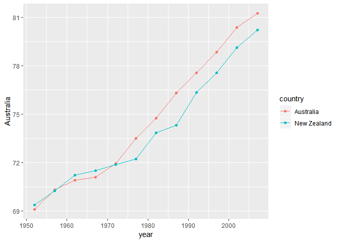
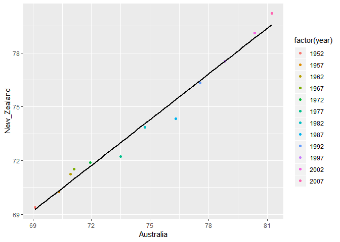
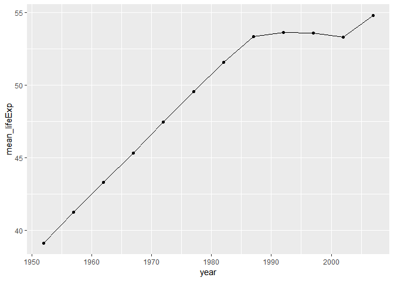
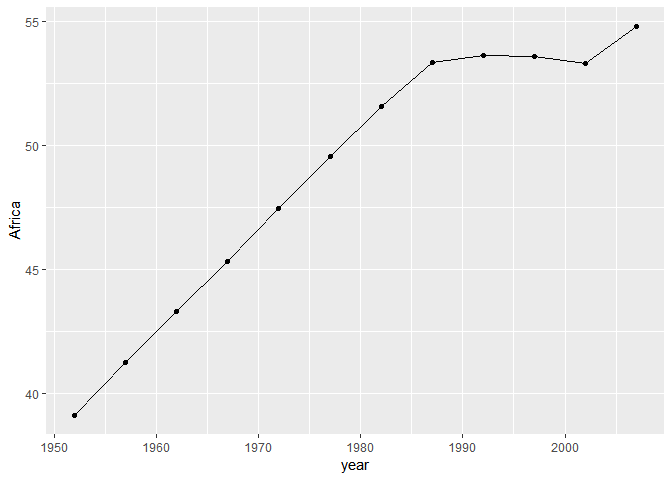

# Bring rectangular data in

```r
## load gapminder
library(gapminder)
## load tidyverse
library(tidyverse)
```

```
## -- Attaching packages ----------------------------------------------------------------------------------- tidyverse 1.2.1 --
```

```
## v ggplot2 3.0.0     v purrr   0.2.5
## v tibble  1.4.2     v dplyr   0.7.6
## v tidyr   0.8.1     v stringr 1.3.1
## v readr   1.1.1     v forcats 0.3.0
```

```
## -- Conflicts -------------------------------------------------------------------------------------- tidyverse_conflicts() --
## x dplyr::filter() masks stats::filter()
## x dplyr::lag()    masks stats::lag()
```

# Data Reshaping Prompts (and relationship to aggregation)

## Activity #1

**Make your own cheatsheet.**

In this section, we try to explore the following functions in `tidyr`:

- `gather()`: converts wide data to longer format.
- `spread()`: converts long data to wider format.
- `unite()`: combines two or more columns into a single column.
- `separate()`: splits one column into two or more columns.

We are going to use `mtcars` and `gapminder` as the databases.


```r
# show a preview of mtcars
head(mtcars) %>% 
  knitr::kable()
```

                      mpg   cyl   disp    hp   drat      wt    qsec   vs   am   gear   carb
------------------  -----  ----  -----  ----  -----  ------  ------  ---  ---  -----  -----
Mazda RX4            21.0     6    160   110   3.90   2.620   16.46    0    1      4      4
Mazda RX4 Wag        21.0     6    160   110   3.90   2.875   17.02    0    1      4      4
Datsun 710           22.8     4    108    93   3.85   2.320   18.61    1    1      4      1
Hornet 4 Drive       21.4     6    258   110   3.08   3.215   19.44    1    0      3      1
Hornet Sportabout    18.7     8    360   175   3.15   3.440   17.02    0    0      3      2
Valiant              18.1     6    225   105   2.76   3.460   20.22    1    0      3      1

We give the first column a name ("car") so it is better to manipulate. In fact, the first column in the above table is the `rownames()` of the table.


```r
# add a new column and assign rownames() to it
mtcars$car <- rownames(mtcars)
# reshape the data frame
mtcars_with_car <- mtcars[, c(12, 1:11)]
# show a preview of modified mtcars
head(mtcars_with_car) %>% 
  knitr::kable()
```

                    car                   mpg   cyl   disp    hp   drat      wt    qsec   vs   am   gear   carb
------------------  ------------------  -----  ----  -----  ----  -----  ------  ------  ---  ---  -----  -----
Mazda RX4           Mazda RX4            21.0     6    160   110   3.90   2.620   16.46    0    1      4      4
Mazda RX4 Wag       Mazda RX4 Wag        21.0     6    160   110   3.90   2.875   17.02    0    1      4      4
Datsun 710          Datsun 710           22.8     4    108    93   3.85   2.320   18.61    1    1      4      1
Hornet 4 Drive      Hornet 4 Drive       21.4     6    258   110   3.08   3.215   19.44    1    0      3      1
Hornet Sportabout   Hornet Sportabout    18.7     8    360   175   3.15   3.440   17.02    0    0      3      2
Valiant             Valiant              18.1     6    225   105   2.76   3.460   20.22    1    0      3      1


### `gather()`

#### Format of `gather()`

`gather(data, key, value, ..., na.rm = FALSE, convert = FALSE)`

Here `...` is the specification of the columns to gather.

#### Demos

`gather()` tries to create key-value pairs for a given data frame. In the first demos, we use `car` as the index, and different attribute as keys and show their corresponding values.


```r
gather_attributes <- mtcars_with_car %>% 
  # list all different attributes in column "attribute", use "car" as index (so it is not included in the reshape)
  gather(attribute, value, -car)

# show previews 
head(gather_attributes) %>% 
  knitr::kable()
```


car                 attribute    value
------------------  ----------  ------
Mazda RX4           mpg           21.0
Mazda RX4 Wag       mpg           21.0
Datsun 710          mpg           22.8
Hornet 4 Drive      mpg           21.4
Hornet Sportabout   mpg           18.7
Valiant             mpg           18.1

```r
tail(gather_attributes) %>% 
  knitr::kable()
```

      car              attribute    value
----  ---------------  ----------  ------
347   Porsche 914-2    carb             2
348   Lotus Europa     carb             2
349   Ford Pantera L   carb             4
350   Ferrari Dino     carb             6
351   Maserati Bora    carb             8
352   Volvo 142E       carb             2

We can also gather some columns instead of all.


```r
gather_some_attributes <- mtcars_with_car %>% 
  #gather only mpg to gear
  gather(attribute, value, mpg:gear)

# show previews
head(gather_some_attributes) %>% 
  knitr::kable()
```


car                  carb  attribute    value
------------------  -----  ----------  ------
Mazda RX4               4  mpg           21.0
Mazda RX4 Wag           4  mpg           21.0
Datsun 710              1  mpg           22.8
Hornet 4 Drive          1  mpg           21.4
Hornet Sportabout       2  mpg           18.7
Valiant                 1  mpg           18.1

```r
tail(gather_some_attributes) %>% 
  knitr::kable()
```

      car               carb  attribute    value
----  ---------------  -----  ----------  ------
315   Porsche 914-2        2  gear             5
316   Lotus Europa         2  gear             5
317   Ford Pantera L       4  gear             5
318   Ferrari Dino         6  gear             5
319   Maserati Bora        8  gear             5
320   Volvo 142E           2  gear             4

### `spread()`

#### Format of `spread()`

`spread(data, key, value, fill = NA, convert = FALSE, drop = TRUE)`

#### Demos

`spread()` can be considered as a reversed operation of `gather()`.


```r
# spread attribute and value
mtcars_spread <- gather_attributes %>% 
  spread(attribute, value)

# show a preview
head(mtcars_spread) %>% 
  knitr::kable()
```


car                   am   carb   cyl   disp   drat   gear    hp    mpg    qsec   vs      wt
-------------------  ---  -----  ----  -----  -----  -----  ----  -----  ------  ---  ------
AMC Javelin            0      2     8    304   3.15      3   150   15.2   17.30    0   3.435
Cadillac Fleetwood     0      4     8    472   2.93      3   205   10.4   17.98    0   5.250
Camaro Z28             0      4     8    350   3.73      3   245   13.3   15.41    0   3.840
Chrysler Imperial      0      4     8    440   3.23      3   230   14.7   17.42    0   5.345
Datsun 710             1      1     4    108   3.85      4    93   22.8   18.61    1   2.320
Dodge Challenger       0      2     8    318   2.76      3   150   15.5   16.87    0   3.520

### `unite()`

#### Format of `unite()`

`unite(data, col, ..., sep = "_", remove = TRUE)`

Here `...` represents the columns to unite and `col` represents the column to add.

#### Demos

In this demo, we try to unite `pop` and `gdpPercap` into the same column in `gapminder`. Notice it just shows the new column as a multiplication of `pop` and `gdpPercap`, but no calculation will be performed.


```r
# unite to have overall_gdp
unite_gdp <- gapminder %>% 
  unite(overall_gdp, pop, gdpPercap, sep = "*")

# show a preview
head(unite_gdp) %>% 
  knitr::kable()
```


country       continent    year   lifeExp  overall_gdp          
------------  ----------  -----  --------  ---------------------
Afghanistan   Asia         1952    28.801  8425333*779.4453145  
Afghanistan   Asia         1957    30.332  9240934*820.8530296  
Afghanistan   Asia         1962    31.997  10267083*853.10071   
Afghanistan   Asia         1967    34.020  11537966*836.1971382 
Afghanistan   Asia         1972    36.088  13079460*739.9811058 
Afghanistan   Asia         1977    38.438  14880372*786.11336   


### `separate()`

#### Format of `separate()`

`separate(data, col, into, sep = "[^[:alnum:]]+", remove = TRUE, convert = FALSE, extra = "warn", fill = "warn", ...)`

#### Demos

`separate()` can be considered as a reversed operation of `unite()`.


```r
# separate into original columns. Notice that we need to use two backslashes as escape character.
sep_gdp <- unite_gdp %>% 
  separate(overall_gdp, c("pop", "gdpPercap"), sep="\\*")

# show a preview
head(sep_gdp) %>% 
  knitr::kable()
```


country       continent    year   lifeExp  pop        gdpPercap   
------------  ----------  -----  --------  ---------  ------------
Afghanistan   Asia         1952    28.801  8425333    779.4453145 
Afghanistan   Asia         1957    30.332  9240934    820.8530296 
Afghanistan   Asia         1962    31.997  10267083   853.10071   
Afghanistan   Asia         1967    34.020  11537966   836.1971382 
Afghanistan   Asia         1972    36.088  13079460   739.9811058 
Afghanistan   Asia         1977    38.438  14880372   786.11336   

## Activity #2

**Make a tibble with one row per year and columns for life expectancy for two or more countries.**

Let's select countries in Oceania.


```r
lifeExp_Oceania <- gapminder %>% 
  # filter countries in Oceania
  filter(continent == "Oceania") %>% 
  # select necessary columns, make year as the first column
  select(year, country, lifeExp) %>% 
  # spread country to columns, with lifeExp as values
  spread(country, lifeExp)

# display the table
lifeExp_Oceania %>% 
  knitr::kable()
```


 year   Australia   New Zealand
-----  ----------  ------------
 1952      69.120        69.390
 1957      70.330        70.260
 1962      70.930        71.240
 1967      71.100        71.520
 1972      71.930        71.890
 1977      73.490        72.220
 1982      74.740        73.840
 1987      76.320        74.320
 1992      77.560        76.330
 1997      78.830        77.550
 2002      80.370        79.110
 2007      81.235        80.204

In Oceania we only have two countries. Then we make a scatterplot of the new tibble. First, we show the trends of lifeExp over years in these two countries.


```r
# fix names with spaces
names(lifeExp_Oceania) <- str_replace_all(names(lifeExp_Oceania), " ", "_")

lifeExp_Oceania %>% 
  ggplot() +
  # make a line plot with points for Australia
  geom_line(aes(x=year, y=Australia, color="Australia")) +
  geom_point(aes(x=year, y=Australia, color="Australia")) +
  # make a line plot with points for New_Zealand
  geom_line(aes(x=year, y=New_Zealand, color="New Zealand")) +
  geom_point(aes(x=year, y=New_Zealand, color="New Zealand")) +
  # change color legent
  scale_color_discrete("country")
```

<!-- -->

Let's also compare them side-by-side.


```r
lifeExp_Oceania %>% 
  # Auatralia as x axis and New_Zealand as y axis, color as year
  ggplot(aes(x=Australia, y=New_Zealand, color=factor(year))) +
  # make it a scatterplot
  geom_point() +
  # try to draw a regression curve
  geom_smooth(method="lm", se=FALSE, color="black")
```

<!-- -->

We can learn from the figures that, after around 1973, the lifeExp in Australia becomes larger than New_Zealand.

## Activity #3

**Compute some measure of life expectancy (mean? median? min? max?) for all possible combinations of continent and year. Reshape that to have one row per year and one variable for each continent. Or the other way around: one row per continent and one variable per year.**

Let's first compute the means of life expectancy for every possible combinations of continent and year.


```r
mean_lifeExp <- gapminder %>% 
  # group by continent and year
  group_by(continent, year) %>%
  # calculate the means
  summarise(
    mean_lifeExp = mean(lifeExp)
  )

# show the table
mean_lifeExp %>% 
  knitr::kable()
```


continent    year   mean_lifeExp
----------  -----  -------------
Africa       1952       39.13550
Africa       1957       41.26635
Africa       1962       43.31944
Africa       1967       45.33454
Africa       1972       47.45094
Africa       1977       49.58042
Africa       1982       51.59287
Africa       1987       53.34479
Africa       1992       53.62958
Africa       1997       53.59827
Africa       2002       53.32523
Africa       2007       54.80604
Americas     1952       53.27984
Americas     1957       55.96028
Americas     1962       58.39876
Americas     1967       60.41092
Americas     1972       62.39492
Americas     1977       64.39156
Americas     1982       66.22884
Americas     1987       68.09072
Americas     1992       69.56836
Americas     1997       71.15048
Americas     2002       72.42204
Americas     2007       73.60812
Asia         1952       46.31439
Asia         1957       49.31854
Asia         1962       51.56322
Asia         1967       54.66364
Asia         1972       57.31927
Asia         1977       59.61056
Asia         1982       62.61794
Asia         1987       64.85118
Asia         1992       66.53721
Asia         1997       68.02052
Asia         2002       69.23388
Asia         2007       70.72848
Europe       1952       64.40850
Europe       1957       66.70307
Europe       1962       68.53923
Europe       1967       69.73760
Europe       1972       70.77503
Europe       1977       71.93777
Europe       1982       72.80640
Europe       1987       73.64217
Europe       1992       74.44010
Europe       1997       75.50517
Europe       2002       76.70060
Europe       2007       77.64860
Oceania      1952       69.25500
Oceania      1957       70.29500
Oceania      1962       71.08500
Oceania      1967       71.31000
Oceania      1972       71.91000
Oceania      1977       72.85500
Oceania      1982       74.29000
Oceania      1987       75.32000
Oceania      1992       76.94500
Oceania      1997       78.19000
Oceania      2002       79.74000
Oceania      2007       80.71950

Then we reshape it to one row per year and one variable for each continent.


```r
# use spread to reshape continent as columns
reshape_mean_lifeExp <- mean_lifeExp %>%
  spread(continent, mean_lifeExp)

# show the table
reshape_mean_lifeExp %>% 
  knitr::kable()
```


 year     Africa   Americas       Asia     Europe   Oceania
-----  ---------  ---------  ---------  ---------  --------
 1952   39.13550   53.27984   46.31439   64.40850   69.2550
 1957   41.26635   55.96028   49.31854   66.70307   70.2950
 1962   43.31944   58.39876   51.56322   68.53923   71.0850
 1967   45.33454   60.41092   54.66364   69.73760   71.3100
 1972   47.45094   62.39492   57.31927   70.77503   71.9100
 1977   49.58042   64.39156   59.61056   71.93777   72.8550
 1982   51.59287   66.22884   62.61794   72.80640   74.2900
 1987   53.34479   68.09072   64.85118   73.64217   75.3200
 1992   53.62958   69.56836   66.53721   74.44010   76.9450
 1997   53.59827   71.15048   68.02052   75.50517   78.1900
 2002   53.32523   72.42204   69.23388   76.70060   79.7400
 2007   54.80604   73.60812   70.72848   77.64860   80.7195

The reshaped tibble is better, if you only want to have data of one continent. For example, we try to get data of Africa and show it as line plot.


```r
# original tibble
mean_lifeExp %>% 
  # need to filter continent as Africa
  filter(continent == "Africa") %>% 
  # year as x axis and mean_lifeExp as y axis
  ggplot(aes(x=year, y=mean_lifeExp)) +
  # make it a line plot with point
  geom_line() +
  geom_point()
```

<!-- -->

```r
reshape_mean_lifeExp %>% 
  # year as x axis and Africa as y axis
  ggplot(aes(x=year, y=Africa)) +
  # make it a line plot with point
  geom_line() +
  geom_point()
```

<!-- -->

The two plots are basically the same, except:
- Using the origianl tibble we need to filter data;
- The default label of y axis in the second figure is "Africa", and we do not need to change it.

## Activity #4

**In [Window functions](http://stat545.com/block010_dplyr-end-single-table.html#window-functions), we formed a tibble with 24 rows: 2 per year, giving the country with both the lowest and highest life expectancy (in Asia). Take that table (or a similar one for all continents) and reshape it so you have one row per year or per year * continent combination.**

First we get the table from the reference.


```r
# this piece of code is directly from the reference, so no commend is added
my_gap <- gapminder %>%
  filter(continent == "Asia") %>%
  select(year, country, lifeExp) %>%
  group_by(year) %>%
  filter(min_rank(desc(lifeExp)) < 2 | min_rank(lifeExp) < 2) %>% 
  arrange(year) %>%
  print(n = Inf)
```

```
## # A tibble: 24 x 3
## # Groups:   year [12]
##     year country     lifeExp
##    <int> <fct>         <dbl>
##  1  1952 Afghanistan    28.8
##  2  1952 Israel         65.4
##  3  1957 Afghanistan    30.3
##  4  1957 Israel         67.8
##  5  1962 Afghanistan    32.0
##  6  1962 Israel         69.4
##  7  1967 Afghanistan    34.0
##  8  1967 Japan          71.4
##  9  1972 Afghanistan    36.1
## 10  1972 Japan          73.4
## 11  1977 Cambodia       31.2
## 12  1977 Japan          75.4
## 13  1982 Afghanistan    39.9
## 14  1982 Japan          77.1
## 15  1987 Afghanistan    40.8
## 16  1987 Japan          78.7
## 17  1992 Afghanistan    41.7
## 18  1992 Japan          79.4
## 19  1997 Afghanistan    41.8
## 20  1997 Japan          80.7
## 21  2002 Afghanistan    42.1
## 22  2002 Japan          82  
## 23  2007 Afghanistan    43.8
## 24  2007 Japan          82.6
```

We reshape it into one row per year.


```r
# unite country and lifeExp
my_gap_unite <- my_gap %>% 
  unite(country_lifeExp, country, lifeExp, sep=",")

# get maximum records for each year (even rows)
my_gap_max <- my_gap_unite %>% 
  filter(row_number() %% 2 == 0)

# get minimum records for each year (odd rows)
my_gap_min <- my_gap_unite %>% 
  filter(row_number() %% 2 == 1)

# combine data together
my_gap_final <- data.frame(
  year = my_gap_max$year,
  max_country_lifeExp = my_gap_max$country_lifeExp,
  min_country_lifeExp = my_gap_min$country_lifeExp
)

# show the table
my_gap_final %>% 
  knitr::kable()
```


 year  max_country_lifeExp   min_country_lifeExp 
-----  --------------------  --------------------
 1952  Israel,65.39          Afghanistan,28.801  
 1957  Israel,67.84          Afghanistan,30.332  
 1962  Israel,69.39          Afghanistan,31.997  
 1967  Japan,71.43           Afghanistan,34.02   
 1972  Japan,73.42           Afghanistan,36.088  
 1977  Japan,75.38           Cambodia,31.22      
 1982  Japan,77.11           Afghanistan,39.854  
 1987  Japan,78.67           Afghanistan,40.822  
 1992  Japan,79.36           Afghanistan,41.674  
 1997  Japan,80.69           Afghanistan,41.763  
 2002  Japan,82              Afghanistan,42.129  
 2007  Japan,82.603          Afghanistan,43.828  


## Activity #5

# Join Prompts (join, merge, look up)

## Activity #1

## Activity #2

## Activity #3

# References
- [Data manipulation with tidyr](https://www.r-bloggers.com/data-manipulation-with-tidyr/)
